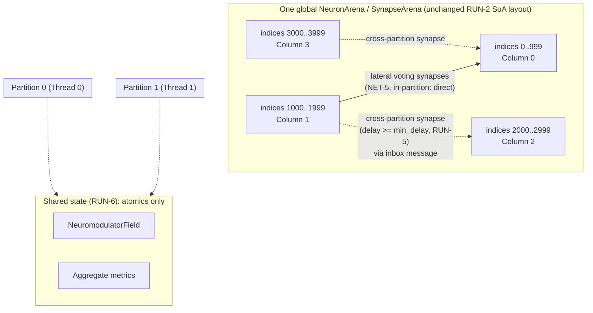

# Design: Brain Engine Phase 4 — Columns and Scale

## Overview

Phase 4 adds two things on top of the Phase 0–3 core (`crates/brain-core`): a repeated
structural unit (the **column**, NET-4) with lateral voting between columns (NET-5), and a
**partitioning layer** that lets many native threads own disjoint slices of the same arenas
concurrently (RUN-4–RUN-8), benchmarked against ENG-11's budget (Requirement 10) and backed by a
migratable snapshot format (Requirement 9).

The central design decision, which shapes almost everything below, is this: **partitioning does
not create N separate `NeuronArena`/`SynapseArena` instances.** It stays exactly one global
arena per simulation, exactly as today (RUN-2's structure-of-arrays layout, unchanged; ENG-8's
zero-copy FFI views, unchanged). What changes is that a partition is a **contiguous range of
neuron indices**, and each worker thread is handed a disjoint `&mut` slice of the arena's
`Vec`s for its own range via `slice::split_at_mut` — no `unsafe`, no re-indexing, no second
identity scheme for neurons. `NeuronId` stays exactly what it is today (`arena.rs`). This mirrors
a pattern the codebase already uses: `FixedNeighbourhoods` (`inhibition.rs`) already treats
`neuron_index / size` as a k-WTA neighbourhood; a **column** is the same kind of contiguous-range
primitive at a coarser granularity, and a **partition** is a set of whole columns (never split
across a partition boundary) at a coarser granularity still. Three nested levels of the same
one idea: neuron → column (its own microcircuit) → partition (its own thread), all addressed as
index ranges over the one arena everyone already understands.

This lets NET-4 and RUN-4 satisfy each other for free: because a partition is always a whole
number of columns, and a column's internal microcircuit only ever wires within its own range
(plus explicit lateral-voting connections to *other* columns, Requirement 2), cross-partition
traffic is exactly and only inter-column traffic — the same edges RUN-7 wants to minimize are
the same edges NET-5 deliberately creates between columns. Partitioning a column-structured
network is therefore not a separate concern bolted on afterward; it falls out of the column
boundaries themselves.

## Architecture



Each tick, every partition thread:

1. Drains its own ring bucket (exactly as `Scheduler::step` does today), applying deliveries
   whose target is in its own range directly against its own slice.
2. For a delivery whose target lies in another partition, does **not** touch that partition's
   memory. It appends `(target_index, current_sign_times_permanence, delivery_already_computed)`
   to a per-target-partition outbox.
3. Integrates its dirty neurons, resolves inhibition, commits/vetoes spikes, and schedules
   future deliveries — all local, all exactly today's per-tick algorithm, just scoped to a
   sub-range instead of the whole arena.

After all partition threads finish tick `T` (the one synchronization point per tick — see
"Concurrency model" below), a merge step deterministically drains every outbox and pushes each
message into its target partition's `ring` at `tick + delay`. Because `delay >= min_delay >= 2`
(Requirement 4, Acceptance Criterion 2), that write always lands at least one tick in the
target partition's future — it can never race with work that partition has already done or is
doing this tick. This is RUN-5's "axonal delay absorbs message latency" made concrete: the
synchronization point exists (this is not a fully asynchronous system), but it is *cheap and
tick-local*, not a lock on shared neuron state, and it never blocks a partition on another
partition's same-tick work.

## Components and Interfaces

### `crates/brain-core/src/column.rs` (new) — NET-4

```rust
pub struct ColumnSpec {
    pub neuron_range: std::ops::Range<u32>,   // contiguous, like FixedNeighbourhoods
    pub inhibition: FixedNeighbourhoods,       // scoped to this column's own range
    pub segments: SegmentConfig,               // every column: same segment count/params
}

pub struct ColumnRegistry {
    columns: Vec<ColumnSpec>,
}

impl ColumnRegistry {
    pub fn column_of(&self, neuron_index: u32) -> Option<usize>;
    pub fn range_of(&self, column_id: usize) -> std::ops::Range<u32>;
}
```

A column is built by `GraphBuilder::build_column` (extends `graph.rs`): allocates
`neuron_range.len()` neurons via the existing `allocate_population`, wires its internal
microcircuit via the existing `DistancePolicy::connect` restricted to its own indices, and
registers a `ColumnSpec`. **No new neuron/synapse/plasticity code path is added** — a column is
existing primitives at a chosen index range, which is Requirement 1's Acceptance Criterion 1 and
2 by construction: there is nothing for a column-specific branch to live in, because column
construction only ever calls the same functions flat-population construction already calls.

`Scheduler` gains no column awareness at all in its hot loop — it already operates on whatever
`FixedNeighbourhoods`/`SegmentConfig` it's given, and a column-structured network just supplies
one `FixedNeighbourhoods` per column instead of one for the whole network. Per-column metrics
(Requirement 1, Acceptance Criterion 5) are computed by `metrics.rs`'s existing meters,
instantiated once per `ColumnSpec` by whatever orchestrates the network (an example script or a
future `packages/brain` API), not by new code in `brain-core`'s hot path.

### `crates/brain-core/src/partition.rs` (new) — RUN-4, RUN-5, RUN-6, RUN-7, RUN-8

```rust
pub struct PartitionPlan {
    /// Sorted, non-overlapping, gap-free ranges covering the whole arena.
    /// A partition is always a whole number of columns (never splits one).
    ranges: Vec<std::ops::Range<u32>>,
}

impl PartitionPlan {
    /// RUN-7 fallback: contiguous column-index ranges, columns assigned
    /// round-robin/contiguous-block by construction order. Locality-biased
    /// assignment (using NeuronArena::coords) is a second constructor,
    /// `PartitionPlan::by_locality`, added once Requirement 10's benchmarks
    /// show the naive contiguous assignment's cross-partition fraction is
    /// actually a bottleneck (this project's established "measure before
    /// optimising" pattern — see graph.rs, neuron.rs).
    pub fn contiguous(columns: &ColumnRegistry, partition_count: usize) -> Self;
    pub fn partition_of(&self, neuron_index: u32) -> usize;
}

/// One thread's exclusively-owned view into the shared arenas for one tick
/// (RUN-4): disjoint `&mut` slices via `split_at_mut`, not a copy and not
/// `unsafe`.
struct PartitionSlice<'a> {
    range: std::ops::Range<u32>,
    membrane: &'a mut [f32],
    threshold: &'a mut [f32],
    // ...one field per NeuronArena/SynapseArena array this partition owns,
    // sliced from the single global Vec.
}

/// A message crossing a partition boundary (RUN-5). Carries exactly what
/// the receiving partition needs to replay the delivery it could not apply
/// itself -- nothing more (no borrowed state, `Copy`).
#[derive(Clone, Copy)]
struct CrossPartitionMessage {
    target_index: u32,
    target_segment: u32,
    signed_current: f32,  // polarity * permanence, precomputed by the sender
    delivery_tick: u32,
    source_index: u32,    // for deterministic ordering (Requirement 8.3) and plasticity's on_delivery ctx
    synapse_id: u32,
}

pub struct PartitionRuntime {
    plan: PartitionPlan,
    outboxes: Vec<Vec<CrossPartitionMessage>>, // one per (source partition) this tick
    modulators: NeuromodulatorField,            // shared, RUN-6 -- see neuromodulator.rs changes
    // one Scheduler-equivalent per partition, each with its own ring/dirty
    // set/scratch buffers scoped to its own range.
    partitions: Vec<PartitionScheduler>,
}

impl PartitionRuntime {
    /// RUN-8: `thread_count == 1` runs this exact same code path with one
    /// partition and an empty cross-partition step -- not a fork.
    pub fn step<D: NeuronDynamics>(&mut self, neurons: &mut NeuronArena, synapses: &mut SynapseArena, params: &D::Params, thread_count: usize);
}
```

`PartitionRuntime::step` is the RUN-4–RUN-8 core:

1. **Parallel phase.** For each partition, in parallel (via `rayon::scope`, see "Concurrency
   model" below — nothing here is rayon-specific at the type level, so the executor is
   swappable), run exactly today's `Scheduler::step` algorithm (`scheduler.rs`'s existing
   1–5 steps), but reading/writing only that partition's slice, and redirecting any delivery
   whose `target_neuron` falls outside `self.range` into `outboxes[this_partition]` instead of
   `input_accum`/`dirty`. This is a refactor of `Scheduler::step`'s delivery loop (step 1) to
   take a `target_owner: impl Fn(u32) -> bool` closure deciding local-vs-outbox — the rest of
   the function is untouched.
2. **Barrier.** `rayon::scope` (or the hand-rolled pool's join, Requirement 10.5) returns once
   every partition has finished tick `T`. This is the one synchronization point per tick.
3. **Merge phase** (single-threaded, O(cross-partition messages this tick), matching the
   existing "reused scratch, cleared only where touched" cost discipline, ENG-9): sort each
   target partition's incoming messages by `(source_index, synapse_id)` (Requirement 8's
   Acceptance Criterion 3 — deterministic regardless of which thread produced which message
   first) and push each into that partition's ring at `delivery_tick`.

`NeuromodulatorField` (`neuromodulator.rs`) changes its four `f32` levels to `[AtomicU32; 4]`
storing bit-cast `f32`s, with `inject`/`levels_at` using `fetch_update`/relaxed loads instead of
`&mut self`. This is RUN-6's only mutation to an existing file: the four-channel semantics,
decay math, and public call shape (`inject(tick, index, amount)`, `levels_at(tick) -> Modulators`)
are unchanged — every existing caller in `scheduler.rs` and every existing test keeps compiling
and passing, because at one thread there is no contention and the atomics degrade to what a
plain `f32` already did (Requirement 5, Acceptance Criterion 4). `metrics.rs`'s
`FiringRateMeter`/`PredictionAccuracyMeter` gain an `AtomicMetricsAggregate` sibling type used
only by `PartitionRuntime`'s merge phase to fold each partition's already-computed local
`StepReport` into shared running totals — per-partition computation itself stays exactly the
existing single-threaded meter code, called once per partition per tick, matching Requirement 5's
Acceptance Criterion 3 ("per-partition metrics remain thread-local... aggregated only at defined
points").

### `crates/brain-core/src/graph.rs` (extend) — NET-5 lateral voting

```rust
/// Reserved segment index for lateral-voting input, mirroring
/// `segment::FEEDFORWARD_SEGMENT`'s reservation pattern: an ordinary
/// dendritic segment (Requirement 10/NEU-5/6 unchanged) that happens to
/// receive its synapses from other columns' spiking neurons instead of
/// from a predictive-sequence source. No new mechanism -- voting *is*
/// dendritic depolarisation wired between columns instead of within one.
pub fn connect_lateral_voting(
    &self,
    neurons: &NeuronArena,
    synapses: &mut SynapseArena,
    columns: &ColumnRegistry,
    voting_group: &[usize],      // column ids that vote together
    vote_segment: u32,
    policy: &DistancePolicy,
);
```

Wiring: for each pair of columns in `voting_group`, connect a sample of column A's neurons to
column B's `vote_segment` (and vice versa), using the *existing* `DistancePolicy`/`derive_stream`
machinery `connect` already uses — the only difference from an ordinary `connect` call is the
target range (another column's range) and the fixed `target_segment`. When a column's neighbour
already has a well-supported candidate, that candidate's spikes depolarise (not drive) this
column's corresponding neurons via `vote_segment`, exactly as a predictive segment lowers
effective threshold (`neuron.rs`, NEU-6) — a neuron already leaning toward the same answer as its
neighbours reaches threshold with a larger margin and wins local k-WTA over one with no lateral
support, which is Requirement 2's Acceptance Criterion 2 ("bias... using only local, spike-based
signalling") implemented with zero new mechanism. Requirement 2's Acceptance Criterion 4 (voting
is additive/ablatable) is satisfied the same way Requirement 10's segments already are: a column
with no `connect_lateral_voting` call simply never has anything delivered to `vote_segment`, and
behaves exactly as an isolated column.

### `crates/brain-core/src/snapshot.rs` (extend) — Requirement 9, migratable format

The existing `write`/`read` pair (magic + `FORMAT_VERSION` + config_hash + tick, sequential
sections) is kept as-is for the *current* version; migration is added as version-dispatched
readers, not a byte-rewriting pipeline — the in-memory `Restored` struct is the real "schema",
and each historical format version gets its own reader straight into that struct, which is
simpler to write and test than round-tripping intermediate bytes through every version in
between:

```rust
pub const FORMAT_VERSION: u32 = 2;         // bumped once columns exist (Req 9.6)
pub const OLDEST_SUPPORTED_VERSION: u32 = 1; // Req 9.8: two versions of migration support

pub fn read_header(bytes: &[u8]) -> Result<SnapshotHeader, SnapshotError>; // Req 9.5, partial load
pub struct SnapshotHeader { pub version: u32, pub config_hash: u64, pub tick: u32 }

pub fn read(bytes: &[u8], expected_config_hash: u64) -> Result<Restored, SnapshotError> {
    let header = read_header(bytes)?;
    match header.version {
        v if v > FORMAT_VERSION => Err(SnapshotError::UnsupportedVersion),
        v if v < OLDEST_SUPPORTED_VERSION => Err(SnapshotError::UnsupportedVersion),
        1 => read_v1_migrated(bytes, header.config_hash),  // today's exact format, Req 9.6:
                                                            // "zero columns" is the only
                                                            // interpretation v1 bytes can produce
        FORMAT_VERSION => read_v2(bytes, header.config_hash),
        _ => unreachable!(),
    }
}
```

`read_header` is exactly today's first three field-reads (`take(6)`, `u32`, `u64`, `u32`) split
out of `read` into its own function — no behavior change to `read` itself, just a decomposition
that also serves Requirement 9's Acceptance Criterion 5 directly. `read_v1_migrated` is today's
`read_neurons`/`read_synapses`/ring/dirty-set parsing, unchanged, wrapped to additionally
populate an empty `ColumnRegistry` (Requirement 9's Acceptance Criterion 6). `read_v2` adds
whatever the column registry's own serialised section looks like once `column.rs` lands. Each
version's reader is a pinned, tested function — Requirement 9's Acceptance Criterion 4's
"testable transformation" is literally `read_v1_migrated`, checked by a test that constructs a
network fresh under v2 with equivalent state and asserts identical post-restore behavior against
a v1-format fixture byte-for-byte captured from before this phase's changes (a golden-format
fixture, the same VAL-7 pattern applied to the snapshot format itself instead of to spike
rasters).

`SnapshotError::UnsupportedVersion` now covers both "too new" and "too old" (Requirement 9,
Acceptance Criterion 3) — a small, additive change to an existing enum variant's meaning, not a
new variant, since both cases already get identical treatment (fail loudly, no partial load).

### `crates/brain-napi` / `packages/brain` — surfacing thread count and columns

`NativeSimulation`'s constructor (`crates/brain-napi/src/lib.rs`) gains an optional
`threadCount` field on its config object (defaulting to 1, i.e. today's behavior exactly —
Requirement 7's Acceptance Criterion 1). Internally it constructs a `PartitionRuntime` instead of
calling `Scheduler` directly, but every existing method (`step`, `stimulate`, `membraneAt`,
`snapshot`, ...) keeps its exact signature: partitioning is invisible at this boundary except for
the new config field and (optionally) new column-scoped accessor methods
(`columnFiringRate(columnId)`) added alongside, not instead of, the whole-network ones. This
preserves ENG-8's zero-copy guarantee: `membraneArray()` still returns one `Float32Array` view
over the arena's one `membrane: Vec<f32>`, because that `Vec` is still exactly one array —
partitioning only changes who is allowed to write which sub-range of it at a given moment, never
its physical layout.

### Concurrency model: rayon vs. hand-rolled (§12a open question 2)

`PartitionRuntime`'s parallel phase is written against a small internal trait
(`ParallelExecutor::scope(&self, partitions: &mut [PartitionScheduler], body: impl Fn(&mut PartitionScheduler) + Sync)`)
with two implementations:

- `RayonExecutor` (`rayon::scope` + `spawn` per partition) — the ENG-6-anticipated default
  ("the Rust core should need approximately `rayon` and nothing else"). This is the first actual
  `[dependencies]` entry in `crates/brain-core/Cargo.toml`; the crate's current "zero runtime
  dependencies" doc comment (`lib.rs`) is updated to say "zero *AI/ML* dependencies, `rayon` as
  the one anticipated exception" rather than silently drifting out of sync with the code.
- `PinnedThreadPoolExecutor` (a hand-rolled fixed pool of long-lived threads, each parked between
  ticks and woken via `std::sync::{Condvar, Mutex}` or a lightweight spin-then-park barrier) —
  the alternative Rayon's work-stealing is a mismatch for (each partition is a long-lived owner
  of a fixed range for the whole run, not a one-off data-parallel task).

Requirement 10's Acceptance Criterion 5 benchmark runs both at the same partition/thread counts;
whichever wins becomes the default `ParallelExecutor` `PartitionRuntime::new` picks when the
caller doesn't force one, with the losing implementation kept behind the same trait (cheap to
keep, since the trait boundary already has to exist for the benchmark to compare them fairly) —
this satisfies RUN-8's "single-threaded is unaffected either way" for free, since both
executors degenerate to sequential partition processing at `thread_count == 1`.

### Benchmarks — `crates/brain-core/benches/core_bench.rs` (extend), `crates/brain-core/tests/scale.rs` (new)

- `bench_synaptic_events_per_second` (criterion, `Throughput::Elements`): a fixed-topology
  network stepped for N ticks at `thread_count in [1, 2, 4, 8, physical_cores]`, reporting
  events/sec/core — Requirement 10's Acceptance Criteria 1 and 3.
- `bench_cross_partition_fraction` (criterion): the same network re-partitioned at varying
  `PartitionPlan` granularities, reporting throughput against measured cross-partition edge
  fraction (`PartitionPlan` exposes a `cross_partition_edge_fraction(&SynapseArena) -> f32`
  helper for this and for Requirement 6's Acceptance Criterion 2) — Requirement 10's Acceptance
  Criterion 4.
- `bench_rayon_vs_pinned_pool` (criterion, `BenchmarkGroup`): the two `ParallelExecutor`
  implementations head to head — Requirement 10's Acceptance Criterion 5.
- `tests/scale.rs`, `#[ignore]`-gated (VAL-11's slow tier, run on demand/schedule like
  `tests/golden.rs`'s `regenerate_golden_rasters`): constructs the 100k-neuron/50M-synapse
  network, steps it briefly, and reports peak resident memory (via `/proc/self/status` on Linux
  CI / a small cross-platform crate-free estimate from `NeuronArena`/`SynapseArena`'s own
  `Vec::capacity()` sizes, which is exact rather than OS-reported and needs no new dependency) —
  Requirement 10's Acceptance Criterion 2. This is explicitly *not* a criterion benchmark (memory
  footprint isn't a timing measurement) and explicitly *not* required to run on every CI
  invocation (Requirement 10's Acceptance Criterion 6) — it runs the same way
  `regenerate_golden_rasters` already does.

The empirical scale-ceiling finding (Requirement 10's Acceptance Criterion 7, §12a open question
1) is written up as a new "§12a resolved" entry in README.md once the numbers exist — not
predicted here. This design commits to *how* the ceiling will be found, not to a specific number.

## Data Models

| Type | File | Change |
|---|---|---|
| `ColumnSpec`, `ColumnRegistry` | `column.rs` (new) | New — contiguous-range + inhibition + segment config, mirrors `FixedNeighbourhoods` |
| `PartitionPlan`, `PartitionRuntime`, `PartitionScheduler`, `CrossPartitionMessage` | `partition.rs` (new) | New — see above |
| `NeuromodulatorField` | `neuromodulator.rs` | `[f32; 4]` levels → `[AtomicU32; 4]` (bit-cast), same public API |
| `AtomicMetricsAggregate` | `metrics.rs` | New sibling type to existing meters, used only by the merge phase |
| `SnapshotHeader`, `read_header`, `read_v1_migrated`, `read_v2` | `snapshot.rs` | New; `FORMAT_VERSION` bumped 1→2; `OLDEST_SUPPORTED_VERSION` added |
| `NativeSimulation` config | `crates/brain-napi/src/lib.rs` | `threadCount` field added, default 1 |

No existing public type's fields are removed or renamed; every addition above is either a new
type or an additive field/method on an existing one, consistent with Requirement 1's Acceptance
Criterion 7 and Requirement 11's regression requirement generally.

## Error Handling

| Failure | Handling |
|---|---|
| Cross-partition synapse created with `delay < min_delay` (structural plasticity sprouting a synapse that happens to land across a partition boundary with a too-short delay) | Rejected at insertion — `SynapseArena::insert`'s caller (structural plasticity's sprouting logic) checks partition membership of source/target before choosing a delay, clamping to `>= min_delay` when they differ. No new `SynapseError` variant needed: this is a delay-selection policy change in `growth.rs`/`plasticity/structural.rs`, not an arena-level failure mode. |
| Snapshot version newer than `FORMAT_VERSION`, or older than `OLDEST_SUPPORTED_VERSION` | `SnapshotError::UnsupportedVersion`, no partial load (Requirement 9, Acceptance Criterion 3) — existing enum, existing fail-loud convention. |
| Snapshot truncated/corrupt mid-migration | `SnapshotError::Corrupt` — every migration reader inherits the existing `Reader::take`'s bounds-checked-before-allocation discipline; no migration reader introduces its own unchecked length read. |
| `PartitionPlan::contiguous` given a column count that doesn't divide evenly into `partition_count` | Not an error — trailing partitions simply get one fewer column; `partition_of` is still total and correct. Documented, not asserted against, since uneven splits are an expected, common case. |
| Rayon (or the pinned pool) panics inside one partition's `step` | Propagates as today's `panic = "unwind"` profile setting already implies (`Cargo.toml`) — ENG-9's "no panics in the core loop" remains a discipline goal for the step logic itself, unchanged by partitioning; partitioning does not add a new suppression/recovery layer around panics, since Phase 0–3 didn't have one either. |

## Testing Strategy

- **Unit tests** (in-module, `cfg(test)`): `column.rs` (range/registry bookkeeping),
  `partition.rs` (message ordering determinism, `PartitionPlan::contiguous` correctness, the
  RUN-8 degenerate one-partition case matching plain `Scheduler` output field-for-field),
  `neuromodulator.rs`'s existing tests re-run against the new atomic storage unchanged (they
  assert on values, not representation), `snapshot.rs`'s `read_v1_migrated` against a checked-in
  v1-format fixture byte array captured from the current `write()` output before this phase's
  changes land.
- **Integration tests** (`crates/brain-core/tests/`): a new `tests/partitioning.rs` proving
  RUN-3/RUN-8's determinism claim directly — the same seed/topology/input run at thread counts
  1, 2, and 4 must produce bit-identical `StepReport` sequences (Requirement 8's Acceptance
  Criterion 1); a new `tests/columns_and_voting.rs` re-expressing `tests/emergent.rs`'s six
  symbol populations as six `ColumnSpec`s (Requirement 11's Acceptance Criterion 3) and adding a
  voting-vs-no-voting ablation case per Requirement 2's Acceptance Criterion 6 (VAL-9's pattern:
  disable the mechanism, assert the property it's responsible for degrades).
- **Existing suite regression** (Requirement 11, Acceptance Criterion 6): every current test file
  (`emergent.rs`, `homeostasis.rs`, `structural_and_growth.rs`, `predictive_learning.rs`,
  `sparsity.rs`, `invariants.rs`, `observability.rs`, `golden.rs`, `workspace_policy.rs`) runs
  unchanged, at `thread_count = 1` implicitly (since `PartitionRuntime` at one partition must
  match plain `Scheduler` exactly) — no assertion in any of these files is touched by this phase.
- **Golden-format fixture** for the snapshot migration path (Requirement 9, Acceptance Criterion
  4), the same regression-detection idea VAL-7 already applies to spike rasters, applied here to
  the byte format itself.
- **Criterion benchmarks + one ignored scale test** as described above, satisfying Requirement
  10 and ENG-11's "benchmarks live in the repo and run in CI" (the criterion group; the scale
  test explicitly does not need to, matching VAL-11's fast/slow split).
- **Traceability** (VAL-10): each acceptance criterion above maps to at least one named test as
  listed; this mapping is checkable the same way the existing suite already is (grep requirement
  numbers in test names/doc comments, the convention `emergent.rs`/`scheduler.rs`'s tests already
  follow).

No backend/DB request path or user-facing UI exists in this phase (brain-core is a library
crate with a TypeScript FFI shell, no web handlers, no screens), so the MAVI-90 integration-
harness question and the `design-wireframe` skill both do not apply.
