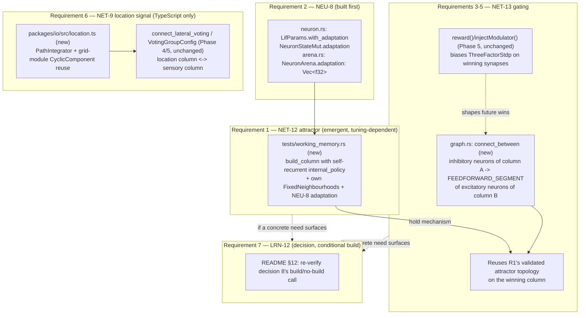
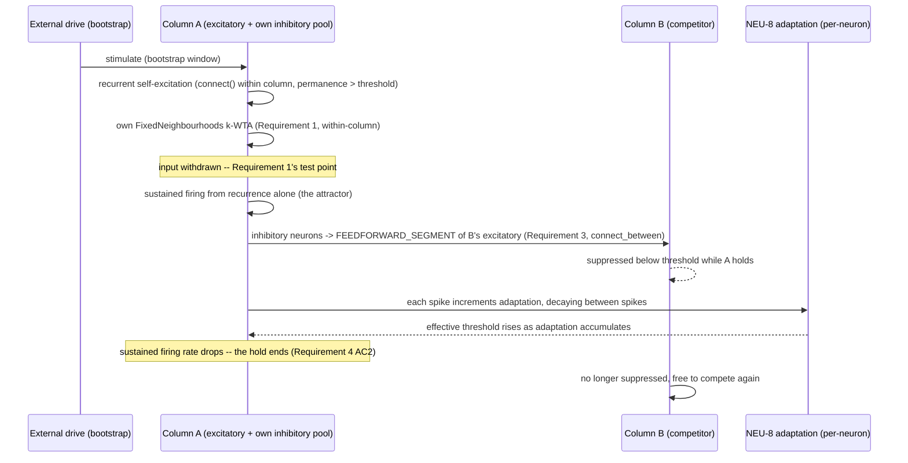

# Design: Brain Engine Phase 5.5 — Working Memory, Action Selection and Reference Frames

## Overview

This design satisfies the nine approved requirements by building, in dependency order, on top of
Phase 0–5's shipped core (`crates/brain-core`), FFI (`crates/brain-napi`), and TypeScript shell
(`packages/brain`, `packages/io`):

1. **NEU-8 (Requirement 2)** — one new per-neuron state variable, added by mirroring the exact
   precedent `predictive` already set (a `LifParams` builder method, a `NeuronStateMut` field, a
   `NeuronArena` column, three call-site updates in `scheduler.rs`). This ships first because
   Requirement 1's attractor experiment is the first thing that might need it as a brake.
2. **NET-12 (Requirement 1)** — **no new production code beyond Requirement 2.** Confirmed this
   session: `GraphBuilder::connect` already wires self-loops and bidirectional recurrence within
   one index list (`graph.rs`'s `self_connections_and_cycles_are_permitted` test), and a column's
   own `internal_policy` already produces exactly this kind of recurrence when built via the
   existing `build_column`/`build_columns` FFI. The entire requirement is a new Rust integration
   test (`crates/brain-core/tests/working_memory.rs`) plus a tuning search over already-exposed
   parameters (`internal_policy.p0`, permanence, `neighbourhood_size`/`k`, and Requirement 2's new
   adaptation knobs). This is the part of the phase explicitly flagged as open-ended.
3. **NET-13 (Requirements 3–5)** — suppress needs one new graph-construction primitive
   (`GraphBuilder::connect_between`, a direct generalisation of the existing
   `connect_lateral_voting`'s inner loop to arbitrary index lists instead of whole column ranges)
   plus one new FFI config type (`GatingGroupConfig`); hold reuses Requirement 1's validated
   attractor mechanism directly, with NEU-8's adaptation current as the natural decay that ends a
   hold without a new "timer" primitive; reward integration adds no code at all — it is a new
   *consumer* of the `reward()`/`injectModulator()` surface Phase 5 already shipped.
4. **NET-9 (Requirement 6)** — **zero new Rust code.** Confirmed this session: the datetime
   encoder's `CyclicComponent` machinery (`packages/io/src/encoders/datetime.ts`) already
   implements exactly the periodic, wrapping bucket construction a grid-cell module needs; a
   location signal is that same machinery applied to path-integrated (x, y) instead of wall-clock
   time, at several periods (several grid-cell "scales"). Binding a location SDR to a sensory SDR
   reuses Phase 4/5's existing `connect_lateral_voting`/`VotingGroupConfig` FFI — a location
   "column" and a sensory column wired as a two-member voting group *is* the binding mechanism,
   with no new core primitive, exactly matching invariant 8's discipline the way IO-5 did.
5. **LRN-12 (Requirement 7)** — a design-time decision, revisited after 1–3's results are in.

Every one of these (1) reuses an existing mechanism rather than inventing one, per this project's
established pattern, and (2) is stated as an empirical result with an honest-failure path
(Requirement 8), not a mechanical acceptance checklist. NET-12 in particular should be budgeted as
the phase's real risk — everything downstream (NET-13's hold, and by extension its reward
integration) is blocked on it succeeding.

## Architecture



Three of the four mechanisms (NET-12, NET-13's suppress half, NET-9) are additive at the
construction layer only — no change to `Scheduler::step`'s per-tick algorithm. NEU-8 is the one
genuine per-tick hot-path change, and it is designed to be behaviourally inert at its existing
default (zero increment), so every Phase 0–5 test is unaffected without being touched.

### The attractor + gating tick flow (Requirements 1, 3, 4)



This is the same three-stage shape (drive → recurrent hold → adaptation-limited decay) whether the
population is tested alone (Requirement 1) or as one half of a two-population gate (Requirements
3–4) — Requirement 4 reuses Requirement 1's mechanism exactly rather than building a second one.

## Components and Interfaces

### Requirement 2 — NEU-8 spike-frequency adaptation

**`crates/brain-core/src/neuron.rs`** — mirrors `predictive`'s existing pattern field-for-field:

```rust
pub struct NeuronStateMut<'a> {
    // ...existing fields unchanged...
    pub predictive: &'a mut f32,
    /// Spike-frequency adaptation (NEU-8): a slow outward current that
    /// increases on each spike and decays between them, raising the
    /// *effective* threshold the same way `predictive` lowers it (opposite
    /// sign, same mechanism shape). `0.0` when adaptation is disabled
    /// (`LifParams::new`'s default), so every pre-Phase-5.5 caller is
    /// unaffected -- the same guarantee `predictive` already gives.
    pub adaptation: &'a mut f32,
    pub threshold: f32,
}

pub struct LifParams {
    // ...existing fields unchanged...
    /// `exp(-1 / tau_adaptation_ticks)`, precomputed like `decay_per_tick`
    /// (see module docs). Defaults to `0.0` via `LifParams::new`.
    pub adaptation_decay_per_tick: f32,
    /// Added to `adaptation` on every committed spike (never on a vetoed
    /// one -- adaptation reflects the cell's own firing history, not near
    /// misses). Defaults to `0.0`.
    pub adaptation_increment: f32,
}

impl LifParams {
    pub fn with_adaptation(mut self, tau_adaptation_ticks: f32, increment: f32) -> Self {
        debug_assert!(tau_adaptation_ticks > 0.0);
        self.adaptation_decay_per_tick = (-1.0 / tau_adaptation_ticks).exp();
        self.adaptation_increment = increment;
        self
    }
}
```

`Lif::integrate` folds adaptation into the same `target` computation `predictive` already
modifies, as a subtracted current rather than a threshold delta (the biologically standard AHP
form, and the one that composes additively with arbitrary input rather than needing its own
clamp):

```rust
let target = p.v_rest + input - state.adaptation.clamp(0.0, f32::MAX);
*state.membrane = target + (*state.membrane - target) * p.decay_per_tick;
// ...threshold check uses predictive_threshold_reduction exactly as today...
*state.adaptation *= p.adaptation_decay_per_tick; // decay after use, same ordering as predictive
```

`Lif::commit_spike` adds one line: `*state.adaptation += p.adaptation_increment;`. `veto_spike`
stays untouched (a vetoed candidate should not accrue adaptation — it did not actually fire).

**`crates/brain-core/src/arena.rs`** — `NeuronArena` gains `pub adaptation: Vec<f32>` next to
`predictive` in the "hot" field group, initialised to `0.0` on allocation (matching `predictive`'s
existing default) and included in `approx_memory_bytes()`.

**`crates/brain-core/src/scheduler.rs`** — the three existing `NeuronStateMut { ... }` construction
sites (confirmed this session: `commit_and_schedule` at line 490, and two more inside `step`'s
integration loop at lines 854 and 909) each gain `adaptation: &mut neuron_view.adaptation[i]`. No
other change to `step`'s control flow — adaptation is read/written exactly where `predictive`
already is, in the same borrow scope.

**`crates/brain-core/src/snapshot.rs`** — `adaptation` is a new flat `Vec<f32>` section, serialised
and restored exactly like `predictive` (RUN-9a's round-trip property applies identically; no format
version bump is needed for the *field*, since Phase 4's migration machinery already handles
additive per-neuron arrays the same way it will handle this one — confirmed by the existing
`read_v1_migrated` precedent for `ColumnRegistry`). A version bump only becomes necessary if the
byte layout itself needs to change shape, which a new trailing section does not require.

**`crates/brain-napi/src/lib.rs`** — `LifConfig` gains two `Option<f64>` fields following
`tau_predictive_ticks`/`predictive_threshold_reduction`'s exact pattern:

```rust
pub struct LifConfig {
    // ...existing fields unchanged...
    pub tau_adaptation_ticks: Option<f64>,
    pub adaptation_increment: Option<f64>,
}
```

`to_lif_params` gains the symmetric `if let (Some(tau), Some(increment)) = (...) { params =
params.with_adaptation(...) }` branch. Omitting both (every existing caller) reproduces today's
`LifParams::new` output exactly.

### Requirement 1 — NET-12 sustained attractor (emergent, tuning-dependent)

**No new production code.** The population is built with the *existing* `GraphBuilder::build_column`
(Rust-side experiment) or `NativeSimulation::build_columns`/`ColumnConfig` (if promoted to a
TypeScript-driven experiment later): one column whose `internal_policy` (`DistancePolicy`) is
configured for strong, high-probability, above-connection-threshold recurrence at short distance —
the same mechanism `graph.rs`'s `self_connections_and_cycles_are_permitted` test already exercises,
just tuned for persistence instead of merely being *permitted*. The column's own `FixedNeighbourhoods`
(via `neighbourhood_size`/`k`) provides the within-population k-WTA brake; Requirement 2's
adaptation is the per-spike brake if k-WTA alone allows runaway excitation.

**`crates/brain-core/tests/working_memory.rs`** (new, `#[ignore]`-gated slow tier, matching
`tests/scale.rs`'s convention) — shaped exactly like README §12a item 3's sketch, confirmed still
current:

```rust
// Pseudocode shape; real test uses build_column + Scheduler::with_inhibition
// (or the column's own FixedNeighbourhoods) + probe::SpikeRaster +
// metrics::FiringRateMeter, per the existing tests/columns_and_voting.rs
// and tests/consolidation.rs conventions for ablation-style tests.

fn attractor_sustains_a_pattern_specific_representation_after_input_stops() {
    // 1. Build one recurrent column (build_column with a self-reinforcing
    //    internal_policy).
    // 2. Drive a specific sub-pattern via stimulate() for a bootstrap window.
    // 3. Withdraw all external input.
    // 4. Continue stepping; call reset_predictive_state() before reading
    //    predictive/membrane state, per the carried-forward gotcha.
    // 5. Assert: (a) firing rate stays above a floor for >= N post-withdrawal
    //    ticks (Req 1 AC1); (b) the *specific* driven subset keeps firing,
    //    measured by SpikeRaster overlap against the originally-driven
    //    indices (Req 1 AC2).
}

fn ablation_recurrent_synapses_below_threshold_do_not_sustain_activity() {
    // Identical topology, recurrent synapses' initial permanence held below
    // connection_threshold (so `deliver` skips them via `continue`, per the
    // existing sub-threshold-is-inert behaviour `plasticity/predictive.rs`
    // already documents). Activity must decay to baseline (Req 1 AC3).
}
```

Both tests run across a configured seed set with an explicit tolerance band (Requirement 1 AC5),
per the existing `tests/emergent.rs`/`tests/columns_and_voting.rs` multi-seed convention. **The
specific values of `internal_policy.p0`, `initial_permanence`, `neighbourhood_size`/`k`, and
NEU-8's `tau_adaptation_ticks`/`adaptation_increment` are the actual deliverable of this
requirement, found by iterating this test** — this design does not pre-commit to numbers, matching
how Phase 0–3's `tests/emergent.rs` exit criterion was reached (design.md's "Design risks" #4
there).

### Requirements 3–4 — NET-13 suppress and hold

**`crates/brain-core/src/graph.rs`** — one new method, `connect_between`, generalising
`connect_lateral_voting`'s inner double loop (distance-policy sampling between two explicit index
sets) to take arbitrary index slices instead of two whole `ColumnRegistry` ranges. This is a
refactor-and-reuse: `connect_lateral_voting` itself becomes a thin wrapper calling
`connect_between(neurons, synapses, &from_range.collect(), &to_range.collect(), vote_segment,
policy)` for each ordered pair, so there is exactly one implementation of "wire a sampled subset of
synapses from one index set to another," not two:

```rust
/// Wires a distance-policy-sampled set of synapses from `source_indices` to
/// `target_indices` (Requirement 3 AC1-2) -- the same sampling
/// `connect`/`connect_lateral_voting` already use, generalised to arbitrary
/// index sets rather than a whole neuron population or a whole column
/// range. `connect_lateral_voting` becomes a caller of this rather than a
/// parallel implementation.
pub fn connect_between(
    &self,
    neurons: &NeuronArena,
    synapses: &mut SynapseArena,
    source_indices: &[u32],
    target_indices: &[u32],
    target_segment: u32,
    policy: &DistancePolicy,
);
```

**The suppress topology.** For a gating group of columns `[A, B, ...]`, for each ordered pair
`(from, to)` with `from != to`: source indices are `from`'s **inhibitory-polarity** neurons
(`neurons.polarity[i] == -1`, filtered from `columns.range_of(from)` — these already exist in every
column at the configured `excitatory_fraction`, per NEU-4's existing 80:20-by-default population;
no new neuron allocation), target indices are `to`'s **excitatory-polarity** neurons, and
`target_segment` is **`FEEDFORWARD_SEGMENT`**, not an ordinary dendritic segment. This last point is
load-bearing and was confirmed against `scheduler.rs`'s `apply_local_effect` this session: a
delivery whose `target_segment != FEEDFORWARD_SEGMENT` accumulates into `segment_counts` (dendritic
coincidence counting, which only *depolarises* — NEU-6) rather than `input_accum` (direct somatic
current). Suppression needs to reduce membrane potential immediately, the way real fast feedforward
inhibition does, so it must take the `FEEDFORWARD_SEGMENT` path exactly like
`FEEDFORWARD_SEGMENT must still drive the soma directly` already asserts for excitatory input
(`scheduler.rs`'s own test of that name). Because delivery already applies `sign * permanence`
(NEU-4's Dale's-principle dispatch, unchanged), an inhibitory source's contribution is negative
current without any new sign-handling code.

**`crates/brain-napi/src/lib.rs`** — `NativeSimulation::build_columns` gains a fourth parameter,
mirroring `voting_groups`'s existing shape:

```rust
#[napi(object)]
pub struct GatingGroupConfig {
    pub column_ids: Vec<u32>,
    pub policy: DistancePolicyConfig,
}

#[napi]
pub fn build_columns(
    &mut self,
    seed: BigInt,
    columns: Vec<ColumnConfig>,
    voting_groups: Vec<VotingGroupConfig>,
    gating_groups: Vec<GatingGroupConfig>, // new, defaults to `[]` from the TS wrapper
) -> Result<Vec<ColumnHandleFfi>>;
```

Internally, after every `ColumnConfig` is built and registered (existing behaviour, unchanged),
`build_columns` calls a new private helper `wire_gating_group` per `GatingGroupConfig`, which
partitions each named column's range by `neurons.polarity` and calls `connect_between` for every
ordered pair — satisfying Requirement 3 AC5 (additive extension to the existing FFI config surface,
no hand-wiring from TypeScript). **`packages/brain/src/index.ts`**'s `Simulation.buildColumns`
gains a fourth, defaulted parameter (`gatingGroups: GatingGroupConfig[] = []`), matching
`votingGroups`'s existing default-empty convention exactly (confirmed this session at
`packages/brain/src/index.ts:400`).

**The hold mechanism (Requirement 4).** No new mechanism: once a column wins the suppress
competition (its own firing suppresses every other gating-group member via the topology above), it
is *already* the kind of self-recurrent, adaptation-braked population Requirement 1 validates — the
same `internal_policy`/`neighbourhood_size`/adaptation tuning applies to each candidate column in
the gating group. The **end of a hold** (Requirement 4 AC2) is therefore not a new "reset" API: it
is NEU-8's adaptation current rising across the held population's sustained firing until its
effective threshold exceeds what recurrence alone can cross, at which point firing rate drops, the
inhibitory drive onto competitors weakens, and a competing column (given comparable or fresh input)
can win the next round. A second, explicit override path is also available for free: if a
*different* candidate receives stronger driving input while the current winner is held, ordinary
threshold competition plus the suppress topology already lets the stronger candidate overturn the
hold — no special-cased "interrupt" logic is needed beyond what Requirement 3's wiring already
provides.

**`crates/brain-core/tests/action_selection.rs`** (new, `#[ignore]`-gated) — the combined suppress
+ hold experiment: two or more gating-wired columns, a minimal multi-step synthetic procedure
(e.g. present cue 1 → column A should win and hold for several ticks → present cue 2 → column B
should win), measured against an ablation with the cross-population inhibitory synapses held
sub-threshold (Requirement 3 AC4) and against a k-WTA-only control with no attractor hold
(Requirement 4 AC3).

### Requirement 5 — reward-shaped selection

No new mechanism. `Scheduler::reward`/`inject_modulator` (`scheduler.rs:320,332`) and
`PartitionRuntime::inject_modulator`'s broadcast form (`partition.rs:531`, confirmed fixed in Phase
5) are called directly by the same `tests/action_selection.rs` harness after a trial resolves,
biasing `ThreeFactorStdp`'s existing `Δw = η · eligibility · modulator` computation on whichever
synapses were active in the winning path — Requirement 5's acceptance criteria are about
*measuring* an effect that Phase 5's shipped machinery already produces, not building new
machinery. The one new test-level concern is Requirement 5 AC3: confirming reward broadcast under
partitioning reaches every partition when this gating topology spans partition boundaries, which
`tests/partitioning_reference.rs` is already the documented home for (per its existing role,
confirmed this session).

### Requirement 6 — NET-9 reference frames

**`packages/io/src/location.ts`** (new) — two small pieces, both pure TypeScript, both direct reuse
of existing patterns:

```ts
// A path-integrator: tracks cumulative (x, y) displacement from a stream of
// actions. Deliberately not tied to GridWorld's own cursor -- the location
// signal must be derivable from actions alone (path integration), the same
// way biological grid cells integrate self-motion rather than reading
// position off an external map.
export interface DisplacementDelta { readonly dx: number; readonly dy: number; }

export class PathIntegrator<Act> {
  #x = 0;
  #y = 0;
  constructor(private readonly actionDelta: (action: Act) => DisplacementDelta) {}
  integrate(action: Act): void { const d = this.actionDelta(action); this.#x += d.dx; this.#y += d.dy; }
  get position(): { readonly x: number; readonly y: number } { return { x: this.#x, y: this.#y }; }
}

// A grid-cell-like encoder: reuses encoders/datetime.ts's CyclicComponent
// construction directly -- a "module" here is exactly a CyclicComponent
// whose period is a spatial wavelength instead of a time period, applied
// to x and y independently and concatenated. Several modules at different
// periods (spatial scales) is what gives genuine grid-cell periodicity
// (Requirement 6.3's "full" branch): two paths whose net displacement
// differs by an exact multiple of a module's period converge on that
// module's sub-SDR, exactly as encodeDatetime's 23:59/00:01 wraparound
// already demonstrates for time.
export interface GridModule { readonly period: number; readonly width: number; readonly activeBits: number; }
export interface LocationEncoderConfig { readonly modules: ReadonlyArray<GridModule>; }

export function encodeLocation(config: LocationEncoderConfig, position: { x: number; y: number }): Sdr;
// Implementation: for each module, build one CyclicComponent for x and one
// for y (via encoders/datetime.ts's existing encodeComponent-equivalent
// logic, reused rather than reimplemented -- a small refactor exports that
// component-level function from datetime.ts for both call sites to share),
// concatenate all modules' x- and y-sub-SDRs into one Sdr, matching
// encodeDatetime's existing concatenation pattern exactly.
```

`encoders/datetime.ts`'s private `encodeComponent` function is promoted to an exported, more
general helper (`encodeCyclicComponent(period, width, activeBits, rawValue)`) so
`location.ts` can call the exact same wraparound bucket logic without duplicating it — the one
non-additive change in this requirement, and it is a pure refactor (same behaviour, same tests
continue to pass, `encodeDatetime` becomes a thin caller of the promoted function exactly the way
`connect_lateral_voting` becomes a thin caller of `connect_between` in Requirement 3).

**Binding location to sensory observation.** Two columns are built via the existing
`build_columns`/`ColumnConfig` FFI — one "location column" stimulated each step with
`encodeLocation`'s output, one ordinary "sensory column" stimulated with the existing symbol
encoder's output (`GridWorld`'s `cell`) — and wired together as a two-member voting group via the
**existing, unchanged** `connect_lateral_voting`/`VotingGroupConfig` FFI (Phase 4/5). This is
deliberately the same mechanism NET-5 already validated: a location column with strong support for
"I am here" depolarises the sensory column's corresponding neurons via an ordinary dendritic
segment (NEU-6), the same way one voting column already biases another today. No new core
primitive, satisfying Requirement 6 AC5 by construction rather than by restraint.

**`packages/io/src/harness/reference-frame.ts`** (new) — a small orchestration loop, structurally
similar to `loop.ts`'s `runSensorimotorLoop` but driving *two* columns per step (location + sensory)
instead of one: each tick, `PathIntegrator.integrate(action)` updates position from the *previous*
step's action, `encodeLocation` produces the location SDR, the sensory encoder produces the
observation SDR, both stimulate their respective columns, `ticksPerStep` advance, and the loop
proceeds. This is new orchestration code, not a new core capability — consistent with how IO-5 was
built in Phase 5.

**The disambiguation task and ablation (Requirement 6 AC2, AC4).** A `GridWorld` configured with
the *same* symbol at two different, well-separated cells (not `distinguishingCell`, which is
already used by Requirement 16's IO-5 ablation for a different purpose — a second, symmetric
repeated-symbol configuration is added to `environments/grid.ts` or a sibling fixture). The task:
after the agent visits both occurrences, does the network's predictive/behavioural response to that
shared symbol differ correctly by location (e.g. a location-conditioned action preference, measured
via the decoder). The ablation holds the location↔sensory voting synapses below connection
threshold (the same sub-threshold-is-inert mechanism Requirement 1's ablation uses) and expects the
disambiguation to fail, per Requirement 6 AC4.

**Scope note (Requirement 6 AC3).** This design proposes shipping full multi-scale periodicity
directly (multiple `GridModule`s at different periods), since it costs no more than the
already-proven `CyclicComponent` machinery reused at a second call site — there is no cheaper
"scoped-down" version that avoids new code, so the fallback named in Requirement 6 AC3 is not
expected to be needed. If the multi-seed disambiguation task (Requirement 8) proves unworkable with
genuine periodicity (e.g. aliasing between real, distinct locations that happen to share every
configured module's phase), the fallback is to drop to a single large-period module (a
path-integration-only signal with no meaningful wraparound within the task's arena size) — a config
change, not a code change, since `LocationEncoderConfig.modules` already supports any number of
modules including one.

### Requirement 7 — LRN-12 decision checkpoint

No components. This section of the actual design work happens *after* Requirements 1–6 have
concrete results (or concrete honest-failure records), per the requirement's own AC1. The
checkpoint asks specifically: did Requirement 1's attractor experiment, or Requirement 3's gating
experiment, need to *bind* a specific pattern into storage on a single coincidence with pattern
separation — something SYN-3's gradually-accumulating permanence structurally cannot do — or did
ordinary STDP/structural plasticity (already running throughout every experiment above) suffice
once the attractor and gating topologies existed? If the answer is "sufficed," Requirement 7 AC2
applies and this section is done by recording that in README §12 alongside decision 8. If not,
Requirement 7 AC3–5 point at exactly the mechanism shape decision 8 already specified (second
`SynapseArena`, scheduler-invoked module per `plasticity/predictive.rs`'s precedent, `ReplaySource`
as second implementer) — no further design work is anticipated to be needed for that branch beyond
what decision 8 already wrote down.

## Data Models

| Type | File | Status |
|---|---|---|
| `LifParams.adaptation_decay_per_tick`, `.adaptation_increment`, `.with_adaptation` | `crates/brain-core/src/neuron.rs` | New (Requirement 2) |
| `NeuronStateMut.adaptation` | `crates/brain-core/src/neuron.rs` | New field (Requirement 2) |
| `NeuronArena.adaptation: Vec<f32>` | `crates/brain-core/src/arena.rs` | New field (Requirement 2) |
| Adaptation snapshot section | `crates/brain-core/src/snapshot.rs` | New (Requirement 2) |
| `LifConfig.tau_adaptation_ticks`, `.adaptation_increment` | `crates/brain-napi/src/lib.rs` | New optional fields (Requirement 2) |
| `GraphBuilder::connect_between` | `crates/brain-core/src/graph.rs` | New (Requirement 3); `connect_lateral_voting` refactored to call it |
| `GatingGroupConfig`, `build_columns`'s 4th parameter | `crates/brain-napi/src/lib.rs` | New (Requirement 3) |
| `Simulation.buildColumns`'s 4th (defaulted) parameter | `packages/brain/src/index.ts` | New (Requirement 3) |
| `PathIntegrator`, `encodeLocation`, `LocationEncoderConfig`, `GridModule` | `packages/io/src/location.ts` (new) | New (Requirement 6) |
| `encodeCyclicComponent` (promoted, exported) | `packages/io/src/encoders/datetime.ts` | Refactor: private `encodeComponent` becomes a shared export (Requirement 6) |
| `runReferenceFrameLoop` (or similarly named orchestration function) | `packages/io/src/harness/reference-frame.ts` (new) | New (Requirement 6) |
| Second repeated-symbol `GridWorld` fixture/config | `packages/io/src/environments/grid.ts` or a sibling test fixture | New (Requirement 6, disambiguation task) |
| `tests/working_memory.rs` | `crates/brain-core/tests/` | New (Requirement 1) |
| `tests/action_selection.rs` | `crates/brain-core/tests/` | New (Requirements 3–5) |
| README §12, new dated decision entry | `README.md` | New (Requirement 7) |

No existing public type's fields are removed or renamed. Every Rust addition is either a new
type/module or an additive field/method on an existing one (the `LifParams`/`NeuronStateMut`
pattern is identical to how `predictive` was added in Phase 0–3), consistent with every prior
phase's non-breaking-extension discipline. `build_columns`'s new fourth parameter is the one
signature change; it is additive (a new `Vec` parameter, defaultable to empty from TypeScript) and
mirrors exactly how `voting_groups` itself was added in Phase 5.

## Error Handling

| Condition | Handling |
|---|---|
| `connect_between` called with an empty `source_indices` or `target_indices` | No-op (zero iterations of the inner loop) — not an error, mirrors `connect_lateral_voting_is_a_noop_for_a_single_column_group`'s existing precedent. |
| `GatingGroupConfig.column_ids` names an unregistered column id | Panics via the existing `columns.range_of(...).expect(...)` convention `connect_lateral_voting` already uses for `voting_group` — a caller error, not a data condition, consistent with existing practice. |
| A gating group's named column has zero inhibitory-polarity neurons (e.g. `excitatory_fraction: 1.0`) | The suppress wiring for that column is a no-op (empty source list) — not an error; a column configured with no inhibitory neurons simply cannot suppress others, which is a caller's parameter choice to discover via Requirement 3 AC3's measurement, not a construction-time failure. |
| NEU-8's `adaptation` value grows unbounded under pathological parameters (e.g. `adaptation_increment` very large, `tau_adaptation_ticks` very long) | Property-tested (Requirement 2 AC6) rather than clamped in the hot path — `adaptation` is already `.clamp(0.0, f32::MAX)`-guarded against going negative (mirroring `predictive`'s existing `.clamp(0.0, 1.0)` pattern, though adaptation has no natural upper bound the way a depolarisation fraction does), and a genuinely runaway configuration is a tuning-search finding for Requirement 1's experiment to surface, not a case for the engine to reject at construction. |
| Requirement 1/3's attractor or gating experiment does not meet its acceptance criteria after tuning | Not a code-level error — Requirement 8's honest-reporting discipline: recorded in README §12a as a dated entry, with the specific configurations tried, per Requirement 8 AC1. |
| `encodeLocation` called with a `LocationEncoderConfig.modules` array containing a non-positive `period` | `RangeError`, matching `ScalarEncoderConfig`/`DatetimeEncoderConfig`'s existing validation convention (`scalar.ts`'s `validateConfig`). |
| The reference-frame disambiguation task or its ablation does not show the expected effect after tuning | Same honest-reporting path as above (Requirement 8 AC1), reported separately from Requirements 1 and 3's results per Requirement 8 AC3. |

## Testing Strategy

- **Rust unit tests** (`neuron.rs`, in-module): adaptation increments on `commit_spike`, decays
  between spikes, does not affect thresholding when `adaptation_increment == 0.0` (a direct
  counterpart to `zero_predictive_configuration_is_unaffected_by_predictive_field`, which already
  exists as the pattern to mirror), and a neuron with high accumulated adaptation is measurably
  harder to re-fire than an otherwise-identical one with none (a direct counterpart to
  `predictive_state_lowers_the_effective_threshold`, sign-flipped).
- **Rust unit tests** (`graph.rs`, in-module): `connect_between` produces the same connectivity a
  manual double loop over the two index sets would (a direct analogue of
  `build_column_wiring_matches_a_direct_allocate_and_connect_call`), and
  `connect_lateral_voting`'s existing test suite continues to pass unchanged after it becomes a
  thin wrapper (proves the refactor preserved behaviour).
- **Rust integration tests** (`crates/brain-core/tests/working_memory.rs`, new, slow tier): the
  sustain/ablation pair described under Requirement 1's component above, multi-seed, tolerance-
  banded.
- **Rust integration tests** (`crates/brain-core/tests/action_selection.rs`, new, slow tier): the
  suppress+hold+reward combined experiment and its two ablations (cross-population inhibition
  disabled; attractor hold disabled, k-WTA only) from Requirements 3–5's components.
- **Rust integration tests** (`crates/brain-core/tests/partitioning_reference.rs`, extended): reward
  broadcast under a gating topology that spans a partition boundary, reusing this file's existing
  bit-identical-across-thread-counts standard (Requirement 5 AC3).
- **Property tests** (`neuron.rs` or a `proptest`-based suite alongside existing ones):
  `adaptation` stays non-negative and bounded across long runs (Requirement 2 AC6), matching VAL-8's
  existing invariant-testing discipline.
- **Snapshot round-trip** (extending existing snapshot tests): `adaptation` survives save/restore
  exactly, per Requirement 2 AC5 and RUN-9a.
- **TypeScript unit tests** (`packages/io/test/location.test.ts`, new, fast tier): `encodeLocation`
  determinism, near-positions-overlap/far-positions-don't (the same property-test shape Requirement
  6 of Phase 5's spec already established for every other encoder), and the wraparound-convergence
  property directly (two positions differing by exactly one module's period produce identical
  sub-SDRs for that module, the location-signal analogue of `datetime.test.ts`'s existing
  23:59/00:01 case).
- **TypeScript slow test** (`packages/io/test/reference-frame.slow.test.ts`, new): the
  disambiguation task and its ablation from Requirement 6's component above, following the
  `sensorimotor.slow.test.ts` precedent exactly (full run plus a fast-tier smoke variant asserting
  only that the loop and both columns wire up correctly).
- **napi boundary tests** (`packages/brain/test/`, extending `boundary.test.ts`): `buildColumns`'s
  new `gatingGroups` parameter produces the expected cross-population inhibitory connectivity
  (checked indirectly via firing-rate suppression under the compiled addon, the same style
  `boundary.test.ts` already uses for `reward`/`injectModulator`), and omitting it (existing
  callers) is unaffected.
- **Invariant 8 re-check** (extending `tests/workspace_policy.rs`'s existing manifest/source scan):
  after Requirement 6 lands, neither core crate names a location, a grid, or a reference frame —
  the same mechanical check Phase 5 already added for actions/effectors/environments.
- **Traceability**: each requirement's acceptance criteria map to the test(s) named above, checked
  by the existing `scripts/check-traceability.mjs`, with Requirement 7's decision-only and
  Requirement 8's reporting-only criteria carried on its existing explicit-deferral list (the same
  precedent Phase 5's Requirement 17 used).
- **Regression**: `npm run test:fast` and `npm run test:slow` must both still pass unchanged for
  every Phase 0–5 test file (Requirement 9 AC5) — the zero-default guarantee on every new field is
  what makes this true without re-touching any existing test.

No backend/DB request path or user-facing UI exists in this phase (a library + Rust test suite +
TypeScript orchestration package, no web handlers, no screens), so the MAVI-90 integration-harness
question and the `design-wireframe` skill both do not apply, matching every prior phase's design.

## Design risks

Stated plainly, because this phase carries more genuine uncertainty than any since Phase 0–3's
exit criterion.

1. **NET-12's attractor may not settle on the first, second, or Nth parameter configuration.**
   This is the risk README's own phasing text names explicitly. Mitigation: Requirement 2's
   adaptation lever exists specifically as a second brake if k-WTA alone is insufficient; the
   ablation test isolates whether a failure is "recurrence isn't sustaining" versus "recurrence
   sustains but isn't pattern-specific" (AC1 vs AC2), which narrows what to retune; and Requirement
   8 makes an honest, recorded non-result an acceptable outcome of this design, not a blocker to
   shipping the rest of the phase's other requirements if NET-13 is deliberately reported as
   blocked on it (per Requirement 1 AC6).
2. **NET-13's hold, being built on NET-12, inherits all of that risk and adds tuning surface of its
   own** (the suppress topology's connection density, the adaptation time constant relative to the
   desired hold duration). Mitigation: the suppress half (Requirement 3) is structurally simple and
   independently testable/ablatable before the hold half is layered on, so a failure localises to
   one half or the other rather than presenting as one opaque non-result.
3. **The reference-frame disambiguation task (Requirement 6) is a genuinely new kind of test for
   this codebase** — every prior emergent-behaviour test measures prediction or recall, not a
   location-conditioned behavioural difference. Mitigation: the task is deliberately built on the
   same "identical except one distinguishing cell, reachable only by acting" pattern Phase 5's IO-5
   ablation already validated works as a sharp, measurable signal, applied to two occurrences of an
   ordinary symbol rather than one unique one.
4. **`connect_between`'s refactor of `connect_lateral_voting` is a behaviour-preservation risk in
   its own right**, independent of Requirement 3's empirical risk — a pure refactor of already-
   shipped, tested code. Mitigation: `connect_lateral_voting`'s full existing test suite
   (`connect_lateral_voting_only_creates_cross_column_synapses`,
   `connect_lateral_voting_is_a_noop_for_a_single_column_group`) runs unchanged against the
   refactored implementation before any new gating-specific code is written, isolating this risk
   from Requirement 3's genuinely new behaviour.
