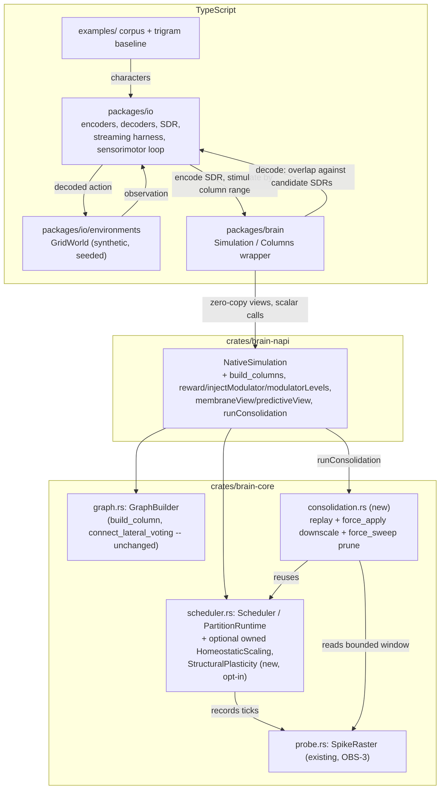

# Design: Brain Engine Phase 5 — I/O, Grounding and Consolidation

> **Revised 2026-09-10** to match the requirements revision of the same date (README §12a items 3–7). Four changes: the neuromodulator/reward surface is promoted from a footnote under Requirement 9.3 to its own component (Requirement 15) and its one open question is now _answered_, not deferred; consolidation's replay source becomes an abstraction (Requirement 10.6); IO-5's sensorimotor loop is designed here (Requirement 16); and a decision-only section settles LRN-12's blocking constraints (Requirement 17). This phase has **no dependency on a "Phase 4.5"** — an earlier draft of this note assumed one; it was dropped as a sequencing mistake (nothing here needs NET-12's attractor result, and the item 6 phase-preservation check it would have carried is already resolved as housekeeping, not a phase). NET-12 itself moved to Phase 5.5.

## Overview

Phase 5 adds the following on top of the Phase 0–4 core, each satisfying a cluster of the approved requirements:

1. **`packages/io`** (new npm workspace member): pure, library-free TypeScript encoders, decoders, and a shared SDR type (Requirements 1–7).
2. **A column-network FFI surface** (`crates/brain-napi`, `packages/brain`): closes the gap Phase 4 deliberately left open — `NativeSimulation` currently only builds flat, hand-wired networks; this phase exposes the _already-implemented_ Rust-side `GraphBuilder::build_column`/ `connect_lateral_voting`/`ColumnRegistry` (Requirement 8), plus bulk per-column reads. (The neuromodulator-injection call originally listed here moved to item 5 below — the 2026-09-10 analysis found it is not the one-line wiring job this bullet assumed.)
3. **"Always-on" homeostasis and structural plasticity** (`crates/brain-core`, `crates/brain-napi`): a genuine gap found during design exploration, not previously named in the requirements as its own item but required to satisfy Requirement 9.2 honestly — see "A finding that shapes this design" below.
4. **Consolidation** (`crates/brain-core/src/consolidation.rs`, new): replay + aggressive downscaling + aggressive pruning, built entirely from existing mechanisms (Requirements 10–12), triggered explicitly from TypeScript.
5. **The reward API and neuromodulator control surface** (`crates/brain-core`, `crates/brain-napi`): LRN-11, raised C → S. Promoted out of item 2 above into its own component because the §12a item 4 analysis found it is three separable pieces of work, not one wiring detail, and because Requirement 9.3's learning-rate modulation cannot be satisfied without it (Requirement 15).
6. **The sensorimotor loop** (`packages/io` or a sibling package, TypeScript only): IO-5, moved into this phase from Phase 5.5. Built entirely over the _existing_ FFI — no new core capability (Requirement 16).
7. **An LRN-12 design decision, deliberately without an implementation**: settles the two constraints that make a fast-binding store expensive to retrofit, so that building it in Phase 5.5 is an addition rather than a migration (Requirement 17).
8. **The milestone harness** (`packages/io`, `examples/`): the phase's acceptance bar, wiring the above together end to end against a real corpus _and_ closing the loop from 6 — VAL-4 and a closed sensorimotor loop are assessed separately and both are required (Requirement 13, including 13.7).

### A finding that shapes this design

Exploring `crates/brain-core` before writing this design surfaced something the prior specs' text doesn't state explicitly: `HomeostaticScaling` (LRN-6) and `StructuralPlasticity` (LRN-7) are **periodic sweeps the caller must drive itself** — `maybe_apply`/`maybe_sweep` take an explicit `tick` and internally decide whether their interval has elapsed, but neither is a field on `Scheduler`, and `Scheduler::step()` never calls them. Today, only Rust integration tests (`tests/homeostasis.rs`, `tests/structural_and_growth.rs`) drive them, by calling them directly in a hand-rolled tick loop. **`NativeSimulation` — the type every TypeScript caller actually uses — has never called either mechanism, ever.** Grepping `crates/brain-napi/src/lib.rs` confirms it: no reference to `Homeostatic`, `Structural`, or the modulator field's `inject` either. **The 2026-09-10 revision found that second finding is not the smaller one it looked like** — it is Requirement 15's whole component, because the modulator field also turns out not to be shared across partitions at all. Both findings were independently reconfirmed by the §12a item 4 analysis.

This matters for Phase 5 specifically because of Requirement 9.2: "the harness SHALL NOT introduce any new training mode switch in the Rust core," and by implication, plasticity being "always on" for a TypeScript-driven stream has to be true _in the core_, not simulated by the TS harness somehow calling Rust-internal sweep logic per tick (which isn't exposed and shouldn't be — sweep-interval bookkeeping is simulation-core policy under ENG-1, not orchestration). Closing this gap is therefore in scope for this phase, as plumbing (no new algorithm — see Components below), and it also directly benefits LRN-10 (Requirements 10–11 reuse the exact same `HomeostaticScaling`/`StructuralPlasticity` types with different parameters).

## Architecture



Three flows exist end to end:

- **Streaming (IO-4, live):** `packages/io`'s harness pulls the next input, encodes it to an SDR, stimulates the network (via `packages/brain`'s column wrapper resolving SDR bits to global neuron indices), steps the simulation N ticks (plasticity — STDP, three-factor, homeostasis, structural — all running inside `step()`, no mode switch), reads back a bulk view of the relevant column(s), and decodes it. This never pauses learning.
- **Consolidation (LRN-10, offline, explicit):** a separate call, `runConsolidation()`, which replays a bounded recent window of the spike raster, then force-applies downscaling and pruning at consolidation-specific (stricter) parameters. It advances the tick counter like any other simulation activity — RUN-9a's round-trip property applies to it exactly as to `step()`.
- **Sensorimotor (IO-5, live, closed):** encode → stimulate → step ×N → decode, the same shape as the streaming flow above, but **not** `streamThrough` itself and not a wrapper around it — `streamThrough` compares a decoded prediction against a known ground-truth label pulled from a predetermined source, and there is no such label here: the loop decodes an _action_, and the _next_ observation is a consequence of that action rather than a fixed item in a sequence (`Environment.observe()` cannot be a `StreamSource<T>` for the same reason a generator cannot know its own next value before its caller decides it). The two therefore stay separate, small orchestration functions (`streamThrough` and `runSensorimotorLoop`) built from the same lower-level primitives (`ColumnHandle.stimulateSdr`/`observedSdr`, `decode()`), rather than one wrapping the other — see Requirement 16's component below. What _is_ true, and is the actual reason moving IO-5 into this phase was cheap, is that neither function needs any new core capability: both are orchestration code over the same `stimulate`/`step` FFI calls (Requirement 16.1).

## Components and Interfaces

### `packages/io` (new workspace member) — Requirements 1–7, 9, 13

```
packages/io/
  package.json          # name "@brain/io", deps: "@brain/core" only (Req 1.1)
  src/
    sdr.ts               # Sdr type, overlap(), density-aware construction (Req 2)
    encoders/
      scalar.ts          # Req 3
      category.ts        # Req 3
      datetime.ts        # Req 4
      text.ts             # character + word-level hashing encoder (Req 5)
    decoders/
      overlap.ts          # SDR-overlap nearest-match decoder (Req 7)
    columns.ts             # thin wrapper: SDR active bits -> column-relative stimulate,
                            # column bulk views -> observation SDR (Req 8.3/8.4 consumer)
    harness/
      stream.ts            # IO-4 streaming loop (Req 9)
    baseline/
      trigram.ts           # plain frequency-counting trigram model (Req 13.3)
  test/
    sdr.test.ts, scalar.test.ts, category.test.ts, datetime.test.ts, text.test.ts  # fast tier
    decoder.test.ts                                                                # fast tier
    char-prediction.slow.test.ts   # Req 13, VAL-4 milestone -- slow tier
    fixtures/corpus.txt            # a public-domain English text, a few hundred KB (Req 13.1)
```

**`sdr.ts` (Requirement 2).**

```ts
export interface Sdr {
  readonly width: number;
  readonly activeBits: ReadonlyArray<number>; // sorted, deduplicated
}

export function overlap(a: Sdr, b: Sdr): number; // Requirement 2.2 -- the one implementation every decoder uses
export function overlapFraction(a: Sdr, b: Sdr): number; // normalised by min(density-implied count)
export function makeSdr(width: number, activeBits: Iterable<number>): Sdr; // validates, sorts, dedupes
```

Every encoder in `encoders/` returns an `Sdr`; every decoder in `decoders/` consumes one. This is the single contract Requirement 2 exists to pin down, so "semantically similar inputs overlap" (IO-1) is checked once, against `overlap()`, rather than once per encoder.

**Encoders (Requirements 3–5).** Each is a small pure module. The scalar encoder is the classic HTM-style sliding-window-over-a-bit-array construction cited in README §13.1 (bucket the value's position in `[min, max]`, turn on a contiguous run of `w` bits centered there — nearby values share most of their run, far values share none). The category encoder assigns each label a disjoint (or caller-supplied-overlap) block of bits, deterministically from the label string via the same hash construction the text encoder uses, so there is one hashing primitive (`hashToBits(seed, key, width, density) -> number[]`) shared by `category.ts` and `text.ts` rather than two independent implementations. The datetime encoder composes one scalar-style sub-encoder per configured cyclic component (time-of-day as a value in `[0, 86400)` wrapped modulo, day-of-week in `[0, 7)`, etc.) and concatenates their bit ranges into one wider SDR — this is what gives it phase-equivalence overlap (Requirement 4.3) a raw epoch-scalar encoder cannot provide, since a scalar encoder's window never wraps at the period boundary.

**Decoder (Requirement 7).**

```ts
export interface Candidate<L> {
  label: L;
  sdr: Sdr;
}
export interface DecodeResult<L> {
  label: L;
  overlap: number;
  confident: boolean;
}

export function decode<L>(
  observed: Sdr,
  candidates: ReadonlyArray<Candidate<L>>,
  minConfidence: number,
): DecodeResult<L> | undefined;
```

Ties broken by lowest candidate index in `candidates` (Requirement 7.3); returns `undefined` when the best overlap is below `minConfidence` (Requirement 7.2) rather than forcing a guess — this is what lets Requirement 13.2's accuracy metric distinguish "wrong" from "no prediction".

**`columns.ts` — the encode/decode ↔ network bridge (Requirements 2.4, 7.5, 8.3, 8.4).**

```ts
export class ColumnHandle {
  readonly id: number;
  readonly range: { start: number; end: number };
  stimulateSdr(sim: Simulation, sdr: Sdr, current: number): void; // maps sdr.activeBits (local) -> range.start + bit, calls sim.stimulate per bit
  observedSdr(spikedThisTick: ReadonlyArray<number>): Sdr; // filters the global spiked-index list to this range, shifts to local indices
  membraneWindow(sim: Simulation): Float32Array; // sim.membraneView().subarray(range.start, range.end) -- zero-copy
  predictiveWindow(sim: Simulation): Float32Array; // sim.predictiveView().subarray(range.start, range.end) -- zero-copy
}
```

`stimulateSdr`/`observedSdr` are the "explicit, documented mapping" Requirement 2.4 and 7.5 require. `membraneWindow`/`predictiveWindow` satisfy Requirement 8.4's "same zero-copy discipline as whole-network reads" by slicing the bulk views added below — no per-neuron FFI call happens per tick.

**`harness/stream.ts` — IO-4 (Requirement 9).**

```ts
export interface StreamSource<T> { [Symbol.iterator](): Iterator<T>; }
export interface StreamStep<T, L> { input: T; predicted: DecodeResult<L> | undefined; actual: L; }

export function* streamThrough<T, L>(
  source: StreamSource<T>,
  encode: (t: T) => Sdr,
  columns: ColumnHandle[],           // where to stimulate / read from
  sim: Simulation,
  candidates: ReadonlyArray<Candidate<L>>,
  actualLabelOf: (t: T) => L,
  ticksPerInput: number,
): Generator<StreamStep<T, L>>;
```

A generator, not a class with start/stop/mode flags: each `next()` call encodes one input, stimulates, steps `ticksPerInput` times, decodes, and yields — there is no "training mode" to turn off (Requirement 9.2), and a caller can `for...of` it indefinitely or stop at any point and call `sim.snapshot()` (Requirement 9.4, reusing `Simulation.snapshot()` from `packages/brain` unchanged).

### Column-network construction at the FFI boundary — Requirement 8

`crates/brain-core`'s `graph.rs` (`GraphBuilder::build_column`, `connect_lateral_voting`) and `column.rs` (`ColumnRegistry`) already implement everything Requirement 8 needs (confirmed by reading both files) — **nothing in `brain-core` changes for this requirement.** The gap is entirely that `crates/brain-napi/src/lib.rs`'s `NativeSimulation` never calls them: it only exposes flat `allocate`/`connect`.

`NativeSimulation` gains:

```rust
struct NativeSimulation {
    neurons: NeuronArena,
    synapses: SynapseArena,
    runtime: Runtime,
    lif_params: LifParams,
    columns: ColumnRegistry,       // new, default empty -- Requirement 8.2's fallback
    builder: Option<GraphBuilder>, // new, built lazily from a seed on first build_columns() call
}

#[napi(object)]
pub struct DistancePolicyConfig { pub p0: f64, pub length_scale: f64, pub delay_min: u32, pub delay_max: u32, pub initial_permanence: f64 }

#[napi(object)]
pub struct ColumnConfig {
    pub neuron_count: u32,
    pub threshold: f64,
    pub excitatory_fraction: f64,
    pub internal_policy: DistancePolicyConfig,
    pub neighbourhood_size: u32,
    pub k: u32,
    pub segments: SegmentsConfig,   // reuses the existing napi type unchanged
}

#[napi(object)]
pub struct VotingGroupConfig { pub column_ids: Vec<u32>, pub vote_segment: u32, pub policy: DistancePolicyConfig }

#[napi(object)]
pub struct ColumnHandleFfi { pub id: u32, pub start: u32, pub end: u32 } // Requirement 8.3

impl NativeSimulation {
    #[napi]
    pub fn build_columns(&mut self, seed: BigInt, columns: Vec<ColumnConfig>, voting_groups: Vec<VotingGroupConfig>) -> Result<Vec<ColumnHandleFfi>>;

    #[napi]
    pub fn membrane_view(&mut self) -> Float32Array;   // new bulk view, mirrors NativeArena::membrane_view (Requirement 8.4)
    #[napi]
    pub fn predictive_view(&mut self) -> Float32Array; // new bulk view (Requirement 8.4)

    // Modulator injection/readback (reward, injectModulator, modulatorLevels) is
    // NOT declared here even though it lives on this same struct -- Requirement
    // 15's "Reward API and neuromodulator control surface" section below is the
    // single, authoritative place that surface is specified, so there is exactly
    // one description of it in this document rather than a partial one here and
    // a full one there.
}
```

`build_columns` is called once, before the first `stimulate`/`step` — the same lifecycle contract `allocate`/`connect` already have (`NativeSimulation`'s existing doc comment on `total_neurons` already states this pattern; `build_columns` documents the identical constraint). Internally it constructs `GraphBuilder::new(seed)` once, calls `build_column` per `ColumnConfig` (each appending a contiguous block via `allocate_population`+`connect`, exactly as `graph.rs`'s existing doc comment describes), registers each into `self.columns`, then calls `connect_lateral_voting` per `VotingGroupConfig`. This satisfies Requirement 8.1 — no new neuron/synapse/plasticity code path, only new call sites into existing ones.

**Partitioned mode.** `ensure_partition_runtime_built` (existing method, `lib.rs`) currently always calls `PartitionPlan::even_split(total_neurons, thread_count)`. It changes to: `if self.columns.is_empty() { PartitionPlan::even_split(...) } else { PartitionPlan::contiguous(&self.columns, thread_count) }` — `PartitionPlan::contiguous` already exists (Phase 4 design.md) and already guarantees a partition never splits a column. This is additive: flat networks (`self.columns` empty) are unaffected (Requirement 8.2, Requirement 8.6).

**Snapshot round-trip (Requirement 8.5).** `snapshot.rs` already versions and migrates a `ColumnRegistry` section (Phase 4's `FORMAT_VERSION = 2`, "Requirement 9.6" in the Phase 4 spec: existing v1 snapshots migrate to an _empty_ registry). Nothing changes here — a `NativeSimulation` built via `build_columns` already populates the same `ColumnRegistry` type Phase 4's snapshot format already knows how to write and restore. No format version bump is needed for this requirement alone.

**Stimulate/observe by column (Requirement 8.3/8.4).** Deliberately _not_ new scalar FFI calls. `build_columns`'s return value (`Vec<ColumnHandleFfi>`) gives TypeScript each column's `start..end`; `packages/io/src/columns.ts`'s `ColumnHandle` wraps that range and the existing `stimulate`/`step`/new bulk views to do the resolution client-side — this is Requirement 2.4's "explicit, documented mapping" pattern reused, and it keeps the FFI surface itself minimal (ENG-8), rather than adding a `stimulateColumn(columnId, localIndex, current)` call that would just do the same addition on the Rust side for no zero-copy benefit (a stimulate call is already a scalar control call regardless of which side computes the target index).

### Reward API and neuromodulator control surface — Requirement 15 (and 9.3)

A second, smaller instance of the same gap pattern as Requirement 8: `Scheduler::inject_modulator(&mut self, index: usize, amount: f32)` and `PartitionRuntime::inject_modulator(&mut self, partition_id: usize, index: usize, amount: f32)` **already exist** in `crates/brain-core` (confirmed by reading `scheduler.rs` and `partition.rs`) — this is LRN-4/LRN-5's three-factor modulator field, built in Phase 0–3 and already tested (`sched.inject_modulator(DOPAMINE, 1.0)` appears in `scheduler.rs`'s own unit tests). It was simply never exposed past `crates/brain-napi`.

This is this document's one, authoritative declaration of that FFI surface (Requirement 8's component above deliberately does not repeat it):

```rust
impl NativeSimulation {
    /// Requirement 15.1: fixes the channel to `DOPAMINE`, leaves magnitude to the caller.
    #[napi]
    pub fn reward(&mut self, amount: f64);

    /// Requirement 15.2: the general form -- any channel, any amount.
    #[napi]
    pub fn inject_modulator(&mut self, channel: u32, amount: f64);

    /// Requirement 15.5: readback, without perturbing the decay clock.
    #[napi]
    pub fn modulator_levels(&self) -> Vec<f64>; // one entry per channel, DOPAMINE/ACETYLCHOLINE/NORADRENALINE/SEROTONIN order
}
```

`reward` and `inject_modulator` both dispatch exactly like `stimulate` already does: `Runtime::Single` calls the scheduler directly; `Runtime::Partitioned` calls the broadcasting `PartitionRuntime::inject_modulator` defined below (never `inject_modulator_into_partition` — nothing at the FFI boundary targets one partition specifically, which is deliberate: a caller who needs that is a Rust-internal caller, not a TypeScript one, per the "Route taken" rationale below).

**The open question in the previous draft is now answered, and the answer is the less convenient one** (§12a item 4, 2026-09-10). The field is **not** shared or atomic across partitions. Each partition owns a private `NeuromodulatorField` inside its own `Scheduler`, and `PartitionRuntime::inject_modulator(partition_id, ...)` reaches exactly one of them — its own doc comment says so explicitly, noting that RUN-6's genuine sharing "is wired once real threads exist," which never happened even though real threads shipped in Step 17. So broadcast **is** required, and the design takes it further than a loop in the FFI wrapper, for two reasons:

1. A loop in `crates/brain-napi` leaves the same trap set for every Rust caller — including NET-13 in Phase 5.5, which is the first thing that would plausibly inject _non-uniformly_ and so the first thing that would be silently wrong.
2. Requirement 15.3 asks the design to state which route it takes and why.

**Route taken: make broadcast the only reachable behaviour at the `PartitionRuntime` API.** `PartitionRuntime::inject_modulator(partition_id, index, amount)` is renamed to `inject_modulator_into_partition` (kept, since a genuinely regional injection is what LRN-5's reserved `region_id` anticipates), and a new `PartitionRuntime::inject_modulator(index, amount)` broadcasts to every partition's field. The FFI and the new reward wrapper both call the broadcasting form. This is deliberately _not_ a shared atomic field: `NeuromodulatorField`'s `catch_up` mutates `last_updated_at` on every read, so making it genuinely shared means either a lock on a per-delivery-hot-path read or a redesign of its lazy-decay clock — and Phase 4 already found (the hard way, documented in `partition.rs`'s module docs) that this type is unforgiving about being queried out of tick order. Broadcasting an identical injection to N independent fields that all advance in lockstep produces the same values with none of that risk. Requirement 15.4's bit-identity test across thread and partition counts is what holds that claim honest.

**The reward wrapper (Requirement 15.1)** is a named entry point over the above — nothing more. It fixes the channel to `DOPAMINE` and leaves magnitude to the caller, so that "reward" has one spelling in this codebase instead of every call site independently knowing which of the four channels means reward. No neuron code and no plasticity rule changes, per LRN-11's own wording; `ThreeFactorStdp` already reads `ctx.modulators[modulator_index]` and needs nothing.

**Readback (Requirement 15.5).** `NeuromodulatorField::levels_at(&mut self, tick)` takes `&mut self` because of the lazy catch-up, so a readback accessor must either take `&mut self` too or report the last-computed levels without advancing. The design takes the latter — a `levels_unchecked()` returning the stored array with no catch-up — because a _diagnostic_ read must not be able to perturb the decay clock that Phase 4 already found is easy to corrupt. The FFI exposes that.

### Always-on homeostasis and structural plasticity — supports Requirement 9.2

New optional fields on `Scheduler` (`scheduler.rs`) and (by the same pattern) on `PartitionScheduler`/`PartitionRuntime` (`partition.rs`), mirroring the existing `with_inhibition`/`with_segments`/`with_predictive_learning` builder pattern exactly:

```rust
// scheduler.rs
pub struct Scheduler {
    // ...existing fields...
    homeostatic_scaling: Option<HomeostaticScaling>,   // new
    structural_plasticity: Option<StructuralPlasticity>, // new
}

impl Scheduler {
    pub fn with_homeostatic_scaling(mut self, scaling: HomeostaticScaling) -> Self { self.homeostatic_scaling = Some(scaling); self }
    pub fn with_structural_plasticity(mut self, sp: StructuralPlasticity) -> Self { self.structural_plasticity = Some(sp); self }

    pub fn step<D: NeuronDynamics>(&mut self, neurons: &mut NeuronArena, synapses: &mut SynapseArena, params: &D::Params) -> StepReport {
        // ...existing steps 1-5, unchanged...
        if let Some(scaling) = &mut self.homeostatic_scaling {
            scaling.maybe_apply(neurons, synapses, self.tick);
        }
        if let Some(sp) = &mut self.structural_plasticity {
            sp.maybe_sweep(neurons, synapses, self.tick);
        }
        report
    }
}
```

Both fields default to `None` (omitted `with_*` call), so every existing Phase 0–4 test and every existing `Scheduler::new(...)` call site is unaffected — this is additive in exactly the same sense Phase 4's Requirement 1 Acceptance Criterion 7 required column-building to be additive. `PartitionRuntime`'s per-partition `PartitionScheduler` gets the same two optional fields, with structural plasticity's sweep using the already-existing `maybe_sweep_partitioned(..., |n| plan.partition_of(n))` variant (Phase 4 Step 19) instead of plain `maybe_sweep`, so cross-partition sprouts keep getting the correct minimum delay automatically.

`crates/brain-napi`'s `SchedulerConfig`/`build_scheduler` (`lib.rs`) gain two new optional config object types (`HomeostaticScalingConfig { target_total_permanence, interval_ticks }`, `StructuralPlasticityConfig { prune_floor, sprout_permanence, min_activity_streak, sweep_interval_ticks, unused_ticks_before_reclaim, min_cross_partition_delay, neighbourhood_size, neighbourhood_k }`), threaded into `NativeSimulation::new`'s constructor exactly like `inhibition`/`segments`/`predictive_learning` already are — same `Option<...>`, same omit-to-disable convention, same place in the parameter list (appended, so existing positional callers from Phase 0–4's tests are unaffected only if those tests use named/object construction already — `packages/brain`'s `Simulation.create` passes options by field already, so this is safe).

### Consolidation — `crates/brain-core/src/consolidation.rs` (new) — Requirements 10–12

Two small additions to existing mechanisms, then one new module that composes them with replay:

- **`homeostatic.rs`**: add `HomeostaticScaling::force_apply(&mut self, neurons, synapses)` — identical body to `rescale_one`'s loop in `maybe_apply`, but skipping the interval-elapsed check. `maybe_apply` becomes a thin wrapper: `if due { self.force_apply(...); true } else { false }`. This is the "same math, different _when_" relationship Requirement 11.1 describes.
- **`structural.rs`**: add `StructuralPlasticity::force_sweep(&mut self, neurons, synapses, tick, partition_of)` analogously — `maybe_sweep_partitioned` becomes a thin wrapper around it.

```rust
// consolidation.rs
pub struct ConsolidationParams {
    pub replay_window: usize,               // Requirement 10.4: bounded, not full history
    pub downscale_target_total_permanence: f32,
    pub prune_floor: f32,                    // stricter than the online StructuralPlasticity's floor
    pub sprout_permanence: f32,
    pub min_activity_streak: u32,
    pub unused_ticks_before_reclaim: u32,
}

pub struct ConsolidationReport { pub replayed_spikes: u32, pub pruned: u32 }

/// What consolidation replays *from* (Requirement 10.6). Deliberately an
/// abstraction rather than `&SpikeRaster` directly: a spike raster is a tape
/// recorder, not the fast store LRN-10 and README §2.9 both assume exists,
/// and LRN-12 must be able to become a second implementer of this trait
/// rather than a breaking change to this signature and to the
/// `#[napi(object)]` shape it is exposed through (README §12a item 5).
///
/// The surface is only what replay actually consumes (Requirement 10.7):
/// an ordered, bounded sequence of (relative tick, neuron index) events.
/// Nothing about storage, export format, or capacity appears here, so an
/// implementer is not obliged to pretend to be a recording.
pub trait ReplaySource {
    /// The most recent `window` events, oldest-first, each as
    /// `(tick_offset_from_window_start, neuron_index)`. Returning fewer
    /// than `window` events is normal, not an error.
    fn recent_events(&self, window: usize) -> Vec<(u32, u32)>;
}

/// The only implementation this phase ships (Requirement 10.1).
impl ReplaySource for SpikeRaster { /* over self.events() */ }

impl Scheduler {
    /// LRN-10: replays up to `params.replay_window` of `source`'s most
    /// recent events, then force-applies downscaling and an aggressive
    /// pruning pass (Requirement 11.1/11.2). Advances `self.tick` by the
    /// replayed span (Requirement 12.2's round-trip property).
    ///
    /// Generic over `R: ReplaySource` rather than taking `&dyn ReplaySource`:
    /// consolidation is an offline, caller-invoked pass, so there is no hot
    /// path to protect, but monomorphising keeps this consistent with
    /// `NeuronDynamics`/`SegmentModel`'s existing generic-not-trait-object
    /// convention in this crate.
    pub fn run_consolidation<D: NeuronDynamics, R: ReplaySource>(
        &mut self,
        neurons: &mut NeuronArena,
        synapses: &mut SynapseArena,
        dyn_params: &D::Params,
        source: &R,
        params: &ConsolidationParams,
        seed: u64,
    ) -> ConsolidationReport;
}
```

**Replay (Requirement 10).** The most recent `replay_window` events from `source.recent_events(params.replay_window)` are re-delivered as genuine spikes at ticks starting from `self.tick + 1`, offset-preserving relative timing within the window. Each replayed event reuses the _exact_ commit path a real winning candidate already goes through in `evaluate_and_resolve` (the `D::commit_spike` call, the outgoing-delivery scheduling loop, and the on-post-spike STDP/three-factor crediting over incoming synapses) — extracted as a small private helper, `Scheduler::commit_and_schedule(idx, tick)`, shared between the two call sites, rather than duplicated. This is what makes Requirement 10.3 true by construction: replayed spikes are not a special case for any plasticity rule to recognise, because from `RuleChain`'s point of view a replayed spike _is_ the same event a live one produces. No membrane integration happens for a replayed spike (it does not need to "re-earn" threshold crossing — the raster already recorded that it happened), which is also why replay does not need the original encoder or live input present (Requirement 10.2). Any ordering choice within the replay (if two recorded sequences' events interleave and a tie-break is needed) draws from `crate::rng::derive_stream(seed, tick, PURPOSE_REPLAY_ORDER, event_index)`, keeping Requirement 11.5's determinism.

**Downscaling and pruning (Requirement 11).** After replay, `run_consolidation` constructs short-lived `HomeostaticScaling`/`StructuralPlasticity` instances from `ConsolidationParams` (distinct from — and not touching — any `Scheduler::homeostatic_scaling`/`structural_plasticity` fields configured for online use) and calls `force_apply`/`force_sweep` once each. This is why Requirement 11.1's "reusing the existing mechanism's math... not a separate implementation" is literal, not just similar-in-spirit: it is the same Rust types, constructed with different numbers.

**Scope decision: single-threaded only, for now.** `run_consolidation` is defined on `Scheduler`, not `PartitionRuntime`. Replaying a raster whose events may target any partition, correctly and deterministically, through the cross-partition messaging path (Requirement 4's inbox/outbox mechanism from Phase 4) is materially more complex than single-threaded replay, and nothing in this phase's milestone (Requirement 13) requires multi-threaded consolidation. This mirrors a scoping choice the codebase already made for itself: `NativeSimulation.snapshotBytes`/`restore` are documented as "`Single`-mode only" (Phase 4 Step 22, `lib.rs`'s module doc comment) with multi-threaded support left as a follow-up. `runConsolidation` follows the same precedent and should say so in its own doc comment, not silently.

### Consolidation FFI — `crates/brain-napi` — Requirement 12

```rust
#[napi(object)]
pub struct ConsolidationConfig {
    pub replay_window: u32,
    pub downscale_target_total_permanence: f64,
    pub prune_floor: f64,
    pub sprout_permanence: f64,
    pub min_activity_streak: u32,
    pub unused_ticks_before_reclaim: u32,
}

#[napi(object)]
pub struct ConsolidationReportFfi { pub replayed_spikes: u32, pub pruned: u32 }

impl NativeSimulation {
    /// Requirement 12.1: explicit only, never a side effect of `step()`.
    /// Requirement 12.4: a network with an empty raster completes as a
    /// no-op (0 replayed, downscale/prune still run against whatever
    /// topology exists).
    #[napi]
    pub fn run_consolidation(&mut self, seed: BigInt, config: ConsolidationConfig) -> Result<ConsolidationReportFfi>;
}
```

Requires `NativeSimulation` to hold a `SpikeRaster` fed from every `step()` call (a small, existing-primitive addition: `self.raster.record_tick(self.current_tick(), &spiked)` at the end of `step`, bounded by truncating to `ConsolidationParams::replay_window`-ish size lazily rather than growing unboundedly — or, more simply, wrapping recording in the same `BoundedRecorder`-style capacity `probe.rs` already provides). Config fields map 1:1 to `ConsolidationParams`, validated at the boundary (`prune_floor`/`downscale_target_total_permanence` must be finite and non-negative, matching existing napi validation conventions elsewhere in `lib.rs` — e.g. `totalNeurons` required when `threadCount > 1` is the same "typed `Result` error, not a panic" convention this follows). `run_consolidation` on `NativeSimulation` requires `Runtime::Single` (Requirement 12.1's "Scope decision" above) — calling it while `Runtime::Partitioned` returns a typed error rather than attempting a wrong or partial consolidation.

### The sensorimotor loop — `packages/io` — Requirement 16

TypeScript only, over the FFI that already exists. No Rust changes at all, which is the whole reason moving IO-5 up a phase is cheap: `NativeSimulation.step()` already returns the indices that spiked and `stimulate()` already takes input back in, so the loop is a `while` statement in orchestration code, not a core capability.

**Decision, recorded here rather than left implicit:** `runSensorimotorLoop` is its own function, not `streamThrough` (Requirement 9) called with a `GridWorld`-backed source, and not a wrapper around it either. `streamThrough` is prediction-accuracy-shaped — it decodes a guess and compares it to an `actualLabelOf(t)` drawn from a _predetermined_ input, so it can run ahead of the network's own responses. This loop cannot: the next observation is `environment.act(decoded)`'s _consequence_, so nothing before this tick's decode exists to source it from, and there is no ground-truth label to compare against (only "did the network score the disambiguation task", Requirement 16.5's ablation, measured over a whole run). Both functions are three or four lines of orchestration once `ColumnHandle`/`decode()` exist, so sharing that much is enough — forcing a second one to type-fit inside `streamThrough`'s generic signature would cost more indirection than it saves.

```ts
// packages/io/src/loop.ts
export interface Environment<Obs, Act> {
  observe(): Obs;
  act(action: Act): void; // mutates environment state
}

export interface SensorimotorConfig<Obs, Act> {
  encode(obs: Obs): Sdr; // Requirement 3-5's encoders
  actions: ReadonlyMap<Act, Sdr>; // candidate SDRs, one per action
  ticksPerStep: number;
}
```

Each iteration: `observe` → `encode` → stimulate → advance `ticksPerStep` → read the spiked set → decode it against `config.actions` **using Requirement 7's existing SDR-overlap readout**, not a second motor-specific path (Requirement 16.2, and invariant 8's "decoding to a device is the mirror of encoding from one") → `act`. Learning stays on throughout, exactly as Requirement 9.2's harness does; the loop is a _different driver_ for the same streaming machinery, not a second mode.

**The environment (Requirement 16.4)** is a synthetic, seeded 2-D symbol grid with a cursor: the agent observes only the cell under the cursor plus its own last action, and can move in four directions. Chosen because it makes Requirement 16.5's ablation sharp — the task is "identify which of two grids you are on", the two grids are identical everywhere except one cell, and the only way to reach that cell is to _move there_. An agent whose actions are disconnected from what it next observes (observations sampled independently) cannot do better than chance on that task, however good its sequence prediction is. That is a much cleaner load-bearing demonstration than measuring a reward curve, and it needs no reward signal at all — which keeps Requirement 16 independent of Requirement 15 rather than stacking two new mechanisms into one test.

**Why this is _not_ NET-9.** No location signal, no grid cells, no reference frame — the agent has no representation of _where_ it is beyond what the sequence memory happens to encode. That is Phase 5.5's job, and IO-5 landing here is precisely what unblocks it.

### LRN-12 fast binding — the decision, and deliberately no implementation — Requirement 17

Requirement 17 is satisfied by this section plus its promotion into README §12, not by code. Four things are decided.

**1. `cap_per_neuron` stays a single global constant in this phase, and the escape route is chosen now.** `SynapseArena::new(cap_per_neuron)` addresses a synapse as `source * cap_per_neuron

- slot`, with `source_of(id) = id / cap_per_neuron`relied on by cross-partition`on_post_spike` routing. Two routes exist:

| Route | What it costs, given Phase 4 shipped |
| --- | --- |
| **Second `SynapseArena`** for the fast store | `split_views_mut`'s neuron-range→synapse-range derivation, `boundary_neurons`, `PartitionRuntime::step`'s single `synapses` parameter, `snapshot.rs`'s `FORMAT_VERSION`, and every `Scheduler` method taking a `SynapseArenaViewMut` |
| **Variable-block arena** | Breaks `id / cap_per_neuron` outright — the derivation cross-partition post-spike routing depends on |

**Decision: the second-arena route.** It is more code but it is _additive_ code — every existing addressing expression keeps working unchanged, which is the same property that made Phase 4's `OffsetSlice` the right call over raw pointers. The variable-block route changes an invariant that three modules silently depend on. Recording this now is the entire point of Requirement 17: the second-arena route's cost is a list of known call sites today and an archaeology exercise after another phase of growth.

**2. LRN-12 is not a `PlasticityRule`, and that does not violate invariant 1.** `PlasticityRule` sees `LocalContext` (two `NeuronLocal` copies, modulators, tick) and `SynapseMut` (four borrowed scalars) — no synapse id, no arena, no population view — so pattern separation is unreachable from it _by construction_, deliberately. The precedent for where it goes instead already exists: `plasticity/predictive.rs`'s `adjust_segment_permanence` and `reinforce_or_sprout_burst` write `synapses.permanence[id]` directly, outside the rule interface, as a scheduler-invoked module. LRN-12 follows that shape.

**3. One-shot binding _writes_ permanence; it does not grow it.** A synapse below `connection_threshold` can never be potentiated by activity — `deliver` skips it with `continue` before `on_delivery` runs, and `on_post_spike`'s STDP term is gated on `last_active`, which only delivery writes. So binding is a `SynapseArena::insert(source, target, segment, delay, 1.0)`, and **SYN-3's `[0, 1]` scalar is not a blocker and is not changed.** This also explains an existing oddity worth writing down: structural plasticity's sprouts start sub-threshold and are therefore inert until something writes them, which is why `tests/emergent.rs` draws initial permanences mostly above threshold rather than relying on STDP to build connections from nothing.

**4. Nothing is built.** The deliverable is this section, its promotion to README §12, and `ReplaySource` above being shaped so LRN-12 can implement it later. Phase 5.5 builds the store if this phase's design results say it is needed.

### The VAL-4 milestone — Requirements 13

```
examples/char-prediction.ts          # runnable script, same convention as existing examples/*.ts
packages/io/src/baseline/trigram.ts  # trigram model: Map<string, Map<string, number>> counts, argmax predict
packages/io/test/char-prediction.slow.test.ts  # the actual VAL-4 assertion, multi-seed, slow tier
packages/io/test/fixtures/corpus.txt # public-domain English text, checked in
```

The harness (`examples/char-prediction.ts`, imported by the slow test) does, per seed:

1. Build a column network via `Simulation.create(...)` + a new `packages/brain` convenience (`Simulation.buildColumns(seed, columnConfigs, votingGroups)`, a thin wrapper over the new `NativeSimulation.build_columns` FFI call, returning `ColumnHandle[]`) — one column (or a small voting group of columns) per candidate character in the text encoder's alphabet, so the decoder's candidate set (Requirement 7.1) is exactly "one SDR per possible next character," produced by the same text encoder used for input (Requirement 7.1's "apples-to-apples").
2. Stream the corpus through `harness/stream.ts`'s `streamThrough`, with `actualLabelOf` being "the next character" and `ticksPerInput` a configured constant.
3. Compute sliding-window accuracy from the yielded `StreamStep`s (Requirement 13.2): a fixed-size window of "was `predicted?.label === actual`" booleans, updated per step.
4. Separately, run `baseline/trigram.ts` over the same corpus, producing its own sliding-window accuracy series for direct comparison (Requirement 13.3).
5. Assert the network's aggregate sliding-window accuracy exceeds the trigram's, across the configured seed set, within an explicit tolerance band (Requirements 13.4–13.5).

The full-corpus run is the slow tier (`char-prediction.slow.test.ts`, wired into `npm run test:slow` alongside the existing `test:golden`/scale-test entries in `package.json`); a small truncated-corpus smoke variant (a few KB, one seed) stays in the fast tier so a broken encoder/ decoder/harness wiring fails fast without waiting for the full run.

## Data Models

| Type | File | Status |
| --- | --- | --- |
| `Sdr`, `overlap`, `makeSdr` | `packages/io/src/sdr.ts` | New |
| Scalar/category/datetime/text encoders | `packages/io/src/encoders/*.ts` | New |
| `decode`, `Candidate`, `DecodeResult` | `packages/io/src/decoders/overlap.ts` | New |
| `ColumnHandle` | `packages/io/src/columns.ts` | New |
| `streamThrough` | `packages/io/src/harness/stream.ts` | New |
| trigram baseline | `packages/io/src/baseline/trigram.ts` | New |
| `ColumnConfig`, `VotingGroupConfig`, `ColumnHandleFfi`, `DistancePolicyConfig` | `crates/brain-napi/src/lib.rs` | New napi object types (Requirement 8) |
| `NativeSimulation.columns: ColumnRegistry`, `.builder: Option<GraphBuilder>`, `.build_columns`, `.membrane_view`, `.predictive_view` | `crates/brain-napi/src/lib.rs` | New fields/methods (Requirement 8) |
| `Scheduler.homeostatic_scaling`, `.structural_plasticity` (+ `PartitionScheduler` equivalents) | `crates/brain-core/src/scheduler.rs`, `partition.rs` | New optional fields (Requirement 9.2) |
| `HomeostaticScalingConfig`, `StructuralPlasticityConfig` | `crates/brain-napi/src/lib.rs` | New napi object types (Requirement 9.2) |
| `HomeostaticScaling::force_apply`, `StructuralPlasticity::force_sweep` | `crates/brain-core/src/plasticity/{homeostatic,structural}.rs` | New methods (existing `maybe_*` become thin wrappers) (Requirement 11) |
| `ConsolidationParams`, `ConsolidationReport`, `Scheduler::run_consolidation` | `crates/brain-core/src/consolidation.rs` (new file) | New (Requirements 10–11) |
| `ReplaySource` trait, `impl ReplaySource for SpikeRaster` | `crates/brain-core/src/consolidation.rs` | New (Requirement 10.6 — the abstraction LRN-12 later implements) |
| `ConsolidationConfig`, `ConsolidationReportFfi`, `NativeSimulation.raster: SpikeRaster`, `.run_consolidation` | `crates/brain-napi/src/lib.rs` | New (Requirement 12) |
| `Scheduler::reward`, `.inject_modulator` (unchanged, already existed), `NeuromodulatorField::levels_unchecked` | `crates/brain-core/src/{scheduler,neuromodulator}.rs` | `reward`/`levels_unchecked` new; `inject_modulator` pre-existing (Requirement 15.1, 15.5) |
| `PartitionRuntime::inject_modulator` (broadcasting), `::inject_modulator_into_partition` | `crates/brain-core/src/partition.rs` | **Renamed + new** — the one non-additive change in this phase; the existing per-partition method keeps its behaviour under the longer name, so no caller silently changes meaning (Requirement 15.3) |
| `NativeSimulation.reward`, `.inject_modulator`, `.modulator_levels` | `crates/brain-napi/src/lib.rs` | All three new at this boundary — none of them crossed FFI before this phase (Requirement 15.1, 15.2, 15.5) |
| `Environment`, `SensorimotorConfig`, `runSensorimotorLoop` | `packages/io/src/loop.ts` | New, TypeScript only — no Rust counterpart (Requirement 16.1) |
| `GridWorld` (synthetic seeded environment) | `packages/io/src/environments/grid.ts` | New (Requirement 16.4) |

No existing public type's _fields_ are removed or renamed, and every Rust addition is either a new type/module or an additive `Option<...>` field/method on an existing one — consistent with the pattern both prior phases already established for non-breaking extension.

**One deliberate exception, called out rather than buried:** `PartitionRuntime::inject_modulator` changes meaning. It keeps its current per-partition behaviour under the new name `inject_modulator_into_partition`, and the old name is rebound to the broadcasting form (Requirement 15.3). This is a rename plus a repurposing, which this project has otherwise avoided — justified because leaving the short, obvious name attached to the _silently-wrong-for-most-uses_ behaviour is precisely the trap §12a item 4 identified, and because the compiler catches every existing call site (the arity changes from three arguments to two). There are exactly two in-tree callers — `tests/partitioning_reference.rs:179` and `tests/emergent_columns.rs:313` — and **both are already hand-rolled broadcast loops** (`for p in 0..partition_count { runtime.inject_modulator(p, DOPAMINE, 1.0) }`), which is the clearest possible evidence that the per-partition form is not what callers actually want. Both collapse to a single call and are semantically unchanged.

## Error Handling

| Failure | Handling |
| --- | --- |
| `build_columns` called after `stimulate`/`step` has already run | Not validated at the boundary (mirrors the existing `totalNeurons`/`threadCount` contract, which is also caller-enforced, not runtime-checked) — documented as a caller contract violation, consistent with the existing convention in the same file. |
| An encoder receives an out-of-range scalar or an unknown category label | `packages/io` throws a typed `Error` subclass (`EncoderRangeError`/`EncoderUnknownCategoryError`) per Requirements 3.3/3.5 — never silently clamps unless the encoder is explicitly configured to. |
| `decode()` finds no candidate above `minConfidence` | Returns `undefined`, not an error and not a forced nearest-match (Requirement 7.2) — this is an expected, common outcome, not a failure. |
| `runConsolidation` called while `threadCount > 1` | `Result::Err` with a typed message ("consolidation is single-threaded-only in this phase"), not a panic and not a silent partial run. |
| `ConsolidationConfig` has a `pruneFloor`/`downscaleTarget` outside a sane range (e.g. negative) | Validated at the FFI boundary, `Result::Err`, matching existing config-validation convention (Requirement 12.3). |
| `runConsolidation` on a network with an empty spike raster | Succeeds as a no-op replay (0 events), downscaling/pruning still run against existing topology (Requirement 12.4) — not an error. |
| A `ReplaySource` returns fewer events than `replay_window` | Normal, not an error (Requirement 10.6's trait doc states this explicitly) — a short window replays short. Only a source returning events with non-monotonic tick offsets is a contract violation, and that is a `debug_assert`, matching how this crate already treats caller-contract violations on the view types. |
| `reward()`/`injectModulator` called before plasticity is configured | No-op, matching `Scheduler::inject_modulator`'s existing documented behaviour ("a no-op if plasticity is not configured, since nothing would ever read the level") — unchanged, not tightened; making this an error now would break existing callers for no benefit. |
| `inject_modulator_into_partition` called with an out-of-range `partition_id` | Panics on the existing `self.schedulers[partition_id]` index, unchanged. Left as-is deliberately: this is now the _explicitly regional_ call, so a caller naming a partition that does not exist is a programming error, and the broadcasting form (which callers should reach for by default) cannot hit this at all. |
| The sensorimotor loop decodes an action below `minConfidence` | The environment receives no action that step and the loop continues — "the network did not commit to a move" is a legitimate outcome for a spiking network, not an exception, and forcing a nearest-match here would quietly manufacture the very agency Requirement 16.5's ablation is trying to measure. |
| The VAL-4 milestone or the sensorimotor ablation is not met after tuning | Recorded honestly in README's decision record (§12a-style entry), per Requirements 13.6 and 13.7 — not a code-level error path, a process one. Requirement 13.7 exists so that "beat trigram, loop not closed" (or the reverse) is reportable rather than collapsing into one pass/fail. |

## Testing Strategy

- **`packages/io` unit tests** (`node:test`, fast tier): one file per encoder/decoder/SDR function, plus property tests (Requirement 6) using simple generated-input loops (no property- testing library needed — ENG-6 — ranges of scalars/categories/characters are small enough to iterate directly, matching the "no runtime dependency without justification" rule).
- **Rust unit tests**: `homeostatic.rs`/`structural.rs`'s existing test modules gain a couple of new cases for `force_apply`/`force_sweep` (asserting they run regardless of interval); `consolidation.rs` gets its own module with replay-determinism and no-op-on-empty-raster cases.
- **Rust integration tests** (`crates/brain-core/tests/`): a new `tests/consolidation.rs` with the ablation case Requirement 10.5/11.4 calls for directly: learn sequence A, learn sequence B, measure A's retention with vs. without an interleaved consolidation pass — the same VAL-9 pattern `tests/structural_and_growth.rs`/`tests/homeostasis.rs` already use for their own mechanisms (disable it, watch the property it protects fail).
- **napi boundary tests** (`packages/brain/test/`, extending `boundary.test.ts`'s style): a new suite proving `build_columns` produces the right ranges, `membraneView`/`predictiveView` are genuinely zero-copy (same "mutate on the Rust side, read through an already-obtained view" pattern `boundary.test.ts` already uses), and `reward`/`injectModulator` measurably change plasticity outcome end to end through the real compiled addon (Requirement 15.2), with `modulatorLevels` reading back what was injected (15.5).
- **Modulator broadcast under partitioning** (`crates/brain-core/tests/partitioning_reference.rs`, extended rather than duplicated): one `inject_modulator` call must produce bit-identical results at every thread and partition count, held to the same standard that file already applies to spikes and synapse state (Requirement 15.4). This file is the right home precisely because its existing harness already hand-rolls the per-partition broadcast the new API replaces — the change is visible as a simplification there, not as a new test asserting a new thing.
- **Modulator snapshot round-trip** (extending the existing snapshot tests): level and decay clock survive save/restore exactly (Requirement 15.6, RUN-9a).
- **VAL-4** (`packages/io/test/char-prediction.slow.test.ts`, slow tier): the milestone itself, multi-seed, tolerance-banded, as described in Requirement 13's component above.
- **Sensorimotor loop** (`packages/io/test/sensorimotor.slow.test.ts`, slow tier): the disambiguation task and its ablation (Requirement 16.5) — same network and environment with actions disconnected from observations must perform at chance, while the closed loop does not. A fast-tier smoke variant asserts only that the loop closes at all (an action changes the next observation), so broken wiring fails without waiting for the full run.
- **Invariant 8 re-check** (extending the existing `tests/workspace_policy.rs`-style manifest/ source scan): after Requirements 1 and 16 land, neither core crate names a modality, an action, an effector, or an environment (Requirements 1.5 and 16.6). This is a mechanical grep-shaped test, which is the only kind that keeps an architectural invariant honest over time.
- **Requirement 17 has no test, deliberately.** It is satisfied by a written decision (this document's LRN-12 section plus its promotion to README §12), and the traceability checker should carry it on the same explicit deferral list `scripts/check-traceability.mjs` already maintains for reviewed gaps — visible, not silently unmapped.
- **Regression**: `npm run test:fast` and `npm run test:slow` (existing scripts) must both still pass unchanged for every Phase 0–4 test file — no assertion in `crates/brain-core/tests/` or `packages/brain/test/` from before this phase is touched, per Requirement 14.6.
- **Traceability**: each requirement's acceptance criteria map to the test file(s) named above, checkable the same way `scripts/check-traceability.mjs` already checks prior phases (Requirement 14.4).

No backend/DB request path or user-facing UI exists in this phase (this is a library + CLI example script, no web handlers, no screens), so the MAVI-90 integration-harness question and the `design-wireframe` skill both do not apply, matching both prior phases' designs.
