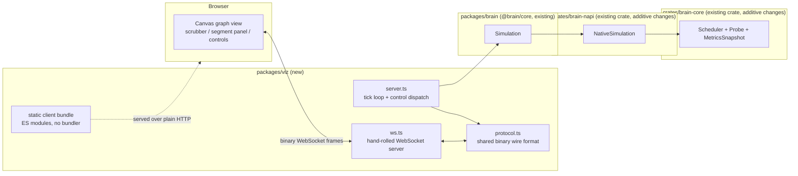
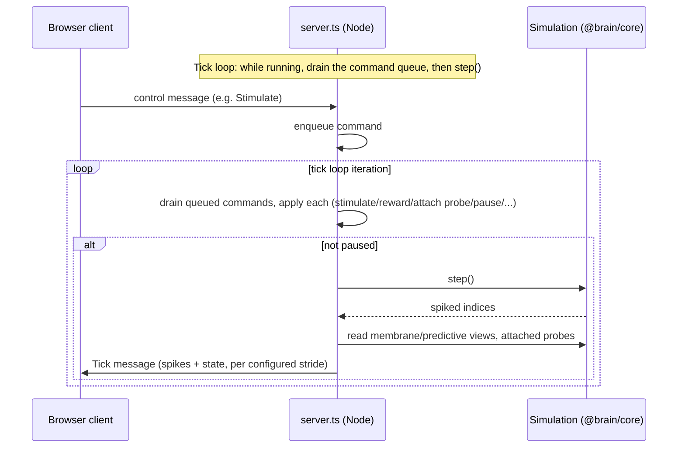

# Design: Brain Engine Phase 6 — Browser Visualiser

## Overview

This phase has two genuinely separate halves, and the design keeps them separate:

1. **Additive FFI/core work** (Requirements 1–6): fill the gap found while grounding this spec —
   `crates/brain-napi` exposes almost nothing of what `brain-core` already computes. This half is
   small, mechanical, and low-risk: every new method mirrors an existing pattern
   (`membrane_view`'s zero-copy contract, `Probe`'s existing bounded-recorder shape) rather than
   inventing a new one. The one real addition to `brain-core` itself is per-segment activity
   recording (Requirement 6), because nothing today retains it.
2. **New package, new protocol** (Requirements 7–13): `packages/viz`, a Node server embedding
   `@brain/core`'s `Simulation` and speaking a small hand-rolled binary protocol over a local
   WebSocket to a plain-JS browser client. This half is genuinely new design surface, per this
   phase's own framing — ENG-8's zero-copy guarantee stops at the process boundary.

Both halves are held to VIZ-2's two hard constraints throughout: the engine never depends on the
visualiser (Requirement 13), and the visualiser adds no charting/graph-layout library (Requirement
9.4) — Canvas 2D and a hand-rolled ~150-line WebSocket layer, not `ws`/`d3`/`cytoscape`/etc.

## Architecture



The dependency direction is strictly left-to-right in the bottom four boxes and the reverse for
data flow: `packages/viz` is the only new consumer; nothing below `packages/brain` knows it
exists (Requirement 13).

### Why a Node server process, not a browser-side WASM build

Restated briefly because it is load-bearing for this design, not because it needs relitigating:
RUN-10/ENG-4 defer WASM. `packages/viz/src/server.ts` is a normal Node process — it can `import`
`@brain/core` and therefore the native `napi-rs` addon directly, with full native threads and no
address-space cap. The browser only ever talks to this Node process over a socket; it never loads
the simulation itself.

### The per-tick data flow (Requirements 3, 7, 8)



A command's effect is always visible starting at a specific, well-defined tick boundary (the next
`step()` call after it was enqueued) because Node's single-threaded event loop guarantees the
queue is drained *between* iterations, never during one — this is what answers Requirement 8.4's
"state the concurrency model" explicitly, with no locking of any kind required.

## Components and Interfaces

### Requirement 1 — Neuron-state FFI surface

`crates/brain-napi/src/lib.rs` gains five new `#[napi]` methods on `NativeSimulation`, immediately
after the existing `predictive_view`:

```rust
#[napi]
pub fn coords_view(&mut self) -> Float32Array {
    // `[f32; 3]` is guaranteed contiguous, no-padding (Rust reference: an
    // array's layout is that of a struct of N fields of its element type),
    // so `self.neurons.coords: Vec<[f32; 3]>`'s backing buffer is exactly
    // `3 * len` contiguous `f32`s -- safe to reinterpret the same way
    // `membrane_view` reinterprets `Vec<f32>`, just with a `* 3` on the
    // length and a pointer cast to `*mut f32`.
    let len = self.neurons.coords.len() * 3;
    let ptr = self.neurons.coords.as_mut_ptr() as *mut f32;
    unsafe { Float32Array::with_external_data(ptr, len, |_, _| {}) }
}

#[napi] pub fn polarity_view(&mut self) -> Int8Array { /* Vec<i8>, direct */ }
#[napi] pub fn threshold_view(&mut self) -> Float32Array { /* Vec<f32>, direct */ }
#[napi] pub fn refractory_view(&mut self) -> Uint32Array { /* Vec<u32>, direct */ }
#[napi] pub fn last_spike_view(&mut self) -> Uint32Array { /* Vec<u32>, direct */ }
#[napi] pub fn adaptation_view(&mut self) -> Float32Array { /* Vec<f32>, direct */ }
```

Every one carries the identical safety comment `membrane_view` already has (valid until the next
growing operation, epoch-guarded by the caller) — no new safety *contract*, just more arrays under
the same one. `packages/brain/src/index.ts`'s `Simulation` class gains matching cached getters
(`coordsView()`, `polarityView()`, etc.), copying `membraneView()`'s per-epoch caching exactly.

**Representation decisions (Requirement 1.3):** `coords` → one flat `Float32Array` of length
`3 * liveCount`, laid out `[x0,y0,z0,x1,y1,z1,...]`. `polarity` → `Int8Array`. `refractory`/
`last_spike` → `Uint32Array`. `threshold`/`adaptation` → `Float32Array`. No struct-of-views
wrapper type is introduced — this stays five independent methods, matching the existing
`membrane_view`/`predictive_view` precedent of one method per array rather than one method
returning a bundle (ENG-10: keep the public API small and boring).

### Requirement 2 — Synapse-state FFI surface

Four new bulk-view methods, plus one scalar:

```rust
#[napi] pub fn synapse_cap_per_neuron(&self) -> u32 { self.synapses.cap_per_neuron() }
#[napi] pub fn synapse_target_neuron_view(&mut self) -> Uint32Array { /* target_neuron */ }
#[napi] pub fn synapse_target_segment_view(&mut self) -> Uint32Array { /* target_segment */ }
#[napi] pub fn synapse_permanence_view(&mut self) -> Float32Array { /* permanence */ }
#[napi] pub fn synapse_delay_view(&mut self) -> Uint16Array { /* delay: Vec<u16>, direct */ }
#[napi] pub fn synapse_occupied_view(&mut self) -> Uint8Array {
    // Vec<bool> has no guaranteed byte layout matching Uint8Array, so this
    // one is NOT a zero-copy reinterpret -- it is a plain O(n) copy into a
    // fresh Uint8Array of 0/1. The one accessor in this requirement that
    // isn't free, and stated as such rather than silently assumed zero-copy.
}
```

Every array has length `liveNeuronCount * capPerNeuron` (the full fixed-size block, including
unoccupied slots) — a client resolves synapse id `i`'s source neuron as
`Math.floor(i / capPerNeuron)` (Requirement 2.1's "enough information to recover source", answered
by exposing the constant rather than a redundant per-synapse source array) and skips entries where
`occupied[i] === 0`.

**Threshold filtering (Requirement 2.2 decision):** filtering happens **client-side**. The server
already knows `connectionThreshold` (it is part of `SimulationOptions`) and forwards it once in
the topology payload; the client compares `permanence[i] >= connectionThreshold` itself. Filtering
Rust-side would need a new allocating pass over the whole arena every time topology is requested,
for a comparison a client can do just as cheaply on data it already has.

**Eligibility (Requirement 2.4 decision): not exposed this phase.** No VIZ-1/2/3 acceptance
criterion needs it, and every other synapse field here mirrors an existing FFI-boundary pattern —
eligibility would be the first array exposed with no consumer, so it is left for a later phase
that actually wants to render it (e.g. a future "show pending, not-yet-rewarded learning" view).

### Requirement 3 — Spike-raster export FFI

```rust
/// OBS-3: exports `self.raster`'s current (bounded) contents via
/// `SpikeRaster::export`'s existing binary format -- reused verbatim, per
/// this phase's grounding instruction not to invent a second export format.
#[napi]
pub fn raster_bytes(&self) -> Result<Uint8Array> {
    let Runtime::Single(_) = &self.runtime else {
        return Err(Error::from_reason(
            "rasterBytes is not supported in partitioned mode (threadCount > 1): self.raster is only fed in Runtime::Single today",
        ));
    };
    Ok(Uint8Array::new(self.raster.export()))
}
```

**Partitioned-mode decision (Requirement 3.4):** restricted to `Runtime::Single`, matching
`snapshot_bytes`/`run_consolidation`'s existing precedent exactly (both already refuse partitioned
mode for the same underlying reason: the relevant state is only tracked in single-threaded mode
today). This phase's visualiser server therefore only supports `threadCount: 1` simulations —
stated as a scope line in Error Handling and Out of Scope below, not silently assumed.

`step()` itself is unchanged (Requirement 3.3) — the live feed is `step()`'s existing return
value, forwarded by `server.ts` as-is.

### Requirement 4 — Probe FFI

Probes are keyed by neuron index (one probe per neuron, matching `Probe::new(neuron, options)`'s
existing one-neuron shape — Requirement 4.5's "independently addressable across many neurons" is
satisfied by the neuron index itself being the address, with no separate id scheme needed).
`NativeSimulation` gains:

```rust
pub struct NativeSimulation {
    // ...existing fields...
    probes: HashMap<u32, Probe>, // read-only w.r.t. simulation state -- see Design Risks
}

#[napi(object)]
pub struct ProbeOptionsFfi {
    pub capacity: u32,
    pub record_membrane: bool,
    pub record_segments: bool,     // Requirement 6
    pub weight_synapses: Vec<u32>,
}

#[napi(object)]
pub struct ProbeDataFfi {
    pub spike_times: Vec<u32>,
    pub membrane_trace: Option<Vec<f64>>,
    pub weight_history: Option<Vec<Vec<WeightSampleFfi>>>,
    pub segment_samples: Option<Vec<SegmentSampleFfi>>,   // Requirement 6
}

impl NativeSimulation {
    #[napi] pub fn attach_probe(&mut self, neuron: u32, options: ProbeOptionsFfi) -> Result<()>;
    #[napi] pub fn detach_probe(&mut self, neuron: u32);
    #[napi] pub fn read_probe(&self, neuron: u32) -> Option<ProbeDataFfi>;
}
```

`step()`'s Rust body (`Runtime::Single` branch only, matching Requirement 3's scoping) gains one
new line after computing `report`: for each `(neuron, probe)` in `self.probes`, call
`probe.observe(report.tick, report.spiked.contains(&neuron), self.neurons.membrane[neuron], |syn|
self.synapses.permanence[syn])`. Cost is `O(#probes)`, not `O(neurons)` — attaching/detaching many
short-lived probes (Requirement 4.4, driven by a browser user clicking around) costs nothing for
neurons no one is watching.

### Requirement 5 — Metrics FFI

`Scheduler` gains two always-on fields, constructed unconditionally in `Scheduler::new` with a
fixed default window (100 ticks) — no new constructor parameter, so no existing call site
changes:

```rust
pub struct Scheduler {
    // ...existing fields...
    firing_rate: FiringRateMeter,          // OBS-2: "cheap enough to leave on"
    prediction_accuracy: PredictionAccuracyMeter,
}
```

Fed once per tick inside `step()` (`firing_rate.record(report.spiked.len() as u32)`,
`prediction_accuracy.record(report.predicted_spikes, report.spiked.len() as u32)` — both already
computed, this only adds the meter update). `NativeSimulation` exposes:

```rust
#[napi] pub fn firing_rate(&self) -> f64;           // Requirement 5.1, incremental, always on
#[napi] pub fn prediction_accuracy(&self) -> f64;   // Requirement 5.1, incremental, always on
#[napi] pub fn metrics_snapshot(&self) -> MetricsSnapshotFfi; // Requirement 5.2, on-demand
```

`metrics_snapshot` calls `MetricsSnapshot::compute(&self.neurons, &self.synapses,
self.last_spike_count)`, where `last_spike_count: u32` is a new `NativeSimulation` field updated
at the end of every `step()` call — this keeps the on-demand call a pure read with no parameter
the caller has to track themselves.

**Cadence (Requirement 5.3 decision):** `firing_rate`/`prediction_accuracy` are pushed by
`server.ts` in *every* `Tick` message (Requirement 7's per-tick payload) — they are two `f64`s,
negligible bandwidth. `metrics_snapshot` (the O(neurons+synapses) scan) is pushed only on an
explicit client request (`RequestMetricsSnapshot` control message, §Data Models) or on a
server-side timer the client configures via `SetMetricsCadence(intervalTicks)` — defaulting to
"never automatically," so a caller who never asks for it pays nothing beyond the two cheap meters.

### Requirement 6 — Per-segment activity recording (new core capability)

The hook point is `crates/brain-core/src/scheduler.rs`'s `evaluate_and_resolve`, in the existing
`segment_touched` loop (the exact site is already conditionally instrumented today — compare
`if self.predictive_learning.is_some() { self.predicting_segment.record_fired(neuron, segment); }`
a few lines below the depolarisation computation):

```rust
for &composite in &self.segment_touched {
    let active = self.segment_counts[composite as usize];
    self.segment_counts[composite as usize] = 0;
    let depolarisation = BinaryCoincidence::evaluate(active, &SegmentState, &config.params);
    let neuron = composite / segments_per_neuron;
    let segment = composite % segments_per_neuron;
    // NEW (Requirement 6): O(1) hashmap lookup, only reached for composites
    // already being visited because they had real synaptic delivery this
    // tick (RUN-1: work proportional to spikes) -- an unwatched neuron's
    // segments never add a lookup that wasn't already happening.
    if let Some(probe) = self.probes.get_mut(&neuron) {
        probe.observe_segment(self.tick, segment, active, depolarisation.0);
    }
    if depolarisation.0 > 0.0 {
        // ...existing predictive-state / predictive_learning logic, unchanged...
    }
}
```

**Where the recording lives (Requirement 6.2 decision):** as a new optional stream on `Probe`
itself (`probe.rs`), not a separate recorder type. `ProbeOptions` gains `record_segments: bool`;
`Probe` gains `segments: Option<BoundedRecorder<SegmentSample>>` and a new method:

```rust
#[derive(Clone, Copy, Debug, PartialEq)]
pub struct SegmentSample { pub tick: u32, pub segment: u32, pub active: u16, pub depolarisation: f32 }

impl Probe {
    pub fn observe_segment(&mut self, tick: u32, segment: u32, active: u16, depolarisation: f32) {
        if let Some(s) = &mut self.segments {
            s.push(SegmentSample { tick, segment, active, depolarisation });
        }
    }
    pub fn segment_history(&self) -> Option<&BoundedRecorder<SegmentSample>> { self.segments.as_ref() }
}
```

This matches `probe.rs`'s own module-doc constraint ("a probe never holds a reference to the
arenas between calls") exactly: `observe_segment` is fed by the scheduler, which already computed
everything it passes in, the same shape `observe`'s existing `permanence_of` callback already
uses. `Scheduler` is the one new place that needs a `probes: HashMap<u32, Probe>` field (moved
there from `NativeSimulation` in the sketch above — see Data Models for the final placement
decision) so this hook can reach it without threading probes through every layer between
`NativeSimulation` and `evaluate_and_resolve`.

**Determinism note:** probes are read-only with respect to simulation state — `observe`/
`observe_segent` never write to `neurons`/`synapses`/the RNG. `HashMap`'s unspecified iteration
order is therefore harmless to RUN-3/RUN-9a: nothing here iterates all probes and feeds the result
back into anything that affects simulated dynamics; every access is a keyed `get`/`get_mut` at a
point the *tick* already determined, not the map's iteration order.

### Requirement 7 — Local streaming protocol

New package `packages/viz` (`@brain/viz` in `package.json`, mirroring `@brain/core`/`@brain/io`'s
naming), workspace-discovered automatically via the root `package.json`'s existing
`"workspaces": ["packages/*", ...]` glob. Layout:

```
packages/viz/
  package.json            # depends on @brain/core only
  tsconfig.json           # extends ../../tsconfig.base.json, references ../brain
  src/
    protocol.ts           # wire-format encode/decode -- pure functions, no Node/DOM API,
                           # importable by both server.ts (Node) and the browser client
    ws.ts                 # hand-rolled minimal WebSocket server (node:http/node:crypto/node:net)
    server.ts             # tick loop, command queue, control dispatch (Requirement 7, 8)
    client/
      main.ts             # browser entry point, native <script type="module">, no bundler
      graph-view.ts        # Requirement 9
      spike-flash.ts        # Requirement 10
      scrubber.ts           # Requirement 11
      segment-panel.ts      # Requirement 12
      controls.ts           # Requirement 8, client side
    public/
      index.html            # loads client/main.ts as a module; served by server.ts over plain HTTP
  test/
    protocol.test.ts        # Requirement 14.3
    server.slow.test.ts     # Requirement 14.4
```

**No bundler, no framework:** the browser client is plain ES modules served as static files by
the same `http` server that upgrades to WebSocket — `<script type="module" src="/client/main.js">`
after a `tsc --build` compile step identical to every other package here. This avoids adding
webpack/esbuild/vite/React as new dependencies (ENG-6), consistent with `packages/io`'s existing
"driveable from plain TypeScript... no new runtime dependency" precedent.

**Hand-rolled WebSocket, not the `ws` npm package (Requirement 13.4 justification):** the RFC 6455
subset this needs — the HTTP Upgrade handshake (`Sec-WebSocket-Accept` via SHA-1 of the client key
plus the RFC's fixed GUID, computed with `node:crypto`, base64-encoded) and binary-frame
encode/decode with no compression or fragmentation extensions — is a bounded, well-specified
amount of code, in the same spirit as this project's existing hand-rolled binary formats
(`snapshot.rs`, `probe.rs`'s `RASTER` format). Pulling in `ws` for this would be the first runtime
npm dependency anywhere in the TypeScript shell (ENG-6: "the TS shell should need nothing at
runtime... any proposed runtime dependency requires explicit justification") — not justified when
the actual surface needed is this small.

**Wire format.** Every WebSocket binary message's first byte is a type tag; everything after it is
that type's payload, little-endian throughout (matching `snapshot.rs`/`probe.rs`'s existing
convention). Lengths are always explicit `u32` prefixes, never a hardcoded array size (Requirement
7.4's forward-compatibility clause) — a scan or a huge network changes how *long* a message is,
never its *shape*.

| Tag | Direction | Name | Payload |
|-----|-----------|------|---------|
| `0x01` | S→C | `TopologyNeurons` | `u32 epoch, u32 count`, then `f32[count*3] coords`, `i8[count] polarity`, `f32[count] threshold` |
| `0x02` | S→C | `TopologySynapses` | `u32 epoch, u32 capPerNeuron, u32 count`, then `u32[count] targetNeuron, u32[count] targetSegment, f32[count] permanence, u16[count] delay, u8[count] occupied` |
| `0x03` | S→C | `Tick` | `u32 tick, f64 firingRate, f64 predictionAccuracy, u32 spikeCount, u32[spikeCount] spiked`, then IF this tick matches the configured state stride: `u32 neuronCount, f32[neuronCount] membrane, f32[neuronCount] predictive, u32[neuronCount] refractory` |
| `0x04` | S→C | `MetricsSnapshot` | `f64 sparsity, f32 meanPermanence, f64 excitatoryFraction, u32 synapseCount` |
| `0x05` | S→C | `ProbeData` | `u32 neuron, u32 spikeCount, u32[spikeCount] spikeTimes, u8 hasMembrane, [f32[N] membraneTrace], u8 hasSegments, [u32 segCount, then (u32 tick, u32 segment, u16 active, f32 depolarisation) per sample]` |
| `0x06` | S→C | `RasterExport` | raw bytes of `SpikeRaster::export()` (OBS-3's own format, opaque to this protocol) |
| `0x07` | S→C | `Error` | `u32 len`, UTF-8 message |
| `0x81` | C→S | `Pause` / `0x82 Resume` / `0x83 StepOnce` | (no payload) |
| `0x84` | C→S | `Stimulate` | `u32 index, f32 current` |
| `0x85` | C→S | `Reward` | `f32 amount` |
| `0x86` | C→S | `InjectModulator` | `u32 channel, f32 amount` |
| `0x87` | C→S | `AttachProbe` | `u32 neuron, u8 recordMembrane, u8 recordSegments, u32 capacity, u32 weightCount, u32[weightCount] weightSynapseIds` |
| `0x88` | C→S | `DetachProbe` | `u32 neuron` |
| `0x89` | C→S | `RequestRaster` | (no payload) → server replies `0x06` |
| `0x8A` | C→S | `RequestMetricsSnapshot` | (no payload) → server replies `0x04` |
| `0x8B` | C→S | `SetStateStride` | `u32 stride` (Requirement 7.4: 1 = full state every tick, N = every Nth tick; spikes/metrics are always sent every tick regardless) |
| `0x8C` | C→S | `SetMetricsCadence` | `u32 intervalTicks` (0 = never auto-push `0x04`) |

`protocol.ts` exports one `encode`/`decode` pair per message (a small discriminated-union TS type,
`ProtocolMessage`), used identically by `server.ts` and the browser client — this is the module
neither side reimplements independently, which is what makes "built independently... would
interoperate" (Requirement 7.5) actually true rather than aspirational.

**Topology re-push on growth (Requirement 7.3 decision):** on every `epoch()` change (checked once
per tick loop iteration, the same cadence `Simulation`'s own TS wrapper already polls it at), the
server re-sends the full `0x01`/`0x02` pair rather than computing a diff. NET-7/NET-10 growth
events are expected to be infrequent relative to tick rate (a structural-plasticity sweep runs
every `sweep_interval_ticks`, not every tick), so a full re-send is simple, always correct, and
cheap relative to how rarely it fires — a diffing scheme is real complexity with no evidence it is
needed yet, consistent with this project's "measure before optimising" convention
(`synapse.rs`'s own comment on `target_index`'s unpruned-leak tradeoff is the precedent for this
exact style of deferral).

**Binding (Requirement 7.6):** `server.ts` binds `127.0.0.1` by default; a `--host` CLI flag exists
for a developer who deliberately wants LAN access, but it is never the default and the design does
not add any authentication for that opt-in case — this stays a local development tool.

### Requirement 8 — Bidirectional control channel

`server.ts`'s tick loop:

```ts
let paused = false;
const commandQueue: ControlCommand[] = [];
// ws.ts calls this on every decoded client→server frame; it only ever pushes,
// never mutates `sim` directly, which is what makes the concurrency model in
// the sequence diagram above true.
function onCommand(cmd: ControlCommand) { commandQueue.push(cmd); }

function loopIteration() {
  while (commandQueue.length > 0) applyCommand(commandQueue.shift()!, sim, primaryClient);
  if (!paused) {
    const spiked = sim.step();
    broadcastTick(spiked);
  }
  setImmediate(loopIteration);
}
```

`applyCommand` dispatches `Pause`/`Resume` (toggle `paused`), `StepOnce` (call `sim.step()` once
even while paused — the one command that runs a tick without unpausing), `Stimulate`/`Reward`/
`InjectModulator` (direct passthrough to the existing `Simulation` methods — Requirement 8.1's "no
new simulation-mutating capability beyond what the FFI already exposes"), and
`AttachProbe`/`DetachProbe` (Requirement 4's new FFI, also reachable this way per Requirement 8.3).

**Multi-client policy (Requirement 8.5 decision):** the first WebSocket connection accepted
becomes the *primary* (control-capable); every later connection is a read-only observer that still
receives every broadcast (`Tick`, `MetricsSnapshot`, topology pushes) and may still send
observation-only commands (`AttachProbe`/`DetachProbe`/`RequestRaster`/`RequestMetricsSnapshot` —
harmless, since they only add recording or request a read), but a mutating command
(`Pause`/`Resume`/`StepOnce`/`Stimulate`/`Reward`/`InjectModulator`) from a non-primary connection
gets an `Error` reply and is not applied. When the primary disconnects, the next-oldest remaining
connection is promoted. This is the simplest policy that answers Requirement 8.5's "state it
explicitly" without building session/auth machinery this is explicitly not meant to have.

### Requirements 9–10 — Graph view, colour-by-state, edge weight, live spikes (VIZ-1)

`graph-view.ts` renders to a plain `<canvas>` 2D context — no WebGL, no layout library
(Requirement 9.4). **Projection (Requirement 9.1 decision):** `(x, y)` from `coords` directly (the
existing `build_column`/`GraphBuilder` machinery already lays columns out along the x-axis with
distinct `base_x/base_y/base_z` offsets per column, so a top-down `(x, y)` view already separates
columns visibly); `z` is not discarded — it maps to a subtle size/opacity depth cue on each drawn
neuron. Pan/zoom is a manual affine transform applied to canvas coordinates (translate + scale on
pointer drag/wheel), not a library.

**State classification (Requirement 9.2 decision, precedence firing > refractory > predicted >
resting):**

```ts
function classify(i: number, spikedSet: Set<number>, tick: number): NeuronState {
  if (spikedSet.has(i)) return "firing";
  if (refractory[i] > tick) return "refractory";
  if (predictive[i] > PREDICTED_THRESHOLD) return "predicted";
  return "resting";
}
```

**Edges (Requirement 9.3 decision):** drawn with opacity/width scaled by `permanence`; synapses
with `permanence < connectionThreshold` are hidden by default behind a "show potential synapses"
toggle (off by default) rather than drawn identically to connected ones — SYN-3 explicitly frames
these as *potential*, not connected, and a structurally-plastic network can carry many of them.

**Live spikes (`spike-flash.ts`, Requirement 10):** v1 renders an instantaneous, time-bounded flash
at a spiking neuron (Requirement 10.2 decision: no delay-aware travelling-dot animation this
phase — a stated simplification; the tick-by-tick ripple across many neurons already reads as
"live propagation" at this project's demo scale without needing per-edge animation). Coalescing
under load (Requirement 10.3): the client keeps a `Map<neuronIndex, lastSpikeAtMs>` updated from
every `Tick` message regardless of the browser's actual frame rate, and the `requestAnimationFrame`
render loop draws flash intensity as a decay function of `now - lastSpikeAtMs` — bursts of several
`Tick` messages between two rendered frames naturally coalesce into one drawn flash per neuron,
with no explicit batching logic required.

### Requirement 11 — Time-scrubbing over a recorded raster (VIZ-3)

`scrubber.ts` sends `RequestRaster` (`0x89`) on demand, decodes the returned `SpikeRaster::export`
bytes client-side (a ~15-line reimplementation of `probe.rs`'s `import` logic — the format is
public and small enough that duplicating the reader in TS is simpler than round-tripping through
Rust again), and builds a `Map<tick, number[]>` index. The scrub slider highlights, at the
scrubbed-to tick, exactly the neurons that spiked there — rendered against the *last known*
topology (Requirement 11.2 decision, restated from requirements: only spike timing is historical;
membrane/predictive/refractory colouring is not reconstructed for past ticks, since nothing
records those historically — the scrubbed view shows spike-highlighted neurons on an otherwise
"resting-coloured" graph, not a full historical replay).

Scrubbing sets a client-only `following = false` flag (Requirement 11.3) that stops the live
`Tick`-driven redraw from overwriting the scrubbed frame; it does **not** send a `Pause` control
message — the simulation (and every other connected observer's live view) keeps running
regardless. A "Follow live" button sets `following = true` again. An empty raster or a scrub
position outside `[minTick, maxTick]` of the currently-loaded raster renders an explicit "no
recorded activity in this range" message (Requirement 11.4) rather than a blank canvas.

### Requirement 12 — Dendritic segment drill-down (VIZ-3)

Clicking a neuron in the graph view opens `segment-panel.ts`, which:

1. Reads that neuron's segment membership from the already-held synapse topology (Requirement 2's
   arrays, filtered client-side by `targetSegment` — no new request needed).
2. Sends `AttachProbe` with `recordSegments: true` (and `recordMembrane: true`) if not already
   attached for this neuron.
3. From then on, every `Tick` message the server sends includes that neuron's `ProbeData` inline
   (server-push, not client polling — chosen because the panel is meant to feel live, and the
   server already knows which probes are attached) rendered as a small per-segment timeline
   distinct from the main graph's per-neuron colour.
4. Sends `DetachProbe` when the panel closes (Requirement 4.4/12.2).

If the selected neuron has no configured segments (`segmentsPerNeuron` for its column is 0, or no
`SegmentsConfig` was ever applied), the panel states this directly ("this neuron has no dendritic
segments configured") rather than rendering an empty grid (Requirement 12.4).

### Requirement 13 — Engine independence

Covered structurally by the Architecture diagram's dependency direction and Requirements 1–6's
"purely additive, no visualiser concept below `packages/brain`" framing. The one new automated
check: `crates/brain-core/tests/workspace_policy.rs` gains a sibling test to the existing
`neither_core_crate_names_a_modality_action_effector_or_environment`, reusing that test's file-walk
helper against a new forbidden list:

```rust
#[test]
fn neither_core_crate_names_a_visualiser_concept() {
    let forbidden = ["viz", "render", "canvas", "websocket", "webgl"];
    // ...identical walk-and-assert structure as the existing modality scan...
}
```

This is a distinct test from the modality one (not a merged forbidden list) because it guards a
different invariant (VIZ-2's layering) from invariant 8's modality-agnosticism, even though the
mechanism is identical.

## Data Models

**Rust (`brain-core`):**
- `probe.rs`: `ProbeOptions.record_segments: bool` (new field), `Probe.segments: Option<BoundedRecorder<SegmentSample>>` (new field), `SegmentSample { tick: u32, segment: u32, active: u16, depolarisation: f32 }` (new type), `Probe::observe_segment` (new method), `Probe::segment_history` (new method).
- `scheduler.rs`: `Scheduler.probes: HashMap<u32, Probe>` (new field — placed on `Scheduler` rather than `NativeSimulation` so the segment-recording hook in `evaluate_and_resolve` can reach it directly, per Requirement 6's Components section), `Scheduler.firing_rate: FiringRateMeter`, `Scheduler.prediction_accuracy: PredictionAccuracyMeter` (new fields, always constructed), plus `attach_probe`/`detach_probe`/`probe`/`firing_rate`/`prediction_accuracy` accessor methods.

**Rust (`brain-napi`):** `ProbeOptionsFfi`, `ProbeDataFfi`, `SegmentSampleFfi`, `WeightSampleFfi`, `MetricsSnapshotFfi` — plain `#[napi(object)]` structs, one field per corresponding core type, following every existing `*Ffi`/`*Config` struct's convention in this file.

**TypeScript (`packages/viz`):**

```ts
// protocol.ts
export type ServerMessage =
  | { type: "topologyNeurons"; epoch: number; coords: Float32Array; polarity: Int8Array; threshold: Float32Array }
  | { type: "topologySynapses"; epoch: number; capPerNeuron: number; targetNeuron: Uint32Array; targetSegment: Uint32Array; permanence: Float32Array; delay: Uint16Array; occupied: Uint8Array }
  | { type: "tick"; tick: number; firingRate: number; predictionAccuracy: number; spiked: Uint32Array; state?: { membrane: Float32Array; predictive: Float32Array; refractory: Uint32Array } }
  | { type: "metricsSnapshot"; sparsity: number; meanPermanence: number; excitatoryFraction: number; synapseCount: number }
  | { type: "probeData"; neuron: number; spikeTimes: Uint32Array; membraneTrace?: Float32Array; segmentSamples?: SegmentSample[] }
  | { type: "rasterExport"; bytes: Uint8Array }
  | { type: "error"; message: string };

export type ClientMessage =
  | { type: "pause" | "resume" | "stepOnce" | "requestRaster" | "requestMetricsSnapshot" }
  | { type: "stimulate"; index: number; current: number }
  | { type: "reward"; amount: number }
  | { type: "injectModulator"; channel: number; amount: number }
  | { type: "attachProbe"; neuron: number; recordMembrane: boolean; recordSegments: boolean; capacity: number; weightSynapseIds: number[] }
  | { type: "detachProbe"; neuron: number }
  | { type: "setStateStride"; stride: number }
  | { type: "setMetricsCadence"; intervalTicks: number };

export function encode(msg: ServerMessage | ClientMessage): Uint8Array;
export function decode(bytes: Uint8Array): ServerMessage | ClientMessage;
```

`encode`/`decode` are pure, dependency-free functions (`DataView` over an `ArrayBuffer`) usable
unchanged in both the Node server and the browser client — no Node-specific API in `protocol.ts`.

## Error Handling

| Failure | Handling |
|---|---|
| Malformed/undecodable client frame | `ws.ts` catches the decode error, replies `Error` (`0x07`), keeps the connection open — a bad message from a buggy client tab must not take down the shared server. |
| Mutating command from a non-primary client | Rejected with `Error`, per Requirement 8.5's stated policy; connection stays open and read-only. |
| `Stimulate`/`AttachProbe`/etc. naming an out-of-range neuron index | The underlying FFI call already returns `Result`/throws for an out-of-range index (e.g. `pokeMembrane`'s existing `Result<()>`); `server.ts` catches it and replies `Error` rather than crashing the process — no panic reaches the core loop (ENG-9). |
| `rasterBytes`/probe FFI called while `threadCount > 1` | `Result::Err` at the FFI boundary (Requirement 3.4/design decision above); `server.ts` refuses to start in partitioned mode at all, with a clear startup error, rather than discovering the restriction mid-session. |
| WebSocket handshake malformed (bad/missing `Sec-WebSocket-Key`) | `ws.ts` responds with a plain HTTP 400 and closes the TCP connection — standard RFC 6455 behaviour, no custom protocol needed at this layer. |
| Epoch changes mid-stream (NET-7 growth) | Full topology re-push (Requirement 7.3 decision) — not an error, a normal event; client discards its old topology arrays and redraws from the new ones on the next frame. |
| Scrub position outside the retained raster window | UI-level "no data in this range" message (Requirement 11.4) — not a protocol error, since `RasterExport` always succeeds and simply may be shorter than the scrub range asks for. |
| Segment drill-down on a neuron with no configured segments | UI-level explicit statement (Requirement 12.4), not an error reply — `AttachProbe`'s `recordSegments: true` is harmless (the scheduler's segment-recording hook is simply never reached for that neuron) and returns an empty `segmentSamples` array, which the panel distinguishes from "not yet attached" by checking segment configuration client-side first. |

## Testing Strategy

Following VAL-5's existing layering, extended per Requirement 14:

- **Rust unit tests** (`probe.rs`, `metrics.rs`, `scheduler.rs`): `Probe::observe_segment`/
  `segment_history` round-trip; `Scheduler`'s always-on meters update correctly across a small
  hand-driven tick sequence; a negative case proving Requirement 6.3's "no cost when unwatched"
  claim — e.g. a benchmark-style assertion or an explicit check that `segment_touched`'s size for
  an unwatched run is identical with and without the `probes` field present (VAL-9's ablation
  pattern, applied to a performance/cost claim rather than a behavioural one).
- **Rust integration tests** (`crates/brain-core/tests/`): a new `segment_probe.rs` (or an
  addition to an existing dendritic-segment test file) driving a small network with known synapse
  coincidences and asserting recorded `SegmentSample`s match exactly.
- **`workspace_policy.rs`**: the new `neither_core_crate_names_a_visualiser_concept` test
  (Requirement 13.3).
- **`packages/brain/test/boundary.test.ts`**: one test per new FFI accessor from Requirements 1–5,
  in the file's existing style — construct a small network, read the new view/method, assert
  values and epoch-invalidation behaviour exactly like the existing membrane-view tests do
  (Requirement 14.1).
- **`packages/viz/test/protocol.test.ts`** (fast tier, `node:test`): pure encode-then-decode
  round-trip tests for every `ServerMessage`/`ClientMessage` variant, with no socket and no
  browser involved (Requirement 14.3) — this is where wire-format correctness is actually proven,
  not by manual browser inspection.
- **`packages/viz/test/server.slow.test.ts`** (slow tier): starts `server.ts` on an ephemeral
  port against a real (not mocked) `Simulation`, connects using a minimal test-only WebSocket
  client built from `ws.ts`'s own frame codec (reused, not duplicated, and not a new
  dependency — consistent with ENG-5/6's discipline even though dev dependencies are technically
  unrestricted), and exercises pause/resume/step-once/stimulate/reward end-to-end, asserting the
  tick-boundary semantics from Requirement 8.4 hold (Requirement 14.4).
- **Traceability**: every acceptance criterion above maps to one of the tests named here, or (for
  the several "the design SHALL state X explicitly" criteria with no independently-testable
  behaviour, e.g. Requirement 7.3's re-push-vs-diff choice) to its location in this document,
  exactly as `scripts/check-traceability.mjs` already expects from prior phases (Requirement 14.5).
- **Regression (Requirement 14.6):** `npm run test:fast`/`test:slow` run unchanged; this phase
  adds files and methods, changes none of the existing ones' signatures or behaviour.

## Design risks

1. **`Scheduler.probes: HashMap<u32, Probe>` widens `Scheduler`'s responsibility.** It was, until
   now, purely a simulation-dynamics type with no observability state of its own (`Probe`s were
   always assembled and driven entirely by test/caller code, per `probe.rs`'s own module doc:
   "nothing here reaches back into a `NeuronArena` or `SynapseArena` on its own"). Putting the
   registry on `Scheduler` is what makes the segment-recording hook possible without threading a
   probe registry through `deliver`/`apply_delivery_effects`/`evaluate_and_resolve`'s existing
   signatures, but it is a real, if small, expansion of what `Scheduler` owns. Mitigation: probes
   remain strictly read-only with respect to everything that affects determinism (see the
   Determinism note in Requirement 6's section) — this is an observability widening, not a
   dynamics one.
2. **Partitioned-mode visualisation is out of scope this phase** (probes, raster export, and by
   extension the whole live-visualiser server require `threadCount: 1`). This mirrors existing
   precedent (`snapshotBytes`, `runConsolidation`) rather than a new gap, but it does mean Phase
   7's larger-scale networks, if they need multiple threads, cannot be watched through this
   visualiser without a follow-up phase extending probes/raster to `PartitionRuntime` — flagged
   explicitly rather than discovered later.
3. **Hand-rolled WebSocket implementation carries real (if bounded) risk.** RFC 6455 has edge
   cases this design deliberately does not handle (message fragmentation across frames,
   `permessage-deflate`, ping/pong keepalive beyond what's needed for a same-machine localhost
   connection). For a local, same-machine, single-well-behaved-browser-tab use case this is an
   acceptable scope cut, but it is real scope not being built, not an oversight — stated here so a
   future contributor extending this to a less controlled environment knows to revisit it before
   doing so.
4. **Full bulk-state-per-tick is the only mode this phase builds** (Requirement 7.4's stride
   control throttles frequency, not payload shape — a "send" tick still sends the whole
   membrane/predictive/refractory arrays). At genuinely large scale (Phase 7's 100k-neuron target)
   this is almost certainly too much per-message bandwidth even at a coarse stride. This is
   explicitly Phase 7's problem per this phase's own scoping instruction, but the stride knob
   exists specifically so Phase 7 has an immediate, cheap lever (increase the stride) before it
   needs to design anything more sophisticated (e.g. dirty-neuron-only deltas).

---

## Out of Scope (carried from requirements.md, restated for implementation-phase clarity)

- WASM build target (RUN-10/ENG-4) — not built.
- Multi-user/authenticated/non-localhost deployment.
- Phase 7's large-scale rendering/streaming performance work.
- Editing topology (creating/destroying neurons or synapses) from the browser.
- LRN-12, NET-11, IO-6, pixel/audio encoders — unaffected.
- Rendering eligibility traces (data not exposed this phase, Requirement 2.4).
- A general multi-user collaboration model beyond Requirement 8.5's single-primary policy.
- Extending probes/raster export/visualisation to `PartitionRuntime` (`threadCount > 1`) — Design
  Risk 2, above.
