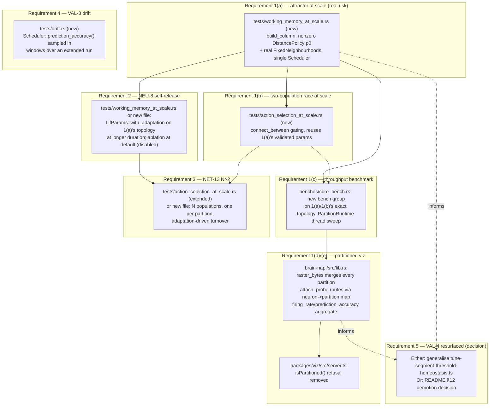

# Design: Brain Engine Phase 7 — Scale Validation, Drift and Visual Inspection

## Overview

This design satisfies the five approved requirements by building, in dependency order, on top of Phase 0–6's shipped core (`crates/brain-core`), FFI (`crates/brain-napi`), and TypeScript shell (`packages/io`, `packages/viz`):

1. **Requirement 1 (NET-12/13 at scale, throughput, partitioned viz)** — five sub-parts, in the order they're built: (a) a single-column attractor at `core_bench.rs`-precedent scale with real `DistancePolicy` wiring and real `FixedNeighbourhoods` inhibition (no new production code — same mechanism as Phase 5.5, new parameters); (b) extended to a two-population race using `connect_between` exactly as `action_selection.rs` does at toy scale; (c) a throughput benchmark on that _exact_ validated topology, extending `core_bench.rs`'s existing thread-sweep pattern; (d) partitioned-mode support added to `crates/brain-napi`'s raster/probe/metrics accessors, which today are `Runtime::Single`-only by Phase 6 scope decision, not by engine limitation; (e) `packages/viz`'s `startVizServer` refusal removed once (d) makes it correct to do so, serving the real multi-threaded run live.
2. **Requirement 2 (NEU-8 self-release)** — no new production code. `LifParams::with_adaptation` has existed and been unit-tested since Phase 5.5; this requirement is a new integration test at Requirement 1's scale/duration plus an empirical search for a self-terminating parameter regime.
3. **Requirement 3 (NET-13, N>2)** — extends Requirement 1(b)'s two-population topology to N same-size populations. No new core mechanism expected; the open design question is whether N populations share one `Scheduler`'s `FixedNeighbourhoods` (works today only if same size/contiguous, per `column.rs`'s documented single-scheme-per-scheduler constraint) or are split one-per-partition (reuses Requirement 1(d)'s partitioning work, and each partition gets its own inhibition scheme for free — the same lever README §12a item 3 already names). This design picks **one population per partition**, since it reuses machinery this phase is already building for Requirement 1 rather than testing `FixedNeighbourhoods`'s single-scheme limit at a boundary nobody needs to cross yet.
4. **Requirement 4 (VAL-3 drift)** — reuses `Scheduler::prediction_accuracy()` (`crates/brain-core/src/metrics.rs`'s `PredictionAccuracyMeter`, already always-on per OBS-2, already exposed at the FFI as `sim.predictionAccuracy()`) sampled in windows across a long run, rather than building a new metric. **Design decision, flagged for review:** this uses the Rust-level dendritic-prediction-accuracy ratio (NEU-5/6's "was this spike predicted" signal), not `packages/io`'s TS-level next-character label accuracy (`SlidingWindowAccuracy`, milestone-specific). The Rust metric is already shipped, cheap, and matches this file's home (`homeostasis.rs`'s existing soak test is Rust-tier); it is a different question from VAL-4's label accuracy, but README's own text ("checks that predictions stay accurate," §13.7's NELL framing being about accumulated belief precision, not specifically character-label accuracy) is satisfied by either — this design uses the one with no new metric-plumbing required. If review disagrees, the TS-level milestone accuracy is the alternative (see Design risks).
5. **Requirement 5 (VAL-4 resurfaced)** — a decision point, not a build, resolved after Requirements 1–3 land: either generalise `scripts/tune-segment-threshold-homeostasis.ts`'s coordinate-search pattern to whichever axis Requirement 1 implicates, or record the demotion decision from README §13.12 item 1 as a new §12 decision. Not designed further here since its shape depends on what Requirement 1 actually finds.

Every part of Requirements 1–3 reuses an existing mechanism rather than inventing one, per this project's established pattern, and is stated as an empirical result with an honest-failure path, not a mechanical acceptance checklist — Requirement 1(a) in particular carries the phase's real risk, exactly as NET-12 did in Phase 5.5: everything downstream (1b, 2, 3) depends on it succeeding at this scale.

## Architecture



### The partitioned-visualisation data flow (Requirement 1(d)/(e))

```mermaid
sequenceDiagram
    participant TS as packages/viz server.ts
    participant Napi as NativeSimulation (brain-napi)
    participant PR as PartitionRuntime
    participant S0 as Scheduler (partition 0)
    participant S1 as Scheduler (partition 1..N)

    TS->>Napi: step()
    Napi->>PR: step::<Lif>(...)
    PR->>S0: step (stage 0-3)
    PR->>S1: step (stage 0-3)
    PR-->>Napi: [StepReport; N], partition-id order
    Napi->>Napi: concatenate spikes (existing)
    Napi->>Napi: record_tick into merged raster (NEW)
    Napi-->>TS: spiked indices

    TS->>Napi: attachProbe(neuron, opts)
    Napi->>Napi: partition_of(neuron) (NEW, via PartitionPlan)
    Napi->>S0: attach_probe (routed)

    TS->>Napi: firingRate() / predictionAccuracy()
    Napi->>S0: firing_rate() / prediction_accuracy()
    Napi->>S1: firing_rate() / prediction_accuracy()
    Napi->>Napi: aggregate (NEW — sum counts, not average ratios)
    Napi-->>TS: combined value
```

## Components and Interfaces

### Requirement 1(a) — attractor at scale

- **New file:** `crates/brain-core/tests/working_memory_at_scale.rs`, slow tier (`#[ignore]`d), multi-seed `[1, 2, 3, 4, 5]`.
- **Topology:** one column at `core_bench.rs`'s `COLUMN_SIZE` precedent (~200 neurons), built via `GraphBuilder::build_column` with a **nonzero** internal `DistancePolicy` (starting from `core_bench.rs`'s own `p0 ≈ 0.05`) instead of `working_memory.rs`'s `p0 = 0.0`, plus a real `FixedNeighbourhoods` attached via `Scheduler::with_inhibition` — neither of which the toy-scale test needed.
- **Driver:** the same bootstrap-then-withdraw protocol as `working_memory.rs` (`run_bootstrap_then_withdraw`-shaped), single `Scheduler` (not `PartitionRuntime` — partitioning correctness is a separately-answered question; conflating it with attractor-tuning risk here would make a negative result ambiguous about cause).
- **Expected retuning:** `TAU_M_TICKS`, clique/internal permanence, and `FixedNeighbourhoods`'s `size`/`k` will likely need new values from `working_memory.rs`'s toy-scale ones, since the driven subset is no longer hand-isolated from the rest of the column. Recorded in the test's module doc either way, per this codebase's established discipline.
- **Shared builder:** the topology-construction constants/function are factored into `crates/brain-core/tests/common/` (this crate's existing shared-fixture location, per `tests/fixtures.rs`'s own doc comment), so Requirement 1(b)'s race and Requirement 1(c)'s benchmark reuse the _identical_ validated parameters rather than three independently-drifting copies.

### Requirement 1(b) — two-population race at scale

- **New file:** `crates/brain-core/tests/action_selection_at_scale.rs`, same slow tier/seed convention.
- Two instances of 1(a)'s validated column, wired cross-population via `GraphBuilder::connect_between` onto `FEEDFORWARD_SEGMENT` exactly as `action_selection.rs` does at toy scale (own inhibitory pool per population, drives the rival's excitatory pool). Reuses 1(a)'s per-population parameters for hold; only the cross-population `SUPPRESS_PERMANENCE`/inhibitory pool sizing is new tuning surface.
- Acceptance mirrors `action_selection.rs`: first-cued population holds and suppresses the later-cued rival; ablation (no cross-population inhibition) lets both hold simultaneously.

### Requirement 1(c) — throughput benchmark

- Extends `crates/brain-core/benches/core_bench.rs` with a new bench group (e.g. `bench_locality_realistic_synaptic_events_per_second`), built from 1(a)/1(b)'s exact shared topology (via the `tests/common/` module, referenced from the bench the same way `core_bench.rs` already references `brain_core`'s public API) — **not** a fresh, disconnected topology, so the "doubles as Phase 4's deferred benchmark" claim in README is honest.
- Sweeps thread counts `[1, 2, 4, 8, available_parallelism]` via `PartitionRuntime::with_thread_count`, matching `bench_synaptic_events_per_second`'s existing convention, reporting events/second/core against ENG-11's ≥1M target.
- `tests/scale.rs`'s existing 100k-neuron memory-only test is untouched — its concern (memory footprint) is orthogonal and already answered.

### Requirement 1(d)/(e) — partitioned visualiser support

- **`crates/brain-napi/src/lib.rs` changes:**
  - `raster_bytes`/the `Runtime::Single` gate at `step()` (currently records into `self.raster` only in the non-partitioned branch, ~line 1230-1237): in the partitioned branch, record the _already-computed_ concatenated spike list (`reports.into_iter().flat_map(...)`, already partition-id-ordered per RUN-3) into the same `self.raster`/`trim_raster()` path. No new merge algorithm needed — the ordering guarantee already exists; it just isn't being used to feed the raster today.
  - `attach_probe`/`read_probe` (currently `Runtime::Single`-only, ~line 1319-1355): add a `partition_of(neuron: u32) -> usize` lookup (backed by `PartitionPlan`, which already computes this mapping internally for `PartitionRuntime`'s own routing — needs a `pub(crate)` accessor if one doesn't already exist) and route the probe to that partition's `Scheduler`. Requires `PartitionRuntime` to expose per-partition `Scheduler` access if not already available internally.
  - `firing_rate`/`prediction_accuracy` (currently silently return `0.0` in partitioned mode, ~line 1375-1396): aggregate across every partition's own meter. For `firing_rate`, sum each partition's spike count over the window divided by total neurons — a straightforward weighted combination. For `prediction_accuracy`, **sum numerator/denominator counts across partitions before dividing**, not average per-partition ratios (averaging ratios directly would skew the combined figure when partitions have different neuron counts — a Simpson's-paradox-shaped bug). This likely needs `PredictionAccuracyMeter` (`crates/brain-core/src/metrics.rs`) to expose its raw `(predicted, total)` counts, not just the ratio, if it doesn't already.
- **`packages/viz/src/server.ts` changes:** remove the `sim.isPartitioned()` refusal (currently ~line 101-107) once the above make every accessor it depends on (`rasterBytes`, `attachProbe`/`readProbe`, `firingRate`, `predictionAccuracy`) correct under partitioning. Update the doc comment referencing "design.md Design Risk 2" to reflect the new support.

### Requirement 2 — NEU-8 self-release

- Extends Requirement 1(a)'s topology (same file or a small new one, decided once 1(a) exists) with `LifParams::with_adaptation(tau_adaptation_ticks, increment)` enabled, run for a longer post-withdrawal window than 1(a)'s, asserting the attractor terminates on its own within a bounded number of ticks with **no** cross-population inhibition or other external suppression applied.
- Ablation: identical configuration, adaptation left at its default (every existing test's configuration) — attractor must **not** self-terminate within the same window.
- No new production code — `with_adaptation` has existed since Phase 5.5 (`neuron.rs`); this is new test-side parameter search, expected to need empirical tuning (`tau_adaptation_ticks`, `increment`), recorded in the module doc.

### Requirement 3 — NET-13 with N > 2 populations

- Extends Requirement 1(b) to N (starting at 3–4) same-size populations, **one per partition** (design decision, see Overview) via `PartitionRuntime`, reusing Requirement 1(c)/(d)'s partitioning machinery — each partition gets its own `FixedNeighbourhoods` scheme "for free," sidestepping the single-scheme-per- scheduler constraint entirely rather than working around it.
- Cross-partition gating synapses (population A's inhibitory pool suppressing population B's excitatory pool, where A and B are in different partitions) are already legal — `RUN-5`'s delay-absorption plus `partition.rs`'s existing cross-partition boundary-neuron routing, already exercised by `partitioning_reference.rs`'s reward-broadcast-under-gating test case (Phase 5.5).
- Enable Requirement 2's adaptation on the currently-holding population; assert a previously-suppressed population wins a later round once the incumbent's fatigue reduces its competitiveness. Ablation: adaptation disabled, same population keeps winning indefinitely.

### Requirement 4 — VAL-3 semantic drift

- **New file:** `crates/brain-core/tests/drift.rs`, slow tier.
- A predictive-learning-enabled network (dendritic segments + `LRN-8`'s predictive learning rule engaged — reusing `emergent.rs`'s or `predictive_learning.rs`'s existing network shape rather than inventing a new one) runs for an extended duration (target: an order of magnitude past `homeostasis.rs`'s existing 10,000-tick soak, tuned to what's tractable in the slow tier).
- `Scheduler::prediction_accuracy()` (already-on, already cheap — no new core mechanism) is sampled at regular intervals across the run and stored as a series, rather than read once at the end.
- Assertion: later-window accuracy does not degrade beyond a configured tolerance relative to earlier windows (fails loudly and names the drift if it does, per Requirement 4 AC2 — not just a final-window threshold that could mask a decay-then-plateau curve).
- Ablation mirrors `homeostasis.rs`'s existing pattern: same protocol with homeostatic scaling/structural plasticity disabled, to see whether any observed drift is distinguishable from the with-homeostasis case.

### Requirement 5 — VAL-4 resurfaced

Not designed in detail here — this is an explicit decision point made _after_ Requirement 1 lands, per the approved requirements. If a retune is warranted, it generalises `scripts/tune-segment-threshold-homeostasis.ts`'s coordinate-search-with- full-trial-log pattern (extracting its search loop to take a parameter name/getter/ setter so it isn't rewritten per-axis) to whatever axis Requirement 1 implicates, logging to an adjacent `.results.md` exactly as before. If not, README gains a new §12 decision recording the §13.12 item 1 demotion argument (VAL-2(b)/(c) as the architectural acceptance bar) explicitly.

## Data Models

- No snapshot format changes expected. Adaptation state (Requirement 2) was already added to the snapshot format in Phase 5.5; Phase 7 exercises it at new scale/ duration, not new state.
- New, test/FFI-internal only: a `(predicted_count, total_count)` accessor pair on `PredictionAccuracyMeter` if aggregation needs raw counts rather than the ratio (Requirement 1(d)); a `partition_of(neuron) -> usize` accessor on whatever holds `PartitionPlan` at the `brain-napi` boundary (Requirement 1(d)).

## Error Handling

- Partitioned-mode accessors (Requirement 1(d)) stop silently returning `0.0` (today's `firing_rate`/`prediction_accuracy` behaviour in partitioned mode) once they're made correct — silent wrong-but-plausible defaults are being removed, not extended. If any accessor genuinely cannot be made correct under partitioning, it keeps today's precedent of failing loudly with a named error (as `raster_bytes`/ `attach_probe` already do), never a silent fallback.
- Emergent-behaviour tests (Requirements 1(a)/(b), 2, 3) treat "did not sustain/ self-terminate/turn over on the first parameterisation" as a recordable, expected- possible result per the approved requirements' honest-failure path — not an error to be silently retried into a passing configuration without recording what changed.

## Testing Strategy

- All new Rust tests are slow-tier (`#[ignore]`d, `npm run test:slow` / `cargo test --workspace --release -- --ignored`), multi-seed, following `working_memory.rs`/`action_selection.rs`'s existing structure and module-doc discipline (record tuning findings, ablations alongside positive results).
- Requirement 1(c)'s new bench group runs under `cargo bench`, same as `core_bench.rs`'s existing groups; results recorded in README per this project's "record the honest result" convention (§12a item 1's table is the precedent).
- Requirement 1(d)/(e) gets: `crates/brain-napi` coverage asserting `rasterBytes`/ `attachProbe`/`firingRate`/`predictionAccuracy` behave correctly under `threadCount > 1` (new cases, likely in or alongside `partitioning_reference.rs`'s existing bit-identical-behaviour suite); `packages/viz/test/server.slow.test.ts` gains a case asserting `startVizServer` _accepts_ a partitioned sim and correctly relays raster/probe/metrics messages (today it only tests that it refuses one).
- Requirement 4's drift test lives in `crates/brain-core/tests/drift.rs`, Rust slow tier, no TypeScript changes needed (per the design decision to use the Rust-level metric).
- Requirement 5 reuses existing TS conventions unchanged (`packages/io/test/*.slow.test.ts`, `scripts/*.ts` + adjacent `.results.md`) if a retune path is taken; a README edit if the demotion path is taken.
- Traceability (VAL-10): every acceptance criterion above maps to a named test, checked via `scripts/check-traceability.mjs`, matching every prior phase.

## Design risks

- **Requirement 1(a) is this phase's load-bearing risk**, exactly as NET-12 was in Phase 5.5 — it may need several rounds of retuning (density, permanence, `TAU_M_TICKS`, neighbourhood `size`/`k`) and could fail to sustain at all at this scale on a reasonable budget of attempts. If so, Requirements 1(b), 2 and 3 need rethinking before they're built, not silently built on an assumption that didn't hold.
- **Requirement 1(d)/(e) touches `crates/brain-napi`'s FFI surface non-trivially** (raster merge, probe routing, metric aggregation). The most likely snag is `PredictionAccuracyMeter` not currently exposing raw counts (only a ratio), which would need a small, low-risk `metrics.rs` addition.
- **Requirement 3's "one population per partition" choice** trades away testing `FixedNeighbourhoods`'s single-scheme-per-scheduler limit (deferred, not contradicted) for reusing Requirement 1(d)'s partitioning work — reasonable given Out of Scope already excludes a general multi-scheme redesign, but worth confirming this is the intended reading.
- **Requirement 4's metric choice is a real design decision, not a foregone conclusion** — using the Rust-level dendritic-prediction-accuracy ratio instead of packages/io's character-label accuracy is cheaper and avoids new plumbing, but it is measuring a different thing (whether spikes were dendritically predicted, not whether next-character guesses were correct). If VAL-3's intent is closer to "the VAL-4 milestone's own accuracy shouldn't decay over a long run," the alternative design reuses `packages/io`'s `SlidingWindowAccuracy` sampled periodically instead, at the cost of building that periodic-sampling wrapper (confirmed absent by this session's research) and running through the full `charPrediction.ts` pipeline rather than a lean Rust-tier test.
- **Requirement 5 is intentionally underspecified here** — its shape depends on Requirement 1's actual findings, which don't exist yet.
