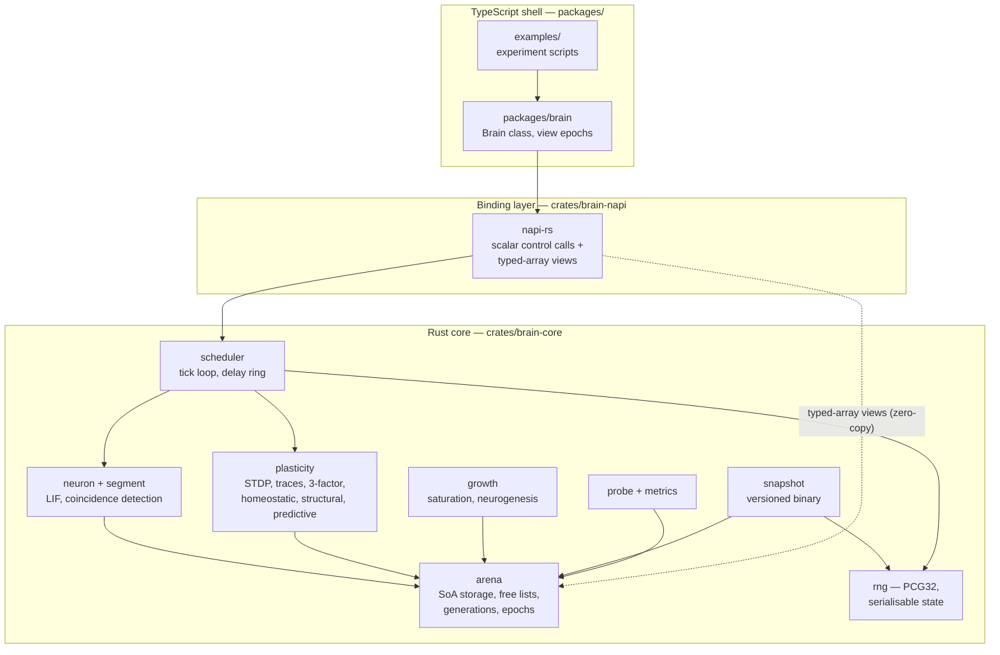
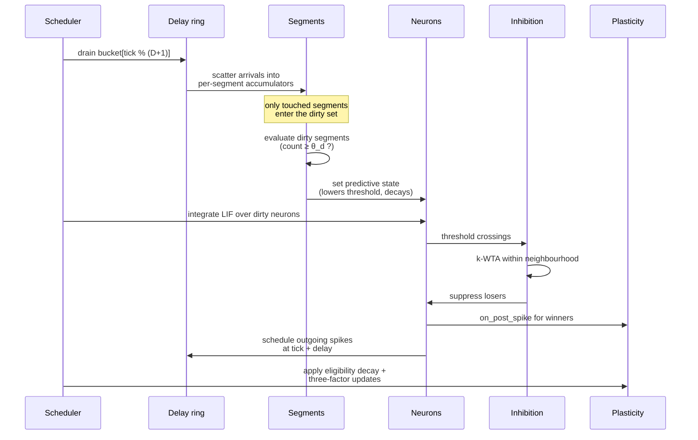

# Design: Brain Engine — Phases 0–3

## Overview

This design implements the 16 approved requirements in [requirements.md](./requirements.md): a Rust simulation core exposed to TypeScript through a zero-copy `napi-rs` boundary, event-driven on a fixed 0.1 ms grid, with local three-factor plasticity, dendritic segments producing predictive state, runtime growth, and full snapshot/restore.

The exit criterion is Requirement 14.4 — learning `ABCD` and `XBCY` and disambiguating `B`/`C` by context. Everything else is scaffolding for that.

**No user-facing UI is in scope** (the visualiser is Phase 6, explicitly out of scope), so no wireframe is required for this design. The TypeScript surface here is a programmatic API plus example scripts.

Three requirements dominate the shape of the design, and they all land on the same component:

- **Requirement 3** (determinism), **Requirement 11** (growth) and **Requirement 16** (persistence) all constrain the _memory arena_. It must simultaneously recycle storage deterministically, grow without invalidating identity, and serialise exactly. This is the highest-risk component and §"Design risks" treats it directly.
- **Requirement 8.2** (locality enforced by the type system) determines how plasticity is factored: rules receive a `LocalContext` value and a single-synapse handle, and are given no type through which the graph is reachable.
- **Requirement 5.1** (work proportional to spikes) determines the scheduler: a ring buffer of delay buckets, and a dirty-set of touched segments, so silent structure costs nothing.

### Toolchain

Verified present: `rustc`/`cargo` 1.96.0, Node 24.11.1, npm 11.15.0. Node 24 ships a mature `node:test`, which satisfies Requirement 15.2's zero-runtime-dependency constraint on the TypeScript side.

---

## Architecture



**Dependency rule (ENG-7, Requirement 1.2):** `brain-core` depends on neither binding crate. The arrows into `brain-core` are calls inward; nothing in the core knows a binding exists.

### The tick

One tick of `scheduler::step` (Requirements 5, 4, 7, 10, 8):



Only structures touched this tick are visited. A silent neuron is never read — this is what makes Requirement 5.1 hold rather than being an aspiration.

---

## Components and Interfaces

### Repository layout

```
brain/
├── Cargo.toml                       # cargo workspace
├── package.json                     # npm workspace
├── rust-toolchain.toml              # pin 1.96.0 for reproducibility (Req 3.4)
├── crates/
│   ├── brain-core/
│   │   ├── src/
│   │   │   ├── lib.rs
│   │   │   ├── ids.rs               # NeuronId, SegmentId, SynapseId, generations
│   │   │   ├── arena.rs             # SoA storage, free lists, epoch counter
│   │   │   ├── rng.rs               # PCG32 with restorable state
│   │   │   ├── neuron.rs            # NeuronDynamics trait + Lif
│   │   │   ├── segment.rs           # SegmentModel trait + BinaryCoincidence
│   │   │   ├── synapse.rs           # source-major synapse arrays
│   │   │   ├── graph.rs             # builder + connectivity policies
│   │   │   ├── inhibition.rs        # k-WTA neighbourhoods
│   │   │   ├── scheduler.rs         # tick loop, delay ring, dirty sets
│   │   │   ├── neuromodulator.rs    # scalar fields, decay
│   │   │   ├── plasticity/
│   │   │   │   ├── mod.rs           # LocalContext, PlasticityRule, SynapseMut
│   │   │   │   ├── stdp.rs
│   │   │   │   ├── three_factor.rs
│   │   │   │   ├── homeostatic.rs
│   │   │   │   ├── structural.rs
│   │   │   │   └── predictive.rs
│   │   │   ├── growth.rs            # saturation metric + neurogenesis policy
│   │   │   ├── probe.rs             # bounded recorders
│   │   │   ├── metrics.rs
│   │   │   └── snapshot.rs          # versioned binary format
│   │   ├── tests/                   # whole-network integration
│   │   └── benches/                 # criterion harness (Req 15.2)
│   ├── brain-napi/src/lib.rs        # napi-rs bindings
│   └── brain-wasm/                  # stub only in this slice
├── packages/
│   └── brain/
│       ├── src/index.ts             # Brain class, view epoch guard
│       └── test/                    # node:test boundary tests
├── examples/
│   ├── single-neuron.ts             # Req 4.4
│   ├── sparsity.ts                  # Req 7
│   └── high-order-sequence.ts       # Req 14.4 — the exit criterion
└── tests/
    ├── emergent/                    # slow tier (Req 15.10)
    └── golden/                      # reference rasters (Req 15.5)
```

### `arena.rs` — storage, growth, reclamation

_Satisfies: RUN-2, Requirements 3.3, 11.4–11.10, 16.6._

Structure-of-arrays. Each attribute is its own flat `Vec`, indexed by a raw `u32`:

```rust
pub struct NeuronArena {
    // hot, per-tick
    pub membrane:     Vec<f32>,
    pub threshold:    Vec<f32>,
    pub predictive:   Vec<f32>,   // decaying depolarisation (NEU-6)
    pub refractory:   Vec<u32>,   // tick until which refractory
    pub last_spike:   Vec<u32>,
    // warm, per-plasticity-step
    pub rate_estimate: Vec<f32>,  // homeostasis (NEU-7)
    pub trace:         Vec<f32>,  // pre/post trace for STDP
    // cold
    pub polarity:      Vec<i8>,   // Dale (NEU-4) — +1 / -1
    pub coords:        Vec<[f32; 3]>,
    pub generation:    Vec<u32>,
    pub alive:         Vec<bool>,
    free:              Vec<u32>,  // LIFO stack — deterministic reuse
    epoch:             u64,       // bumped on any reallocation
}
```

**Growth** appends. **Reclamation** pushes the index onto `free` and bumps `generation[i]`. Allocation pops from `free` first, else appends — a LIFO stack, so reuse order is deterministic and snapshot-stable (Requirements 3.3, 11.10).

**Identity** is `NeuronId { index: u32, generation: u32 }` at the API boundary, checked on entry; hot loops use the bare `u32`. A stale id fails loudly rather than silently addressing a recycled slot.

**View invalidation** (Requirement 2.2) uses `epoch`. Any `Vec` reallocation bumps it. Views handed to TypeScript carry the epoch they were minted at; the TS wrapper compares before use and throws on mismatch. Growth is the only common cause, and re-acquiring views is one call.

> Alternative considered: a chunked arena (`Vec<Box<[f32; N]>>`) so growth never reallocates and views stay valid indefinitely. Rejected for v1 — it adds a chunk/offset indirection to the hottest loops to solve a problem that costs one call per frame. Revisit if view churn shows up in profiling.

### `synapse.rs` — source-major, fixed-capacity

_Satisfies: SYN-1, SYN-3, SYN-4, Requirements 6.5–6.7, 11.1–11.3._

Synapses are stored **source-major**: each neuron owns a fixed-capacity block of outgoing synapses. This is the decision that makes the hot path cheap.

```rust
pub struct SynapseArena {
    pub target_neuron:  Vec<u32>,
    pub target_segment: Vec<u32>,
    pub permanence:     Vec<f32>,   // [0,1]; connected above threshold (SYN-3)
    pub delay:          Vec<u16>,   // ticks, ≥1 (SYN-2)
    pub eligibility:    Vec<f32>,   // (LRN-3)
    pub last_active:    Vec<u32>,
    pub occupied:       Vec<bool>,
    // block b of neuron n spans [n * cap, n * cap + cap)
    pub cap_per_neuron: u32,
}
```

Rationale:

- **Spike propagation is source→target**, and that is the hot direction. A spiking neuron reads one contiguous block.
- **Fixed capacity per neuron directly implements the synapse budget** of Requirement 11.3 — no separate accounting, and it is biologically defensible (segments carry bounded synapse counts).
- **No compaction, no variable-length lists, no per-segment allocation.** Insert = scan the block for a free slot. Delete = clear `occupied`. Both are structural-timescale operations, not per-tick.
- **Trivially serialisable** — flat POD arrays, mostly `memcpy` (Requirement 16).

Target-side segment membership needs no list at all: delivery _scatters_ into a per-segment accumulator, so segments never enumerate their synapses.

### `scheduler.rs` — fixed grid, delay ring, dirty sets

_Satisfies: RUN-1, RUN-1a, RUN-1b, Requirement 5._

```rust
pub struct Scheduler {
    tick: u32,
    dt_ms: f32,                        // default 0.1 (Req 5.2)
    ring: Vec<Vec<u32>>,               // D+1 buckets of SynapseId, pre-allocated
    dirty_segments: DirtySet,          // touched this tick
    dirty_neurons: DirtySet,
}
```

The ring buffer has `max_delay + 1` buckets, each a `Vec<u32>` **cleared but never freed**, so steady state performs no allocation (Requirement 5.6, ENG-9). Scheduling a spike pushes a `SynapseId` into `ring[(tick + delay) % len]`. Delivery drains one bucket.

`DirtySet` is an index vector plus a `Vec<bool>` membership flag — O(1) insert with dedupe, O(touched) iteration, cleared by truncation. This is the mechanism behind "a silent neuron costs nothing".

Ordering within a bucket is insertion order, which is deterministic given deterministic upstream iteration — the basis of Requirement 3.1.

### `neuron.rs` and `segment.rs` — static dispatch

_Satisfies: NEU-1 to NEU-7, NEU-6a, Requirements 4, 10._

Pluggability (NEU-3, Requirement 4.6) uses generics, not trait objects, so the hot loop monomorphises with no vtable:

```rust
pub trait NeuronDynamics {
    type Params: Copy + Send + Sync;
    /// Returns true if the neuron spiked this step.
    fn step(state: NeuronStateMut<'_>, p: &Self::Params, input: f32, dt: f32) -> bool;
}
pub struct Lif;   // the default (NEU-2)
```

The segment interface returns a **graded** value (NEU-6a, Requirement 10.5):

```rust
#[derive(Clone, Copy)] pub struct Depolarisation(pub f32);

pub trait SegmentModel {
    type Params: Copy + Send + Sync;
    fn evaluate(active: u16, s: &SegmentState, p: &Self::Params) -> Depolarisation;
}
pub struct BinaryCoincidence;  // returns 0.0 or 1.0 (Req 10.6)
```

A dendritic spike writes into `NeuronArena::predictive`, which _lowers the effective threshold_ and decays — it never fires the cell directly (NEU-6, Requirement 10.3).

### `plasticity/mod.rs` — locality by construction

_Satisfies: LRN-1, Requirement 8.1, 8.2; invariant 1._

This is where the no-backpropagation invariant is made structural rather than aspirational. A rule is handed a `LocalContext` **by value** and a handle to exactly one synapse. There is no type in scope through which the graph, another neuron, or a global error could be reached:

```rust
/// Everything a plasticity rule is permitted to see. Copy, no references out.
#[derive(Clone, Copy)]
pub struct LocalContext {
    pub pre:  NeuronLocal,      // last_spike, trace, rate_estimate
    pub post: NeuronLocal,
    pub modulators: Modulators, // [f32; N] — the only global signal (LRN-5)
    pub tick: u32,
    pub dt: f32,
}

/// A single synapse's mutable fields. Cannot address any other synapse.
pub struct SynapseMut<'a> {
    pub permanence:  &'a mut f32,
    pub eligibility: &'a mut f32,
    pub last_active: &'a mut u32,
}

pub trait PlasticityRule {
    fn on_delivery(&self, syn: SynapseMut<'_>, ctx: &LocalContext);
    fn on_post_spike(&self, syn: SynapseMut<'_>, ctx: &LocalContext);
}
```

Rules compose as an ordered slice (LRN-9, Requirement 8.10). `three_factor.rs` implements `Δw = η · eligibility · modulator`, which reduces to plain STDP when the modulator is held at 1.0 (Requirement 8.8).

Weight bounds (SYN-4, Requirement 6.7) are clamped centrally after the rule chain, so no individual rule can violate them — a property-based test target (Requirement 15.7).

### `growth.rs` — saturation and neurogenesis

_Satisfies: NET-10, Requirement 11.6–11.8._

Growth is policy-driven behind a trait, because **the saturation metric is the design's main unknown** (flagged in Requirement 11.6 and in §"Design risks"):

```rust
pub trait GrowthPolicy {
    fn should_grow(&mut self, stats: &PopulationStats, rng: &mut Pcg32) -> u32; // neurons to add
}
```

Proposed default, `OverlapSaturation`: maintain a rolling window of recently activated SDRs per population and track the fraction of new activations whose overlap with an existing stored representation exceeds a similarity threshold. Sustained high collision rate means the population can no longer represent new input without interference — the operational reading of "saturated". When that fraction exceeds a threshold over a window, allocate neurons.

`FixedSchedule` is the fallback if the metric proves unreliable, and keeps Requirement 11 satisfiable regardless. Growth is bounded by a configured ceiling (Requirement 11.8).

### `snapshot.rs` — versioned binary

_Satisfies: RUN-9, RUN-9a–c, Requirement 16._

Because every structure is a flat POD array, serialisation is largely length-prefixed `memcpy`.

```
magic   "BRAIN\0"            6 bytes
version u32                  format version (Req 16.7)
config_hash u64              rejects mismatched configuration
tick    u32
rng     { state: u64, inc: u64 }     (Req 16.4)
sections[]  { tag: u32, len: u64, bytes }   little-endian, fixed
```

Free lists, generation counters and `occupied` flags are all serialised, which is what makes Requirement 16.6 (restore after structural mutation, including index reuse) hold. An unrecognised version fails loudly with no partial load (Requirement 16.8).

The delay ring is serialised too. In-flight spikes are genuine state, and omitting them would break the bit-identical round-trip of Requirement 16.3.

#### Durability policy

**Saving is on demand only.** There is no autosave, no interval timer and no shutdown hook in this slice — the caller decides when to persist, via `Brain.snapshot(path)`. A save button is a visualiser concern (Phase 6) and the API is already the right shape for one.

The write itself is atomic: serialise to `<path>.tmp`, `fsync`, then rename over the target. This is not a frequency policy but a property of the operation — a snapshot takes seconds at the ENG-11 target, and a naive in-place overwrite that is interrupted mid-write would destroy the previous good snapshot without completing the new one, losing everything. Rename-into-place means an interrupted save leaves the prior snapshot untouched.

Deferred, with the design left open for them:

- **Incremental checkpointing.** The arena has a useful asymmetry — the large arrays change slowly (permanences, topology: 1.2 GB, but plasticity touches a small fraction per second) while the fast-changing arrays are small (membrane, predictive state, delay ring: tens of MB). Dirty-chunk tracking at ~64 KB granularity would turn a checkpoint from 1.2 GB into tens of MB. Not needed while saves are manual.
- **Autosave and generation retention.** Straightforward to add on top of the atomic write above if long unattended runs later make it worthwhile.

### `rng.rs` — PCG32

_Satisfies: RUN-3, Requirements 3.2, 16.4._

PCG32 written in-repo (ENG-5). State is `{ state: u64, inc: u64 }` — small, exactly restorable, and streamable per-partition when Phase 4 introduces threads. Requirement 16.4 is the reason this is not, for example, a `SmallRng` from an external crate whose internal state is not a stable serialisation target.

### `packages/brain/src/index.ts` — the shell

_Satisfies: ENG-1, ENG-3, ENG-8, Requirements 1.5, 2._

```ts
export class Brain {
  static create(config: BrainConfig): Brain;
  static restore(path: string): Brain;

  step(ticks: number): void;
  stimulate(neurons: Uint32Array, current: Float32Array): void;

  /** Zero-copy views over Rust-owned memory. Invalidated by growth. */
  views(): ArenaViews; // { epoch, membrane, predictive, polarity, ... }

  grow(spec: GrowthSpec): void; // Req 16.9
  snapshot(path: string): void;
  metrics(): Metrics; // OBS-2
  probe(sel: Selector, opts: ProbeOptions): ProbeHandle; // OBS-1
}
```

`ArenaViews` carries the arena epoch; every accessor validates it and throws `StaleViewError` on mismatch (Requirement 2.2). Only bulk views and scalar control calls cross the boundary — never per-tick or per-synapse structured values (Requirement 2.3).

---

## Data Models

### Identifiers

| Type | Representation | Notes |
| --- | --- | --- |
| `NeuronId` | `{ index: u32, generation: u32 }` | Generation checked at API boundary; bare `u32` in hot loops |
| `SegmentId` | `u32` | `neuron_index * segments_per_neuron + k` — implicit, not stored |
| `SynapseId` | `u32` | `source_index * cap_per_neuron + slot` — implicit, not stored |

Deriving segment and synapse ids arithmetically rather than storing them removes two indirection arrays from the hot path and makes the snapshot smaller.

### Per-synapse cost

| Field            | Bytes                 |
| ---------------- | --------------------- |
| `target_neuron`  | 4                     |
| `target_segment` | 4                     |
| `permanence`     | 4                     |
| `delay`          | 2                     |
| `eligibility`    | 4                     |
| `last_active`    | 4                     |
| `occupied`       | 1                     |
| **Total**        | **23** (padded to 24) |

This sits inside the 16–24 byte estimate in README §12a, so the 50M-synapse ENG-11 target lands near 1.2 GB — comfortable natively, and the reason WASM32 is not the primary target.

### Configuration

`BrainConfig` is a plain serialisable struct — seed, `dt_ms`, population sizes and coordinates, connectivity policy parameters, E/I ratio (default 80:20, NEU-4), inhibition neighbourhood and `k`, target sparsity (default 2%), segment count and θ_d, plasticity rule chain with constants, homeostatic target and interval, growth policy and ceiling. Its hash is stored in snapshots so a restore against incompatible configuration fails loudly rather than behaving strangely.

---

## Error Handling

The core distinguishes _hot path_ from _boundary_. Requirement 5.6 and ENG-9 forbid panics and allocation in the tick loop, so all fallible operations are pushed to construction and boundary calls.

| Condition | Where | Handling |
| --- | --- | --- |
| Synapse block full on sprout | Core, structural step | Sprout is skipped, counter incremented. Not an error — Requirement 11.3 defines the budget as a hard cap |
| Growth ceiling reached | Core, growth step | Growth declined, surfaced in metrics (Requirement 11.8) |
| Stale `NeuronId` generation | Boundary | `Err(StaleId)` → JS `StaleIdError` |
| View used after epoch bump | TS shell | `StaleViewError` before any read (Requirement 2.2) |
| Snapshot version unknown | Boundary | `Err(UnsupportedVersion)`, no partial load (Requirement 16.8) |
| Snapshot config hash mismatch | Boundary | `Err(ConfigMismatch)` |
| Truncated/corrupt snapshot | Boundary | `Err(Corrupt)` — section lengths validated before any allocation |
| Invalid config (θ_d > segment capacity, delay 0, k > neighbourhood) | Construction | `Err(InvalidConfig)` with the offending field |
| Numerical non-finiteness in membrane state | Core, debug builds | `debug_assert` + a metrics counter in release; a NaN means a plasticity or homeostasis bug and must not propagate silently |

`brain-napi` maps every `Err` to a typed JS exception; no error crosses the boundary as a status code.

---

## Testing Strategy

Implements Requirement 15 and README VAL-5 through VAL-11. Four layers, two tiers.

### Layer 1 — Rust unit tests (`cargo test`, fast tier)

- **LIF against closed form** (Requirement 4.4, 14.1). Constant supra-threshold current has an analytic inter-spike interval; assert within tolerance. Sub-threshold current must not spike (4.5).
- **STDP curve** (Requirement 8.5, 14.1). Sweep spike intervals, assert the resulting Δw traces the configured asymmetric curve.
- **Arena** — allocate/free/reallocate, generation invalidation, LIFO reuse order determinism.
- **Ring buffer** — a spike scheduled at delay _d_ is delivered at exactly `tick + d` (5.4).
- **PCG32** — reference vectors, and state save/restore equivalence.

### Layer 2 — Rust integration tests (`crates/brain-core/tests/`)

Whole networks, still in-crate: sparsity holds under drive (Requirement 7), homeostasis stabilises weights (9), sequences are learned (12.4), topology mutates without breaking the run (11.9).

### Layer 3 — TypeScript boundary tests (`node:test`, fast tier)

This is where zero-copy bugs actually live:

- A view reflects Rust-side mutation without a copy step (Requirement 2.1).
- Growth bumps the epoch and any prior view throws `StaleViewError` (2.2).
- Round-tripping a snapshot through the TS API preserves behaviour (16.11).
- Stale `NeuronId` after reclamation throws rather than addressing a recycled slot.
- No `any` at the boundary — enforced by `tsc --strict` in CI (1.5).

### Layer 4 — Emergent behaviour (slow tier, `tests/emergent/`)

The VAL-2 battery from Requirement 14, and the real acceptance criteria. **Every test here runs across a seed set and asserts on the aggregate within a tolerance band** (Requirement 15.3), so that no result depends on a lucky seed. A per-seed disagreement is a defect, never a retry (15.4).

| Test                                                | Requirement |
| --------------------------------------------------- | ----------- |
| Sparsity near target under varied drive             | 14.2        |
| Prediction error falls across exposures             | 14.3        |
| **`ABCD` vs `XBCY` disambiguated — exit criterion** | **14.4**    |
| Recall under ~30% bit-flip noise                    | 14.5        |
| Second task does not erase the first                | 14.6        |
| Growth does not degrade prior learning              | 11.11       |
| Long-run stability soak                             | 14.7, 9.3   |

### Cross-cutting

**Golden rasters** (Requirement 15.5–15.6, `tests/golden/`). Fixed scenarios produce reference spike rasters, stored and compared. This catches the failure mode unit tests structurally cannot: a refactor that silently changes dynamics while every assertion still passes. Regeneration is a separate, explicit command — never automatic on failure.

**Property-based invariants** (`proptest`, Requirement 15.7). Over generated networks and inputs: permanence stays in `[0,1]`; weights stay bounded; no spike is delivered before its axonal delay; a neuron's polarity is identical across all its outgoing synapses (Dale); sparsity never exceeds ceiling; a snapshot round-trip is the identity function on state.

**Ablation** (Requirement 15.8). Each load-bearing mechanism disabled, asserting the property it supports _fails_: inhibition off breaks sparsity; homeostasis off lets weights diverge; predictive learning off collapses 14.4 to chance. This is what distinguishes a mechanism doing work from one merely present.

**Round-trip fidelity** (Requirement 16.3) is a first-class test, not a subsection: run _N_ ticks; snapshot at _N/2_, restore, run the remainder; assert the raster is bit-identical to the uninterrupted run. It subsumes almost every unserialised-state bug.

**Traceability** (Requirement 15.9, VAL-10). Each test is tagged with the criterion ids it covers, and a small script asserts every numbered criterion in [requirements.md](./requirements.md) maps to at least one test, failing CI on a gap. This is the quality gate in preference to line coverage.

### CI (Requirement 15.11)

Fast tier on every change: `cargo test`, `cargo clippy`, `tsc --strict`, `node:test`, proptest. Slow tier on schedule and on demand: emergent battery, soaks, golden rasters. Both build every ENG-4 target.

---

## Design risks

Stated plainly, because two of these are genuinely unresolved.

1. **The saturation metric (Requirement 11.6) is not settled.** There is no standard measure of representational saturation in an SDR population. The `OverlapSaturation` proposal above is reasonable but unvalidated. Mitigation: `GrowthPolicy` is a trait and `FixedSchedule` is a working fallback, so Requirement 11 remains satisfiable if the metric disappoints. Expect to iterate here.
2. **The arena carries three constraints at once** — deterministic reuse, growth, and exact serialisation. Each is easy alone. Mitigation: the LIFO free list and serialised generation counters are chosen specifically so all three hold, and the property-based round-trip test exercises the combination directly. This remains the component most likely to cause trouble.
3. **Fixed per-neuron synapse capacity trades flexibility for speed.** If real usage wants heavily skewed fan-out, fixed blocks waste memory. Mitigation: capacity is configurable per population; revisit only if profiling shows real waste.
4. **The exit criterion depends on parameter tuning, not just correctness.** θ_d, segment count, inhibition `k` and STDP constants interact, and `ABCD`/`XBCY` may fail on tuning while every unit test passes. Mitigation: the ablation tests and the metrics in OBS-2 are there to distinguish "wrong" from "mistuned"; expect a tuning phase before 14.4 goes green.
