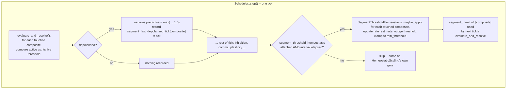

# Design: Dendritic Segment Threshold Homeostasis

## Overview

Adds `SegmentThresholdHomeostasis`, a new opt-in homeostatic sweep living in `crates/brain-core/src/plasticity/homeostatic.rs` next to the existing `HomeostaticScaling` (synaptic weight) and `IntrinsicHomeostasis` (somatic threshold, NEU-7). It is a third, independent member of the same family: on a slow, configurable interval, it looks at each dendritic segment's own recent depolarisation rate and nudges that segment's own coincidence threshold toward a configured target rate — mirroring `IntrinsicHomeostasis::maybe_apply` field-for-field and line-for-line where the logic is the same, addressed by _segment_ (`composite = neuron * segments_per_neuron + segment`, `scheduler.rs`'s existing addressing scheme) instead of by neuron.

Disabled (the default — nothing attaches it), every segment evaluates against `BinaryCoincidenceParams.threshold` exactly as it does today: bit-identical, zero extra allocation, zero extra per-tick cost (Requirement 2). Enabled, each segment gets its own live `f32` threshold that starts at `BinaryCoincidenceParams.threshold` and drifts independently of every other segment, satisfying Requirements 1 and 3.

This design deliberately does not touch `SegmentModel`'s trait signature, `BinaryCoincidenceParams`'s field type, or any existing caller's literal `threshold: <u16>` — see "Design Decision: where the live threshold lives" below for why, and how backward compatibility is preserved exactly.

## A note on precedent, found while grounding this design

`IntrinsicHomeostasis` (NEU-7, somatic threshold) already exists in this exact shape and already has full unit-test coverage inside `plasticity/homeostatic.rs` — but a repo-wide grep found it is **not** actually wired into `Scheduler::step()`, `NativeSimulation`, or any test beyond its own module. `HomeostaticScaling` (synaptic weight), by contrast, _is_ fully wired: `Scheduler` holds an `Option<HomeostaticScaling>` field and calls `maybe_apply` automatically inside `step()` (`scheduler.rs` ~line 952, covered by `configured_homeostatic_scaling_runs_automatically_inside_step`). There is no comment anywhere explaining why NEU-7 was left unwired — it reads as an incomplete integration, not a deliberate choice. This design follows the `HomeostaticScaling` precedent (fully wired, automatic inside `step()`) because that is the one this codebase actually finished and tested end-to-end; it does **not** attempt to fix `IntrinsicHomeostasis`'s own gap, which is out of scope here and worth flagging back to the project owner separately.

## Architecture



## Components and Interfaces

### `crates/brain-core/src/plasticity/homeostatic.rs` — new `SegmentThresholdHomeostasis`

```rust
/// Homeostasis for a dendritic segment's own coincidence threshold (this
/// design's Requirement 1): mirrors IntrinsicHomeostasis exactly, addressed
/// by composite segment index instead of by neuron. See this file's module
/// doc for why a *rate* target, not an absolute synapse count, is the
/// config surface -- README §13.12 items 6/7, invariant 10.
pub struct SegmentThresholdHomeostasis {
    pub target_rate: f32,      // fraction in [0, 1)
    pub smoothing: f32,        // [0, 1), same meaning as IntrinsicHomeostasis::smoothing
    pub adjustment_rate: f32,
    pub min_threshold: f32,    // Requirement 4's floor
    pub interval_ticks: u32,
    last_applied_at: u32,
}

impl SegmentThresholdHomeostasis {
    pub fn new(target_rate: f32, smoothing: f32, adjustment_rate: f32, min_threshold: f32, interval_ticks: u32) -> Self;

    /// Sweeps every *touched* composite (Requirement 3: only ever reads
    /// that composite's own history) -- takes raw slices, not a Scheduler
    /// reference, so this module stays as decoupled from Scheduler's
    /// internals as HomeostaticScaling/IntrinsicHomeostasis already are
    /// from NeuronArena/SynapseArena.
    pub fn maybe_apply(
        &mut self,
        threshold: &mut [f32],
        rate_estimate: &mut [f32],
        last_depolarised_tick: &[u32],
        touched: &[u32],   // composite indices to sweep -- Scheduler passes segment_counts' own index domain
        tick: u32,
    ) -> bool;
}
```

`maybe_apply`'s body is `IntrinsicHomeostasis::maybe_apply`'s body verbatim, with `neurons.last_spike[i]` → `last_depolarised_tick[composite]`, `neurons.rate_estimate[i]` → `rate_estimate[composite]`, `neurons.threshold[i]` → `threshold[composite]`, and the iteration domain narrowed from "every living neuron" to "every composite index this scheduler has ever actually resized into existence" (passed in as `touched`, see below) rather than a blind `0..threshold.len()` range, since an untouched composite has no synapses and nothing meaningful to sweep.

### `crates/brain-core/src/scheduler.rs` — wiring

New fields alongside the existing `segment_counts`/`segment_last_touched_tick`:

```rust
segment_threshold_homeostasis: Option<SegmentThresholdHomeostasis>,
segment_threshold: Vec<f32>,              // live per-composite threshold; empty/unused when disabled
segment_rate_estimate: Vec<f32>,
segment_last_depolarised_tick: Vec<u32>,  // u32::MAX sentinel, same convention as NeuronArena::last_spike
```

New builder, mirroring `with_homeostatic_scaling` exactly:

```rust
pub fn with_segment_threshold_homeostasis(mut self, homeostasis: SegmentThresholdHomeostasis) -> Self {
    self.segment_threshold_homeostasis = Some(homeostasis);
    self
}
```

**Lazy init, gated on the mechanism being attached** (Requirement 2: zero cost when disabled) — in the existing delivery-accumulation block (`scheduler.rs`, the `if self.segment_counts.len() <= composite { ... }` branch, ~line 692) add a sibling resize for the three new vecs, only entered when `self.segment_threshold_homeostasis.is_some()`:

```rust
if self.segment_threshold_homeostasis.is_some() && self.segment_threshold.len() <= composite {
    self.segment_threshold.resize(composite + 1, config.params.threshold as f32);
    self.segment_rate_estimate.resize(composite + 1, 0.0);
    self.segment_last_depolarised_tick.resize(composite + 1, u32::MAX);
}
```

**Read path** (`evaluate_and_resolve`, replacing today's `BinaryCoincidence::evaluate(active, &SegmentState, &config.params)` call):

```rust
let depolarisation = match &self.segment_threshold_homeostasis {
    None => BinaryCoincidence::evaluate(active, &SegmentState, &config.params), // unchanged path
    Some(_) => {
        let threshold = self.segment_threshold[composite as usize];
        if active >= threshold { Depolarisation(1.0) } else { Depolarisation::NONE }
    }
};
```

and, inside the existing `if depolarisation.0 > 0.0 { ... }` branch, record the observation:

```rust
if self.segment_threshold_homeostasis.is_some() {
    self.segment_last_depolarised_tick[composite as usize] = self.tick;
}
```

**Sweep call**, inside `step()` alongside the existing `homeostatic_scaling.maybe_apply(...)` call:

```rust
if let Some(homeostasis) = &mut self.segment_threshold_homeostasis {
    // `segment_counts.len()` is exactly the set of composites ever
    // touched -- 0..len() is therefore the correct, minimal sweep domain,
    // no separate "touched" list needs to be retained across ticks.
    let touched: Vec<u32> = (0..self.segment_threshold.len() as u32).collect();
    homeostasis.maybe_apply(&mut self.segment_threshold, &mut self.segment_rate_estimate, &self.segment_last_depolarised_tick, &touched, report.tick);
}
```

(The `Vec<u32> touched` allocation here is a candidate for a reused scratch buffer, matching `HomeostaticScaling::incoming_scratch`'s existing "reused across calls, ENG-9" pattern — worth doing during implementation, not a correctness requirement of this design.)

### Design Decision: where the live threshold lives (why not widen `BinaryCoincidenceParams`)

`BinaryCoincidenceParams.threshold` is `u16` and is `Copy`, shared network-wide via `SegmentConfig` — dozens of existing tests construct it with an integer literal (`threshold: 3`, `threshold: u16::MAX`, etc.). Two options were considered:

1. **Widen `threshold` to `f32` and make it per-composite** — would ripple through every existing call site and change a public struct's field type, a real (if mechanical) breaking change, for no benefit to callers who never enable this mechanism.
2. **Leave `BinaryCoincidenceParams` exactly as-is** (it remains each segment's _initial_ value, and the only value used when the mechanism is disabled), and add a **parallel, opt-in `f32` override** at the `Scheduler` level, consulted only when `segment_threshold_homeostasis` is attached. Chosen.

Option 2 also avoids a real correctness problem option 1 would have hidden: `IntrinsicHomeostasis`'s `adjustment_rate` is meant to be a small, slow nudge (its own tests use `0.2` per sweep against a continuous `f32` threshold). If the live threshold were forced back through a `u16` every sweep, an adjustment smaller than `1.0` would round away to nothing — the threshold would never move at all, or would move in discrete jumps unrelated to `adjustment_rate`'s configured size. Keeping the live value as `f32`, compared directly against `active: f32` (itself already a decaying accumulator, not an integer — see `segment.rs`'s own module doc on the coincidence window), sidesteps this entirely.

### `crates/brain-core/src/snapshot.rs` — persistence (Requirement 7)

Follows `segment_counts`/`segment_last_touched_tick`'s own precedent exactly (`write_segment_ coincidence_state`/`read_segment_coincidence_state`, gated on `header.version >= 5`): add a new section gated on a new format version (**6**, the current max is 5), holding `segment_threshold`, `segment_rate_estimate`, and `segment_last_depolarised_tick`. A snapshot written at version < 6 restores these as empty vecs, matching `read_segment_coincidence_state`'s existing "absent means this scheduler had the feature off" convention (Requirement 7 AC3) — on restore, if `segment_threshold_homeostasis` is attached but the restored vecs are empty, treat this exactly like a freshly-constructed scheduler (composites re-lazily-init to `config.params.threshold` on their first post-restore touch), not an error.

### Observability (Requirement 8, SHOULD)

`probe.rs`'s existing `observe_segment(tick, segment, active, depolarisation)` call (`scheduler.rs`'s `evaluate_and_resolve`, next to the read-path change above) is the natural place to also pass the live threshold when the mechanism is enabled. This is additive to `Probe`'s existing per-segment record and does not block the rest of this design — sized as its own follow-up task during implementation, not a gate on Requirements 1-7.

## Data Models

| Field | Type | Location | Lifecycle |
| --- | --- | --- | --- |
| `segment_threshold_homeostasis` | `Option<SegmentThresholdHomeostasis>` | `Scheduler` | set once via `with_segment_threshold_homeostasis`, never mutated except by its own `maybe_apply` |
| `segment_threshold` | `Vec<f32>` | `Scheduler` | lazily grows on first touch of a composite, only when the mechanism is attached |
| `segment_rate_estimate` | `Vec<f32>` | `Scheduler` | same lifecycle as `segment_threshold`, initial value `0.0` |
| `segment_last_depolarised_tick` | `Vec<u32>` | `Scheduler` | same lifecycle, initial value `u32::MAX` (never), same sentinel convention as `NeuronArena::last_spike` |

No changes to `NeuronArena`, `SynapseArena`, `SegmentConfig`, `BinaryCoincidenceParams`, or `SegmentModel`'s trait signature.

## Error Handling

Matches `HomeostaticScaling::new`/`IntrinsicHomeostasis::new`'s existing convention exactly: invariant violations are `assert!` panics at construction time (a caller programming error, not a runtime data condition), never a `Result`:

- `interval_ticks > 0` (matches both existing constructors).
- `smoothing` in `[0.0, 1.0)` (matches `IntrinsicHomeostasis::new`).
- `target_rate` in `[0.0, 1.0)` — it is a fraction of sweeps depolarised, cannot legitimately be negative or `>= 1.0` (a segment cannot depolarise more than once per sweep under this binary observation model, matching `IntrinsicHomeostasis`'s own `target_rate` framing).
- `min_threshold >= 0.0` — `active` (a synapse count / decaying accumulator) is never negative, so a negative floor could never bind and would just be a caller mistake worth catching early.

No new panics or errors are introduced on the _read_ path (`evaluate_and_resolve`): the `segment_threshold` lookup is always valid by construction, because a composite only ever reaches the read path after having gone through the same lazy-init block that seeds its `segment_threshold` entry (both are keyed off the identical `segment_counts.len() <= composite` condition).

## Testing Strategy

New file `crates/brain-core/tests/segment_threshold_homeostasis.rs`, matching this crate's established per-feature test-file convention (module-doc explaining the _why_, e.g. `segment_coincidence_window.rs`), covering:

1. **Core homeostatic behaviour** (unit-level, in `plasticity/homeostatic.rs` next to `IntrinsicHomeostasis`'s own tests, same style): above-target raises threshold, below-target lowers it, at-target leaves it materially unchanged, repeated sweeps never cross `min_threshold`, `does_not_apply_before_the_interval_elapses` — one-for-one mirrors of `IntrinsicHomeostasis`'s existing test names and shapes (Requirement 1, Requirement 4).
2. **Disabled = bit-identical** (integration, in the new test file): build two otherwise-identical networks, one with the mechanism attached but never swept (interval far in the future) and one without it attached at all; assert identical spike/depolarisation traces over N ticks (Requirement 2).
3. **Per-segment independence** (Requirement 1 AC5, Requirement 3 AC1): one neuron, two segments; drive segment 0 to depolarise far more often than segment 1; assert their thresholds diverge in the expected directions and that segment 1's history never influenced segment 0's threshold (read only the touched-composite's own recorded arrays, nothing cross-indexed).
4. **Determinism** (Requirement 3 AC3): same construction + tick sequence run twice (or under `PartitionRuntime` at multiple thread counts, matching `tests/partitioning_reference.rs`'s existing standard of proof) must produce identical `segment_threshold` sequences.
5. **Snapshot round-trip** (Requirement 7): extend `snapshot.rs`'s existing segment-coincidence round-trip tests with a version-6 case (threshold/rate-estimate/last-depolarised-tick survive exactly) and an old-snapshot-restores-cleanly case mirroring the existing `version >= 5` test's shape (Requirement 7 AC3).
6. **Coexistence** (Requirement 6 AC3): extend `crates/brain-core/tests/combined_mechanisms.rs` (README §12a item 8's existing 5-mechanism interaction test) to attach this as a 6th concurrent mechanism and assert it still converges toward its own target under the same combined load, rather than writing an entirely new combined-mechanisms test from scratch.

No changes needed to `crates/brain-napi` or `packages/io` tests for this feature to be complete — see requirements.md's Out of Scope.
