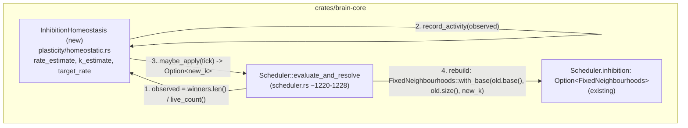

# Design: Self-Tuning k-WTA Sparsity (Inhibition Homeostasis)

## Overview

A new `InhibitionHomeostasis` type in
`crates/brain-core/src/plasticity/homeostatic.rs`, structurally identical to its
two siblings (`IntrinsicHomeostasis`, `SegmentThresholdHomeostasis`): an EMA of
an observed rate, a proportional nudge toward a target, gated on
`interval_ticks`. `Scheduler` owns one as an optional field; when configured, it
observes each tick's actual population activity fraction (the same quantity
OBS-2/`MetricsSnapshot.sparsity` already calls "sparsity") and periodically
replaces its own `inhibition: Option<FixedNeighbourhoods>` with a version whose
`k` has been nudged toward whatever value keeps sparsity near the configured
target — using `FixedNeighbourhoods`'s already-public `base()`/`size()`/`k()`
getters and a wholesale reconstruction, per Requirement 1 Acceptance Criterion
3's preferred path. No changes to `inhibition.rs` itself.

**The chosen "observed rate" (Acceptance Criterion 2's required, justified
decision): global population activity fraction** —
`winners_scratch.len() as f32 / neurons.live_count() as f32` per tick, sampled
inside `evaluate_and_resolve` right where both quantities are already computed
(`scheduler.rs` ~1220-1228). This is the _exact_ quantity README's own
OBS-2/VAL-2(a) already call "sparsity" (fraction of the live population that
spiked this tick) — reusing an already-load-bearing definition rather than
inventing a new one (e.g. "fraction of candidates that won their neighbourhood,"
which would conflate sparsity with a different, harder-to-interpret quantity: a
population with very few above-threshold candidates could have 100%
candidate-win-rate while still being nowhere near saturated). Tracked as one
global EMA (not per-neighbourhood), matching Requirement 1 Acceptance Criterion
5's approved uniform-only scope.

**A sign-flip subtlety relative to the existing templates, flagged explicitly so
it is not copy-paste-inverted:**
`IntrinsicHomeostasis`/`SegmentThresholdHomeostasis` both _raise_ their tuned
value (threshold) when the observed rate is too high, because a higher threshold
makes firing _harder_. For k-WTA, a higher `k` makes winning _easier_ — the
relationship is inverted. The nudge must be
`k_estimate -= adjustment_rate * error` (not `+=`), where
`error = rate_estimate - target_rate`: too much activity (`error > 0`) must
_decrease_ `k`, not increase it.

## Architecture



## Components and Interfaces

### `crates/brain-core/src/plasticity/homeostatic.rs`

New type, placed alongside `IntrinsicHomeostasis`/`SegmentThresholdHomeostasis`:

```rust
pub struct InhibitionHomeostasis {
    target_rate: f32,
    smoothing: f32,
    adjustment_rate: f32,
    min_k: f32,
    interval_ticks: u32,
    last_applied_at: u32,
    rate_estimate: f32,
    k_estimate: f32,
}

impl InhibitionHomeostasis {
    /// `k_estimate` starts at `initial_k` (the scheme's `k` at construction
    /// time) so the very first `maybe_apply` nudges from the caller's own
    /// starting point, not from zero. `min_k` mirrors `min_threshold`'s
    /// floor-clamp role; the *ceiling* (`k <= size`) is deliberately not
    /// known to this type (it has no notion of `size`, matching
    /// `SegmentThresholdHomeostasis`'s own decoupling from `SegmentConfig`)
    /// -- the integration site clamps against the live scheme's own
    /// `size()` when applying, see below.
    pub fn new(target_rate: f32, smoothing: f32, adjustment_rate: f32, min_k: f32, interval_ticks: u32, initial_k: f32) -> Self { /* asserts matching SegmentThresholdHomeostasis::new's style: interval_ticks > 0, smoothing in [0,1), target_rate in [0,1), min_k >= 1.0 */ }

    /// Call once per tick with this tick's observed activity fraction.
    pub fn record_activity(&mut self, observed_rate: f32) {
        self.rate_estimate = self.rate_estimate * self.smoothing + observed_rate * (1.0 - self.smoothing);
    }

    /// Gated on `interval_ticks`; `Some(new_k)` (rounded, `>= 1`) when an
    /// adjustment applies this tick, `None` otherwise -- mirrors
    /// `IntrinsicHomeostasis::maybe_apply`'s bool-gate shape, but returns
    /// the value rather than mutating an arena directly, since this
    /// mechanism's "arena" (the live `FixedNeighbourhoods`) needs
    /// reconstruction, not in-place mutation.
    pub fn maybe_apply(&mut self, tick: u32) -> Option<u32> {
        if tick < self.last_applied_at + self.interval_ticks { return None; }
        self.last_applied_at = tick;
        let error = self.rate_estimate - self.target_rate;
        // NOTE the sign: subtract, not add -- see this document's Overview
        // for why k's relationship to "too much activity" is inverted
        // relative to threshold.
        self.k_estimate = (self.k_estimate - self.adjustment_rate * error).max(self.min_k);
        Some(self.k_estimate.round().max(1.0) as u32)
    }
}
```

### `crates/brain-core/src/scheduler.rs`

- New field: `inhibition_homeostasis: Option<InhibitionHomeostasis>` (alongside
  the existing `segment_threshold_homeostasis` field, same `Option`-gated
  shape).
- New builder:
  `with_inhibition_homeostasis(mut self, ih: InhibitionHomeostasis) -> Self`.
- Integration point, immediately after the existing winner-resolution block
  (~1220-1228, right after
  `let inhibition_active = self.inhibition.is_some();`):
  ```rust
  if let Some(ih) = &mut self.inhibition_homeostasis {
      let observed = self.winners_scratch.len() as f32 / neurons.live_count() as f32;
      ih.record_activity(observed);
      if let Some(new_k) = ih.maybe_apply(self.tick) {
          if let Some(old) = &self.inhibition {
              let clamped_k = new_k.min(old.size()).max(1);
              self.inhibition = Some(FixedNeighbourhoods::with_base(old.base(), old.size(), clamped_k));
          }
      }
  }
  ```
  The `clamped_k` line is the defensive ceiling `InhibitionHomeostasis` itself
  deliberately doesn't know about (`size` lives on `FixedNeighbourhoods`, read
  back via its own public getter at the integration site) -- this is what
  guarantees `FixedNeighbourhoods::with_base`'s own `k > 0 && k <= size`
  assertion can never panic here, regardless of how far `k_estimate` might
  otherwise drift.
- **A real cost worth naming, not hidden:** replacing `self.inhibition`
  reallocates `FixedNeighbourhoods`'s internal `scratch: Vec<(u32, f32)>` buffer
  (currently reused across ticks for ENG-9's zero-allocation-in-steady-state
  discipline) on every adjustment tick. Since adjustments only happen every
  `interval_ticks` (not every tick), this is a bounded, infrequent cost — but it
  should be measured (a `criterion` micro-benchmark, or simply confirmed against
  `core_bench.rs`'s existing throughput numbers before/after) rather than
  assumed negligible, especially if `interval_ticks` is configured aggressively
  low.

### `crates/brain-napi` (only if Requirement 2's condition is met)

If a concrete TypeScript-driven need is identified: a
`#[napi(object)] InhibitionHomeostasisConfig` mirroring
`SegmentThresholdHomeostasisConfig`'s field shape (`targetRate`, `smoothing`,
`adjustmentRate`, `minK`, `intervalTicks`), an optional
`SimulationOptions.inhibitionHomeostasis` field, and `build_scheduler` wiring it
via `with_inhibition_homeostasis` when present — otherwise, per Requirement 2
Acceptance Criterion 2, explicitly deferred and named as a follow-up in this
design's own Design Risks section rather than built speculatively.

## Data Models

- New type `InhibitionHomeostasis` (Rust-core only, per the above).
- `Scheduler` gains one field
  (`inhibition_homeostasis: Option<InhibitionHomeostasis>`).
- Snapshot format: check whether `Scheduler`'s existing
  `segment_threshold_homeostasis` field is serialized in `snapshot.rs` today. If
  it is not (plasticity config is typically caller-reconstructed on restore,
  matching the builder-pattern precedent), `inhibition_homeostasis` needs no
  snapshot change either, for consistency. If `segment_threshold_homeostasis`
  _is_ serialized, this field should get the same treatment for the same reason
  (RUN-9a's round-trip fidelity).

## Error Handling

- `InhibitionHomeostasis::new`'s asserts (interval_ticks > 0,
  smoothing/target_rate in valid ranges, min_k >= 1.0) mirror
  `SegmentThresholdHomeostasis::new`'s existing `debug_assert!` style —
  construction-time failures, not runtime panics deep in `evaluate_and_resolve`.
- The `clamped_k` defensive clamp above is itself the error-handling story for
  the one runtime hazard this mechanism introduces (a `k` estimate drifting
  outside `[1, size]`) — no `Result`/error type needed since the clamp makes the
  invalid state unreachable rather than needing to be reported.

## Testing Strategy

- **Unit tests in `homeostatic.rs`**, mirroring
  `IntrinsicHomeostasis`'s/`SegmentThresholdHomeostasis`'s existing test shapes
  exactly: EMA convergence, the `interval_ticks` gate, the sign of the nudge (a
  test specifically asserting `k` _decreases_ when
  `observed_rate > target_rate`, guarding the sign-flip subtlety above against a
  future accidental copy-paste regression), and the `min_k` floor.
- **New integration test** (new file, e.g.
  `crates/brain-core/tests/inhibition_homeostasis.rs`): Requirement 1 Acceptance
  Criterion 5's ablation --- build two populations identical except for size (or
  internal connectivity density) such that a fixed `k` produces visibly
  different sparsity in each; show the homeostasis-enabled version converges
  both toward the same target sparsity while the disabled version does not.
- **Regression**: confirm every existing whole-network test (in particular
  anything already sensitive to exact spike timing, e.g.
  `tests/partitioning_reference.rs`, `tests/golden.rs`) is unaffected when this
  mechanism is not configured -- it must be fully opt-in, matching Requirement 1
  Acceptance Criterion 4.

## Design risks

- **The global-sparsity metric may be too coarse if a population has
  meaningfully different sub-regions** (e.g. one dense cluster and one sparse
  one averaging out to "on target" while neither actually is). Requirement 1
  Acceptance Criterion 5 already scopes this phase to uniform, whole-scheduler
  tuning specifically to avoid taking on that complexity now; if this proves to
  be a real problem in practice, per-neighbourhood tracking is the named
  follow-up in `requirements.md`'s Out of Scope section, not something to solve
  speculatively here.
- **The `scratch` buffer reallocation cost on every adjustment** (Components
  section above) is a real, measurable-but-unmeasured cost this design accepts
  without data. Measure before shipping a very low `interval_ticks` default.
- **No FFI exposure is guaranteed by this design** -- Requirement 2 makes it
  conditional on a real need. Do not build `crates/brain-napi` surface for this
  speculatively; confirm a concrete caller first.
