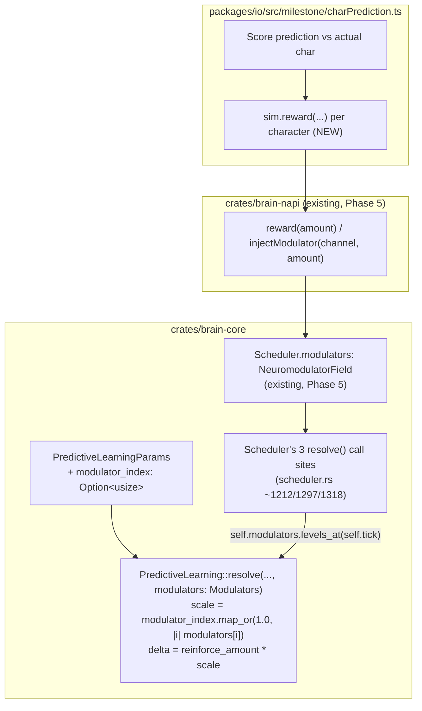
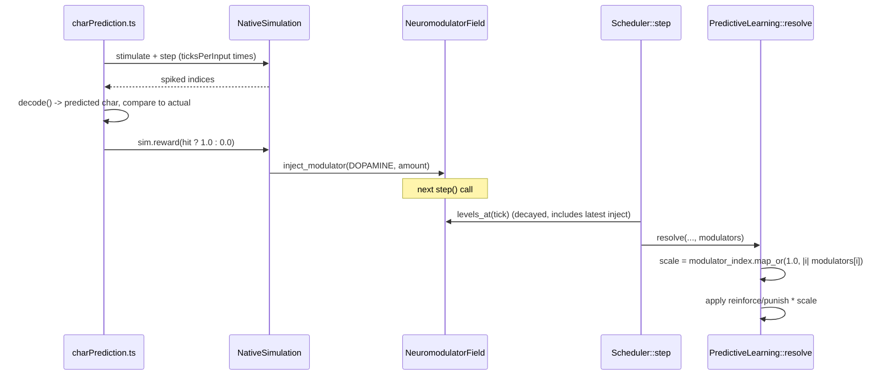

# Design: Neuromodulator-Routed Predictive Learning

## Overview

Two independent changes, both required for either to matter:

1. **`PredictiveLearning` gains an opt-in modulator channel.** `PredictiveLearningParams` gains
   `modulator_index: Option<usize>`. `None` (the only value every existing call site can pass without
   changing behavior) means "scale by `1.0`" — i.e. exactly today's fixed-amount arithmetic, computed
   with no read of `NeuromodulatorField` at all. `Some(idx)` multiplies the reinforce/punish delta by
   `modulators[idx]`, the same shape `ThreeFactorStdp::apply_modulated_update` already uses.
2. **`charPrediction.ts` actually injects a real signal** — the milestone-level gap found during this
   spec's own research (it never calls `reward()`/`injectModulator()` today, so nothing in (1) would be
   observable there without this).

**A deliberate refinement over a literal reading of the approved requirements, flagged explicitly:**
`requirements.md`'s Acceptance Criterion 4 describes the desired *outcome* ("bit-identical... when the
modulator level is held at a constant nonzero baseline, e.g. `1.0`") without mandating a specific
mechanism. A literal "always multiply by `self.modulators.levels_at(tick)[index]`" design is a real
trap: `NeuromodulatorField`'s levels default to `0.0` (confirmed: no injection ever happened in any of
`predictive_learning.rs`'s or `tests/emergent.rs`'s existing tests, or in `charPrediction.ts` before
this spec), so a naive always-multiply design would silently zero out *every* existing predictive-
learning test's reinforcement the moment this ships, unless every one of those tests was separately
updated to inject a `1.0` baseline first. The `Option<usize>`-gated design below instead follows this
project's own established convention for every other optional mechanism (`SegmentThresholdHomeostasis`,
`HomeostaticScaling`, `StructuralPlasticity` are all `Option<T>`-gated on `Scheduler`, defaulting to
"off" = today's exact behavior) — `None` needs no test updated at all, because no existing test's
numeric result changes.

## Architecture



### Data flow for one character (once both changes land)



## Components and Interfaces

### `crates/brain-core/src/plasticity/predictive.rs`

- **`PredictiveLearningParams`** (44-66): add one field,
  `pub modulator_index: Option<usize>`. Every existing struct-literal construction site (this file's
  own `default_params()` test helper, `predictive_learning.rs`'s two `predictive_params()` functions,
  `tests/emergent.rs`'s construction, `crates/brain-napi`'s FFI config mapping if one exists) must add
  `modulator_index: None` — a mechanical, one-line addition per site with zero numeric effect. Grep for
  `PredictiveLearningParams {` to find every site before starting.
- **`resolve()`** (216-226): add one parameter, `modulators: crate::plasticity::Modulators` (the
  `[f32; NUM_MODULATORS]` type alias, matching `ThreeFactorStdp`'s own `ctx.modulators` shape exactly —
  passing the whole array, not a pre-resolved scalar, keeps the indexing decision inside
  `PredictiveLearning` where `modulator_index` already lives, rather than splitting that logic across
  two files).
- **New private helper**, used by both `adjust_segment_permanence` (140-149) and
  `reinforce_or_sprout_burst`'s reinforcement path (168-202, the `Some(id)` branch at 190-193 —
  **not** the `None` sprout branch at 194-198, per Requirement 1 AC2: a sprout's starting permanence is
  structural, not a reinforcement event, and stays exactly `burst_sprout_permanence`):
  ```rust
  fn modulator_scale(&self, modulators: Modulators) -> f32 {
      self.params.modulator_index.map_or(1.0, |i| modulators[i])
  }
  ```
  `adjust_segment_permanence`'s `delta: f32` parameter becomes the *unscaled* amount at call sites
  (`resolve`'s `(true,true)`/`(true,false)` arms), with the scale applied once, centrally, rather than
  duplicating `modulator_scale` logic at every call site — e.g.
  `self.adjust_segment_permanence(synapses, neuron, segment, self.params.reinforce_amount *
  self.modulator_scale(modulators))`.
- **`reinforce_or_sprout_burst`** (168-202): thread `modulators: Modulators` through as an added
  parameter; apply `self.modulator_scale(modulators)` to the `self.params.reinforce_amount` used in the
  `Some(id)` reinforcement branch (192) only.

### `crates/brain-core/src/scheduler.rs`

Three call sites (confirmed at ~1212, ~1297, ~1318, all inside methods where `self.modulators:
NeuromodulatorField` and `self.tick: u32` are already fields on `self`) change from:
```rust
pl.resolve(neurons, synapses, &self.predicting_segment, idx, predictive_before, /*committed*/, self.tick, neurons.capacity_len() as u32);
```
to pass one more argument, computed once per call (cheap — `levels_at` is an O(1) decay catch-up, not a
scan):
```rust
pl.resolve(neurons, synapses, &self.predicting_segment, idx, predictive_before, /*committed*/, self.tick, neurons.capacity_len() as u32, self.modulators.levels_at(self.tick));
```
No change to `Scheduler`'s own fields or `with_predictive_learning`'s signature — `modulator_index` is
part of `PredictiveLearningParams`, already threaded through that constructor.

### `crates/brain-napi/src/lib.rs`

Check whether an FFI-facing config type mirrors `PredictiveLearningParams` field-for-field (the
research phase noted `buildNetwork`'s `predictiveLearning: {...}` object in `charPrediction.ts` — find
its corresponding `#[napi(object)]` Rust struct). If one exists, add an optional
`modulatorIndex?: number` field (TypeScript `undefined` → Rust `None`, matching every other optional
FFI field's existing convention in this codebase, e.g. `SegmentThresholdHomeostasisConfig`).

### `packages/io/src/milestone/charPrediction.ts`

- **New `CharPredictionConfig` field**, per Requirement 2 AC3: `readonly rewardSignal?: "correctness" |
  undefined` (or a richer shape if design work during implementation finds a better one — see Design
  Risks below for the specific signal choice). `undefined` (default) preserves today's behavior
  exactly: no `reward()`/`injectModulator()` call, `PredictiveLearningParams.modulatorIndex` left
  `undefined`/`None`.
- **Proposed concrete signal (Requirement 2 AC1's required documented choice), to confirm or revise
  during implementation:** after each character's prediction is scored against the actual next
  character (the same comparison `networkAcc.record(...)` at `charPrediction.ts:274` already makes),
  call `sim.reward(step.predicted?.label === step.actual ? 1.0 : 0.0)` — dopamine channel (matching
  `reward()`'s existing fixed mapping), reusing the exact boolean `runCharPredictionTrial` already
  computes rather than re-deriving it. Rationale: "reward = got it right" is the most direct, least
  speculative mapping of LRN-11's reward API to this specific task, and requires no new comparison
  logic. **Named alternative, not built in v1 unless investigation prefers it:** a separate
  uncertainty/surprise channel (acetylcholine or noradrenaline) scaling the *punish* half differently
  from the *reinforce* half — `PredictiveLearningParams`'s single `modulator_index` applies to both
  halves uniformly, so a two-channel design would need a second `Option<usize>` field
  (`punish_modulator_index`, say). Flagged as a real design fork, not resolved here — start with the
  single-channel version since it directly mirrors `ThreeFactorParams`'s own single-index precedent,
  and revisit only if the single-channel result doesn't teach anything useful.
- `buildNetwork` passes `modulatorIndex: DOPAMINE` (or the FFI's equivalent constant/numeric value) to
  the `predictiveLearning` config object only when `rewardSignal` is configured — omitted (matching
  `exactOptionalPropertyTypes`'s existing spread-only-if-defined convention already used for
  `segmentThresholdHomeostasis` at `charPrediction.ts:193`) otherwise.

## Data Models

- `PredictiveLearningParams` gains one field: `modulator_index: Option<usize>`.
- No snapshot format change: `PredictiveLearningParams` is scheduler *configuration*, not per-tick
  state — confirm this by checking whether `snapshot.rs` serializes `Scheduler`'s
  `predictive_learning: Option<PredictiveLearning>` field at all (if it does today, the new field needs
  the same treatment as every other config field already round-tripped there; if it doesn't — plasticity
  config is typically reconstructed by the caller on restore, matching `with_predictive_learning`'s own
  builder-pattern precedent — no snapshot change is needed).
- `CharPredictionConfig` gains one optional field (`rewardSignal` or equivalent), matching
  `segmentThresholdHomeostasis`'s existing optional-field shape.

## Error Handling

- `modulator_index: Some(idx)` where `idx >= NUM_MODULATORS` — decide whether this should be a
  construction-time `assert!` (matching `SegmentThresholdHomeostasis::new`'s existing
  `debug_assert!`-heavy convention) or left to panic naturally on array index — prefer the explicit
  assert, since a silently-panicking array index deep inside `resolve()`'s hot path is a worse failure
  mode than an immediate, clear construction-time message.
- No new fallible paths on the TypeScript side beyond what `sim.reward()`/`injectModulator()` already
  have (neither returns a `Result` today, per the existing FFI surface).

## Testing Strategy

- **`predictive.rs`'s own `#[cfg(test)]` module**: every existing test updated to pass
  `modulator_index: None` and a modulator array parameter to `resolve()` (any value — `[0.0;
  NUM_MODULATORS]` is simplest and proves `None` truly ignores it) — assertions unchanged, proving
  Requirement 1 AC4's bit-identical claim directly at the unit level.
- **New unit tests in `predictive.rs`**: `Some(idx)` at varying modulator levels (e.g. `0.0`, `0.5`,
  `1.0`, `2.0`) produces proportionally scaled deltas — a direct arithmetic check, plus a
  `mod tests` case confirming the sprout branch's `burst_sprout_permanence` is unaffected by any
  modulator level (Requirement 1 AC2).
- **New integration test** (new file, e.g. `crates/brain-core/tests/predictive_learning_neuromodulation.rs`,
  or extend `predictive_learning.rs`): Requirement 1 AC5's behavioral claim — the same repeating
  A-then-B sequence `predictive_learning.rs`'s own `correct_prediction_proportion_rises_across_exposures...`
  test uses, run at two or three different constant injected modulator levels, showing learning speed
  (ticks-to-reach-consistent-prediction) differs measurably between them.
- **`packages/io/test/*.slow.test.ts`**: extend or add a case building `charPrediction.ts`'s network
  with `rewardSignal` configured vs. not, confirming the "not configured" path is unaffected (no
  `reward()` calls, identical accuracy to today's baseline) and the "configured" path actually differs.
- **VAL-4 re-measurement** (Requirement 2 AC4): run the modulator-driven configuration through the
  identical protocol (corpus slice, 5 seeds) as every prior README §13.12 figure, record the honest
  result in README regardless of direction.

## Design risks

- **The single biggest open question is empirical, not architectural: does scaling reinforcement by
  "was the network right recently" actually help character prediction, or does it create a
  destabilizing feedback loop** (predictions that start out lucky get reinforced harder, entrenching
  early — possibly wrong — representations)? This is exactly the kind of thing this project's own
  discipline says to measure, not assume either way.
- **Punish-scaling by the same "reward" channel is semantically odd** (Design section above already
  flags this) — being in a high-dopamine state and then *punishing* a false positive harder is not
  obviously correct. Worth a specific experiment isolating reinforce-only scaling vs. reinforce+punish
  scaling before concluding either is better.
- **`OverlapSaturation`/`FixedNeighbourhoods` are untouched by this spec** — this document only covers
  `PredictiveLearning`; do not conflate with the separate `inhibition-homeostasis` or
  `saturation-driven-growth` specs, which are independent tracks.
