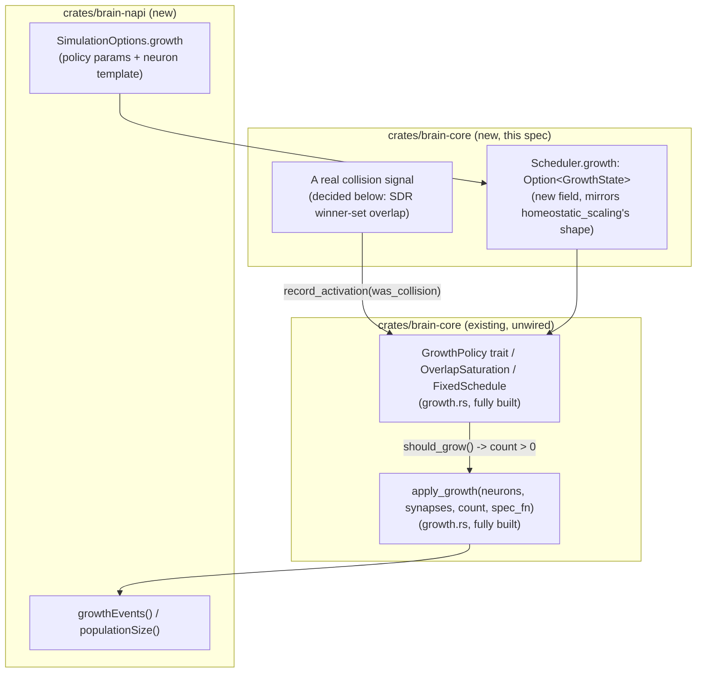

# Design: NET-10 Saturation-Driven Growth, Wired Live

## Overview

Three parts: (1) a `Scheduler`-owned, optional growth mechanism following
`HomeostaticScaling`/ `StructuralPlasticity`'s existing "opt-in,
caller-driven-or-automatic sweep" shape, wrapping the already-built
`growth::GrowthPolicy`/`apply_growth`; (2) a concrete, real "collision" signal,
chosen and justified rather than left abstract; (3) FFI exposure, following
LRN-11's own precedent that a Rust-only mechanism is not usable from a
TypeScript experiment until it explicitly crosses that boundary.

**The one genuinely open architectural question, surfaced by this design and not
resolved by `growth.rs` itself:** `apply_growth`'s
`spec_fn: impl Fn(u32) -> NeuronSpec` is a closure — perfectly fine inside
`crates/brain-core`, but closures cannot cross the `napi-rs` FFI boundary. A
production, TypeScript-driven growth experiment needs _some_ concrete,
serializable way to say "here is how a newly grown neuron should be
constructed," and no such shape exists in this codebase yet. This design
proposes a minimal concrete template (below) rather than a general closure —
flagged as a real decision point in Design Risks, not a settled one.

## Architecture



## Components and Interfaces

### `crates/brain-core/src/scheduler.rs`

New field, mirroring `homeostatic_scaling: Option<HomeostaticScaling>`'s exact
shape:

```rust
pub struct GrowthState {
    policy: Box<dyn GrowthPolicy>,
    ceiling: u32,                              // Acceptance Criterion 4: caller-enforced population cap
    spec_fn: Box<dyn Fn(u32) -> NeuronSpec>,    // how to build the i-th newly grown neuron
}
```

```rust
// on Scheduler:
growth: Option<GrowthState>,

pub fn with_growth(mut self, policy: Box<dyn GrowthPolicy>, ceiling: u32, spec_fn: Box<dyn Fn(u32) -> NeuronSpec>) -> Self {
    self.growth = Some(GrowthState { policy, ceiling, spec_fn });
    self
}

/// Caller-driven, matching OverlapSaturation's own "the caller decides
/// what counts as a collision" design -- this is the hook a real task's
/// decode/overlap logic calls once per relevant event (e.g. once per
/// character, once per decoded candidate), *before* `step()`, the same
/// ordering `tests/homeostasis.rs`'s own `HomeostaticScaling::maybe_apply`
/// call already establishes as this codebase's convention for
/// caller-paired (not literally step()-internal) mechanisms.
pub fn record_growth_activation(&mut self, was_collision: bool) {
    if let Some(g) = &mut self.growth {
        g.policy_record_activation(was_collision); // needs a GrowthPolicy method or a concrete-type match; see Design Risks
    }
}

/// Checks and applies growth for one population, gated by the policy's
/// own should_grow/interval logic and this mechanism's ceiling.
pub fn maybe_grow(&mut self, neurons: &mut NeuronArena, synapses: &mut SynapseArena, tick: u32) -> Option<Vec<NeuronId>> {
    let g = self.growth.as_mut()?;
    if neurons.live_count() >= g.ceiling { return None; }
    let stats = PopulationStats { live_count: neurons.live_count() as u32, tick };
    let count = g.policy.should_grow(&stats, /* seed */ 0); // seed threading: see Design Risks
    if count == 0 { return None; }
    let capped = count.min(g.ceiling - neurons.live_count() as u32);
    Some(apply_growth(neurons, synapses, capped, |i| (g.spec_fn)(i)))
}
```

**A trait-object subtlety worth resolving during implementation, not glossed
over:** `GrowthPolicy`'s `record_activation` is defined only on the concrete
`OverlapSaturation` type today (`FixedSchedule` has no such method — it doesn't
need one). If `Scheduler.growth` holds a `Box<dyn GrowthPolicy>`,
`record_growth_activation` above has no generic way to call a method that isn't
on the trait. Two options: (a) add
`fn record_activation(&mut self, was_collision: bool) {}` as a default-no-op
trait method on `GrowthPolicy` itself (cheap, additive, `FixedSchedule` inherits
the no-op), or (b) make `Scheduler.growth` generic/concrete over
`OverlapSaturation` specifically rather than trait-object-boxed, losing the
ability to swap in `FixedSchedule` without a different `Scheduler` type
parameter. **(a) is recommended** — it is the smaller, purely-additive change
and keeps `Scheduler`'s own type simple (no new generic parameter).

### `crates/brain-core/src/growth.rs`

Add the default trait method discussed above:

```rust
pub trait GrowthPolicy {
    fn should_grow(&mut self, stats: &PopulationStats, seed: u64) -> u32;
    fn record_activation(&mut self, was_collision: bool) {}
}
```

`OverlapSaturation` already has an inherent `record_activation`
(growth.rs:107-120) — change it from an inherent method to a trait-method
override
(`impl GrowthPolicy for OverlapSaturation { ... fn record_activation(&mut self, was_collision: bool) { /* existing body */ } }`),
or keep the inherent one and add a trait-forwarding override that calls it —
either preserves every existing test in `growth.rs`'s own `#[cfg(test)]` module
and `tests/structural_and_growth.rs` unchanged, since they call the concrete
type's methods directly, not through the trait object.

### The collision signal (Requirement 1 Acceptance Criterion 2's required decision)

**Proposed, concrete, and grounded in an already-documented real phenomenon in
this codebase:** `crates/brain-core/tests/emergent.rs`'s own module doc records
that when candidate winner sets for _different_ symbols are drawn from an
undersized shared population, they can "coincidentally land on the same neurons
often enough... to wash out the very distinction the split exists to carry" —
this _is_ representational collision, already observed and named, just currently
worked around by hand-sizing populations rather than growing them in response.
This design proposes reproducing that exact shape of scenario as the test-bed,
rather than inventing an unrelated synthetic one:

1. A k-WTA population presented with several distinct sparse input patterns
   (each pattern = a specific subset of externally-stimulated neurons, the same
   "candidate SDR" shape `packages/io` already uses elsewhere).
2. After each presentation, record which neurons won (`Scheduler`'s own
   `winner_set`/`winners_scratch`, or the returned `spiked` list) against the
   _labelled_ winner set of the pattern presented.
3. `was_collision = true` when the current winner set's overlap with a
   **different** label's own most-recently-recorded winner set exceeds a
   configured overlap fraction (e.g. 50%) — i.e., two different inputs are
   becoming hard to tell apart by their network response, which is precisely
   NET-10's own definition of saturation ("unable to represent new input without
   unacceptable interference with what it already holds").
4. Feed this into
   `record_growth_activation`/`OverlapSaturation::record_activation` once per
   presentation.

This keeps the demonstration self-contained (no dependency on
`charPrediction.ts`'s own, separately underperforming, dendritic-prediction
machinery) while still being a _real_ task-shaped signal, not a synthetic
counter incremented for the test's own convenience.

### `crates/brain-napi/src/lib.rs`

- `SimulationOptions.growth?: GrowthConfig` (optional, `undefined` = today's
  exact behavior, no growth mechanism attached).
- `GrowthConfig` (proposed shape, the concrete-template answer to this design's
  flagged open question):
  ```typescript
  interface GrowthConfig {
    collisionThreshold: number;
    window: number;
    neuronsPerTrigger: number;
    minTicksBetweenGrowth: number;
    ceiling: number;
    // Concrete, FFI-safe stand-in for `spec_fn`: every newly grown neuron
    // uses this fixed template rather than an arbitrary closure.
    newNeuronThreshold: number;
    newNeuronExcitatoryFraction: number; // 1.0 or 0.0 for a single grown neuron; see Design Risks for a batch of several
    newNeuronCoordsOrigin: [number, number, number]; // grown neurons placed at a fixed point/small jitter from here
  }
  ```
- `NativeSimulation::step()` calls `self.scheduler.maybe_grow(...)`
  automatically once `growth` is configured — matching the exact precedent
  already set (and the exact prior bug already found and fixed) for
  `HomeostaticScaling`/`StructuralPlasticity`: "`NativeSimulation` has never
  called either" was a real, previously-discovered gap (README §12a item 4) for
  those two mechanisms; do not repeat it for growth.
- Observability: a `growthEvents(): number` (count of growth triggers so far)
  and confirm `sim.coordsView()`/existing bulk views already reflect a grown
  population's larger size automatically (they should, since `apply_growth` uses
  the same `NeuronArena::allocate` path every other construction does — verify,
  don't assume).

## Data Models

- `GrowthPolicy` trait gains one default method (`record_activation`, no-op
  default).
- `Scheduler` gains one field (`growth: Option<GrowthState>`, a new, non-public
  struct).
- FFI: one new optional `SimulationOptions` field and its associated config
  type.
- Snapshot: population size itself is already part of `NeuronArena`'s existing
  serialized state (any network's neuron count round-trips today); confirm
  `GrowthState`'s own policy configuration (thresholds,
  `last_grown_at`/`hits`/`total` counters) needs snapshotting for `RUN-9a`'s
  bit-identical round-trip fidelity if growth is expected to resume correctly
  mid-accumulation after a restore — if not snapshotted, a restored run's growth
  policy silently resets its rolling window, which is a correctness gap worth
  deciding on explicitly rather than discovering later (mirroring this project's
  own `segment_coincidence_window`/format-version precedent for exactly this
  class of gap).

## Error Handling

- `ceiling` reached: `maybe_grow` returns `None` rather than erroring — matching
  this project's existing convention that resource limits (e.g.
  `SynapseArena::insert`'s `BlockFull`) are handled by silent, expected no-ops
  at the mechanism level, not propagated as errors.
- No new fallible FFI calls; `growthEvents()` is a plain counter read.

## Testing Strategy

- **`growth.rs`'s own tests**: add coverage for the new `record_activation`
  default trait method (confirm `FixedSchedule` accepts calls to it as a no-op,
  confirm `OverlapSaturation`'s behavior is unchanged by the
  inherent-to-trait-override refactor).
- **New integration test** (new file, e.g.
  `crates/brain-core/tests/saturation_driven_growth.rs`): Requirement 1
  Acceptance Criteria 1, 3, 5, 6 together — the winner-set-overlap scenario
  above, run twice (growth enabled vs. disabled, the ablation), demonstrating
  collision rate measurably drops after a growth event in the enabled run and
  stays elevated in the disabled one. Multi-seed, per this project's VAL-6
  discipline (statistical claims need more than one seed).
- **FFI-level test** (`packages/brain/test/boundary.test.ts`): confirm
  `SimulationOptions.growth` configured vs. `undefined` produces different
  population sizes after a scripted collision-triggering sequence, and that
  `NativeSimulation::step()` genuinely drives it automatically (not requiring a
  separate manual call from TypeScript) — matching the exact test shape that
  caught the `HomeostaticScaling`/`StructuralPlasticity` "never called" bug
  previously.

## Design risks

- **This is the most open-ended, emergent-behaviour-shaped item of the three
  specs in this batch** — explicitly named as such in `requirements.md`'s own
  Introduction. `OverlapSaturation`'s collision metric is untested against any
  real scenario end-to-end; it may need retuning (window size, threshold) once
  actually driven by the proposed winner-set-overlap signal, the same way
  NET-12's own attractor tuning needed several rounds in Phase 5.5. Budget for
  that, don't assume the first parameterisation works.
- **The FFI neuron-spec-template question (Components section) is a real design
  fork.** A single fixed template works for "grow a few identical neurons," but
  if a population's own construction convention varies threshold/coordinates per
  neuron (e.g. `allocate_population`'s 80:20 excitatory/inhibitory split), a
  single scalar `newNeuronExcitatoryFraction` needs to become "assign the i-th
  of `count` grown neurons excitatory unless `i % 5 == 4`" or similar — decide
  this against a real caller's actual need, not speculatively.
- **The `record_activation`-via-default-trait-method design (Components section)
  is the recommended fix for the trait-object dispatch gap, but is itself a
  judgment call** — revisit if implementation finds a cleaner alternative (e.g.
  an
  `enum GrowthPolicyKind { Fixed(FixedSchedule), Overlap(OverlapSaturation) }`
  instead of `Box<dyn GrowthPolicy>`, trading dynamic dispatch for a closed set
  of two known policies, which this codebase's own size may not even need the
  flexibility to avoid).
- **Snapshot/restore correctness for mid-accumulation growth state** (Data
  Models section) is flagged but not resolved here — decide explicitly during
  implementation rather than leaving it an unstated gap the way
  `NativeSimulation`'s missing homeostasis/structural-plasticity calls once
  were.
