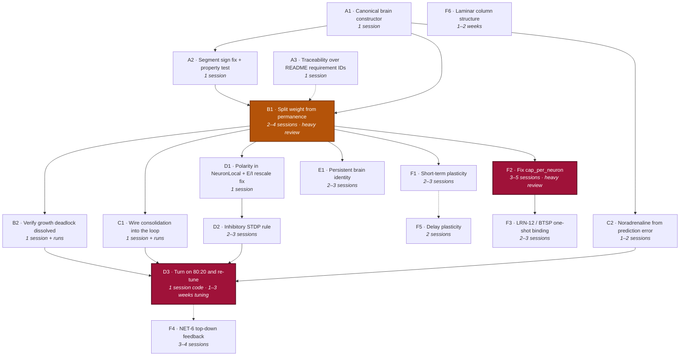

# Remediation plan — review findings, ordered

Companion to `README.md`. The findings themselves live in the README (§13.12 items 11–14 for the
code defects, item 10 for the growth deadlock, §13.13 for the literature gaps); this file is only
the *plan* — what order to do them in, what each one costs, and a ready-to-paste prompt per item.

Written 2026-09-13 after a full review of §2 against §3–§9 against the shipped core.

**One item = one Claude Code session.** Where the original estimate said "2–4 sessions", that is
one long session, not a split. Each prompt below is self-contained and assumes a fresh session with
no memory of this review.

---

## Contents

| § | Section |
|---|---|
| 1 | [How to use this](#1-how-to-use-this) |
| 2 | [Dependency chart](#2-dependency-chart) |
| 3 | [The items, in order](#3-the-items-in-order) |
| 4 | [House rules](#4-house-rules) — the standing context every session needs |
| 5 | [Prompts](#5-prompts) |

---

## 1. How to use this

Work top to bottom. Within a phase, items are independent unless the chart says otherwise; across
phases, the gates are real.

Two scheduling facts that shape everything:

- **Coding time compresses ~3–5× with an LLM. Experiment time does not compress at all.** The
  bottleneck moves to wall-clock simulation and your judgment about what a result means. Estimates
  below separate the two.
- **Phase A is a closing window.** Those fixes produce no golden-raster churn *only* while every
  network runs `excitatoryFraction: 1.0`. Once D3 lands, they become expensive. Do them first.

Where an item is tuning-bound, parallelise the trials across cores — independent seeds are
embarrassingly parallel and that is the only real speedup available there.

---

## 2. Dependency chart



**Solid arrow** = hard dependency. **Dotted arrow** = strongly preferred order, not a blocker.

**B1 is the critical path.** It gates VAL-4 re-baselining, NET-10 (invariant 10), consolidation's
downscale semantics, and the `cap_per_neuron` work. Nothing downstream of it is worth starting first.

**D3 and F2 are the two risk items.** D3 because its cost is tuning, not code. F2 because it is a
wide change to the arena addressing scheme that cross-partition routing depends on.

---

## 3. The items, in order

| ID | Item | Gated by | Claude Code | Wall-clock / your time |
|---|---|---|---|---|
| **A1** | Canonical "everything on" brain constructor | — | 1 session | — |
| **A2** | Segment sign fix + segment-configured Dale property test | A1 | 1 session | 1 design call |
| **A3** | Traceability check over README requirement IDs | — | 1 session | — |
| **B1** | Split `weight` from `permanence` | A1, A2 | 2–4 sessions | **heavy review** |
| **B2** | Verify the NET-10 growth deadlock is dissolved | B1 | 1 session | ~1 hour of runs |
| **C1** | Wire `runConsolidation` into the streaming loop | B1 | 1 session | hours of runs |
| **C2** | Drive noradrenaline from prediction error | A1 | 1–2 sessions | 1 design call |
| **D1** | `polarity` in `NeuronLocal` + E/I-aware `rescale_one` | B1 | 1 session | — |
| **D2** | Inhibitory STDP rule (Vogels-style) + ablation test | D1 | 2–3 sessions | — |
| **D3** | Turn on 80:20 and re-tune | B2, C1, C2, D2 | 1 session | **1–3 weeks tuning** |
| **E1** | Persistent named brain that resumes | B1 | 2–3 sessions | — |
| **F1** | Short-term plasticity (Tsodyks–Markram) | B1 | 2–3 sessions | tuning |
| **F2** | Fix `cap_per_neuron`'s single-constant addressing | B1 | 3–5 sessions | **heavy review** |
| **F3** | LRN-12 / BTSP one-shot binding | F2 | 2–3 sessions | experiments |
| **F4** | NET-6 top-down feedback carrying predictions | D3 (pref.) | 3–4 sessions | experiments |
| **F5** | Delay plasticity | F1 (pref.) | 2 sessions | experiments |
| **F6** | Laminar column structure | — | 1–2 weeks | experiments |

**Phase totals:** A ≈ 1 day · B ≈ 3–5 days · C ≈ 1–2 days · D ≈ 1 week code + 1–3 weeks calendar ·
E+F ≈ 3–4 weeks code + 2+ months calendar.

---

## 4. House rules

Standing context for every session. The prompts reference this section rather than repeating it.

- **Read `README.md` first.** It is the canonical spec: §2 is the evidence base, §3–§9 the numbered
  requirements, §10 the ten invariants, §12 decisions taken, §12a open questions, §13 prior art.
  Requirement IDs (`NEU-*`, `SYN-*`, `LRN-*`, `NET-*`, `RUN-*`, `IO-*`, `ENG-*`, `OBS-*`, `VAL-*`)
  are the shared vocabulary between the doc, the specs and the code — cite them, don't restate them.
- **Per-slice specs** live under `.claude/scratch/<slice>/{requirements,design}.md`.
- **Invariants are not trade-offs** (§10). Locality, no global gradient, sign on the neuron, enforced
  sparsity, real delay, learned topology, no train/infer split, modality-agnostic core, serialisable
  state, grown capacity. Violating one is a defect.
- **Determinism is a hard requirement** (RUN-3, RUN-9a). No ambient randomness; draw via
  `rng::derive_stream(seed, entity_id, purpose, tick)`. Results must be bit-identical across thread
  counts and across snapshot/restore.
- **Test tiers:** `npm run test:fast` (cargo test + clippy + build + typecheck + TS fast) on every
  change; `npm run test:slow` (release `--ignored`, golden rasters, TS slow, traceability) before
  declaring done. Golden rasters regenerate with `npm run test:golden:regen` — **only** when you can
  explain why the behaviour legitimately changed.
- **Statistical assertions are multi-seed** (VAL-6). Ablation tests are required for load-bearing
  mechanisms (VAL-9): disable it, assert the property *fails*.
- **Honest reporting** (README Requirement 13.6/8, visible throughout §11 and §13.12): report what
  did not work, by sub-part, in the doc itself. A negative result recorded precisely is a deliverable.
- **Zero AI/ML dependencies** (ENG-5/6), Rust core ≈ `rayon` only, TS shell nothing at runtime.
- **When you finish, update `README.md`** — the relevant §11 phase status and/or §13.12 item — in the
  document's existing voice. Then update this file's status for the item.

---

## 5. Prompts

### A1 — Canonical "everything on" brain constructor

```
Read README.md §1 (vision), §10 (invariants), §11 Phase 5/7 status, and PLAN.md §4 (house rules).

THE PROBLEM. Every experiment in this repo builds a fresh network from a config object, runs it,
and throws it away — that is the shape of a training run, which README §1.1 explicitly rejects
("a brain that grows, not a model that is trained"). Worse, it is a diagnostic blind spot: because
each experiment hand-picks which mechanisms to switch on, the paths nobody picks are never
exercised. That is exactly how README §13.12 items 11, 13 and 14 happened — a segment sign bug, a
consolidation path with zero callers, three dead neuromodulator channels, and an 80:20 Dale ratio
that no run has ever used, all sitting in a tree with a strong test suite.

THE TASK. Build one canonical brain constructor: a single place that wires every mechanism the core
has, live, by default. Model it on packages/io/src/milestone/charPrediction.ts, which is the closest
thing that exists today — but that file hardcodes `excitatoryFraction: 1.0`, never calls
runConsolidation, and only ever injects DOPAMINE.

Include, on by default: segments (NEU-5/6), inhibition (NET-2), STDP + eligibility + three-factor
(LRN-2/3/4), homeostatic scaling (LRN-6), intrinsic homeostasis (NEU-7), segment threshold
homeostasis, structural plasticity (LRN-7), growth (NET-10), spike-frequency adaptation (NEU-8),
predictive learning (LRN-8), probes and metrics (OBS-1/2/3).

Decide and justify where it lives: a new module in packages/io, or the TS shell in packages/brain.
It must not add a modality-aware branch to the core (invariant 8).

Then add a standing test that runs it for N ticks and asserts only what is TRUE TODAY — sparsity
stays near target, permanence stays in [0,1], no panic, snapshot round-trips. Do not assert things
the known defects would fail. The point is a fixture that later items tighten as each fix lands.

DONE WHEN. One constructor, one standing test, `npm run test:fast` and `npm run test:slow` green,
and a short note in README §11 recording what the constructor switches on and what it revealed.
If turning everything on at once surfaces new breakage, that is a finding — record it, do not
silently disable the mechanism that broke.
```

---

### A2 — Segment sign fix + segment-configured Dale property test

```
Read README.md §2.3 (dendrites), §2.4 (inhibition), §10 invariant 3, §13.12 item 11, and §13.13(a).
Then PLAN.md §4.

THE FINDING (README §13.12 item 11a/11b). Dale's principle is correctly enforced on the somatic
path — crates/brain-core/src/scheduler.rs's `deliver` computes
`signed_current = sign * permanence` (~line 999). It is silently dropped on the dendritic path:
`Scheduler::apply_local_effect` (scheduler.rs ~line 897) receives that `signed_current` and, in its
`is_dendritic` branch, does `self.segment_counts[composite] += 1.0` — ignoring both the sign and
the magnitude. So an INHIBITORY presynaptic neuron RAISES a dendritic segment's coincidence count
and makes the target cell more likely to fire.

This inverts one of the best-established motifs in cortex: SST interneurons target distal dendrites
specifically to veto dendritic spikes (§13.13(a)). It is the clearest invariant-3 violation in the
tree.

WHY THE TEST SUITE MISSES IT. crates/brain-core/tests/invariants.rs's
`synapse_sign_always_matches_its_source_neurons_polarity` (~line 111) allocates its synapse with
`target_segment = 0` and never calls `with_segments`, so it exercises the somatic path only. VAL-8's
property is asserted exactly where it already holds.

THE TASK.
1. Fix the sign. There is a real design call here — make it explicitly and record the reasoning:
   does an inhibitory delivery SUBTRACT from the coincidence count (dendritic veto, closest to the
   SST biology), or accumulate into a separate inhibitory channel the segment model consults? The
   cheap correct version is the former. Note that `segment_counts` is already f32 and snapshotted,
   so neither option needs a format bump.
2. Separately decide, and record, whether the count should also weight by permanence rather than
   `1.0`. HTM's binary reading is defensible — but say which you chose and why, because right now
   permanence means "graded current" at the soma and "nothing at all" at the segment.
3. Extend the property test: a second case that configures segments via `with_segments`, routes a
   synapse to a non-zero `target_segment`, and asserts the sign reaches the segment correctly.

TIMING MATTERS. Every network in this repo currently runs `excitatoryFraction: 1.0`
(packages/io/src/milestone/charPrediction.ts ~line 221 and every test), so this fix should change
NO golden raster. If a raster does change, stop and investigate — it means something is already
running a mixed population and you have found a second bug.

DONE WHEN. Fix in, property test covering the dendritic path, `npm run test:fast` and
`npm run test:slow` green with golden rasters unchanged, and README §13.12 item 11 updated to record
the fix and the two design calls.
```

---

### A3 — Traceability check over README requirement IDs

```
Read README.md VAL-10 (§9), §13.12 item 14, and PLAN.md §4.

THE FINDING (README §13.12 item 14). scripts/check-traceability.mjs already exists and works — but
it covers a DIFFERENT ID space. It parses numbered acceptance criteria ("Requirement N.M") out of
.claude/scratch/*/requirements.md and checks that some test cites each one. It does not know about
README requirement IDs at all (NEU-*, SYN-*, LRN-*, NET-*, RUN-*, IO-*, ENG-*, OBS-*, VAL-*, VIZ-*).

The concrete miss: RUN-9b ("restore then expand", a MUST) is genuinely implemented and genuinely
tested — crates/brain-core/tests/structural_and_growth.rs's
`a_restored_network_can_grow_and_keep_learning_without_discarding_prior_learning` is exactly RUN-9b
— but the test cites no requirement ID, so nothing connects them. A reader has to grep to find out
which README requirements have tests, which have code, and which are simply unbuilt.

THE TASK.
1. Extend the checker (or add a sibling script — your call, justify it) to build an inventory over
   README requirement IDs: for each ID, does the codebase mention it, and does any test mention it?
2. Report three buckets: cited by a test / mentioned in code but no test / not mentioned anywhere.
3. Add a deferral list in the same spirit as the existing script's, so DELIBERATE gaps stay visible
   and reviewed rather than silently masked. Seed it from README §13.12 item 14: NET-6, NET-8,
   NET-11 and LRN-12 are known-unbuilt, not oversights.
4. Annotate the RUN-9b test with its requirement ID. Sweep for other obvious uncited cases while
   you are there, but do not invent citations — if a test does not actually demonstrate a
   requirement, leave it uncited and list it.
5. Wire it into `npm run test:slow` alongside the existing check.

CONSTRAINTS. No new runtime dependency (ENG-6) — Node built-ins only, matching the existing script.

DONE WHEN. The script runs, the three buckets match what README §13.12 item 14 claims (or you have
corrected the README where it is wrong), and `npm run test:slow` is green.
```

---

### B1 — Split `weight` from `permanence` ⚠️ critical path

```
Read README.md SYN-1, SYN-3, SYN-4, LRN-6, LRN-7 (§3–§4); §2.5; §13.12 items 10 and 12; and
§12a item 5(c). Then PLAN.md §4. This is the largest change in the plan — read all of it before
writing code.

THE FINDING (README §13.12 item 12). There is no `weight` field. `SynapseArena`
(crates/brain-core/src/synapse.rs) holds `permanence` and transmission is `sign * permanence`
(scheduler.rs ~line 999). SYN-1 lists "weight/permanence" as one field and that is what shipped.
But SYN-3's permanence is STRUCTURAL (is this synapse connected) and §2.5's weight is EFFICACY
(how much current does it pass). Aliasing them onto one f32 causes three things:

1. A synapse just above `connection_threshold` transmits at roughly half strength. "Firmly
   connected but weak" and "tentative but strong" are both inexpressible.
2. HomeostaticScaling silently performs structural plasticity. `rescale_one`
   (crates/brain-core/src/plasticity/homeostatic.rs ~line 67) multiplies every incoming permanence
   by `target_total / total` with no awareness of `connection_threshold` — so a downscaling sweep
   DISCONNECTS synapses wholesale and an upscaling sweep CONNECTS previously-potential ones. LRN-6,
   SYN-3 and LRN-7 are three writers of one variable.
3. Consolidation's global downscale (LRN-10) is the same operation at a stricter target, so "sleep"
   prunes structurally as a side effect.

AND IT BLOCKS NET-10 OUTRIGHT (README §13.12 item 10's 2026-09-13 addendum). Because permanence is
also the gate, "below threshold" means "invisible to plasticity": `deliver` skips sub-threshold
synapses with `continue` BEFORE calling `on_delivery`, and `on_post_spike`'s STDP is gated on
`last_active`, which only delivery writes. So a provisional synapse can never be potentiated by
activity — which removes the one remedy a bootstrapping deadlock normally has, and is why a neuron
added by growth can never acquire a synapse in either direction. Splitting the fields dissolves that
deadlock as a side effect.

THE TASK. Add a separate `weight` to the synapse representation.

Surface to touch (grep before assuming this list is complete):
- crates/brain-core/src/synapse.rs — `SynapseArena` fields, `SynapseArenaViewMut`/`OffsetSlice`,
  `insert`, `split_views_mut`, `incoming`, `occupied_in_block`
- crates/brain-core/src/scheduler.rs — `deliver` transmits weight, not permanence; the
  `connection_threshold` gate still reads permanence
- crates/brain-core/src/plasticity/ — homeostatic.rs scales WEIGHT; structural.rs prunes/sprouts on
  PERMANENCE; three_factor.rs and predictive.rs need an explicit decision (below)
- crates/brain-core/src/snapshot.rs — FORMAT_VERSION is currently 7; bump to 8 with a migration that
  restores a v7 snapshot by deriving weight from permanence. There are six prior format bumps in
  that file to copy the pattern from, and a versioned golden fixture convention under tests/fixtures/
- crates/brain-napi/src/lib.rs + index.d.ts — FFI surface
- packages/brain, packages/io, packages/viz — anything reading permanence as a strength

THE DESIGN DECISION, MADE EXPLICITLY AND RECORDED. What does STDP move — weight, permanence, or
both on different timescales? The biologically motivated answer is weight fast (efficacy, per
spike-pair) and permanence slow (structural consolidation, following sustained weight). Propose your
answer with reasoning BEFORE implementing, and record it in README §12 as a numbered decision.

CONSTRAINTS. Memory cost is +4 bytes/synapse — at the 50M-synapse target that is ~+200MB on the
measured ~1.46GB (README §12a item 1); state the new figure. Determinism must hold (RUN-3) and
snapshot round-trip must stay bit-identical (RUN-9a). Golden rasters WILL change — regenerate them
only with a written explanation of why the behaviour legitimately differs.

DONE WHEN. Both fields exist and are independently exercised, v7 snapshots still restore, the full
fast and slow tiers pass, VAL-4 is re-measured on the 5-seed protocol and the new number reported
honestly whether it improved or not, and README §13.12 item 12 plus §11's phase status record the
outcome.
```

---

### B2 — Verify the NET-10 growth deadlock is dissolved

```
Read README.md §13.12 item 10 in full (including its 2026-09-13 addendum), NET-10, invariant 10,
and PLAN.md §4. Assumes B1 has landed.

THE FINDING. Developmental growth adds no functional capacity, for a structural reason:

- `apply_growth` (crates/brain-core/src/growth.rs ~line 211) allocates a neuron from a NeuronSpec
  and nothing else — zero synapses, by NET-10's explicit design.
- `StructuralPlasticity::sprout` (crates/brain-core/src/plasticity/structural.rs ~lines 145 and 154)
  requires `activity_streak >= min_activity_streak` for BOTH the source and the target.
- `update_activity_streaks` (structural.rs ~line 105) drives that streak purely from
  `NeuronArena::last_spike` — real spikes only.

So: no synapses → no current → no spike → streak pinned at 0 → ineligible as source AND target →
never wired. LRN-8's burst-sprout path (plasticity/predictive.rs ~lines 198–225) is closed for the
same reason. `reclaim_unused_neurons` (structural.rs ~line 175) exempts never-fired neurons, so
grown neurons are also immortal, and `apply_growth` reserves a full `cap_per_neuron` block for each.

The empirical proof is already in the repo: README §13.12 item 10's conditions B/C/D/E/F are
BIT-FOR-BIT identical across every growth pace and sprout restriction tried — growth changes nothing
because grown neurons are invisible to everything. scripts/investigate-growth-regression.ts is the
harness that produced that table.

THE TASK. B1 should have dissolved this: a grown neuron can now be sprouted a structurally
connected, near-zero-weight synapse that transmits a trickle, is visible to STDP, and survives or is
pruned on its own merits.

1. Re-run the six conditions from item 10's table using the existing script, same protocol (5 seeds,
   15,000-character corpus slice). Parallelise the seeds across cores.
2. Confirm B/C/D/E/F are no longer bit-identical — that is the specific signal that growth now does
   something. Report per-condition numbers in item 10's existing table format.
3. Instrument whether grown neurons actually acquire synapses and fire: live neuron count, sprouted
   count onto grown indices, and first-spike tick for grown neurons.
4. If they still do not wire, diagnose why rather than tuning around it. Candidates: the sprout
   eligibility gate still requires a streak the neuron cannot build (a one-time grace for a neuron
   with zero synapses and no prior spike is the surgical option item 10 already scoped); or the
   near-zero weight is below what the coincidence/integration path can act on at all.
5. Separately, decide whether `reclaim_unused_neurons`' never-fired exemption is still right now
   that grown neurons CAN wire. A permanently-inert grown neuron consuming a ceiling slot and a
   synapse block is a real cost.

DONE WHEN. The six conditions are re-measured and reported honestly (including "still deadlocked"
if that is the answer), README §13.12 item 10 carries the new table, and §11's phase status says
whether NET-10 and invariant 10 are now actually met.
```

---

### C1 — Wire consolidation into the streaming loop

```
Read README.md §2.9, LRN-10, §13.12 item 13, §13.13(h), and PLAN.md §4.

THE FINDING (README §13.12 item 13). `run_consolidation`
(crates/brain-core/src/consolidation.rs) and the `runConsolidation` FFI surface
(crates/brain-napi/src/lib.rs, packages/brain/src/index.ts) are built, tested, and have ZERO callers
outside their own tests. README §2.9 calls an offline phase "a required operating state, not an
optimisation", and VAL-4's streaming run — the longest-running experiment in the repo, and the one
§13.12 item 5's drift risk applies to — never sleeps.

Tononi & Cirelli's synaptic homeostasis hypothesis (§13.13(h)) is the argument for why this matters:
continuous learning drives total synaptic strength upward until signal-to-noise collapses.
Streaming 15,000 characters with no consolidation is studying for a week without sleeping.

THE TASK.
1. Add a sleep cadence to the streaming harness (packages/io/src/milestone/charPrediction.ts and/or
   the canonical constructor from A1). The cadence is a design call: every N characters? On a
   metric trigger? Propose and justify.
2. Measure VAL-4 with and without it, 5-seed protocol, parallelised.
3. Note the known limitation: `runConsolidation` is Runtime::Single-only and returns an error in
   partitioned mode (crates/brain-napi/src/lib.rs ~line 1862). Do NOT fix that here — record it as a
   scoped follow-up. This item is about whether sleeping helps at all.
4. If it does not help, that is a real result. Report it in §13.12's existing honest-negative style
   rather than tuning until it does.

WORTH KNOWING. §13.13(h) also records that the downscale is UNIFORM
(`HomeostaticScaling::force_apply` at a stricter target), whereas the biology's down-selection is
selective — what survives is what was replayed. That is a separate, larger change. If uniform
downscaling measurably hurts, say so and scope selective downscaling as its own item rather than
attempting it here.

DONE WHEN. Consolidation runs as part of a real experiment, VAL-4 is measured both ways and reported
honestly, and README §11's phase status plus §13.12 item 13 record the result.
```

---

### C2 — Drive noradrenaline from prediction error

```
Read README.md §2.5, §2.7, LRN-5, LRN-8, §13.12 item 13, and PLAN.md §4.

THE FINDING (README §13.12 item 13). LRN-5 specifies four neuromodulator channels — dopamine,
acetylcholine, noradrenaline, serotonin. Only DOPAMINE is ever injected or read. ACETYLCHOLINE,
NORADRENALINE and SEROTONIN are declared constants (crates/brain-core/src/plasticity/mod.rs) with no
producer and no consumer.

What makes this worth fixing cheaply rather than deferring: a producer already exists and is being
thrown away. crates/brain-core/src/plasticity/predictive.rs classifies every dirty neuron, every
tick, into one of three outcomes — correct prediction, false positive (predicted, did not fire), and
unpredicted spike. That is a locally-computable surprise signal of exactly the kind README §2.5
assigns to noradrenaline ("surprise/arousal"), and it is aggregated nowhere.

THE TASK.
1. Aggregate the prediction-failure rate that predictive.rs already computes into a noradrenaline
   injection on the neuromodulator field (crates/brain-core/src/neuromodulator.rs).
2. Decide, explicitly, WHAT NORADRENALINE GATES. This is the real design work, not the plumbing.
   Candidates: a global learning-rate multiplier when the world stops matching predictions; a
   plasticity-rate term in the three-factor rule via a second RuleChain entry with
   `modulator_index = NORADRENALINE`; an inhibition/sparsity modulation. Propose with reasoning
   before implementing.
3. Respect invariant 2 and LRN-5 strictly: the field is a BROADCAST SCALAR carrying no per-synapse
   routing information. A per-neuron or per-synapse surprise signal would be a gradient in disguise
   and is forbidden. Aggregate to a scalar before it reaches the field.
4. Respect RUN-6's known limitation: each partition holds its own field copy, broadcast via
   `PartitionRuntime::inject_modulator` (crates/brain-core/src/partition.rs ~line 551). Your
   aggregation must produce the same value on every partition or partitioned runs will diverge from
   single-threaded ones — which `tests/partitioning_reference.rs` will catch.
5. Add an ablation test (VAL-9): disable the coupling, assert the property it provides fails.

DONE WHEN. Noradrenaline has a producer and a consumer, single-threaded and partitioned runs stay
bit-identical, VAL-4 is re-measured on the 5-seed protocol and reported either way, and README
§13.12 item 13 plus LRN-5's status record what the channel now does.
```

---

### D1 — `polarity` in `NeuronLocal` + E/I-aware `rescale_one`

```
Read README.md NEU-4, LRN-2, LRN-6, §10 invariant 3, §13.12 item 11(c), §13.13(a), and PLAN.md §4.

THE FINDING (README §13.12 item 11c). No plasticity rule reads `polarity`. Two consequences:

1. `ThreeFactorStdp` (crates/brain-core/src/plasticity/three_factor.rs) applies the excitatory STDP
   kernel to inhibitory synapses unchanged.
2. `HomeostaticScaling::rescale_one` (crates/brain-core/src/plasticity/homeostatic.rs ~line 67) sums
   excitatory and inhibitory incoming permanence into ONE total it renormalises toward a positive
   target — so with a mixed population, adding inhibition to a neuron makes homeostasis scale UP its
   excitation.

LRN-2 and LRN-6 are written as if every synapse were excitatory. This is latent only because nothing
in the repo has ever run a mixed population (item 11d).

THE TASK. This item is the plumbing; D2 is the rule that uses it.

1. Add `polarity` to `NeuronLocal` (crates/brain-core/src/plasticity/mod.rs ~line 26). This is
   cheaper than it looks: `NeuronLocal` is constructed fresh from the arena by
   `neuron_local(neurons, idx)` in scheduler.rs, so there is NO snapshot format change. Check
   `CrossPartitionPostSpike` and partition.rs's boundary `NeuronLocal` table carry it correctly.
2. Make `rescale_one` E/I-aware. Design call, made explicitly: separate totals with separate
   targets, or normalise on magnitude? Whatever you choose, "adding inhibition scales up excitation"
   must stop being true.
3. Do NOT change STDP's behaviour in this item. Just make the sign reachable. D2 is where the
   inhibitory rule gets designed.

CONSTRAINTS. This must be behaviour-preserving for the all-excitatory case — every existing test and
every golden raster must pass UNCHANGED, because every network currently runs
`excitatoryFraction: 1.0`. If a raster changes, you have altered excitatory behaviour by accident.

DONE WHEN. `polarity` is reachable from every plasticity call site including the cross-partition
path, `rescale_one` handles mixed populations sensibly, fast and slow tiers green with golden
rasters unchanged, and README §13.12 item 11 updated.
```

---

### D2 — Inhibitory STDP rule + ablation test

```
Read README.md §2.4, §2.5, NEU-4, LRN-2, LRN-9, §10 invariants 3 and 4, §13.12 item 11,
and §13.13(a). Then PLAN.md §4. Assumes D1 has landed.

THE FINDING (README §13.12 item 11d and §13.13(a)). NET-2's sparsity is produced by an ALGORITHMIC
k-winners-take-all over contiguous index ranges (crates/brain-core/src/inhibition.rs) — a sort, not
a circuit. Meanwhile NEU-4's 80:20 excitatory/inhibitory population is correctly implemented and has
NO experiment behind it: every run in the repo sets `excitatoryFraction: 1.0`.

README §2.4 says the control system is an inhibitory circuit, and §13.13(a) names the missing
requirement: inhibitory synaptic plasticity. Vogels, Sprekeler, Zenke, Clopath & Gerstner (Science
2011, cited in §14) show that a symmetric, purely local rule at INHIBITORY synapses is what
establishes and maintains detailed E/I balance — networks self-organise into asynchronous irregular
states, and sparsity becomes a CONSEQUENCE of a learned circuit rather than an imposed competition.

THE TASK.
1. Implement an inhibitory plasticity rule as a new `PlasticityRule` impl. `RuleChain`
   (crates/brain-core/src/plasticity/mod.rs) already supports composing rules, per LRN-9 — use it
   rather than branching inside the existing `ThreeFactorStdp`.
2. The Vogels rule is symmetric — pre-before-post AND post-before-pre both potentiate — with a
   depression term proportional to a target postsynaptic rate. `NeuronLocal::rate_estimate` already
   exists and is driven by `IntrinsicHomeostasis`. Read those before designing.
3. Respect invariant 1 absolutely: a rule sees only `LocalContext` (two `NeuronLocal` copies,
   modulators, tick) and `SynapseMut`. No graph access, no arena, no population view. If your design
   needs more than that, it is the wrong design — say so rather than widening the interface.
4. Make the rule dispatch on the polarity D1 exposed, so excitatory and inhibitory synapses get
   different kernels and Dale's principle means something dynamically as well as structurally.
5. Add an ablation test (VAL-9): with inhibitory plasticity disabled, assert E/I balance fails to
   establish. A mechanism that cannot be shown to matter by removing it is not yet load-bearing.
6. Unit-test the kernel shape directly against the published curve, in the style of
   crates/brain-core/src/plasticity/stdp.rs's existing tests (VAL-1).

DO NOT turn on 80:20 in any existing experiment in this item — that is D3, and it is a separate,
tuning-bound piece of work. Test the rule on its own dedicated fixtures so this session stays
bounded.

DONE WHEN. The rule exists, composes through `RuleChain`, has unit tests and an ablation test,
existing all-excitatory runs are bit-identical (golden rasters unchanged), and README §13.12 item 11
plus LRN-2's status record the new rule.
```

---

### D3 — Turn on 80:20 and re-tune ⚠️ tuning-bound

```
Read README.md §2.4, NEU-4, NET-2, §13.12 items 1, 2 and 11, §13.13(a), and §11 Phase 7/8 status.
Then PLAN.md §4. Assumes A2, B1, B2, C1, C2, D1 and D2 have all landed.

WHAT THIS IS. Every parameter in this repository was found with `excitatoryFraction: 1.0` — no run
has ever used the 80:20 ratio NEU-4 specifies (README §13.12 item 11d). This item turns it on. The
code change is trivial. The work is re-tuning, and README §13.12 item 2 predicts exactly this: "the
interaction of §4's rules is the hard part, not any individual rule... where simulator projects
historically lose months to instability."

Budget accordingly: ~1 session of code, then 1–3 weeks of tuning. Do not expect a result in one
sitting, and do not let the session's length pressure you into declaring a number before the seeds
support it.

THE TASK.
1. Set a genuinely mixed population in the canonical constructor (A1) and in charPrediction.ts.
2. Expect everything to break. Sparsity, prediction accuracy, segment thresholds and the k-WTA's
   `k` were all fitted against an all-excitatory network. README §11 Phase 7's status records two
   prior instances of exactly this failure mode — a value tuned at one scale silently wrong at
   another — and both were only found because someone re-derived the parameter rather than reusing
   it. Assume every constant is now wrong until re-measured.
3. Re-tune systematically, not by hand. scripts/tune-segments-and-threshold.ts is the existing
   search harness; extend it rather than writing a new one. PARALLELISE TRIALS ACROSS CORES — seeds
   are independent and this is the only real speedup available here.
4. Use the official protocol throughout: 5 seeds, 15,000-character corpus slice, compared against
   the trigram baseline (README §13.12 items 7–10 all use it, so results stay comparable).
5. Watch for a genuinely NEW result, not just a worse number: does E/I balance now produce sparsity
   without the k-WTA doing the work? README §13.13(a) notes that avalanche-size distributions are
   the measurable signature of the critical regime §2.4 invokes — that is a candidate new VAL test
   and a much more interesting outcome than an accuracy delta.

HONEST REPORTING IS THE DELIVERABLE. README §13.12 items 8, 9 and 10 are all recorded negative
results, in detail, with the conditions that produced them. If 80:20 makes VAL-4 worse, that is the
finding — record it in that style, including per-seed ranges, and do not quietly revert to 1.0
without writing down what happened.

DONE WHEN. A mixed population runs stably, VAL-4 is re-measured on the 5-seed protocol with the full
search recorded, README §11's phase status and §13.12 carry the result whatever it is, and NEU-4
finally has an experiment behind it.
```

---

### E1 — Persistent named brain that resumes

```
Read README.md §1.1, §10 invariants 9 and 10, RUN-9, RUN-9a, RUN-9b, RUN-9c, §13.7, §13.11 claim 3.
Then PLAN.md §4. Assumes B1 has landed — deliberately, so you are not migrating a synapse format
already known to be wrong.

WHAT THIS IS. README §1.1 says the target is developmental, not a training run: "A child is not
trained to convergence and then deployed." §13.11 names restore-then-expand as this project's most
defensible novel claim — "simulators checkpoint; none of them treat restore-then-expand as a
supported operation, because none of them expect the network to outlive the experiment."

The machinery all exists: snapshot/restore round-trips bit-identically (RUN-9a), and
crates/brain-core/tests/structural_and_growth.rs's
`a_restored_network_can_grow_and_keep_learning_without_discarding_prior_learning` proves RUN-9b.
What does not exist is the IDENTITY — a named brain you open, feed, and close, rather than a network
an experiment constructs and discards.

THE TASK.
1. Build a persistent brain identity on top of A1's canonical constructor: a named, on-disk brain
   that is created once, resumed on every subsequent run, and grows across sessions.
2. It must survive process exit and resume as though nothing happened (invariant 9), and it must
   support being expanded after restore (RUN-9b) without a rebuild.
3. Make the lifecycle explicit and small (ENG-10): create / open / step / snapshot / close.
4. Add a test that genuinely crosses a process boundary — create, feed, exit, re-open in a NEW
   process, feed more, and assert prior learning survived. An in-process round-trip does not
   demonstrate invariant 9.
5. Decide where snapshots live on disk and how versions are handled when FORMAT_VERSION bumps again
   (it is at 7 today and B1 takes it to 8). A brain meant to outlive the code needs a migration
   story, not just a version check.

WORTH FLAGGING. Once state is carried forward permanently, every future change becomes a MIGRATION
rather than a config edit. Say clearly in the README which parts of the system are now
commitment-grade and which are still free to change.

DONE WHEN. A named brain persists across processes, grows after restore, has a cross-process test,
and README §11 plus invariant 9's status record that the project now has a brain rather than a
series of experiments.
```

---

### F1 — Short-term plasticity (Tsodyks–Markram)

```
Read README.md §2.2, SYN-1, SYN-4, NET-12, §13.13(c), and §11 Phase 7's working-memory status.
Then PLAN.md §4. Assumes B1 has landed.

THE FINDING (README §13.13(c)). A synapse currently holds permanence, weight (after B1), delay, an
eligibility trace and a last-active tick — but no per-synapse RECOVERY state. So a burst and an
isolated spike of the same total count are indistinguishable downstream.

Tsodyks & Markram (PNAS 1997, cited in §14) showed that short-term depression and facilitation make
the SAME presynaptic spike train mean different things at synapses with different recovery dynamics
— temporal filtering a static weight cannot express at any value. Mongillo, Barak & Tsodyks (Science
2008) then showed working memory can be carried by presynaptic facilitation rather than persistent
spiking: cheap, robust to interruption, and refreshable at a low rate.

WHY THIS ONE MATTERS FOR VAL-4. Character prediction needs "what did I just see, ~100ms ago" held
somewhere. Short-term plasticity is exactly that, at the synapse, with no extra learning rule.
NET-12's attractor works but README §11 Phase 7's status records how narrow its parameter window was
— STP composes with it rather than replacing it.

THE TASK.
1. Add per-synapse short-term dynamics (a utilisation/resource pair in the Tsodyks–Markram shape) to
   the arena, following B1's precedent for widening the synapse representation.
2. Apply them in `deliver` (crates/brain-core/src/scheduler.rs) so transmitted current reflects
   recent presynaptic history.
3. Bump FORMAT_VERSION with a migration (there will be seven prior bumps in snapshot.rs to copy).
4. Keep it OFF by default initially, exactly as NEU-8's adaptation was introduced
   (`LifParams::new` vs `with_adaptation` in crates/brain-core/src/neuron.rs is the pattern) — so
   existing runs are bit-identical until a caller opts in.
5. Unit-test the facilitation and depression curves against the published shapes (VAL-1), then
   measure VAL-4 with it on, 5-seed protocol.

CONSTRAINTS. Determinism (RUN-3), no per-tick allocation (ENG-9), and this must not become a third
writer of the same number B1 just finished separating — state clearly how STP's state relates to
weight and permanence.

DONE WHEN. STP exists, is off by default, has curve tests, VAL-4 is measured both ways and reported
honestly, and README §13.13(c) plus SYN-1's status record the addition.
```

---

### F2 — Fix `cap_per_neuron`'s single-constant addressing ⚠️ wide change

```
Read README.md §12a item 5, especially sub-item (d); SYN-1; RUN-2; ENG-9; §12a item 1's memory
figures. Then PLAN.md §4. Assumes B1 has landed. This blocks F3.

THE FINDING (README §12a item 5d). `SynapseArena::new(cap_per_neuron)`
(crates/brain-core/src/synapse.rs) takes a SINGLE CONSTANT FOR THE WHOLE NETWORK. A synapse id is
`source * cap_per_neuron + slot`, and `source_of(id) = id / cap_per_neuron`.

That derivation is load-bearing in more places than it looks: `split_views_mut` derives synapse
ranges from neuron ranges; `boundary_neurons` and cross-partition `on_post_spike` routing
(crates/brain-core/src/partition.rs) depend on it; `PartitionRuntime::step` takes a single
`synapses` parameter; snapshot.rs encodes it; and every `Scheduler` method takes a
`SynapseArenaViewMut`.

The cost: a mechanism wanting high fan-out on a small dedicated population (pattern separation for
LRN-12) must raise the cap for EVERY neuron. README §12a item 5d's own figure — 500/neuron ×
100k neurons is the measured ~1.46 GB, so a store wanting 4,000/neuron multiplies synapse memory
roughly eightfold, paid by the 98% of neurons that do not need it.

§12a item 5d is explicit that this was cheap before Phase 4 shipped and is not any more. It is the
real blocker for LRN-12, not the interface-shape question that item originally focused on.

THE TASK.
1. Choose between the two options §12a item 5d names, with reasoning: a SECOND `SynapseArena` (drags
   in split_views_mut's range derivation, boundary_neurons, PartitionRuntime::step's single
   parameter, snapshot's FORMAT_VERSION, and every Scheduler method signature), or a VARIABLE-BLOCK
   arena (breaks the `id / cap_per_neuron` derivation that cross-partition on_post_spike routing
   depends on). Neither is cheap; say which is cheaper HERE and why.
2. Implement it, preserving: determinism across thread counts (RUN-3), bit-identical
   single-vs-partitioned results (crates/brain-core/tests/partitioning_reference.rs is the check),
   snapshot round-trip fidelity (RUN-9a), and no per-tick allocation (ENG-9).
3. Re-run the memory-footprint test (crates/brain-core/tests/scale.rs, `#[ignore]`d) and the
   criterion benchmarks (crates/brain-core/benches/core_bench.rs) — report the new figures against
   README ENG-11's targets and §12a item 1's recorded numbers.

THIS IS THE HIGHEST-RISK MECHANICAL CHANGE IN THE PLAN. The addressing scheme is an invariant that
three subsystems assume silently. Prefer a smaller change that preserves the derivation over an
elegant one that does not, and say explicitly what you verified rather than what you believe.

DONE WHEN. Per-population fan-out is expressible, all partitioning and snapshot tests pass
bit-identically, memory and throughput figures are re-measured and reported, and README §12a item 5
is updated to record which option was taken and what it cost.
```

---

### F3 — LRN-12 / BTSP one-shot binding

```
Read README.md LRN-12, LRN-3, NEU-6, §2.9, §12 decision 8, §12a item 5 (all sub-items), §13.13(d),
and §13.12 item 1's 2026-09-13 resolution. Then PLAN.md §4. Assumes F2 has landed.

WHY THIS MATTERS FOR VAL-4 SPECIFICALLY. README §13.12 item 1 records the decision to keep VAL-4 as
the acceptance bar, on the grounds that a human memorises text to a real if limited degree and
therefore predicts familiar English well above chance. That argument has a consequence the plan
takes seriously: a person doing this is partly REMEMBERING, not inferring. This project currently
has no recall mechanism at all, so it can only ever do the statistics half. LRN-12 is the missing
half, which makes it more load-bearing for VAL-4 than it looks in the requirement list.

THE GROUNDWORK ALREADY DONE (README §12a item 5).
- (a) The replay source is already an abstraction — `ReplaySource`
  (crates/brain-core/src/consolidation.rs), not a concrete `&SpikeRaster`. Implementing this is an
  added `impl`, not a breaking change.
- (b) `PlasticityRule` structurally cannot host this (it sees only `LocalContext` and `SynapseMut`),
  and it does not need to: `plasticity/predictive.rs`'s `adjust_segment_permanence` and
  `reinforce_or_sprout_burst` already establish the precedent of a scheduler-invoked module writing
  permanence directly, outside the rule interface, WITHOUT violating invariant 1.
- (c) A one-shot write to permanence 1.0 via `SynapseArena::insert` is legal.
- (d) `cap_per_neuron` was the blocker — F2 removed it.

THE MECHANISM (README §13.13(d)). Bittner, Milstein, Grienberger, Romani & Magee (Science 2017):
behavioural timescale synaptic plasticity. A single dendritic plateau potential potentiates inputs
that arrived SECONDS before and after it — not coincident, not Hebbian, and a complete place field
forms in one trial. The eligibility window is seconds wide, which is exactly LRN-3's stated τ. A
2025 Nature Communications model shows the rule gives content-addressable memory with one-shot
learning and BINARY synapses, which fits (c) above directly.

THE TASK.
1. Implement BTSP-style one-shot binding as a scheduler-invoked module, following predictive.rs's
   precedent. Trigger on a dendritic event (NEU-6); potentiate on the seconds-scale eligibility
   trace LRN-3 already maintains.
2. Give it sparse pattern separation — LRN-12 requires that similar inputs do not overwrite each
   other. This is what F2's per-population fan-out was for.
3. Implement `ReplaySource` for it, so consolidation (C1) replays from the fast store rather than
   from a tape recorder. README §12a item 5(a) is explicit that a spike raster "satisfies LRN-10
   literally while bypassing the mechanism LRN-12 exists to supply" — closing that is part of this
   item.
4. Measure VAL-4 with it, 5-seed protocol.

CONSTRAINTS. Invariant 1 holds — justify explicitly why the scheduler-invoked path does not violate
it, citing §12a item 5(b), because it is the obvious first objection. Determinism (RUN-3) and
snapshot fidelity (RUN-9a) apply as always.

DONE WHEN. One-shot binding works, consolidation replays from it, VAL-4 is measured and reported
honestly, and README §12a item 5 plus LRN-12's status record that the question is closed.
```

---

### F4 — NET-6 top-down feedback carrying predictions

```
Read README.md §2.3, §2.7, NET-6, NEU-5, NEU-6, NEU-6a, §13.12 item 14, and §13.13(b).
Then PLAN.md §4.

THE FINDING (README §13.12 item 14). NET-6 — "feedback (top-down) connectivity is supported and
carries predictions; feedforward carries what was not predicted" — has NO implementation, no test,
and no mention of the requirement ID anywhere in crates/ or packages/. `GraphBuilder::connect_between`
(crates/brain-core/src/graph.rs ~line 277) makes a descending projection topologically expressible,
but nothing distinguishes a descending synapse from any other, and §2.7's prediction-error routing
has no counterpart in the delivery path.

THE BIOLOGY IT SHOULD FOLLOW (README §13.13(b)). The pyramidal neuron has TWO input streams, not
one. Larkum (2013) and Larkum, Zhu & Sakmann (1999): a basal/somatic input and an APICAL TUFT input
arriving within ~30 ms produce a calcium plateau and a burst that neither produces alone. The apical
tuft is where top-down and associative input lands; the basal tree is where feedforward and lateral
context land. §2.3's "distal dendritic segments act as independent coincidence detectors" is the
basal half of that story only.

crates/brain-core/src/segment.rs currently has exactly ONE segment type plus a reserved
`FEEDFORWARD_SEGMENT`; a segment does not know whether its synapses came from within the column,
from a voting peer, or from a top-down projection.

THE TASK.
1. Add a segment ROLE tag — §13.13(b) explicitly calls this "the cheap version of this [that] needs
   no second compartment model". Start there rather than building a two-compartment neuron.
2. Make `connect_between` able to mark a descending projection, so top-down synapses land on
   apical-role segments distinguishable from basal ones.
3. Give apical depolarisation a different effect from basal — the Larkum finding is that coincidence
   of the two is what matters, not either alone.
4. IMPORTANT CONSTRAINT. README §13.13(b) is explicit that Sacramento et al. (2018) and Payeur et
   al. (2021) both build learning rules on this split, and BOTH explicitly aim at approximating
   backpropagation — which README invariant 2 forbids. What is borrowable is the ARCHITECTURE
   (segments typed by where their input comes from), NOT the credit assignment. Do not import a
   feedback pathway that carries error information.
5. Test that a top-down prediction actually changes what the lower population predicts, in the style
   of crates/brain-core/tests/predictive_learning.rs.

DONE WHEN. Segment roles exist, top-down projections are distinguishable and have a distinct effect,
invariant 2 is demonstrably intact, VAL-4 is measured with the loop closed, and README NET-6's
status plus §13.12 item 14 record that it is built.
```

---

### F5 — Delay plasticity

```
Read README.md §2.2, §2.8, SYN-2, NET-8, §12a item 6, and §13.13(e). Then PLAN.md §4.

THE FINDING (README §13.13(e)). SYN-2 makes axonal delay a first-class computational resource —
"delay is a computational resource, not a nuisance" — and then FREEZES it at construction. `delay`
is drawn once from `DistancePolicy` (crates/brain-core/src/graph.rs) and never changes again.

Fields (2015), Pajevic, Basser & Fields (2014) and the activity-dependent-myelination work since
(PNAS 2020, all cited in §14) show conduction velocity is adjusted on a LEARNING timescale, and that
sub-millisecond changes in arrival time measurably shift oscillatory coupling and synchronisation.
It is now treated as a plasticity mechanism in its own right, not developmental wiring.

WHY IT FITS HERE PARTICULARLY WELL. README §12a item 6 settled the segment coincidence window, and
coincidence is the mechanism dendritic segments depend on entirely. A delay that can ADAPT TOWARD
coincidence is a plasticity dimension the core already has the field for and no rule for. §13.13(e)
also notes it is the most direct route to NET-8 (emergent oscillations) that does not require an
explicit pacemaker population.

THE TASK.
1. Add an activity-dependent rule that adjusts `delay` toward coincidence at the target segment.
2. Delay is `u16` ticks with a hard floor of 1 (SYN-2). Respect that floor — and note that
   RUN-5 depends on cross-partition synapses having ≥2 ticks of delay to absorb message latency
   without a synchronisation barrier. A rule that shortens a cross-partition delay below that
   breaks partitioning. `StructuralPlasticityParams::min_cross_partition_delay`
   (crates/brain-core/src/plasticity/structural.rs) is the existing precedent for handling this.
3. Off by default, following NEU-8's introduction pattern (crates/brain-core/src/neuron.rs's
   `LifParams::new` vs `with_adaptation`), so existing runs stay bit-identical until opted in.
4. Snapshot the state if the rule needs any beyond `delay` itself.
5. Then test the NET-8 hypothesis directly: does adaptive delay produce gamma/theta-band structure
   in E/I loop dynamics without a pacemaker? That is the interesting result, more than a VAL-4 delta.

DONE WHEN. Delay adapts, cross-partition safety is preserved and tested, off-by-default keeps
rasters unchanged, the NET-8 question is answered either way, and README SYN-2/NET-8's status plus
§13.13(e) record the outcome.
```

---

### F6 — Laminar column structure

```
Read README.md §2.6, NET-4, NET-5, NET-9, §13.1, §13.2, §13.12 item 14's final bullet, §13.13(f),
and §1.2's trajectory table. Then PLAN.md §4.

THE FINDING (README §13.12 item 14, final bullet). "Every column runs the identical algorithm"
(NET-4) is currently true for an uninteresting reason: THERE IS NO PER-COLUMN ALGORITHM. A
`Scheduler` holds at most one `FixedNeighbourhoods` and one `SegmentConfig` for every neuron it
owns; a column (crates/brain-core/src/column.rs) is a contiguous neuron-index range plus a distance
policy, and `ColumnSpec`'s own `inhibition`/`segments` fields are — by that type's own doc comment —
IDENTITY DATA, not live per-column configuration.

Relatedly, `GraphBuilder::connect_lateral_voting` (crates/brain-core/src/graph.rs ~line 328) wires
every neuron of one column to every neuron of another. That is lateral excitation, not voting
between object representations, because no object representation exists to vote with.

WHAT THE CITED MODEL ACTUALLY SPECIFIES (README §13.13(f)). Hawkins, Lewis, Klukas, Purdy & Ahmad
(2019) — the companion paper to the Thousand Brains Theory, cited in §14 — specifies: grid-cell-
derived location signals in EVERY column, an input layer representing feature-at-location, an output
layer pooling over movements into a stable object representation, and voting between the OUTPUT
layers specifically. Whittington et al.'s Tolman-Eichenbaum Machine (2020) is the strongest account
of what NET-9's location signal would need to BE in order to generalise rather than memorise.

Note also that NET-9's location signal currently lives in packages/io (TypeScript —
location.ts, harness/reference-frame.ts), not in the core. That is defensible under invariant 8
while it is scaffolding, but the cited model puts it INSIDE the column.

THE TASK. This is a real redesign, not a fix — scope it explicitly before writing code.
1. Give a column internal structure: distinct populations with distinct roles and defined
   inter-population connectivity, replacing the flat contiguous range.
2. Make per-column configuration actually live, so `ColumnSpec`'s fields stop being inert.
3. Rework lateral voting to connect output-layer populations rather than whole columns.
4. Consider whether NET-9's location signal should move into the core — and be strict about
   invariant 8 if it does. A location signal is not a modality; a location signal that knows it is
   spatial-because-vision would be a defect.

EXPECTATION SETTING. README §1.2 is honest that stages 2–5 are "a direction, not a schedule". This
item mostly pays off at trajectory stage 2 and beyond (images, reference frames), NOT at VAL-4.
Sequence it accordingly and do not justify it on character prediction.

DONE WHEN. Columns have real internal structure, per-column config is live, voting connects output
layers, and README NET-4/NET-5's status plus §13.12 item 14 and §13.13(f) record what changed and
what it is and is not expected to buy.
```

---

## Status

| ID | Status | Completed | Duration | Notes |
|---|---|---|---|---|
| A1 | done | 2026-09-13 20:10 +0100 | ~19 min* | `packages/io/src/canonicalBrain.ts` + `canonicalBrain.test.ts`; found & closed NEU-7's missing FFI surface along the way — see README §11 Phase 7 status and §13.12 item 13 |
| A2 | done | 2026-09-13 20:29 +0100 | ~16 min† | `scheduler.rs`'s `apply_local_effect` (`signed_current.signum()`), new `tests/invariants.rs` property test, README §13.12 item 11(a)/(b) updated — see README for the two design calls recorded there |
| A3 | done | 2026-09-13 21:05 +0100 | ~22 min‡ | `scripts/check-requirement-coverage.mjs` (sibling script, README ids), wired into `npm run test:slow`; RUN-9b annotated plus ~15 other genuine test citations added; 27-entry `DEFERRED` list records every real gap the sweep found — see README §13.12 item 15 |
| B1 | not started | | | critical path |
| B2 | not started | | | |
| C1 | not started | | | |
| C2 | not started | | | |
| D1 | not started | | | |
| D2 | not started | | | |
| D3 | not started | | | tuning-bound |
| E1 | not started | | | |
| F1 | not started | | | |
| F2 | not started | | | |
| F3 | not started | | | |
| F4 | not started | | | |
| F5 | not started | | | |
| F6 | not started | | | |

*A1's duration is measured from its first file edit (19:51 +0100) to the completing commit (20:10 +0100) — this session has no independently logged start time, so it excludes the research/reading phase (README, PLAN.md, `charPrediction.ts`, `scheduler.rs`/`lib.rs`) that preceded that first edit, and understates the real total. Future items should log a start timestamp here (or in the item's own commit trail) when work begins, so this column can be a real measurement rather than a partial one.

†A2's duration is measured from this session's actual start (20:14 +0100, per the user) to the completing commit (`bab577d`, 20:29:51 +0100) — ~16 min, including the README/PLAN.md/`scheduler.rs`/`tests/invariants.rs` reading phase that preceded the first edit. An earlier version of this note used the working directory's creation timestamp (19:43:15 +0100) as a proxy for session start and got ~47 min; that proxy was wrong (stale/reused temp directory, not this session's actual start) and the user corrected it. Lesson for next time: don't infer a session's start time from filesystem metadata — log it explicitly, or ask.

‡A3's duration is measured from this session's actual start (20:43 +0100, per the user) to 21:05 +0100 (per the user, prompting this note's update) — ~22 min, including the README/PLAN.md/`check-traceability.mjs` reading phase that preceded the first edit. No completing commit exists yet at the time this note was written, so 21:05 stands in for it; per †'s lesson, this is a logged, user-given timestamp, not an inference from filesystem metadata.
