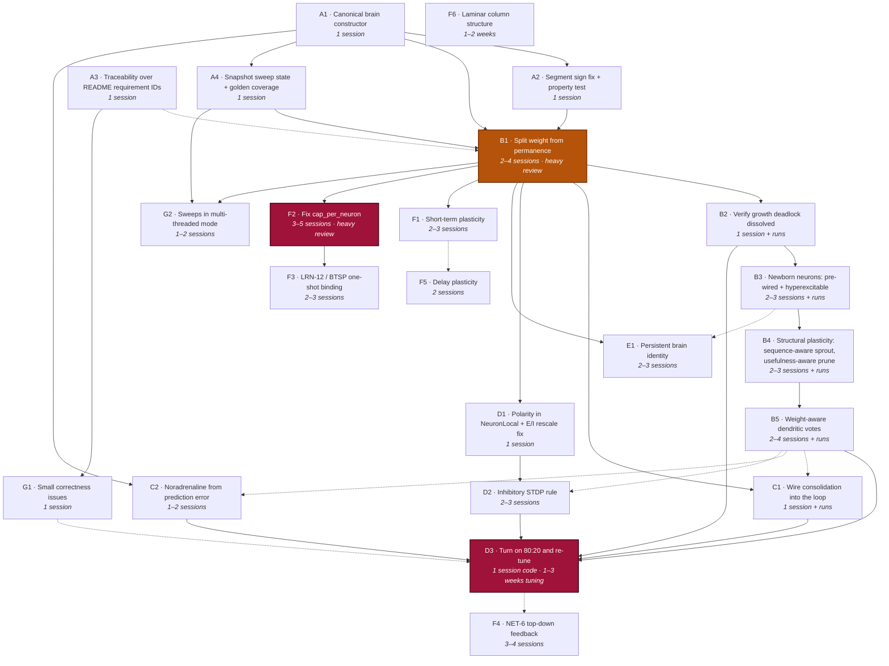

# Remediation plan — review findings, ordered

Companion to `README.md`. The findings themselves live in the README (§13.12 items 11–14 for the
code defects, item 10 for the growth deadlock, §13.13 for the literature gaps); this file is only
the *plan* — what order to do them in, what each one costs, and a ready-to-paste prompt per item.

Written 2026-09-13 after a full review of §2 against §3–§9 against the shipped core.

**One item = one Claude Code session.** Where the original estimate said "2–4 sessions", that is
one long session, not a split. Each prompt below is self-contained and assumes a fresh session with
no memory of this review.

---

## Contents

| § | Section |
|---|---|
| 1 | [How to use this](#1-how-to-use-this) |
| 2 | [Dependency chart](#2-dependency-chart) |
| 3 | [The items, in order](#3-the-items-in-order) |
| 4 | [House rules](#4-house-rules) — the standing context every session needs |
| 5 | [Prompts](#5-prompts) |

---

## 1. How to use this

Work top to bottom. Within a phase, items are independent unless the chart says otherwise; across
phases, the gates are real.

Two scheduling facts that shape everything:

- **Coding time compresses ~3–5× with an LLM. Experiment time does not compress at all.** The
  bottleneck moves to wall-clock simulation and your judgment about what a result means. Estimates
  below separate the two.
- **Phase A is a closing window.** Those fixes produce no golden-raster churn *only* while every
  network runs `excitatoryFraction: 1.0`. Once D3 lands, they become expensive. Do them first.

Where an item is tuning-bound, parallelise the trials across cores — independent seeds are
embarrassingly parallel and that is the only real speedup available there.

---

## 2. Dependency chart



**Solid arrow** = hard dependency. **Dotted arrow** = strongly preferred order, not a blocker.

**B1 is the critical path.** It gates VAL-4 re-baselining, NET-10 (invariant 10), consolidation's
downscale semantics, and the `cap_per_neuron` work. Nothing downstream of it is worth starting first.

**A4 sits directly in front of B1** (added 2026-09-13 after verifying A1–A3). B1's own "done when"
requires snapshot continuation to stay bit-identical, and that does not hold today once periodic
sweeps are live — so without A4, B1 cannot tell its own bugs from a pre-existing one.

**B3 exists because B1 was necessary but not sufficient** (added 2026-09-14, while B2 was still
running). Splitting weight from permanence opened one of three locks on a newborn neuron; the other
two — sprouting requires *both* ends to have already fired, and every internal synapse lands on a
dendritic segment that can prime a cell but never fire it — are still shut. B3 implements the
biological answer instead: a newborn arrives already wired to whatever is active, and temporarily
easy to excite. It gates D3 because the canonical brain has growth on, and is strongly preferred
before E1, since a persistent brain that cannot grow contradicts invariant 10.

**B4 exists because B3's own VAL-4 battery surfaced a cost that predates B3 — and predates growth
entirely** (added 2026-09-14, immediately after B3 closed). Condition C (structural plasticity
alone, no growth) regressed from Phase A's 13.04% to 6.40% at the point B1 landed: B1 made every
sprout connected and STDP-visible from birth (the fix growth genuinely needed), but nothing about
*where* or *how* `StructuralPlasticity::sprout` places a synapse was designed for that — it was
tuned when a fresh sprout was inert until potentiated, and is now live from the first sweep. README
§13.12 item 10's 2026-09-14 diagnosis update names four specific mechanisms sharing that one root
cause. It gates D3 for the same reason B3 does: D3's re-tune should start from a structural
plasticity mechanism that has been fixed, not one with a known, already-measured drag baked in —
tuning around it now would fit parameters to a defect rather than to the network's actual behaviour.

**B5 exists because B4's own value search showed sprouting cannot help while dendritic votes
ignore weight** (added 2026-09-15, as B4 closed). With every B4 value and STDP searched together,
the best structural-plasticity configuration reached 15.58% on confirmation seeds, against 16.63%
for the same configuration with sprouting disabled. The search chose the lowest STDP learning rate
and a high unsilence weight, so few sprouts ever vote, and with sprouting off STDP changed nothing at
all. A segment counts each delivery as ±1 whatever the synapse's weight, so B4's silent gate could
only be an on/off switch. B5 gives each delivery a capped, weight-scaled contribution. It gates D3
hard: a weighted vote changes what every segment threshold responds to, and tuning the 80:20
network first would mean tuning twice. It is strongly preferred before C1, C2 and D2, because each
of those changes or learns weights, and whether weight reaches predictions changes what each of
them does.

**Phase G is housekeeping** found during the same verification. G1 needs only A3 and is best done
before D3, which is when vetoed segments first become visible. G2 waits for A4 and B1, because both
change the sweeps it has to wire up.

**D3 and F2 are the two risk items.** D3 because its cost is tuning, not code. F2 because it is a
wide change to the arena addressing scheme that cross-partition routing depends on.

---

## 3. The items, in order

| ID | Item | Gated by | Claude Code | Wall-clock / your time |
|---|---|---|---|---|
| **A1** | Canonical "everything on" brain constructor | — | 1 session | — |
| **A2** | Segment sign fix + segment-configured Dale property test | A1 | 1 session | 1 design call |
| **A3** | Traceability check over README requirement IDs | — | 1 session | — |
| **A4** | Snapshot every sweep's state (RUN-9a) + a golden scenario that can see the engine | A1 | 1 session | — |
| **B1** | Split `weight` from `permanence` | A1, A2, A4 | 2–4 sessions | **heavy review** |
| **B2** | Verify the NET-10 growth deadlock is dissolved | B1 | 1 session | ~1 hour of runs |
| **B3** | Newborn neurons arrive pre-wired to active inputs and hyperexcitable, then mature or die | B2 | 2–3 sessions | **1 design call** + hours of runs |
| **B4** | Structural plasticity sprouts by sequence and prunes by usefulness, not just co-activity/permanence | B3 | 2–3 sessions | **3 design calls** + hours of runs |
| **B5** | Dendritic votes weigh each synapse by its weight, capped, so a new synapse earns influence gradually | B4 | 2–4 sessions | **3 design calls** + ~1–2 days of runs |
| **C1** | Wire `runConsolidation` into the streaming loop | B1 | 1 session | hours of runs |
| **C2** | Drive noradrenaline from prediction error | A1 | 1–2 sessions | 1 design call |
| **D1** | `polarity` in `NeuronLocal` + E/I-aware `rescale_one` | B1 | 1 session | — |
| **D2** | Inhibitory STDP rule (Vogels-style) + ablation test | D1 | 2–3 sessions | — |
| **D3** | Turn on 80:20 and re-tune | B2, B5, C1, C2, D2 | 1 session | **1–3 weeks tuning** |
| **E1** | Persistent named brain that resumes | B1 | 2–3 sessions | — |
| **F1** | Short-term plasticity (Tsodyks–Markram) | B1 | 2–3 sessions | tuning |
| **F2** | Fix `cap_per_neuron`'s single-constant addressing | B1 | 3–5 sessions | **heavy review** |
| **F3** | LRN-12 / BTSP one-shot binding | F2 | 2–3 sessions | experiments |
| **F4** | NET-6 top-down feedback carrying predictions | D3 (pref.) | 3–4 sessions | experiments |
| **F5** | Delay plasticity | F1 (pref.) | 2 sessions | experiments |
| **F6** | Laminar column structure | — | 1–2 weeks | experiments |
| **G1** | Small correctness issues: ENG-5 false gap, stale deferrals, vetoed segments invisible | A3 | 1 session | — |
| **G2** | Periodic sweeps silently inert in multi-threaded mode | A4, B1 | 1–2 sessions | — |

**Phase totals:** A ≈ 1–1.5 days · B ≈ 3–5 days · C ≈ 1–2 days · D ≈ 1 week code + 1–3 weeks
calendar · E+F ≈ 3–4 weeks code + 2+ months calendar · G ≈ 1–2 days.

---

## 4. House rules

Standing context for every session. The prompts reference this section rather than repeating it.

- **Read `README.md` first.** It is the canonical spec: §2 is the evidence base, §3–§9 the numbered
  requirements, §10 the ten invariants, §12 decisions taken, §12a open questions, §13 prior art.
  Requirement IDs (`NEU-*`, `SYN-*`, `LRN-*`, `NET-*`, `RUN-*`, `IO-*`, `ENG-*`, `OBS-*`, `VAL-*`)
  are the shared vocabulary between the doc, the specs and the code — cite them, don't restate them.
- **Per-slice specs** live under `.claude/scratch/<slice>/{requirements,design}.md`.
- **Invariants are not trade-offs** (§10). Locality, no global gradient, sign on the neuron, enforced
  sparsity, real delay, learned topology, no train/infer split, modality-agnostic core, serialisable
  state, grown capacity. Violating one is a defect.
- **Determinism is a hard requirement** (RUN-3, RUN-9a). No ambient randomness; draw via
  `rng::derive_stream(seed, entity_id, purpose, tick)`. Results must be bit-identical across thread
  counts and across snapshot/restore.
- **Test tiers:** `npm run test:fast` (cargo test + clippy + build + typecheck + TS fast) on every
  change; `npm run test:slow` (release `--ignored`, golden rasters, TS slow, traceability) before
  declaring done. Golden rasters regenerate with `npm run test:golden:regen` — **only** when you can
  explain why the behaviour legitimately changed.
- **Statistical assertions are multi-seed** (VAL-6). Ablation tests are required for load-bearing
  mechanisms (VAL-9): disable it, assert the property *fails*.
- **Honest reporting** (README Requirement 13.6/8, visible throughout §11 and §13.12): report what
  did not work, by sub-part, in the doc itself. A negative result recorded precisely is a deliverable.
- **Zero AI/ML dependencies** (ENG-5/6), Rust core ≈ `rayon` only, TS shell nothing at runtime.
- **When you finish, update `README.md`** — the relevant §11 phase status and/or §13.12 item — in the
  document's existing voice. Then update this file's status for the item.
- **Log the Status table row for the item you're working on AS YOU GO, not only at the end** — set
  `Status` to `in progress` and record a start timestamp the moment you begin, then update the
  `Duration` cell again at natural checkpoints (finishing a design call, kicking off a long
  background run, wrapping up). Get the start time from the user or an actual `date`/logged
  timestamp — **never infer it from filesystem metadata** (a working directory's creation time, a
  file's mtime): A2's own footnote records a ~30-minute error from exactly that shortcut. This
  matters most for items with real wall-clock cost (background experiment runs, multi-hour
  batteries) — B2's and B3's own Status rows are both measured this way, and the discipline is what
  makes those numbers trustworthy enough for a future session's time estimates to lean on, instead
  of every item's cost being reconstructed after the fact from guesswork.

---

## 5. Prompts

### A1 — Canonical "everything on" brain constructor

```
Read README.md §1 (vision), §10 (invariants), §11 Phase 5/7 status, and PLAN.md §4 (house rules).

THE PROBLEM. Every experiment in this repo builds a fresh network from a config object, runs it,
and throws it away — that is the shape of a training run, which README §1.1 explicitly rejects
("a brain that grows, not a model that is trained"). Worse, it is a diagnostic blind spot: because
each experiment hand-picks which mechanisms to switch on, the paths nobody picks are never
exercised. That is exactly how README §13.12 items 11, 13 and 14 happened — a segment sign bug, a
consolidation path with zero callers, three dead neuromodulator channels, and an 80:20 Dale ratio
that no run has ever used, all sitting in a tree with a strong test suite.

THE TASK. Build one canonical brain constructor: a single place that wires every mechanism the core
has, live, by default. Model it on packages/io/src/milestone/charPrediction.ts, which is the closest
thing that exists today — but that file hardcodes `excitatoryFraction: 1.0`, never calls
runConsolidation, and only ever injects DOPAMINE.

Include, on by default: segments (NEU-5/6), inhibition (NET-2), STDP + eligibility + three-factor
(LRN-2/3/4), homeostatic scaling (LRN-6), intrinsic homeostasis (NEU-7), segment threshold
homeostasis, structural plasticity (LRN-7), growth (NET-10), spike-frequency adaptation (NEU-8),
predictive learning (LRN-8), probes and metrics (OBS-1/2/3).

Decide and justify where it lives: a new module in packages/io, or the TS shell in packages/brain.
It must not add a modality-aware branch to the core (invariant 8).

Then add a standing test that runs it for N ticks and asserts only what is TRUE TODAY — sparsity
stays near target, permanence stays in [0,1], no panic, snapshot round-trips. Do not assert things
the known defects would fail. The point is a fixture that later items tighten as each fix lands.

DONE WHEN. One constructor, one standing test, `npm run test:fast` and `npm run test:slow` green,
and a short note in README §11 recording what the constructor switches on and what it revealed.
If turning everything on at once surfaces new breakage, that is a finding — record it, do not
silently disable the mechanism that broke.
```

---

### A2 — Segment sign fix + segment-configured Dale property test

```
Read README.md §2.3 (dendrites), §2.4 (inhibition), §10 invariant 3, §13.12 item 11, and §13.13(a).
Then PLAN.md §4.

THE FINDING (README §13.12 item 11a/11b). Dale's principle is correctly enforced on the somatic
path — crates/brain-core/src/scheduler.rs's `deliver` computes
`signed_current = sign * permanence` (~line 999). It is silently dropped on the dendritic path:
`Scheduler::apply_local_effect` (scheduler.rs ~line 897) receives that `signed_current` and, in its
`is_dendritic` branch, does `self.segment_counts[composite] += 1.0` — ignoring both the sign and
the magnitude. So an INHIBITORY presynaptic neuron RAISES a dendritic segment's coincidence count
and makes the target cell more likely to fire.

This inverts one of the best-established motifs in cortex: SST interneurons target distal dendrites
specifically to veto dendritic spikes (§13.13(a)). It is the clearest invariant-3 violation in the
tree.

WHY THE TEST SUITE MISSES IT. crates/brain-core/tests/invariants.rs's
`synapse_sign_always_matches_its_source_neurons_polarity` (~line 111) allocates its synapse with
`target_segment = 0` and never calls `with_segments`, so it exercises the somatic path only. VAL-8's
property is asserted exactly where it already holds.

THE TASK.
1. Fix the sign. There is a real design call here — make it explicitly and record the reasoning:
   does an inhibitory delivery SUBTRACT from the coincidence count (dendritic veto, closest to the
   SST biology), or accumulate into a separate inhibitory channel the segment model consults? The
   cheap correct version is the former. Note that `segment_counts` is already f32 and snapshotted,
   so neither option needs a format bump.
2. Separately decide, and record, whether the count should also weight by permanence rather than
   `1.0`. HTM's binary reading is defensible — but say which you chose and why, because right now
   permanence means "graded current" at the soma and "nothing at all" at the segment.
3. Extend the property test: a second case that configures segments via `with_segments`, routes a
   synapse to a non-zero `target_segment`, and asserts the sign reaches the segment correctly.

TIMING MATTERS. Every network in this repo currently runs `excitatoryFraction: 1.0`
(packages/io/src/milestone/charPrediction.ts ~line 221 and every test), so this fix should change
NO golden raster. If a raster does change, stop and investigate — it means something is already
running a mixed population and you have found a second bug.

DONE WHEN. Fix in, property test covering the dendritic path, `npm run test:fast` and
`npm run test:slow` green with golden rasters unchanged, and README §13.12 item 11 updated to record
the fix and the two design calls.
```

---

### A3 — Traceability check over README requirement IDs

```
Read README.md VAL-10 (§9), §13.12 item 14, and PLAN.md §4.

THE FINDING (README §13.12 item 14). scripts/check-traceability.mjs already exists and works — but
it covers a DIFFERENT ID space. It parses numbered acceptance criteria ("Requirement N.M") out of
.claude/scratch/*/requirements.md and checks that some test cites each one. It does not know about
README requirement IDs at all (NEU-*, SYN-*, LRN-*, NET-*, RUN-*, IO-*, ENG-*, OBS-*, VAL-*, VIZ-*).

The concrete miss: RUN-9b ("restore then expand", a MUST) is genuinely implemented and genuinely
tested — crates/brain-core/tests/structural_and_growth.rs's
`a_restored_network_can_grow_and_keep_learning_without_discarding_prior_learning` is exactly RUN-9b
— but the test cites no requirement ID, so nothing connects them. A reader has to grep to find out
which README requirements have tests, which have code, and which are simply unbuilt.

THE TASK.
1. Extend the checker (or add a sibling script — your call, justify it) to build an inventory over
   README requirement IDs: for each ID, does the codebase mention it, and does any test mention it?
2. Report three buckets: cited by a test / mentioned in code but no test / not mentioned anywhere.
3. Add a deferral list in the same spirit as the existing script's, so DELIBERATE gaps stay visible
   and reviewed rather than silently masked. Seed it from README §13.12 item 14: NET-6, NET-8,
   NET-11 and LRN-12 are known-unbuilt, not oversights.
4. Annotate the RUN-9b test with its requirement ID. Sweep for other obvious uncited cases while
   you are there, but do not invent citations — if a test does not actually demonstrate a
   requirement, leave it uncited and list it.
5. Wire it into `npm run test:slow` alongside the existing check.

CONSTRAINTS. No new runtime dependency (ENG-6) — Node built-ins only, matching the existing script.

DONE WHEN. The script runs, the three buckets match what README §13.12 item 14 claims (or you have
corrected the README where it is wrong), and `npm run test:slow` is green.
```

---

### A4 — Snapshot every sweep's state (RUN-9a) + a golden scenario that can see the engine

```
Read README.md RUN-9, RUN-9a, RUN-9c, VAL-7, §10 invariant 9, and §11 Phase 7 status's A1 entry
(the paragraph ending "an accepted, pre-existing gap shared by every homeostasis-style sweep in this
tree"). Then PLAN.md §4.

THE FINDING (verification of A1–A3, 2026-09-13). RUN-9a says a run that is snapshotted, restored and
continued must be bit-identical to an uninterrupted run. That does NOT hold once periodic sweeps are
live. Measured on the canonical brain (packages/io/src/canonicalBrain.ts, seed 1n, the same
stimulation loop as packages/io/test/canonicalBrain.test.ts including recordGrowthActivation),
comparing each tick's sorted spiked set over 400 ticks:

  two uninterrupted runs     -> identical (so this is not a determinism failure)
  snapshot at 50, 100, 200   -> identical for all 400 ticks
  snapshot at 137            -> diverges at tick 352 (14 of 263 post-restore ticks differ)
  snapshot at 263            -> diverges at tick 376 (7 of 137 post-restore ticks differ)

The canonical brain's sweep intervals are 50 (homeostatic scaling, intrinsic homeostasis, structural
plasticity) and 100 (segment threshold homeostasis). Snapshots on a multiple of both resume exactly;
snapshots between them do not.

THE CAUSE. Every periodic sweep keeps its own scheduling state, and none of it is in the snapshot:
- crates/brain-core/src/plasticity/homeostatic.rs: `last_applied_at` on HomeostaticScaling
  (~line 27), IntrinsicHomeostasis (~119), SegmentThresholdHomeostasis (~189) and
  InhibitionHomeostasis (~270), plus InhibitionHomeostasis's own rate and k estimates.
- crates/brain-core/src/plasticity/structural.rs: `last_swept_at` (~line 75) and the per-neuron
  `activity_streak` (~line 79).
On restore these reset to zero, so the `tick < last + interval` gate fires on the first tick after
restore instead of at the scheduled boundary, and the schedule's phase stays shifted for the rest of
the run. Treat this list as a starting point: audit everything the Scheduler owns for state that
changes between ticks, and do not assume the list is complete.

WHY NOBODY CAUGHT IT.
- The restore path documents the omission as deliberate (crates/brain-napi/src/lib.rs ~lines 1777
  and 1800), and A1 recorded it in README §11 as "accepted". No README decision accepts it, and
  invariant 9 says anything unserialisable in the simulation is a design defect.
- The canonical brain's snapshot test (canonicalBrain.test.ts ~line 129) snapshots at tick 50,
  exactly on a sweep boundary, and only checks tick and neuron count after restore, never
  continuation.
- The golden raster suite (crates/brain-core/tests/golden.rs) has ONE scenario: a small hand-wired
  network with no segments, plasticity, homeostasis or structural plasticity. It cannot see this, and
  it will not be able to see B1's changes either.

THE TASK. Three parts, one session.

1. Serialise every sweep's scheduling state. Bump FORMAT_VERSION 7 -> 8 in
   crates/brain-core/src/snapshot.rs, following the six prior bumps' migration pattern and the
   versioned fixture convention under crates/brain-core/tests/fixtures/. For a v7 snapshot, the best
   available migration is probably to reconstruct each `last_applied_at` as the most recent multiple
   of its interval at or below the snapshot tick — but verify that against the gate rather than
   trusting it, and note it is WRONG for any run that called runConsolidation, because
   `StructuralPlasticity::force_sweep` advances `last_swept_at` off-schedule. State plainly which
   state cannot be reconstructed (activity streaks, estimates) and what the migration does instead.
   Correct the "not part of the snapshot payload" comments in lib.rs's restore path.

2. Add tests that would have caught it, and prove they do:
   - In canonicalBrain.test.ts, beside the existing tick-50 test (keep it), snapshot at ticks that
     are NOT multiples of any sweep interval (e.g. 137 and 263), restore, continue, and assert the
     per-tick sorted spiked set matches an uninterrupted run on every remaining tick.
   - In crates/brain-core/tests/invariants.rs, extend
     `snapshot_round_trip_is_the_identity_function_on_state` (~line 209), or add a sibling, to cover
     continuation with sweeps configured and the snapshot tick drawn by the generator.
   - Run both against the UNFIXED code first and confirm they fail. A test that has never been seen
     to fail has not been shown to detect anything.

3. Add a second golden scenario to crates/brain-core/tests/golden.rs that exercises segments, STDP,
   homeostatic scaling, intrinsic and segment threshold homeostasis, and structural plasticity:
   all-excitatory, deterministic, small enough to store. Generating a NEW fixture is a legitimate use
   of `npm run test:golden:regen` — say so in the commit, and confirm the existing scenario's fixture
   is byte-for-byte unchanged.

CONSTRAINTS. Determinism (RUN-3). Snapshot size tracks live structure (RUN-9c): per-neuron
`activity_streak` is fine, scratch buffers are not state and must not be serialised. Partitioned mode
refuses to snapshot today (lib.rs `snapshot_bytes`), so this item is single-threaded only — do not
attempt partitioned snapshots. char-prediction.slow.test.ts is a VAL-4 test; if you are unsure
whether VAL-4 tuning is still in progress, ask before running it.

DONE WHEN. Off-boundary continuation is bit-identical in both the TypeScript and Rust tests (and both
were seen to fail before the fix), v7 snapshots still restore, the second golden scenario exists, the
fast and slow tiers are green, and README's §11 A1 note and RUN-9a's status say the gap is closed
rather than accepted.
```

---

### B1 — Split `weight` from `permanence` ⚠️ critical path

```
Read README.md SYN-1, SYN-3, SYN-4, LRN-6, LRN-7 (§3–§4); §2.5; §13.12 items 10 and 12; and
§12a item 5(c). Then PLAN.md §4. This is the largest change in the plan — read all of it before
writing code.

THE FINDING (README §13.12 item 12). There is no `weight` field. `SynapseArena`
(crates/brain-core/src/synapse.rs) holds `permanence` and transmission is `sign * permanence`
(scheduler.rs ~line 999). SYN-1 lists "weight/permanence" as one field and that is what shipped.
But SYN-3's permanence is STRUCTURAL (is this synapse connected) and §2.5's weight is EFFICACY
(how much current does it pass). Aliasing them onto one f32 causes three things:

1. A synapse just above `connection_threshold` transmits at roughly half strength. "Firmly
   connected but weak" and "tentative but strong" are both inexpressible.
2. HomeostaticScaling silently performs structural plasticity. `rescale_one`
   (crates/brain-core/src/plasticity/homeostatic.rs ~line 67) multiplies every incoming permanence
   by `target_total / total` with no awareness of `connection_threshold` — so a downscaling sweep
   DISCONNECTS synapses wholesale and an upscaling sweep CONNECTS previously-potential ones. LRN-6,
   SYN-3 and LRN-7 are three writers of one variable.
3. Consolidation's global downscale (LRN-10) is the same operation at a stricter target, so "sleep"
   prunes structurally as a side effect.

AND IT BLOCKS NET-10 OUTRIGHT (README §13.12 item 10's 2026-09-13 addendum). Because permanence is
also the gate, "below threshold" means "invisible to plasticity": `deliver` skips sub-threshold
synapses with `continue` BEFORE calling `on_delivery`, and `on_post_spike`'s STDP is gated on
`last_active`, which only delivery writes. So a provisional synapse can never be potentiated by
activity — which removes the one remedy a bootstrapping deadlock normally has, and is why a neuron
added by growth can never acquire a synapse in either direction. Splitting the fields dissolves that
deadlock as a side effect.

THE TASK. Add a separate `weight` to the synapse representation.

Surface to touch (grep before assuming this list is complete):
- crates/brain-core/src/synapse.rs — `SynapseArena` fields, `SynapseArenaViewMut`/`OffsetSlice`,
  `insert`, `split_views_mut`, `incoming`, `occupied_in_block`
- crates/brain-core/src/scheduler.rs — `deliver` transmits weight, not permanence; the
  `connection_threshold` gate still reads permanence
- crates/brain-core/src/plasticity/ — homeostatic.rs scales WEIGHT; structural.rs prunes/sprouts on
  PERMANENCE; three_factor.rs and predictive.rs need an explicit decision (below)
- crates/brain-core/src/snapshot.rs — FORMAT_VERSION is 8 after A4; bump to 9 with a migration that
  restores older snapshots by deriving weight from permanence. There are seven prior format bumps in
  that file to copy the pattern from, and a versioned golden fixture convention under tests/fixtures/
- crates/brain-napi/src/lib.rs + index.d.ts — FFI surface
- packages/brain, packages/io, packages/viz — anything reading permanence as a strength

THE DESIGN DECISION, MADE EXPLICITLY AND RECORDED. What does STDP move — weight, permanence, or
both on different timescales? The biologically motivated answer is weight fast (efficacy, per
spike-pair) and permanence slow (structural consolidation, following sustained weight). Propose your
answer with reasoning BEFORE implementing, and record it in README §12 as a numbered decision.

KNOW BEFORE YOU START (from verifying A1–A3).
- Use A4's second golden scenario as your behavioural evidence. The original three-neuron scenario
  has no segments, plasticity or homeostasis, so "it didn't move" tells you nothing about this change.
- With threadCount > 1, homeostatic scaling and every other periodic sweep currently never runs
  (PLAN.md G2). A partitioned test passing is NOT evidence your scaling change is correct — verify
  scaling single-threaded.

CONSTRAINTS. Memory cost is +4 bytes/synapse — at the 50M-synapse target that is ~+200MB on the
measured ~1.46GB (README §12a item 1); state the new figure. Determinism must hold (RUN-3) and
snapshot continuation must stay bit-identical (RUN-9a), including A4's off-boundary tests. Golden
rasters WILL change — regenerate them only with a written explanation of why the behaviour
legitimately differs.

DONE WHEN. Both fields exist and are independently exercised, v7 and v8 snapshots still restore, the full
fast and slow tiers pass, VAL-4 is re-measured on the 5-seed protocol and the new number reported
honestly whether it improved or not, and README §13.12 item 12 plus §11's phase status record the
outcome.
```

---

### B2 — Verify the NET-10 growth deadlock is dissolved

```
Read README.md §13.12 item 10 in full (including its 2026-09-13 addendum), NET-10, invariant 10,
and PLAN.md §4. Assumes B1 has landed.

THE FINDING. Developmental growth adds no functional capacity, for a structural reason:

- `apply_growth` (crates/brain-core/src/growth.rs ~line 211) allocates a neuron from a NeuronSpec
  and nothing else — zero synapses, by NET-10's explicit design.
- `StructuralPlasticity::sprout` (crates/brain-core/src/plasticity/structural.rs ~lines 145 and 154)
  requires `activity_streak >= min_activity_streak` for BOTH the source and the target.
- `update_activity_streaks` (structural.rs ~line 105) drives that streak purely from
  `NeuronArena::last_spike` — real spikes only.

So: no synapses → no current → no spike → streak pinned at 0 → ineligible as source AND target →
never wired. LRN-8's burst-sprout path (plasticity/predictive.rs ~lines 198–225) is closed for the
same reason. `reclaim_unused_neurons` (structural.rs ~line 175) exempts never-fired neurons, so
grown neurons are also immortal, and `apply_growth` reserves a full `cap_per_neuron` block for each.

The empirical proof is already in the repo: README §13.12 item 10's conditions B/C/D/E/F are
BIT-FOR-BIT identical across every growth pace and sprout restriction tried — growth changes nothing
because grown neurons are invisible to everything. scripts/investigate-growth-regression.ts is the
harness that produced that table.

THE TASK. B1 should have dissolved this: a grown neuron can now be sprouted a structurally
connected, near-zero-weight synapse that transmits a trickle, is visible to STDP, and survives or is
pruned on its own merits.

1. Re-run the six conditions from item 10's table using the existing script, same protocol (5 seeds,
   15,000-character corpus slice). Parallelise the seeds across cores.
2. Confirm B/C/D/E/F are no longer bit-identical — that is the specific signal that growth now does
   something. Report per-condition numbers in item 10's existing table format.
3. Instrument whether grown neurons actually acquire synapses and fire: live neuron count, sprouted
   count onto grown indices, and first-spike tick for grown neurons.
4. If they still do not wire, diagnose why rather than tuning around it. Candidates: the sprout
   eligibility gate still requires a streak the neuron cannot build (a one-time grace for a neuron
   with zero synapses and no prior spike is the surgical option item 10 already scoped); or the
   near-zero weight is below what the coincidence/integration path can act on at all.
5. Separately, decide whether `reclaim_unused_neurons`' never-fired exemption is still right now
   that grown neurons CAN wire. A permanently-inert grown neuron consuming a ceiling slot and a
   synapse block is a real cost.

DONE WHEN. The six conditions are re-measured and reported honestly (including "still deadlocked"
if that is the answer), README §13.12 item 10 carries the new table, and §11's phase status says
whether NET-10 and invariant 10 are now actually met.
```

---

### B3 — Newborn neurons: pre-wired to active inputs, hyperexcitable, then mature or die

```
Read README.md NET-7, NET-10, NET-11, LRN-7, NEU-6, NEU-7, SYN-3, §10 invariants 1, 4 and 10,
§12 decision 11 (B1's weight/permanence split), and ALL of §13.12 item 10 including its
2026-09-13 addendum and whatever B2 recorded there. Then PLAN.md §4. Assumes B2 has landed.

WHY THIS ITEM EXISTS. B1 split weight from permanence, and README §13.12 items 10 and 12 predicted
that would "dissolve the growth deadlock as a side effect". It did not: B2's re-run still shows
grown neurons that never fire. That prediction was wrong, and the reason is that a newborn neuron is
behind THREE locks, not one. B1 opened only the third:

1. ELIGIBILITY LOCK. `StructuralPlasticity::sprout` (crates/brain-core/src/plasticity/structural.rs,
   the two `activity_streak < min_activity_streak` checks, ~lines 162 and 171) requires BOTH the
   source and the target to have fired for several consecutive sweeps. A neuron born with zero
   synapses never fires, so it is never eligible as either. LRN-8's burst sprouting
   (plasticity/predictive.rs) has the same shape: the source must be recently active, and the
   target must be the neuron that just fired.
2. WIRING-LOCATION LOCK. In any network with dendritic segments configured — which includes the
   canonical brain and charPrediction.ts — every internal synapse lands on a DENDRITIC segment.
   `GraphBuilder::connect` draws segment 0..segmentsPerNeuron (graph.rs ~line 199–203) and `sprout`
   hard-codes segment 0 (structural.rs ~line 179). Dendritic input can only prime a cell (NEU-6), it
   can never make it fire; only synapses targeting `segment::FEEDFORWARD_SEGMENT` (u32::MAX,
   segment.rs ~line 92; see `apply_local_effect`'s `is_dendritic` check, scheduler.rs ~line 1098)
   drive the soma. So in these networks the ONLY thing that ever makes a neuron fire is external
   stimulation — and grown neurons are never stimulated. Even a fully wired newborn would stay
   silent under today's rules.
3. INVISIBLE-SYNAPSE LOCK — opened by B1. A new synapse can now be structurally connected with
   near-zero weight and still be seen and strengthened by STDP.

Also still true after B1: `reclaim_unused_neurons` (structural.rs ~line 192) exempts never-fired
neurons, so dead-on-arrival newborns are immortal and keep their ceiling slot and synapse block.

THE BIOLOGY TO FOLLOW. README §13.12 item 10's closing paragraph already names it under NET-11:
exuberant activity-independent synaptogenesis plus newborn intrinsic hyperexcitability. Concretely,
from adult hippocampal neurogenesis — the best-studied case of neurons joining a working circuit:
- Inputs first, outputs later, attached to what is already active: dendrites of new neurons first
  contact PRE-EXISTING presynaptic boutons already synapsing on other cells (Toni et al., Nat
  Neurosci 2007).
- Temporarily easy to excite and quick to learn: young granule cells have distinct membrane
  properties and enhanced LTP (Schmidt-Hieber, Jonas & Bischofberger, Nature 2004), and raising a
  newborn's intrinsic excitability measurably improves its integration (Lin et al., Neuron 2010).
- Use it or lose it: many newborns die, and survival depends on their own synaptic input during a
  critical window (Tashiro et al., Nature 2006).
Honesty note for the README: adult neurogenesis is a hippocampal phenomenon, not a neocortical one.
What is borrowed is the integration strategy, not a claim that cortex grows neurons in adulthood.

WHERE A NEWBORN IS CREATED TODAY (verify, then change what the design below requires):
- Arena index: `NeuronArena::allocate` (arena.rs ~line 182) reuses a freed slot if one exists,
  otherwise appends. In practice newborns are appended past the original population.
- Coordinates: every newborn gets the SAME point, `coords_origin` (scheduler.rs growth block,
  ~line 1462). Distance-based wiring cannot tell newborns apart or place them near anything.
- Column: the Rust ColumnRegistry's last column is extended (brain-napi lib.rs ~line 1453), but the
  TypeScript ColumnHandle's range is fixed at construction, so newborns are never stimulated or
  decoded.
- Inhibition: FixedNeighbourhoods groups by contiguous index, so appended newborns form their OWN
  competition group with the same k. Canonical brain: 50 newborns competing for k = 3 slots.
  charPrediction.ts: up to 400 newborns competing for k = 64 slots — 16%, eight times the 2% target.
  Hyperexcitable newborns in an over-generous group will flood it.

THE TASK. Make a newborn neuron integrate, using the three-part biological strategy.

1. INPUTS AT BIRTH (the design call — propose it, get the user's agreement, then build it).
   Recommended default: wire each newborn's inputs from a sparse, deterministic random subset of the
   neurons that were active in a short window before the growth event, targeting
   FEEDFORWARD_SEGMENT, structurally connected (permanence at/above threshold) with a modest weight.
   Reasoning: growth fires because the population could not represent what it was just seeing, so
   the neurons active at that moment ARE the thing that needed more capacity. The newborn starts
   selective for exactly that. This is scheduler-invoked wiring outside the PlasticityRule
   interface — the same precedent `predictive.rs` already sets and README §12a item 5(b) says does
   not violate invariant 1.
   Alternatives to weigh and reject explicitly, with reasons: random by distance (activity
   independent, but newborns share one coordinate so it is meaningless without fixing placement,
   and they would represent noise); cloning an existing neuron's inputs (the copy may never
   diverge, since ties break deterministically by index).
   Details that must be settled: window length relative to when `should_grow` actually fires (the
   saturation signal arrives from TypeScript via recordGrowthActivation and the policy may decide
   later, so measure how well the chosen inputs overlap the pattern that caused the collision);
   subset size and weight such that a realistic fraction of those inputs re-firing crosses the
   newborn's LOWERED threshold; and every newborn drawing a DIFFERENT subset via
   rng::derive_stream(seed, newborn_index, purpose, tick) so newborns do not duplicate each other.
2. PLACEMENT. Give each newborn coordinates derived from its inputs (for example their centroid,
   plus deterministic jitter) instead of the shared coords_origin, so later distance-based
   mechanisms treat it as local to what it represents. Keep appended indices — do NOT redesign
   inhibition here — but make sure the newborn group's sparsity stays at target (k relative to
   group size) and record what you chose. Membership-based inhibition, if needed, belongs in F6.
3. OUTPUTS LATER. No outgoing synapses at birth. Once a newborn fires, its activity streak builds
   and LRN-7/LRN-8 treat it like any other neuron. Note that sprouted outputs land on dendritic
   segment 0 of their targets, so a mature newborn contributes predictive CONTEXT to the existing
   population — that is its route to affecting VAL-4. Confirm it actually happens.
4. HYPEREXCITABILITY THAT MATURES. A newborn starts with a lowered firing threshold that relaxes to
   normal over a maturation window. Prefer an explicit per-neuron birth tick over relying on
   IntrinsicHomeostasis (NEU-7) to raise it: NEU-7 may be disabled, and coupling to its tuning makes
   the window invisible. A birth tick is new per-neuron state, so it goes in the snapshot —
   FORMAT_VERSION 9 -> 10 with a migration (existing neurons are "mature"). Elevated plasticity for
   newborns is NET-11's local half; implement it only if integration fails without it, and record
   the decision either way.
5. SURVIVAL. At the end of the maturation window, a newborn that has not integrated (define it —
   e.g. fired at least N times and holds at least one outgoing synapse) is reclaimed, replacing the
   never-fired exemption FOR NEWBORNS ONLY. Before relying on reclaim, VERIFY what freeing a neuron
   actually does: `NeuronArena::free` (arena.rs ~line 218) flips `alive` and pushes to the free
   list but does not touch synapses, and a static read found no liveness check in delivery,
   integration or pruning. If a freed slot keeps its old incoming and outgoing synapses — and the
   next newborn reuses that slot via the free list — the newborn would inherit a dead neuron's
   wiring. Confirm or rule that out with a test before building on it, and fix it if real.

TESTS.
- A focused Rust integration test: a driven network grows newborns; assert that newborns FIRE within
  the window, acquire at least one outgoing synapse, that non-integrating ones are reclaimed, and
  that reclaimed slots do not leak wiring into the next occupant.
- VAL-9 ablations: without FEEDFORWARD input placement nothing fires; without hyperexcitability
  measurably fewer newborns integrate. A mechanism that cannot be shown to matter is not yet
  load-bearing.
- Determinism (RUN-3) with growth on, and A4-style off-boundary snapshot continuation with newborns
  mid-maturation (canonicalBrain.test.ts has the pattern).
- Re-run B2's harness (scripts/investigate-growth-regression.ts): grown neurons should now have a
  firstGrownSpikeTick, synapsesFromGrown should be non-zero, and conditions B–F should finally
  differ from structural-plasticity-alone.

CONSTRAINTS. Invariant 1 (locality) and 2 (no global gradient): choosing a newborn's inputs from
recent spike times is local bookkeeping, not credit assignment — keep it that way. Invariant 4: the
newborn group must not break sparsity. Growth remains single-threaded only (lib.rs rejects it with
threadCount > 1); do not change that. char-prediction.slow.test.ts is a VAL-4 test — if you are
unsure whether VAL-4 tuning is in progress, ask before running it.

DONE WHEN. Newborns fire, wire outputs, and either mature or are reclaimed; the ablations and the
slot-reuse test pass; B2's harness shows grown neurons participating; VAL-4 is measured on the
5-seed protocol and reported honestly whichever way it moves; README §13.12 items 10 and 12 are
corrected where they said the split alone would dissolve the deadlock; and NET-10's and invariant
10's status say whether growth now adds functional capacity.
```

---

### B4 — Structural plasticity: sequence-aware sprout, usefulness-aware prune

```
Read README.md LRN-2, LRN-7, LRN-8, §12 decision 11 in full, §13.12 item 10's 2026-09-14 diagnosis
update AND its own further 2026-09-14 "confirmed by experiment" update immediately below it (both,
not just the VAL-4 table above them), and PLAN.md §4 (including the status-tracking rule — this item
is exactly the multi-session-scale, real-runs-involved shape that rule exists for). Assumes B3 has
landed.

**The confirming experiments below are ALREADY DONE — do not re-run them.** A first pass through
this item (2026-09-14) ran experiments 1, 2, and one not originally listed here (a stricter prune
floor) before writing any of the four fixes, specifically to avoid designing all four blind and
finding out later that one didn't matter. Full results:
`scripts/investigate-structural-plasticity-drag.results.md`, discussed in README §13.12 item 10.
Headline numbers, condition C (structural plasticity alone, no growth), 5-seed protocol: control
6.40%, sprout reverted to sub-threshold (pre-B1) 13.04%, sprout disabled entirely 16.51% (against a
17.37% baseline), prune floor raised 0.05→0.15 with sprout unchanged **1.78% — worse than doing
nothing**. Only the REMAINING EXPERIMENTS below (testing THE TASK's fix 1 and fix 2 once built, each
in isolation) remain to actually run — see THE TASK's fix priority, informed directly by this result.

WHY THIS ITEM EXISTS. B3 closed the two locks that kept growth's neurons inert and, as a side
effect, ran the official VAL-4 battery for the first time since B1 landed. Condition C (structural
plasticity alone, no growth at all) came back at 6.40% — down from Phase A's pre-B1 13.04% on the
identical configuration. B1 did not touch `StructuralPlasticity::sprout`'s or `prune`'s own logic at
all; what changed is that a fresh sprout is now connected and STDP-visible from the sweep it is
created, instead of sitting invisible below `connection_threshold` until potentiated. Every design
choice `sprout`/`prune` currently embodies was made against the *old* semantics. README §13.12 item
10's 2026-09-14 update names four specific consequences, read directly from the current
implementation:

1. DENDRITIC VOTES ARE WEIGHT-BLIND. `Scheduler::apply_local_effect`'s dendritic branch
   (crates/brain-core/src/scheduler.rs, the `self.segment_counts[composite] += signed_current.signum()`
   line) reads only the SIGN of a delivery, never its magnitude. `sproutWeight`'s near-zero value
   makes a fresh sprout "silent" on the feedforward path (`input_accum += signed_current`) but does
   nothing on the dendritic path — a synapse sprouted one sweep ago casts the same ±1 coincidence
   vote as one STDP has spent 10,000 characters confirming. This is deliberate design, not a bug
   (decision 11's own reasoning: HTM's binary-count convention, and not silently reweighting every
   existing tuned threshold) — but it was decided before a live sprout was even reachable in this
   quantity, and the cost was never measured until now.
2. SPROUT IS SYMMETRIC AND ATEMPORAL. `StructuralPlasticity::sprout`'s nested `a`/`b` loop
   (crates/brain-core/src/plasticity/structural.rs) creates both `a→b` and `b→a` for any pair that
   both cleared `min_activity_streak` within the same sweep window (`sweep_interval_ticks`), with no
   notion of which fired first. LRN-8's predictive learning needs the opposite: a segment predicts
   BY being active before the spike it anticipates, so a useful predictive synapse encodes "this
   fired shortly before me," not "we were both active sometime in the same window." A same-pair
   symmetric sprout gets the direction right only about half the time, by construction.
3. EVERY SPROUT LANDS ON SEGMENT 0. Same function, `synapses.insert(a, b, 0, ...)` — the literal
   `0` third argument. Unlike a newborn (B3's own "wiring-location lock"), this does not block the
   *original* population from firing (segment 0 already has real wiring there) — but it does mean
   every sprout across every neighbourhood piles onto the SAME segment's coincidence count instead
   of being spread the way `graph.rs`'s own construction-time wiring already spreads real synapses
   (`purpose::SEGMENT_ASSIGN`, a deterministic per-pair hash).
4. PRUNE CANNOT SEE ANY OF THIS. `StructuralPlasticity::prune` removes a synapse at or below
   `prune_floor` and reads nothing else. A sprout that connects instantly (permanence at
   `sproutPermanence`, structurally connected by construction since B1) and is never potentiated by
   STDP (`weight` stuck near `sproutWeight` forever) has no path to removal — it is exactly as
   prune-eligible the day it is created as it is 10,000 characters later, regardless of whether it
   ever contributed anything correct. Decision 11's own closing bullet already flagged this as an
   open question, unconnected at the time to any measured cost.

THE TASK. Four sub-fixes, each with its own design call — propose each, get the user's agreement,
then build. Read the diagnosis update's full reasoning for each before starting; do not treat the
summary above as the whole finding.

**Priority, from the confirming experiments, not merely from how the list below is numbered.**
Disabling sprout entirely already recovers 16.51% of a 17.37% baseline — sprout's own placement is
carrying almost the whole regression, and pruning alone (no sprout at all) is nearly harmless. Fixes
1 and 2 below (dendritic weight-gating, temporal direction) are therefore the load-bearing pair; treat
them as the item's real center of mass. Fix 3 (segment spreading) is a smaller, more mechanical
change bundled in because it touches the same `sprout` call site. Fix 4 (pruning) is real and
separately motivated (decision 11's own open question) but is NOT a substitute for fixes 1/2 — see
its own task entry below for why a naive version of it is actively harmful, confirmed by experiment,
not merely a concern.

1. WEIGHT-GATE DENDRITIC COINCIDENCE, WITHOUT RETUNING EVERY EXISTING THRESHOLD. Decision 11
   explicitly rejected scaling `segment_counts` by weight magnitude, because every threshold in this
   codebase (`BinaryCoincidenceParams::threshold`, `segmentThresholdHomeostasis`'s targets) was tuned
   assuming a count of *connected* synapses, and a magnitude-weighted sum would silently change what
   every one of those numbers means. Find a fix that does not reopen that — the natural shape is a
   binary maturity gate (a synapse counts toward coincidence once its weight clears some floor,
   separate from `connection_threshold`, not a continuous reweighting), but this is your design call
   to make and justify, not a prescription. State clearly what "silent" now means for a dendritic
   synapse and confirm it does not change `BinaryCoincidenceParams::threshold`'s own meaning for an
   already-mature synapse.
2. MAKE SPROUT TEMPORALLY DIRECTED. Use `NeuronArena::last_spike` (already read by
   `update_activity_streaks`) to determine which of a candidate pair fired more recently within the
   sweep window, and sprout only in the predictive direction (earlier → later), not both. Decide and
   record: what counts as "clearly earlier" (a fixed tick gap? the more recent of two streak-building
   windows?) and what happens to a pair that fired closely enough to be ambiguous — sprout neither,
   matching STDP's own treatment of near-simultaneous spikes, is the conservative default, but say so
   explicitly rather than leaving it implicit.
3. SPREAD SPROUTS ACROSS SEGMENTS DETERMINISTICALLY. Replace the hard-coded `0` with a deterministic
   per-pair segment assignment, following `graph.rs`'s own `purpose::SEGMENT_ASSIGN` precedent
   (`derive_stream(seed, source, purpose, target) % segments_per_neuron`) rather than inventing a new
   scheme. This is the narrow, tractable half of "which segment" — choosing a segment that matches
   the *context* a synapse should predict (closer to NET-6 feedback or a clustering signal) is
   explicitly out of scope here; do not attempt it.
4. GIVE PRUNE A SECOND CRITERION: SYNAPSES THAT NEVER MATURED. **Confirmed harmful in its naive
   form — do not just raise `prune_floor`.** The confirming experiments (above) tested exactly that:
   condition C with `pruneFloor` raised 0.05→0.15, sprout otherwise untouched, landed at 1.78% —
   *worse* than the 6.40% control, because `prune` has no notion of "sprouted vs. original" and a
   blanket stricter floor destroys genuinely useful synapses the original population's own
   construction and STDP already built, right alongside the noisy sprouts. The fix has to be
   *selective*: a synapse connected for a long time (structurally, permanence-wise) whose weight
   never moved meaningfully above its sprout-time value is a standing cost with no benefit — decision
   11's own open question, now with a measured reason the crude version doesn't work. Decide what
   "never matured" means with the state this module already has available (`last_active`,
   `eligibility_updated_at`, or a new per-synapse field if genuinely needed — justify before adding
   one, since it is a `SynapseArena` width increase, the same class of change B1 was) and add it as a
   second, independent prune condition alongside the existing permanence floor — not a change to the
   floor itself. State whether this should also apply to ordinary (non-sprouted) synapses or only
   ones `sprout` itself created.

EXPERIMENTS DONE SO FAR (do not repeat — see this prompt's own opening note and
`scripts/investigate-structural-plasticity-drag.results.md`): sub-threshold sprout revert (13.04%,
reproduces Phase A almost exactly), sprout disabled entirely (16.51%, near baseline), a stricter
prune floor alone (1.78%, worse than doing nothing). Together these establish that sprout's own
placement carries the regression and a naive prune-floor fix does not help — they do NOT tell you
how to build fixes 1/2/3 (the design calls above are still genuinely open), only that building them
is worth doing and building fix 4 as a blanket floor change is not.

REMAINING EXPERIMENTS, to run once the corresponding fix exists — condition C alone, no growth, so
each is far cheaper than B3's own battery; a shared worker-thread pool (this repo's own established
pattern, `investigate-growth-regression.worker.ts`/`investigate-structural-plasticity-drag.ts`) gets
real parallelism without the contention a naive higher-concurrency attempt already measured on this
machine (see either script's own header):
1. Condition C with fix 1 (weight-gated dendritic coincidence) applied alone, fixes 2-4 and
   `sprout`/`prune` otherwise unchanged from today — tests the "loud vote" hypothesis in isolation.
2. Condition C with fix 2 (temporally-directed sprout) applied alone — tests the "wrong-direction
   synapse" hypothesis in isolation.
3. Once the above narrow down which mechanism(s) matter most, the corresponding combination of
   fixes, condition C, to confirm the fix actually recovers accuracy before re-running the full
   B/D/E/F battery (and, separately, fix 4 alone in its now-selective (not blanket-floor) form,
   condition C, to confirm it does not repeat the harmful result the naive version produced).
Report every experiment's result, including ones that show no effect — a fix that cannot be shown to
matter is not yet load-bearing (VAL-9's own standard).

TESTS.
- Unit tests for each fix in isolation, in `structural.rs`'s own test module, following its existing
  pattern (construct a scenario, sweep once, assert the specific property): a sprout only forms in
  the earlier-fires-first direction; a sprout's target segment is not always 0 and is deterministic
  given the same seed; a synapse that never matures gets pruned by the new criterion even with
  permanence held fixed above the floor; an already-mature synapse's dendritic vote is unaffected by
  the weight gate.
- A regression test locking in the actual finding from the experiments above — assert condition C's
  accuracy on the 5-seed protocol is measurably closer to the 16.51% ceiling the confirming
  experiments already established (sprout disabled entirely) than to B3's 6.40%, not merely "better
  than 6.40%" — a fix that recovers only partway to that ceiling without a documented reason why is
  probably leaving one of the four mechanisms unaddressed. This locks in the finding so a future
  change that reintroduces the regression is caught automatically rather than requiring another
  manual investigation.
- VAL-9 ablations for whichever fixes the experiments confirm matter, following B3's own precedent.

CONSTRAINTS. Invariant 1 (locality): every fix here stays within `StructuralPlasticity`'s existing
scheduler-invoked-sweep shape — none of this reaches for global state. Do not touch B3's own
`NewbornMaturation` wiring in this item; if a fix here changes how newborns' OWN inputs behave
(fix 1 in particular, since B3's newborn inputs also land on segments), note the interaction
explicitly but scope any newborn-specific follow-up separately. Golden rasters WILL need
regeneration if any fix changes ordinary (non-newborn, non-growth) network behaviour — expected here,
unlike Phase A's items, since this is exactly the "some mechanism I fixed instead of not exercising"
case `npm run test:golden:regen`'s own guidance describes; explain why each changed raster's
divergence is the intended fix, not a side effect.

DONE WHEN. The four design calls are made and recorded; the remaining confirming experiments (fixes
1/2 in isolation, then combined) have been run and reported, building on — not repeating — the
sprout-revert/sprout-disabled/prune-floor results already recorded; condition C's accuracy is
measurably improved toward the 16.51% ceiling and locked in by a regression test; the new unit tests
and VAL-9 ablations pass; `npm run test:fast` and `npm run test:slow` are green; and README §12
decision 11 (the weight-blind-coincidence rationale) and §13.12 item 10 (the diagnosis and the
confirming-experiment update this item worked from) are updated with the final result, honestly,
whichever fixes turned out to matter and whichever did not. This file's own Status row for B4 should
already carry a start timestamp and running duration updates from the point work began (house rules,
§4) — finalise it here rather than filling it in only now.
```

---

### B5 — Weight-aware dendritic votes

```
Read README.md NEU-5, NEU-6, LRN-2, LRN-6, LRN-8, §12 decisions 11 and 12 in full (decision 12's
"STDP on, and the shipped values" section is why this item exists), §13.12 item 10's 2026-09-15
update, §13.12 item 11(a) (the fixed-1.0-magnitude rationale this item reopens), and PLAN.md §4.
Then read this item's spec, already written and approved for implementation:
.claude/scratch/weight-aware-dendritic-votes/requirements.md and design.md. Assumes B4 has landed.
This is a multi-session item with long background runs: log the Status row as you go (§4).

WHY THIS ITEM EXISTS. A dendritic segment counts each delivery as ±1
(`Scheduler::apply_local_effect`, crates/brain-core/src/scheduler.rs: `self.segment_counts[composite]
+= signed_current.signum()`), and `BinaryCoincidence::evaluate` fires once the count reaches the
threshold. A synapse's weight never reaches that tally. B4's value search
(`scripts/tune-b4-values.results.md`) measured what this costs once sprouting is live, on
confirmation seeds never used to choose:
- B4's best configuration: 15.58%. The same configuration with sprouting disabled: 16.63%, better on
  all 5 seeds. Condition A (no structural plasticity): 16.99%.
- The search picked the lowest STDP learning rate in range and an unsilence weight of 0.65: it did
  best by keeping almost every sprout out of the vote.
- With sprouting disabled, the winner's accuracy was bit-identical per seed with STDP on or off.
  STDP has no path to prediction except B4's on/off unsilencing.
In the brain a new spine starts small and contributes a small potential. Dendritic spikes respond to
summed depolarisation on the branch, not to a count of synapses. This item lets weight set how much a
delivery contributes, so a new synapse earns influence gradually and STDP shapes predictions.

THE TASK. The spec's design is the starting point, not a prescription to follow blindly. Confirm or
revise each design call below with the user before building it. Record the outcome in a new README
§12 decision. If you revise the design, update design.md (and requirements.md first, if the change
contradicts a requirement), keeping the two in sync.

1. THE CONTRIBUTION RULE. Spec: `sign × min(weight / reference_weight, 1)` on the dendritic path
   only, as `segment::DendriticVote::{Count, Weighted { reference_weight }}` on `SegmentConfig`,
   `Count` the default and bit-identical. The cap is what answers decision 11's objection: a synapse
   at or above the reference weight still counts exactly 1, so `coincidence_threshold` keeps meaning
   "this many established synapses" and segment-threshold homeostasis needs no unit change. A raw
   weighted sum is the `reference_weight = 1.0` case. State plainly what a vote now means for an
   established synapse, a new sprout and an inhibitory synapse.
2. WHICH VARIABLE PREDICTIVE LEARNING ADJUSTS. B1 put reinforce/punish on permanence because count
   votes could not see weight, and weight-only adjustment collapsed VAL-4 to 0. That reason no
   longer holds under weighted votes. Make the target configurable (`Permanence` default, `Weight`,
   `Both`) and decide by measurement, not by carrying B1's call forward. Two facts to address:
   `adjust_segment_permanence` (crates/brain-core/src/plasticity/predictive.rs) adjusts every
   synapse on the segment, not only the ones that contributed; and a weight-punished synapse keeps
   transmitting and is never pruned, while a permanence-punished one can disconnect.
3. WHAT WEIGHT-RESCALING NOW DOES TO PREDICTIONS. Homeostatic scaling (LRN-6) renormalises each
   neuron's total incoming weight, and consolidation's downscale uses the same code. Under weighted
   votes both reach predictions directly. Measure scaling on and off. Also measure B4's silent gate
   on and ablated (`silentTransmits: true`): under a graded vote it may be redundant. Record the
   result either way. Design a remedy only if data shows a cost.

IMPLEMENTATION (the design doc has file-level detail): `segment.rs` (`DendriticVote`),
`scheduler.rs` (`apply_local_effect`, probe recording of fractional tallies), `predictive.rs`
(learning target), `snapshot.rs` (`FORMAT_VERSION` 11→12, migration to `Count`/`Permanence`),
`crates/brain-napi/src/lib.rs` (`SegmentsConfig.voteReferenceWeight`, validated, included in
`matches()`; `PredictiveLearningConfig.learningTarget`), `packages/brain/src/index.ts`,
`packages/io/src/milestone/charPrediction.ts` (config options, threaded into both the column's and the
scheduler's `segments`), and `canonicalBrain.ts` (adopt weighted votes only if they win on
confirmation seeds under the clear-win rule; record the decision either way).

EXPERIMENTS. Every value is chosen by measurement, reusing B4's search rather than rebuilding it:
- Generalise `scripts/b4-search/` so `runSearch` takes its space and condition builders as
  parameters. B4's existing search tests must pass unchanged, which is the proof the refactor
  preserved behaviour. Add `scripts/b5-search/{space,conditions}.ts` and `scripts/tune-b5-values.ts`.
- The space: reference weight, with count mode as one of its levels; coincidence threshold; STDP
  learning rate, time constant, depression ratio and eligibility; predictive-learning target;
  homeostatic scaling on/off; and B4's four fix flags with their values. Each of these changes
  meaning under weighted votes.
- The seed discipline B4 settled: selection 1–5, held-out 6–10 choosing only among finalists,
  confirmation 11–15 only for reporting.
- Choose the budget by simulating the search on synthetic landscapes first, as `tune-b4-values.ts`'s
  header records. This space is larger, so do not copy B4's numbers.
- Report on confirmation seeds: condition A in count mode and at the winner's vote settings;
  condition C at the winner; the winner with sprouting disabled; B4's count-mode winner (the config in
  `char-prediction.slow.test.ts`). Together these answer the question this item exists for: does
  sprouting beat not sprouting once votes are weighted?
- Run a factorial at the winner: vote mode × silent gate × learning target.
- Then re-run README §13.12 item 10's growth conditions B, D, E and F at the winner on the 5-seed
  protocol. Growth is where new wiring should earn its keep, and no item has re-run them since B3.
- Smoke-run everything end to end before launching a long run, and give the user the launch command.
  Report every result, including ones that show no effect or a loss (VAL-9's standard).

TESTS (the design doc's Testing Strategy lists each one):
- Unit tests for the contribution rule, its cap, zero weight, inhibition, count-mode identity and
  validation.
- A scheduler test that two synapses at half the reference weight do not complete a threshold-2
  coincidence that two established synapses do.
- Learning-target unit tests; snapshot round-trip, migration and hash-mismatch tests.
- An invariants property test; a partitioned-vs-single-threaded determinism case.
- A VAL-9 ablation in `tests/dendritic_votes_b5.rs`: a weak new distractor synapse cannot complete
  a coincidence in weighted mode, and switching to count mode lets it.
- A new golden scenario with a fast-tier sibling. Every existing golden raster must reproduce
  unchanged (count mode is the default); if one changes, that is a bug, not a regen.
- FFI validation tests; the generalised search's tests.
- A slow-tier regression test that reproduces the winner's selection-seed figure within ±0.5 points.

CONSTRAINTS.
- Invariant 1 (locality): the contribution is computed from the delivery's own `signed_current` at
  the receiving scheduler, and `DeliveryEffect` already carries it across partitions, so no new
  boundary state is needed. Keep it that way.
- Keep `excitatoryFraction: 1.0` everywhere it is today; the 80:20 population is D3's.
- The segment's output stays binary. A graded depolarisation output is a separate, later item.
- Do not change B3's `NewbornMaturation` inputs. They land on `FEEDFORWARD_SEGMENT` and are
  unaffected, but note any interaction you find.

DONE WHEN. The three design calls are confirmed with the user and recorded (a new README §12
decision, with decision 11 and §13.12 item 11(a) pointing to it). The mechanism, FFI surface and
snapshot migration are built. The search, factorial and growth re-run have been run and reported
honestly, whichever way they fell. `canonicalBrain.ts` and the slow regression test reflect the
result. All new tests pass. `npm run test:fast` and `npm run test:slow` are green. README §13.12
item 10 records whether weighted votes changed sprouting's net effect. This file's Status row for B5
carries a start timestamp and running updates from the point work began (§4).
```

---

### C1 — Wire consolidation into the streaming loop

```
Read README.md §2.9, LRN-10, §13.12 item 13, §13.13(h), and PLAN.md §4.

THE FINDING (README §13.12 item 13). `run_consolidation`
(crates/brain-core/src/consolidation.rs) and the `runConsolidation` FFI surface
(crates/brain-napi/src/lib.rs, packages/brain/src/index.ts) are built, tested, and have ZERO callers
outside their own tests. README §2.9 calls an offline phase "a required operating state, not an
optimisation", and VAL-4's streaming run — the longest-running experiment in the repo, and the one
§13.12 item 5's drift risk applies to — never sleeps.

Tononi & Cirelli's synaptic homeostasis hypothesis (§13.13(h)) is the argument for why this matters:
continuous learning drives total synaptic strength upward until signal-to-noise collapses.
Streaming 15,000 characters with no consolidation is studying for a week without sleeping.

THE TASK.
1. Add a sleep cadence to the streaming harness (packages/io/src/milestone/charPrediction.ts and/or
   the canonical constructor from A1). The cadence is a design call: every N characters? On a
   metric trigger? Propose and justify.
2. Measure VAL-4 with and without it, 5-seed protocol, parallelised.
3. Note the known limitation: `runConsolidation` is Runtime::Single-only and returns an error in
   partitioned mode (crates/brain-napi/src/lib.rs ~line 1862). Do NOT fix that here — record it as a
   scoped follow-up. This item is about whether sleeping helps at all.
4. If it does not help, that is a real result. Report it in §13.12's existing honest-negative style
   rather than tuning until it does.

WORTH KNOWING. §13.13(h) also records that the downscale is UNIFORM
(`HomeostaticScaling::force_apply` at a stricter target), whereas the biology's down-selection is
selective — what survives is what was replayed. That is a separate, larger change. If uniform
downscaling measurably hurts, say so and scope selective downscaling as its own item rather than
attempting it here.

DONE WHEN. Consolidation runs as part of a real experiment, VAL-4 is measured both ways and reported
honestly, and README §11's phase status plus §13.12 item 13 record the result.
```

---

### C2 — Drive noradrenaline from prediction error

```
Read README.md §2.5, §2.7, LRN-5, LRN-8, §13.12 item 13, and PLAN.md §4.

THE FINDING (README §13.12 item 13). LRN-5 specifies four neuromodulator channels — dopamine,
acetylcholine, noradrenaline, serotonin. Only DOPAMINE is ever injected or read. ACETYLCHOLINE,
NORADRENALINE and SEROTONIN are declared constants (crates/brain-core/src/plasticity/mod.rs) with no
producer and no consumer.

What makes this worth fixing cheaply rather than deferring: a producer already exists and is being
thrown away. crates/brain-core/src/plasticity/predictive.rs classifies every dirty neuron, every
tick, into one of three outcomes — correct prediction, false positive (predicted, did not fire), and
unpredicted spike. That is a locally-computable surprise signal of exactly the kind README §2.5
assigns to noradrenaline ("surprise/arousal"), and it is aggregated nowhere.

THE TASK.
1. Aggregate the prediction-failure rate that predictive.rs already computes into a noradrenaline
   injection on the neuromodulator field (crates/brain-core/src/neuromodulator.rs).
2. Decide, explicitly, WHAT NORADRENALINE GATES. This is the real design work, not the plumbing.
   Candidates: a global learning-rate multiplier when the world stops matching predictions; a
   plasticity-rate term in the three-factor rule via a second RuleChain entry with
   `modulator_index = NORADRENALINE`; an inhibition/sparsity modulation. Propose with reasoning
   before implementing.
3. Respect invariant 2 and LRN-5 strictly: the field is a BROADCAST SCALAR carrying no per-synapse
   routing information. A per-neuron or per-synapse surprise signal would be a gradient in disguise
   and is forbidden. Aggregate to a scalar before it reaches the field.
4. Respect RUN-6's known limitation: each partition holds its own field copy, broadcast via
   `PartitionRuntime::inject_modulator` (crates/brain-core/src/partition.rs ~line 551). Your
   aggregation must produce the same value on every partition or partitioned runs will diverge from
   single-threaded ones — which `tests/partitioning_reference.rs` will catch.
5. Add an ablation test (VAL-9): disable the coupling, assert the property it provides fails.

DONE WHEN. Noradrenaline has a producer and a consumer, single-threaded and partitioned runs stay
bit-identical, VAL-4 is re-measured on the 5-seed protocol and reported either way, and README
§13.12 item 13 plus LRN-5's status record what the channel now does.
```

---

### D1 — `polarity` in `NeuronLocal` + E/I-aware `rescale_one`

```
Read README.md NEU-4, LRN-2, LRN-6, §10 invariant 3, §13.12 item 11(c), §13.13(a), and PLAN.md §4.

THE FINDING (README §13.12 item 11c). No plasticity rule reads `polarity`. Two consequences:

1. `ThreeFactorStdp` (crates/brain-core/src/plasticity/three_factor.rs) applies the excitatory STDP
   kernel to inhibitory synapses unchanged.
2. `HomeostaticScaling::rescale_one` (crates/brain-core/src/plasticity/homeostatic.rs ~line 67) sums
   excitatory and inhibitory incoming permanence into ONE total it renormalises toward a positive
   target — so with a mixed population, adding inhibition to a neuron makes homeostasis scale UP its
   excitation.

LRN-2 and LRN-6 are written as if every synapse were excitatory. This is latent only because nothing
in the repo has ever run a mixed population (item 11d).

THE TASK. This item is the plumbing; D2 is the rule that uses it.

1. Add `polarity` to `NeuronLocal` (crates/brain-core/src/plasticity/mod.rs ~line 26). This is
   cheaper than it looks: `NeuronLocal` is constructed fresh from the arena by
   `neuron_local(neurons, idx)` in scheduler.rs, so there is NO snapshot format change. Check
   `CrossPartitionPostSpike` and partition.rs's boundary `NeuronLocal` table carry it correctly.
2. Make `rescale_one` E/I-aware. Design call, made explicitly: separate totals with separate
   targets, or normalise on magnitude? Whatever you choose, "adding inhibition scales up excitation"
   must stop being true.
3. Do NOT change STDP's behaviour in this item. Just make the sign reachable. D2 is where the
   inhibitory rule gets designed.

CONSTRAINTS. This must be behaviour-preserving for the all-excitatory case — every existing test and
every golden raster must pass UNCHANGED, because every network currently runs
`excitatoryFraction: 1.0`. If a raster changes, you have altered excitatory behaviour by accident.

DONE WHEN. `polarity` is reachable from every plasticity call site including the cross-partition
path, `rescale_one` handles mixed populations sensibly, fast and slow tiers green with golden
rasters unchanged, and README §13.12 item 11 updated.
```

---

### D2 — Inhibitory STDP rule + ablation test

```
Read README.md §2.4, §2.5, NEU-4, LRN-2, LRN-9, §10 invariants 3 and 4, §13.12 item 11,
and §13.13(a). Then PLAN.md §4. Assumes D1 has landed.

THE FINDING (README §13.12 item 11d and §13.13(a)). NET-2's sparsity is produced by an ALGORITHMIC
k-winners-take-all over contiguous index ranges (crates/brain-core/src/inhibition.rs) — a sort, not
a circuit. Meanwhile NEU-4's 80:20 excitatory/inhibitory population is correctly implemented and has
NO experiment behind it: every run in the repo sets `excitatoryFraction: 1.0`.

README §2.4 says the control system is an inhibitory circuit, and §13.13(a) names the missing
requirement: inhibitory synaptic plasticity. Vogels, Sprekeler, Zenke, Clopath & Gerstner (Science
2011, cited in §14) show that a symmetric, purely local rule at INHIBITORY synapses is what
establishes and maintains detailed E/I balance — networks self-organise into asynchronous irregular
states, and sparsity becomes a CONSEQUENCE of a learned circuit rather than an imposed competition.

THE TASK.
1. Implement an inhibitory plasticity rule as a new `PlasticityRule` impl. `RuleChain`
   (crates/brain-core/src/plasticity/mod.rs) already supports composing rules, per LRN-9 — use it
   rather than branching inside the existing `ThreeFactorStdp`.
2. The Vogels rule is symmetric — pre-before-post AND post-before-pre both potentiate — with a
   depression term proportional to a target postsynaptic rate. `NeuronLocal::rate_estimate` already
   exists and is driven by `IntrinsicHomeostasis`. Read those before designing.
3. Respect invariant 1 absolutely: a rule sees only `LocalContext` (two `NeuronLocal` copies,
   modulators, tick) and `SynapseMut`. No graph access, no arena, no population view. If your design
   needs more than that, it is the wrong design — say so rather than widening the interface.
4. Make the rule dispatch on the polarity D1 exposed, so excitatory and inhibitory synapses get
   different kernels and Dale's principle means something dynamically as well as structurally.
5. Add an ablation test (VAL-9): with inhibitory plasticity disabled, assert E/I balance fails to
   establish. A mechanism that cannot be shown to matter by removing it is not yet load-bearing.
6. Unit-test the kernel shape directly against the published curve, in the style of
   crates/brain-core/src/plasticity/stdp.rs's existing tests (VAL-1).

DO NOT turn on 80:20 in any existing experiment in this item — that is D3, and it is a separate,
tuning-bound piece of work. Test the rule on its own dedicated fixtures so this session stays
bounded.

DONE WHEN. The rule exists, composes through `RuleChain`, has unit tests and an ablation test,
existing all-excitatory runs are bit-identical (golden rasters unchanged), and README §13.12 item 11
plus LRN-2's status record the new rule.
```

---

### D3 — Turn on 80:20 and re-tune ⚠️ tuning-bound

```
Read README.md §2.4, NEU-4, NET-2, §13.12 items 1, 2 and 11, §13.13(a), and §11 Phase 7/8 status.
Then PLAN.md §4. Assumes A2, B1, B2, B4, B5, C1, C2, D1 and D2 have all landed.

WHAT THIS IS. Every parameter in this repository was found with `excitatoryFraction: 1.0` — no run
has ever used the 80:20 ratio NEU-4 specifies (README §13.12 item 11d). This item turns it on. The
code change is trivial. The work is re-tuning, and README §13.12 item 2 predicts exactly this: "the
interaction of §4's rules is the hard part, not any individual rule... where simulator projects
historically lose months to instability."

Budget accordingly: ~1 session of code, then 1–3 weeks of tuning. Do not expect a result in one
sitting, and do not let the session's length pressure you into declaring a number before the seeds
support it.

THE TASK.
1. Set a genuinely mixed population in the canonical constructor (A1) and in charPrediction.ts.
2. Expect everything to break. Sparsity, prediction accuracy, segment thresholds and the k-WTA's
   `k` were all fitted against an all-excitatory network. README §11 Phase 7's status records two
   prior instances of exactly this failure mode — a value tuned at one scale silently wrong at
   another — and both were only found because someone re-derived the parameter rather than reusing
   it. Assume every constant is now wrong until re-measured.
3. Re-tune systematically, not by hand. scripts/tune-segments-and-threshold.ts is the existing
   search harness; extend it rather than writing a new one. PARALLELISE TRIALS ACROSS CORES — seeds
   are independent and this is the only real speedup available here.
4. Use the official protocol throughout: 5 seeds, 15,000-character corpus slice, compared against
   the trigram baseline (README §13.12 items 7–10 all use it, so results stay comparable).
5. Watch for a genuinely NEW result, not just a worse number: does E/I balance now produce sparsity
   without the k-WTA doing the work? README §13.13(a) notes that avalanche-size distributions are
   the measurable signature of the critical regime §2.4 invokes — that is a candidate new VAL test
   and a much more interesting outcome than an accuracy delta.

HONEST REPORTING IS THE DELIVERABLE. README §13.12 items 8, 9 and 10 are all recorded negative
results, in detail, with the conditions that produced them. If 80:20 makes VAL-4 worse, that is the
finding — record it in that style, including per-seed ranges, and do not quietly revert to 1.0
without writing down what happened.

DONE WHEN. A mixed population runs stably, VAL-4 is re-measured on the 5-seed protocol with the full
search recorded, README §11's phase status and §13.12 carry the result whatever it is, and NEU-4
finally has an experiment behind it.
```

---

### E1 — Persistent named brain that resumes

```
Read README.md §1.1, §10 invariants 9 and 10, RUN-9, RUN-9a, RUN-9b, RUN-9c, §13.7, §13.11 claim 3.
Then PLAN.md §4. Assumes B1 has landed — deliberately, so you are not migrating a synapse format
already known to be wrong.

WHAT THIS IS. README §1.1 says the target is developmental, not a training run: "A child is not
trained to convergence and then deployed." §13.11 names restore-then-expand as this project's most
defensible novel claim — "simulators checkpoint; none of them treat restore-then-expand as a
supported operation, because none of them expect the network to outlive the experiment."

The machinery all exists: snapshot/restore round-trips bit-identically (RUN-9a), and
crates/brain-core/tests/structural_and_growth.rs's
`a_restored_network_can_grow_and_keep_learning_without_discarding_prior_learning` proves RUN-9b.
What does not exist is the IDENTITY — a named brain you open, feed, and close, rather than a network
an experiment constructs and discards.

THE TASK.
1. Build a persistent brain identity on top of A1's canonical constructor: a named, on-disk brain
   that is created once, resumed on every subsequent run, and grows across sessions.
2. It must survive process exit and resume as though nothing happened (invariant 9), and it must
   support being expanded after restore (RUN-9b) without a rebuild.
3. Make the lifecycle explicit and small (ENG-10): create / open / step / snapshot / close.
4. Add a test that genuinely crosses a process boundary — create, feed, exit, re-open in a NEW
   process, feed more, and assert prior learning survived. An in-process round-trip does not
   demonstrate invariant 9.
5. Decide where snapshots live on disk and how versions are handled when FORMAT_VERSION bumps again
   (A4 takes it to 8 and B1 to 9). A brain meant to outlive the code needs a migration
   story, not just a version check.

WORTH FLAGGING. Once state is carried forward permanently, every future change becomes a MIGRATION
rather than a config edit. Say clearly in the README which parts of the system are now
commitment-grade and which are still free to change.

DONE WHEN. A named brain persists across processes, grows after restore, has a cross-process test,
and README §11 plus invariant 9's status record that the project now has a brain rather than a
series of experiments.
```

---

### F1 — Short-term plasticity (Tsodyks–Markram)

```
Read README.md §2.2, SYN-1, SYN-4, NET-12, §13.13(c), and §11 Phase 7's working-memory status.
Then PLAN.md §4. Assumes B1 has landed.

THE FINDING (README §13.13(c)). A synapse currently holds permanence, weight (after B1), delay, an
eligibility trace and a last-active tick — but no per-synapse RECOVERY state. So a burst and an
isolated spike of the same total count are indistinguishable downstream.

Tsodyks & Markram (PNAS 1997, cited in §14) showed that short-term depression and facilitation make
the SAME presynaptic spike train mean different things at synapses with different recovery dynamics
— temporal filtering a static weight cannot express at any value. Mongillo, Barak & Tsodyks (Science
2008) then showed working memory can be carried by presynaptic facilitation rather than persistent
spiking: cheap, robust to interruption, and refreshable at a low rate.

WHY THIS ONE MATTERS FOR VAL-4. Character prediction needs "what did I just see, ~100ms ago" held
somewhere. Short-term plasticity is exactly that, at the synapse, with no extra learning rule.
NET-12's attractor works but README §11 Phase 7's status records how narrow its parameter window was
— STP composes with it rather than replacing it.

THE TASK.
1. Add per-synapse short-term dynamics (a utilisation/resource pair in the Tsodyks–Markram shape) to
   the arena, following B1's precedent for widening the synapse representation.
2. Apply them in `deliver` (crates/brain-core/src/scheduler.rs) so transmitted current reflects
   recent presynaptic history.
3. Bump FORMAT_VERSION with a migration (there will be at least eight prior bumps in snapshot.rs to copy).
4. Keep it OFF by default initially, exactly as NEU-8's adaptation was introduced
   (`LifParams::new` vs `with_adaptation` in crates/brain-core/src/neuron.rs is the pattern) — so
   existing runs are bit-identical until a caller opts in.
5. Unit-test the facilitation and depression curves against the published shapes (VAL-1), then
   measure VAL-4 with it on, 5-seed protocol.

CONSTRAINTS. Determinism (RUN-3), no per-tick allocation (ENG-9), and this must not become a third
writer of the same number B1 just finished separating — state clearly how STP's state relates to
weight and permanence.

DONE WHEN. STP exists, is off by default, has curve tests, VAL-4 is measured both ways and reported
honestly, and README §13.13(c) plus SYN-1's status record the addition.
```

---

### F2 — Fix `cap_per_neuron`'s single-constant addressing ⚠️ wide change

```
Read README.md §12a item 5, especially sub-item (d); SYN-1; RUN-2; ENG-9; §12a item 1's memory
figures. Then PLAN.md §4. Assumes B1 has landed. This blocks F3.

THE FINDING (README §12a item 5d). `SynapseArena::new(cap_per_neuron)`
(crates/brain-core/src/synapse.rs) takes a SINGLE CONSTANT FOR THE WHOLE NETWORK. A synapse id is
`source * cap_per_neuron + slot`, and `source_of(id) = id / cap_per_neuron`.

That derivation is load-bearing in more places than it looks: `split_views_mut` derives synapse
ranges from neuron ranges; `boundary_neurons` and cross-partition `on_post_spike` routing
(crates/brain-core/src/partition.rs) depend on it; `PartitionRuntime::step` takes a single
`synapses` parameter; snapshot.rs encodes it; and every `Scheduler` method takes a
`SynapseArenaViewMut`.

The cost: a mechanism wanting high fan-out on a small dedicated population (pattern separation for
LRN-12) must raise the cap for EVERY neuron. README §12a item 5d's own figure — 500/neuron ×
100k neurons is the measured ~1.46 GB, so a store wanting 4,000/neuron multiplies synapse memory
roughly eightfold, paid by the 98% of neurons that do not need it.

§12a item 5d is explicit that this was cheap before Phase 4 shipped and is not any more. It is the
real blocker for LRN-12, not the interface-shape question that item originally focused on.

THE TASK.
1. Choose between the two options §12a item 5d names, with reasoning: a SECOND `SynapseArena` (drags
   in split_views_mut's range derivation, boundary_neurons, PartitionRuntime::step's single
   parameter, snapshot's FORMAT_VERSION, and every Scheduler method signature), or a VARIABLE-BLOCK
   arena (breaks the `id / cap_per_neuron` derivation that cross-partition on_post_spike routing
   depends on). Neither is cheap; say which is cheaper HERE and why.
2. Implement it, preserving: determinism across thread counts (RUN-3), bit-identical
   single-vs-partitioned results (crates/brain-core/tests/partitioning_reference.rs is the check),
   snapshot round-trip fidelity (RUN-9a), and no per-tick allocation (ENG-9).
3. Re-run the memory-footprint test (crates/brain-core/tests/scale.rs, `#[ignore]`d) and the
   criterion benchmarks (crates/brain-core/benches/core_bench.rs) — report the new figures against
   README ENG-11's targets and §12a item 1's recorded numbers.

THIS IS THE HIGHEST-RISK MECHANICAL CHANGE IN THE PLAN. The addressing scheme is an invariant that
three subsystems assume silently. Prefer a smaller change that preserves the derivation over an
elegant one that does not, and say explicitly what you verified rather than what you believe.

DONE WHEN. Per-population fan-out is expressible, all partitioning and snapshot tests pass
bit-identically, memory and throughput figures are re-measured and reported, and README §12a item 5
is updated to record which option was taken and what it cost.
```

---

### F3 — LRN-12 / BTSP one-shot binding

```
Read README.md LRN-12, LRN-3, NEU-6, §2.9, §12 decision 8, §12a item 5 (all sub-items), §13.13(d),
and §13.12 item 1's 2026-09-13 resolution. Then PLAN.md §4. Assumes F2 has landed.

WHY THIS MATTERS FOR VAL-4 SPECIFICALLY. README §13.12 item 1 records the decision to keep VAL-4 as
the acceptance bar, on the grounds that a human memorises text to a real if limited degree and
therefore predicts familiar English well above chance. That argument has a consequence the plan
takes seriously: a person doing this is partly REMEMBERING, not inferring. This project currently
has no recall mechanism at all, so it can only ever do the statistics half. LRN-12 is the missing
half, which makes it more load-bearing for VAL-4 than it looks in the requirement list.

THE GROUNDWORK ALREADY DONE (README §12a item 5).
- (a) The replay source is already an abstraction — `ReplaySource`
  (crates/brain-core/src/consolidation.rs), not a concrete `&SpikeRaster`. Implementing this is an
  added `impl`, not a breaking change.
- (b) `PlasticityRule` structurally cannot host this (it sees only `LocalContext` and `SynapseMut`),
  and it does not need to: `plasticity/predictive.rs`'s `adjust_segment_permanence` and
  `reinforce_or_sprout_burst` already establish the precedent of a scheduler-invoked module writing
  permanence directly, outside the rule interface, WITHOUT violating invariant 1.
- (c) A one-shot write to permanence 1.0 via `SynapseArena::insert` is legal.
- (d) `cap_per_neuron` was the blocker — F2 removed it.

THE MECHANISM (README §13.13(d)). Bittner, Milstein, Grienberger, Romani & Magee (Science 2017):
behavioural timescale synaptic plasticity. A single dendritic plateau potential potentiates inputs
that arrived SECONDS before and after it — not coincident, not Hebbian, and a complete place field
forms in one trial. The eligibility window is seconds wide, which is exactly LRN-3's stated τ. A
2025 Nature Communications model shows the rule gives content-addressable memory with one-shot
learning and BINARY synapses, which fits (c) above directly.

THE TASK.
1. Implement BTSP-style one-shot binding as a scheduler-invoked module, following predictive.rs's
   precedent. Trigger on a dendritic event (NEU-6); potentiate on the seconds-scale eligibility
   trace LRN-3 already maintains.
2. Give it sparse pattern separation — LRN-12 requires that similar inputs do not overwrite each
   other. This is what F2's per-population fan-out was for.
3. Implement `ReplaySource` for it, so consolidation (C1) replays from the fast store rather than
   from a tape recorder. README §12a item 5(a) is explicit that a spike raster "satisfies LRN-10
   literally while bypassing the mechanism LRN-12 exists to supply" — closing that is part of this
   item.
4. Measure VAL-4 with it, 5-seed protocol.

CONSTRAINTS. Invariant 1 holds — justify explicitly why the scheduler-invoked path does not violate
it, citing §12a item 5(b), because it is the obvious first objection. Determinism (RUN-3) and
snapshot fidelity (RUN-9a) apply as always.

DONE WHEN. One-shot binding works, consolidation replays from it, VAL-4 is measured and reported
honestly, and README §12a item 5 plus LRN-12's status record that the question is closed.
```

---

### F4 — NET-6 top-down feedback carrying predictions

```
Read README.md §2.3, §2.7, NET-6, NEU-5, NEU-6, NEU-6a, §13.12 item 14, and §13.13(b).
Then PLAN.md §4.

THE FINDING (README §13.12 item 14). NET-6 — "feedback (top-down) connectivity is supported and
carries predictions; feedforward carries what was not predicted" — has NO implementation, no test,
and no mention of the requirement ID anywhere in crates/ or packages/. `GraphBuilder::connect_between`
(crates/brain-core/src/graph.rs ~line 277) makes a descending projection topologically expressible,
but nothing distinguishes a descending synapse from any other, and §2.7's prediction-error routing
has no counterpart in the delivery path.

THE BIOLOGY IT SHOULD FOLLOW (README §13.13(b)). The pyramidal neuron has TWO input streams, not
one. Larkum (2013) and Larkum, Zhu & Sakmann (1999): a basal/somatic input and an APICAL TUFT input
arriving within ~30 ms produce a calcium plateau and a burst that neither produces alone. The apical
tuft is where top-down and associative input lands; the basal tree is where feedforward and lateral
context land. §2.3's "distal dendritic segments act as independent coincidence detectors" is the
basal half of that story only.

crates/brain-core/src/segment.rs currently has exactly ONE segment type plus a reserved
`FEEDFORWARD_SEGMENT`; a segment does not know whether its synapses came from within the column,
from a voting peer, or from a top-down projection.

THE TASK.
1. Add a segment ROLE tag — §13.13(b) explicitly calls this "the cheap version of this [that] needs
   no second compartment model". Start there rather than building a two-compartment neuron.
2. Make `connect_between` able to mark a descending projection, so top-down synapses land on
   apical-role segments distinguishable from basal ones.
3. Give apical depolarisation a different effect from basal — the Larkum finding is that coincidence
   of the two is what matters, not either alone.
4. IMPORTANT CONSTRAINT. README §13.13(b) is explicit that Sacramento et al. (2018) and Payeur et
   al. (2021) both build learning rules on this split, and BOTH explicitly aim at approximating
   backpropagation — which README invariant 2 forbids. What is borrowable is the ARCHITECTURE
   (segments typed by where their input comes from), NOT the credit assignment. Do not import a
   feedback pathway that carries error information.
5. Test that a top-down prediction actually changes what the lower population predicts, in the style
   of crates/brain-core/tests/predictive_learning.rs.

DONE WHEN. Segment roles exist, top-down projections are distinguishable and have a distinct effect,
invariant 2 is demonstrably intact, VAL-4 is measured with the loop closed, and README NET-6's
status plus §13.12 item 14 record that it is built.
```

---

### F5 — Delay plasticity

```
Read README.md §2.2, §2.8, SYN-2, NET-8, §12a item 6, and §13.13(e). Then PLAN.md §4.

THE FINDING (README §13.13(e)). SYN-2 makes axonal delay a first-class computational resource —
"delay is a computational resource, not a nuisance" — and then FREEZES it at construction. `delay`
is drawn once from `DistancePolicy` (crates/brain-core/src/graph.rs) and never changes again.

Fields (2015), Pajevic, Basser & Fields (2014) and the activity-dependent-myelination work since
(PNAS 2020, all cited in §14) show conduction velocity is adjusted on a LEARNING timescale, and that
sub-millisecond changes in arrival time measurably shift oscillatory coupling and synchronisation.
It is now treated as a plasticity mechanism in its own right, not developmental wiring.

WHY IT FITS HERE PARTICULARLY WELL. README §12a item 6 settled the segment coincidence window, and
coincidence is the mechanism dendritic segments depend on entirely. A delay that can ADAPT TOWARD
coincidence is a plasticity dimension the core already has the field for and no rule for. §13.13(e)
also notes it is the most direct route to NET-8 (emergent oscillations) that does not require an
explicit pacemaker population.

THE TASK.
1. Add an activity-dependent rule that adjusts `delay` toward coincidence at the target segment.
2. Delay is `u16` ticks with a hard floor of 1 (SYN-2). Respect that floor — and note that
   RUN-5 depends on cross-partition synapses having ≥2 ticks of delay to absorb message latency
   without a synchronisation barrier. A rule that shortens a cross-partition delay below that
   breaks partitioning. `StructuralPlasticityParams::min_cross_partition_delay`
   (crates/brain-core/src/plasticity/structural.rs) is the existing precedent for handling this.
3. Off by default, following NEU-8's introduction pattern (crates/brain-core/src/neuron.rs's
   `LifParams::new` vs `with_adaptation`), so existing runs stay bit-identical until opted in.
4. Snapshot the state if the rule needs any beyond `delay` itself.
5. Then test the NET-8 hypothesis directly: does adaptive delay produce gamma/theta-band structure
   in E/I loop dynamics without a pacemaker? That is the interesting result, more than a VAL-4 delta.

DONE WHEN. Delay adapts, cross-partition safety is preserved and tested, off-by-default keeps
rasters unchanged, the NET-8 question is answered either way, and README SYN-2/NET-8's status plus
§13.13(e) record the outcome.
```

---

### F6 — Laminar column structure

```
Read README.md §2.6, NET-4, NET-5, NET-9, §13.1, §13.2, §13.12 item 14's final bullet, §13.13(f),
and §1.2's trajectory table. Then PLAN.md §4.

THE FINDING (README §13.12 item 14, final bullet). "Every column runs the identical algorithm"
(NET-4) is currently true for an uninteresting reason: THERE IS NO PER-COLUMN ALGORITHM. A
`Scheduler` holds at most one `FixedNeighbourhoods` and one `SegmentConfig` for every neuron it
owns; a column (crates/brain-core/src/column.rs) is a contiguous neuron-index range plus a distance
policy, and `ColumnSpec`'s own `inhibition`/`segments` fields are — by that type's own doc comment —
IDENTITY DATA, not live per-column configuration.

Relatedly, `GraphBuilder::connect_lateral_voting` (crates/brain-core/src/graph.rs ~line 328) wires
every neuron of one column to every neuron of another. That is lateral excitation, not voting
between object representations, because no object representation exists to vote with.

WHAT THE CITED MODEL ACTUALLY SPECIFIES (README §13.13(f)). Hawkins, Lewis, Klukas, Purdy & Ahmad
(2019) — the companion paper to the Thousand Brains Theory, cited in §14 — specifies: grid-cell-
derived location signals in EVERY column, an input layer representing feature-at-location, an output
layer pooling over movements into a stable object representation, and voting between the OUTPUT
layers specifically. Whittington et al.'s Tolman-Eichenbaum Machine (2020) is the strongest account
of what NET-9's location signal would need to BE in order to generalise rather than memorise.

Note also that NET-9's location signal currently lives in packages/io (TypeScript —
location.ts, harness/reference-frame.ts), not in the core. That is defensible under invariant 8
while it is scaffolding, but the cited model puts it INSIDE the column.

THE TASK. This is a real redesign, not a fix — scope it explicitly before writing code.
1. Give a column internal structure: distinct populations with distinct roles and defined
   inter-population connectivity, replacing the flat contiguous range.
2. Make per-column configuration actually live, so `ColumnSpec`'s fields stop being inert.
3. Rework lateral voting to connect output-layer populations rather than whole columns.
4. Consider whether NET-9's location signal should move into the core — and be strict about
   invariant 8 if it does. A location signal is not a modality; a location signal that knows it is
   spatial-because-vision would be a defect.

EXPECTATION SETTING. README §1.2 is honest that stages 2–5 are "a direction, not a schedule". This
item mostly pays off at trajectory stage 2 and beyond (images, reference frames), NOT at VAL-4.
Sequence it accordingly and do not justify it on character prediction.

DONE WHEN. Columns have real internal structure, per-column config is live, voting connects output
layers, and README NET-4/NET-5's status plus §13.12 item 14 and §13.13(f) record what changed and
what it is and is not expected to buy.
```

---

### G1 — Small correctness issues from the A1–A3 verification

```
Read README.md ENG-5, IO-2, VAL-10, VIZ-3, §13.12 item 15, and PLAN.md §4.

THREE SMALL, INDEPENDENT ISSUES, found while verifying A1–A3 on 2026-09-13. None blocks anything;
each makes a report or a view quietly wrong. One session, one commit per issue.

1. ENG-5 IS A FALSE GAP IN THE REQUIREMENT COVERAGE REPORT.
   scripts/check-requirement-coverage.mjs lists ENG-5 in DEFERRED because "no test asserts it". That
   is wrong: crates/brain-core/tests/workspace_policy.rs's
   `no_manifest_names_a_forbidden_ai_ml_dependency` (~line 73) asserts exactly ENG-5, across both
   Cargo and npm manifests. It cites the spec criterion "Requirement 1.3" rather than the README id,
   so the checker cannot connect the two. README §13.12 item 15 (~line 2587) repeats the error.
   - Cite ENG-5 in that test and remove ENG-5 from DEFERRED.
   - Close the test's own hole while you are there: it checks the root package.json and
     packages/io/package.json but not packages/brain/package.json or packages/viz/package.json. Find
     manifests by walking the tree instead of listing them, so a new package cannot slip past.
   - IO-2 is deferred with the same reason. The forbidden list includes "tokenizer" and
     "embedding-model", which covers part of IO-2. Decide honestly whether that is enough to cite it,
     and record the reasoning either way. Do not cite it just to shorten the list.
   - Correct README §13.12 item 15.

2. THE OLD TRACEABILITY CHECKER REPORTS STALE DEFERRALS — CHECK EACH BEFORE REMOVING IT.
   `npm run check:traceability` prints: "deferred criteria now have a citing test -- remove from
   DEFERRED: 5.2, 7.1, 7.2, 7.3, 7.4, 7.5, 8.1, 8.2, 8.3". Do NOT just remove them.
   scripts/check-traceability.mjs's own header explains that the Phase 0-3 and Phase 5 specs both
   number requirements from 1, so a bare "Requirement 7.1" cannot say which phase it means, and a
   citation for one phase's 7.1 can mask the other's. 5.2 is especially suspicious: it is the twin of
   RUN-1a, which A3 deliberately deferred as unmet.
   For each of the nine: find the citing test, read what it actually demonstrates, and work out which
   phase's criterion it covers. Remove only the genuinely satisfied ones; record the rest as
   collisions. If collisions keep producing false signals like this, say so — a phase-qualified
   citation form may be the real fix, but scope it rather than build it here.

3. THE VISUALISER CANNOT SHOW A VETOED DENDRITIC SEGMENT.
   Since A2, an inhibitory delivery subtracts from a segment's coincidence count, so the count can go
   negative. crates/brain-core/src/scheduler.rs (~line 1385) records it for the probe as
   `active.round() as u16`, which saturates negatives to 0 — a vetoed segment looks identical to an
   untouched one in VIZ-3's drill-down. The simulation is unaffected (this value is observational
   only), but it matters as soon as D3 turns inhibition on, which is exactly when someone will want
   to see vetoes. Carry the signed value through crates/brain-core/src/probe.rs, the probe FFI
   surface in crates/brain-napi, the segment-sample encoding in packages/viz/src/protocol.ts (version
   the protocol if it is versioned, and extend its existing round-trip tests), and the client's
   rendering.

CONSTRAINTS. No behavioural change to the simulation: fast and slow tiers green, golden rasters
byte-for-byte unchanged.

DONE WHEN. ENG-5 is cited and off DEFERRED with the manifest walk in place, each of the nine old
deferrals is either removed with evidence or recorded as a collision, vetoed segments are visible in
probe data and the visualiser, and README §13.12 item 15 is corrected.
```

---

### G2 — Periodic sweeps silently do nothing in multi-threaded mode

```
Read README.md RUN-3, RUN-4, RUN-5, RUN-8, LRN-6, LRN-7, NEU-7, §11 Phase 7 status's "Partitioned
visualiser support" entry, and PLAN.md §4. Assumes A4 and B1 have landed.

THE FINDING (verification of A1–A3, 2026-09-13). Through the FFI with threadCount > 1, every
periodic sweep is accepted as configuration and then never runs: homeostaticScaling,
structuralPlasticity, intrinsicHomeostasis, segmentThresholdHomeostasis and inhibitionHomeostasis.

How it happens:
- crates/brain-napi/src/lib.rs's `build_scheduler` (~line 639) attaches every configured sweep to a
  Scheduler, and `ensure_partition_runtime_built` (~line 958) calls it once per partition.
- `PartitionRuntime::step` (crates/brain-core/src/partition.rs ~line 592) calls
  `Scheduler::deliver`/`evaluate_and_resolve` directly and never `Scheduler::step`. The sweeps only
  run inside `Scheduler::step` (scheduler.rs ~line 1237 onward).
- PartitionRuntime does have its own `homeostatic_scaling`/`structural_plasticity` fields, run at
  partition.rs ~line 829, but nothing in lib.rs ever calls `PartitionRuntime::with_homeostatic_scaling`
  or `with_structural_plasticity`, and there is no equivalent at all for the other three.

This is the same failure shape Phase 7 already hit once: probes, firing_rate and prediction_accuracy
were silently empty in partitioned mode for exactly this reason, fixed by extracting
`record_tick_observables` so both step paths call it (README §11 Phase 7, "Partitioned visualiser
support"). Nothing run today is affected — the canonical brain and charPrediction.ts are
single-threaded, because growth forces it — which is why it went unnoticed.

THE TASK.
1. Make every sweep either run correctly in partitioned mode or be rejected at construction with a
   clear error, the way growth already is (lib.rs ~line 908). Silent acceptance is the defect; the
   minimum acceptable outcome is that no configuration is quietly ignored.
2. Decide per sweep, and record why:
   - Whole-arena sweeps (homeostatic scaling, intrinsic homeostasis, structural plasticity) fit
     PartitionRuntime's existing runtime-level pattern — wire them through from lib.rs.
   - Sweeps with per-scheduler state (segment threshold homeostasis, inhibition homeostasis) need
     care. Single-threaded mode has ONE inhibition k and one estimate for the whole network, so
     independent per-partition estimates would diverge from threadCount 1. Work out what
     bit-identical behaviour actually requires before choosing.
3. Prove it: extend crates/brain-core/tests/partitioning_reference.rs (single vs partitioned, every
   tick, every thread count) with each supported sweep enabled, and add a matching case through the
   real napi boundary in packages/brain/test/boundary.test.ts.
4. Consider a structural guard so the next sweep cannot repeat this — for example one method both
   step paths must call for periodic work, the way `record_tick_observables` now is for metrics.

CONSTRAINTS. RUN-3 and RUN-8: partitioned results must match single-threaded results exactly.
Partitioned snapshots are refused today and A4 left it that way — do not change that here.

DONE WHEN. No sweep is silently ignored at any thread count, every supported sweep is bit-identical
to threadCount 1 in both the Rust reference test and the napi boundary test, unsupported ones fail
loudly at construction, and README §11 plus the relevant requirement rows record what now works
partitioned.
```

---

## Status

| ID | Status | Completed | Duration | Notes |
|---|---|---|---|---|
| A1 | done | 2026-09-13 20:10 +0100 | ~19 min* | `packages/io/src/canonicalBrain.ts` + `canonicalBrain.test.ts`; found & closed NEU-7's missing FFI surface along the way — see README §11 Phase 7 status and §13.12 item 13. **Gap found and closed 2026-09-19 by B5's closing audit:** this constructor configured `growth` without B3's `newbornMaturation` (landed 2026-09-14, the day after A1), so it grew neurons with zero synapses that could never fire — §13.12 item 10's own deadlock, inside the module meant to prevent exactly this — and the standing test passed regardless because it asserted `growthEventCount()` moved rather than that newborns did anything. Now wired at values scaled to this network, with the test asserting newborns fire, gain inputs and outputs, and survive maturation; new §13.12 item 13 bullet records the lesson |
| A2 | done | 2026-09-13 20:29 +0100 | ~16 min† | `scheduler.rs`'s `apply_local_effect` (`signed_current.signum()`), new `tests/invariants.rs` property test, README §13.12 item 11(a)/(b) updated — see README for the two design calls recorded there |
| A3 | done | 2026-09-13 21:05 +0100 | ~22 min‡ | `scripts/check-requirement-coverage.mjs` (sibling script, README ids), wired into `npm run test:slow`; RUN-9b annotated plus ~15 other genuine test citations added; 27-entry `DEFERRED` list records every real gap the sweep found — see README §13.12 item 15 |
| A4 | done | 2026-09-13 21:56 +0100 | ~27 min§ | Snapshot format version 7 → 8 (`crates/brain-core/src/snapshot.rs`): every periodic sweep's own scheduling state now round-trips; documented best-effort migration for v1-7 snapshots; second golden scenario (`engine_mechanisms_all_excitatory`, existing fixture unchanged); off-boundary continuation tests in both `canonicalBrain.test.ts` and `invariants.rs`, both confirmed to fail pre-fix — see README §11 Phase 7 status's A1 entry |
| B1 | done | 2026-09-14 01:13 +0100 | not reliably measured¶ | New `weight` field split from `permanence` end to end (`synapse.rs`, `scheduler.rs`, `plasticity/*.rs`, `snapshot.rs` format version 8→9, `brain-napi`, `packages/brain`/`io`/`viz`); design decision + gotcha recorded at README §12 decision 11; outcome recorded at §13.12 item 12 and §11 Phase 7 status; VAL-4 re-measured at 18.03% (was 17.37%), still not met |
| B2 | done | 2026-09-14 11:03 +0100 | ~3h46min‖ | `scripts/investigate-growth-regression.ts` re-run post-B1 (corrected `sproutPermanence`/new `sproutWeight`, parallelised via `investigate-growth-regression.worker.ts`); **finding: the deadlock is NOT dissolved** — B–F still bit-identical to C at every seed, direct instrumentation shows grown neurons acquire zero synapses and never fire across the full run; root cause is a still-shut sprout eligibility gate (`activity_streak`), a different lock than the one B1 closed — see README §13.12 item 10's 2026-09-14 update and §11 Phase 7 status |
| B3 | done | 2026-09-14 14:33 +0100 | ~3h08min** | Closed the two locks B1 left shut (README §13.12 item 10's 2026-09-14 update): new `crates/brain-core/src/plasticity/newborn.rs` (`NewbornMaturation`) wires a newborn's inputs from recently-active neurons onto `FEEDFORWARD_SEGMENT`, places it at their coordinate centroid, and gives it a temporary hyperexcitability window that relaxes over a maturation window, reclaiming it if it never integrates; `FORMAT_VERSION` 9→10 with migration; found and fixed a real pre-existing bug along the way (`NeuronArena::free` never disconnected a freed neuron's synapses — fixed via new `SynapseArena::disconnect_neuron`, shared with `StructuralPlasticity::reclaim_unused_neurons`). Verified at three levels: 5 unit tests, 6 whole-network integration tests (`tests/newborn_integration.rs` — incl. both VAL-9 ablations and an A4-style mid-maturation snapshot-continuation test, which caught a test-harness alternation-phase bug, not an engine one), and the official 5-seed × 6-condition VAL-4 battery (`scripts/investigate-growth-regression.ts`, same protocol as B2). **Result: the deadlock is confirmed dissolved — B–F are no longer bit-identical to C or each other for the first time across Phase A/B2/B3 — but the newly-functional capacity does not help VAL-4**: burst-pace growth (7.45%/7.00%) lands slightly above structural-plasticity-alone (6.40%), gentle-pace (4.51%/4.52%) lands below it, none approach baseline (17.37%) — honestly reported per Requirement 13.6, not spun. Invariant 10 is met for functional capacity (grown neurons fire and wire bidirectionally) for the first time; whether that capacity helps this specific task is a separate, now-answered "not with this configuration." `npm run test:fast` green throughout. README §13.12 items 10 and 12 plus §11 Phase 7 status all corrected and updated — see README for the full account and the per-condition/per-window data in `scripts/investigate-growth-regression.{results,samples}.md`. |
| B4 | done | 2026-09-15 20:55 +0100 | not reliably measured as one figure†† | Second pass (reopened 2026-09-14 19:11 +0100 after a review against this item's own prompt) replaced the first pass's weight-gated design, whose headline result was an artefact of running without STDP. Built: silent synapses (`SynapseArena::silent_since`, `SilentSynapseParams`), a bounded causal sprout window, deterministic segment spread, silent-synapse elimination, snapshot `FORMAT_VERSION` 10→11 with migration, FFI + TS surface, structural counters, unit tests per fix, VAL-9 ablations (`tests/structural_b4.rs`), and a new golden raster (`structural_plasticity_b4.raster`; existing rasters reproduced unchanged). Values chosen by `scripts/tune-b4-values.ts`, a resumable search over every value and fix flag together with STDP, with unit-tested search logic (`scripts/b4-search/`), a budget chosen by simulation, and confirmation seeds never used to choose; 905 trials, 0 failed. **Result, confirmation seeds: every fix off 3.58%; winner (fixes 1, 2, 4; spread off; unsilence 0.65, window 1..2, elimination 20,000) 15.58%; same config with sprouting disabled 16.63%; condition A 16.99%.** The drag is removed but sprouting is roughly neutral, about a point below not sprouting; fix 3 hurts everywhere; fix 4 is effectively inert at the winner. Kept as found (user's call, 2026-09-15). Shipped in `canonicalBrain.ts`; locked by `char-prediction.slow.test.ts`. Weight-blind dendritic votes remain the root cause, so B5 was added. See README §12 decision 12 and §13.12 item 10. Full B/D/E/F growth battery not re-run (condition C scope); moved to B5. |
| B5 | done | 2026-09-19 16:25 +0100 | not reliably measured as one figure‡‡ | Spec: `.claude/scratch/weight-aware-dendritic-votes/{requirements,design}.md` (generated 2026-09-15). Gates D3; preferred before C1, C2, D2. Three design calls confirmed with the user as spec'd, unrevised: (1) capped contribution `sign × min(weight/reference_weight, 1)`; (2) configurable predictive-learning target (Permanence default), decided by measurement, contributor-tracking deferred; (3) measure weight-rescaling's effect first, design a remedy only if data shows a cost. **Rust core + FFI mechanism built and tested; `cargo build/test/clippy --workspace --all-targets --release` all green; every pre-existing golden raster reproduces unchanged.** Built: `segment::DendriticVote` (`Count`/`Weighted{reference_weight}`) wired into `apply_local_effect`; `predictive::SegmentLearningTarget` (`Permanence`/`Weight`/`Both`), `adjust_segment_permanence` generalised to `adjust_segment`/`apply_delta`, both `resolve()` and the burst path's existing-synapse branch honour it; snapshot `FORMAT_VERSION` 11→12 (new trailing `write_column_votes`/`read_column_votes` section, not an in-place edit -- the column section sits too early in the payload for the truncate-from-the-end migration tests to express an in-place change); `brain-napi`'s `SegmentsConfig.voteReferenceWeight`/`PredictiveLearningConfig.learningTarget`, validated, `matches()` updated, both `new()` and `restore()` wired. Corrected one design.md inaccuracy while implementing: predictive-learning params have no core snapshot section at all (like every other construction-only config) -- design.md's "predictive-learning params section" doesn't exist; consistency is the FFI config hash's job (`hashConfig` already hashes the whole `segments`/`predictiveLearning` option objects), not snapshot.rs's. **Tests added, all passing:** `segment.rs` unit tests (contribution rule, cap, zero, inhibitory, count-mode identity, invalid reference_weight); `scheduler.rs` unit tests (threshold-2 coincidence with/without reference weight, silent-synapse interaction, feedforward unaffected); `predictive.rs` unit tests (Weight/Both targets, burst-path parity); `snapshot.rs` round-trip + v11-migration tests; `tests/invariants.rs` property test (contribution never exceeds magnitude 1, tally = capped sum); `tests/partitioning_reference.rs` weighted-vote determinism case (partitioned + real-threaded match single-threaded); new `tests/dendritic_votes_b5.rs` VAL-9 ablation (weak distractor synapse cannot complete a coincidence weighted, can in count mode); new golden scenario `dendritic_votes_weighted.raster` + fast-tier sensitivity sibling (took two redesigns to get a scenario where vote mode actually changes the raster -- see session notes: NEU-6 dendritic priming alone never fires a neuron, so the scenario needs a weak *direct* drive to targets, mirroring `run_structural_plasticity_b4_scenario`'s own proven pattern). **TS surface built too, `npm run test:fast` green end to end (cargo + build:native + typecheck + TS fast tests, 240 TS tests + 61 boundary.test.ts including 4 new B5 ones):** `packages/brain/src/index.ts`'s `PredictiveLearningConfig` narrows the generated `learningTarget?: string` to the real `"permanence" | "weight" | "both"` union (napi-rs has no string-enum here); `SegmentsConfig.voteReferenceWeight` needed no TS narrowing (already `number`). `packages/io/src/milestone/charPrediction.ts`'s `CharPredictionConfig` gained `voteReferenceWeight?`/`predictiveLearningTarget?`, threaded into both `columnConfig` and `buildNetwork`'s scheduler-wide `segments`/`predictiveLearning` identically (the existing mismatch-refusal contract), and into `runCharPredictionTrial`'s call. New `packages/brain/test/boundary.test.ts` cases: weighted vs count mode changes a real two-neuron trial's outcome; invalid `voteReferenceWeight`/`learningTarget` rejected; a column/scheduler `voteReferenceWeight` mismatch is refused. **Search infrastructure generalised and built, smoke-tested end to end through the real native addon (`npm run test:fast` still green afterward):** `scripts/b4-search/space.ts`'s `Point`/`ParamSpec`/`Space` made generic in the parameter-name union `N` (default `ParamName`, B4's original 11 -- preserves exact, non-optional indexed access per name, unlike a plain `Record<string, number>`, which `noUncheckedIndexedAccess` would have made `number | undefined` everywhere); `search.ts`'s `runSearch` takes an optional `SearchHooks<N, TCondition, TCombo>` (`toCondition`, `conditionLabel`, factorial combo builder, references builder), defaulting to `defaultB4Hooks()` so every existing call site (all of `search.test.ts`, none of which passes a `hooks` argument) is unaffected; `evaluator.ts`'s `makeEvaluate` takes an optional `ConditionCodec<TCondition>` the same way. **All 42 pre-existing b4-search tests pass unchanged** -- the proof the refactor preserved behaviour, per the task's own discipline. Two design.md inaccuracies corrected while implementing: `report.ts`/`checkpoint.ts`/`pool.ts`/`trial.worker.ts` are not all "item-agnostic" as design.md claimed -- `report.ts` is genuinely B4-specific (hardcoded `Fixes`/`fixesLabel`/`searchCondition`) and was left alone rather than generalised, with `scripts/b5-search/report.ts` written as B5's own adaptation instead. New: `scripts/b5-search/{space,conditions,hooks,report}.ts` (15-parameter space: B4's 11 plus `voteReferenceWeight` with a count-mode sentinel level, `coincidenceThreshold`, `predictiveLearningTarget`, `homeostaticScaling`; B5's own `Condition` union and factorial combo type `{voteMode, silentGate, learningTarget}`, 12 rows per Requirement 9.4, not B4's 16) and `scripts/tune-b5-values.ts`. Along the way, closed two real config-surface gaps `charPrediction.ts` had: `homeostaticScaling` was never wired into the VAL-4 harness at all (needed for Requirement 6.2's on/off measurement) and `coincidenceThreshold` was hardcoded to `3` (needed since B5 must treat it as searched, not assumed). **`B5_SMOKE=1 node --experimental-strip-types scripts/tune-b5-values.ts` run and passed** (75 real trials through the native addon in ~64s: screen, promote, refine, hill-check, held-out, confirm, 12-row factorial, references all executed and produced a coherent `tune-b5-values.smoke.results.md` -- deleted after inspection, `.gitignore`d like B4's own smoke output). **`FULL_BUDGET` validated by synthetic-landscape simulation (throwaway `scripts/simulate-b5-budget.ts`, not checked in, mirroring `tune-b4-values.ts`'s own precedent of recording only the conclusion here).** Four landscapes over the real 15-parameter space (two separated hills; a hill needing three parameters aligned at once; a hill beyond `coincidenceThreshold`'s initial top level; a narrow off-grid needle), 2026-09-15, 12 runs per candidate budget, +-2.5-point seed noise. Result: on the first three landscapes, four candidate budgets spanning a 4.6x range of trial cost (~750 to ~1900 trials/run: screen configs 30/60/100/140, refine rounds 3/4/6/8) all found the peak equally well, within 1-2 points of each other -- search quality was flat across that whole range. On the needle, every budget failed equally (~15-17% of the true peak, i.e. found nothing) -- the same "a peak that narrow is a known limit of any sampling search" conclusion B4's own simulation reached, confirmed rather than assumed for B5's larger space. Chosen: the smaller candidate (screenConfigs 60, promoteTop 18, refineRounds 4, maxHillChecks 12 -- roughly half the original scaled-up placeholder), since it matched the larger candidates on every landscape that showed any signal, with `refineStarts`/`finalists`/`neighbourPromote` left at B4's own values as a margin against a real landscape having more hills than any of these four synthetic ones modelled. Re-typechecked and re-smoke-tested after the change; still green. **A launch mistake, caught and undone within ~2 seconds, worth recording rather than quietly fixing:** while re-deriving the trial-count estimate for this note, ran `node -e "import('./scripts/tune-b5-values.ts')"` directly to peek at its log output -- forgetting that a bare import executes the script's real (non-`B5_SMOKE`) top-level run, not the smoke path. Caught immediately (`TaskStop` on the background shell); the real run had only reached "queued 120 trials" with zero trials completed and no `checkpoint.jsonl` ever created, confirmed by the stray log file's own timestamp going stale seconds later -- no compute was wasted, no checkpoint state exists to clean up. The stray `tune-b5-values.log` was deleted. Lesson: never `import`/execute a script file just to read a log line -- read the source, or run it only through its own documented `B5_SMOKE=1` entry point. **The real search is now running** (launched by the user 2026-09-15 22:47 +0100: `node --experimental-strip-types scripts/tune-b5-values.ts`, 6 workers, corpus 15,000 characters, ≤1,736 trials estimated). `scripts/tune-b5-values.{checkpoint.jsonl,log}` are committed as a point-in-time snapshot of an in-progress run, matching `tune-b4-values.*`'s own precedent of tracking these files rather than gitignoring them; both will keep changing on disk as the run continues (resumable -- re-running the same command picks up from the checkpoint) and should be re-committed as the run progresses or completes. Remaining once it finishes: read `tune-b5-values.results.md`/`.chosen.json`; the growth-battery re-run script (README §13.12 item 10's conditions B/D/E/F at the winner); README §12 new decision + §13.12 item 10 update; `canonicalBrain.ts`'s adopt-or-not decision under the clear-win rule; `char-prediction.slow.test.ts` regression test pinning the winner's figure within ±0.5 points; `char-prediction-smoke.test.ts` config-option coverage for the new fields. **The search finished 2026-09-16 16:27 UTC (17:27 +0100), 1,025 trials, none failed** -- about 18h40m of wall-clock across 6 workers, resumed once from the mid-run snapshot. **Winner: weighted votes at reference weight 1.0, coincidence threshold 3, predictive learning on permanence, homeostatic scaling on, B4's fix 2 at a 1..4-tick window, fixes 1, 3 and 4 off**, STDP learning rate 0.02 / tau 4 / depression 2 / eligibility 50. Confirmation-seed mean **19.05%**, a clear win (better on 4 of 5 confirmation seeds than the runner-up). **The result this whole item existed to get: sprouting finally helps** -- 19.05% against 15.58% for the same config with sprouting disabled, better on all five confirmation seeds, the reverse of B4's finding -- and it is the first VAL-4 configuration clearly above the 16.56% "always guess space" baseline. Weighted votes are *not* a free win: condition A (no sprouting) is worse weighted (15.58%) than counted (16.99%), so weighting pays only where weak new synapses exist to grade. B4's fix 1 (silent gate) is now harmful (10.89% on vs 19.05% off) and B4's fix 4 flips from inert to very harmful (20.2% -> 9.4% on two selection seeds), since with the gate off ~55,000 usefully-transmitting sprouts are permanently "silent" and fix 4 deletes exactly those. Homeostatic scaling helps now that weight reaches prediction (20.2% vs 17.2% off, two seeds). Predictive learning stays on permanence by measurement (19.05% vs 16.24% both / 15.54% weight), so decision 11's call survives its own reopening. **Requirement 9.5's growth battery, written this session as new `scripts/investigate-b5-growth.ts`** (it did not exist; resumable, reuses the b4-search pool/checkpoint and reads the two reference rows straight out of the value search's own checkpoint rather than re-running them): conditions B and E reproduce condition C's accuracy **identically on every seed**, D measures 20.05% and F 19.12%. A throwaway instrumented run (seed 11, deleted after use) found the reason B is identical: 400 neurons grow and fire on ~11,200 of 15,000 characters and receive 33,104 synapses, but send **zero** to the original 800 -- both sprout paths use `FixedNeighbourhoods`' fixed index blocks and grown neurons sit past the originals' blocks, so grown capacity can never reach the readout. D's +1.0 point has **no identified mechanism** (it also ends with zero grown->original synapses, and the same restriction without growth reproduces C bit-for-bit); recorded as measured, not claimed as growth helping. Shipped: `canonicalBrain.ts` adopts the winner (weighted votes, silent gate off, 1..4 window, fix 4 off) under the clear-win rule, replacing B4's values; new slow-tier regression test pinning the winner's selection-seed figure (20.36%, reproduced **exactly**); new fast-tier smoke coverage for `voteReferenceWeight`/`predictiveLearningTarget`/`homeostaticScaling`/`coincidenceThreshold`, including the measured finding that homeostatic scaling is **inert in count mode** (it moves only weight, which count-mode votes ignore) and live once votes are weighted -- the first draft of that test asserted it always changes the result and correctly failed. README: new §12 decision 13, §13.12 item 10's 2026-09-14 growth question closed, decision 11's predictive-learning bullet and §13.12 item 11a's "binary, not permanence-weighted" call both updated to point at it, and §11's Phase 5 status (still reading 3.23%) given the current figure. `npm run test:fast` and `npm run test:slow` both green. |
| C1 | not started | | | **Read before starting (added 2026-09-19 by B5's closing audit):** `run_consolidation`'s global downscale is `HomeostaticScaling::force_apply` over **weight** (README §12 decision 11), and B5 (decision 13) made weight the quantity a dendritic segment counts. A sleep cycle therefore now weakens every dendritic vote at once, where before B5 it was invisible to prediction entirely -- measure that on B5's own protocol rather than assuming it is neutral. Decision 12's deferred "consolidation does not eliminate silent synapses" question changes meaning for the same reason, since a silent synapse now still transmits at its own weight. |
| C2 | not started | | | |
| D1 | not started | | | |
| D2 | not started | | | |
| D3 | not started | | | tuning-bound |
| E1 | not started | | | |
| F1 | not started | | | |
| F2 | not started | | | |
| F3 | not started | | | |
| F4 | not started | | | |
| F5 | not started | | | |
| F6 | not started | | | |
| G1 | not started | | | best before D3 |
| G2 | not started | | | |

*A1's duration is measured from its first file edit (19:51 +0100) to the completing commit (20:10 +0100) — this session has no independently logged start time, so it excludes the research/reading phase (README, PLAN.md, `charPrediction.ts`, `scheduler.rs`/`lib.rs`) that preceded that first edit, and understates the real total. Future items should log a start timestamp here (or in the item's own commit trail) when work begins, so this column can be a real measurement rather than a partial one.

†A2's duration is measured from this session's actual start (20:14 +0100, per the user) to the completing commit (`bab577d`, 20:29:51 +0100) — ~16 min, including the README/PLAN.md/`scheduler.rs`/`tests/invariants.rs` reading phase that preceded the first edit. An earlier version of this note used the working directory's creation timestamp (19:43:15 +0100) as a proxy for session start and got ~47 min; that proxy was wrong (stale/reused temp directory, not this session's actual start) and the user corrected it. Lesson for next time: don't infer a session's start time from filesystem metadata — log it explicitly, or ask.

‡A3's duration is measured from this session's actual start (20:43 +0100, per the user) to 21:05 +0100 (per the user, prompting this note's update) — ~22 min, including the README/PLAN.md/`check-traceability.mjs` reading phase that preceded the first edit. No completing commit exists yet at the time this note was written, so 21:05 stands in for it; per †'s lesson, this is a logged, user-given timestamp, not an inference from filesystem metadata.

§A4's duration is measured from this session's actual start (21:29 +0100, given at the start of the prompt) to 21:56 +0100 (`date` at the time this note was written) — ~27 min, including the README/PLAN.md/`scheduler.rs`/`snapshot.rs`/`homeostatic.rs`/`structural.rs` reading phase that preceded the first edit, and both `npm run test:fast`/`npm run test:slow` runs. No completing commit exists yet at the time this note was written, so 21:56 stands in for it, per ‡'s precedent.

¶B1's duration is not reliably measured, per †'s own lesson: this item's implementation spanned a conversation-history compaction (the session's context was summarized partway through), so no single logged start timestamp covers the whole of it, and inferring one from filesystem or commit metadata after the fact would repeat †'s mistake rather than fix it. "Completed" is a `date` timestamp taken when this row was written, not a measurement of elapsed effort — it is the largest item so far by surface area (full Rust core plus FFI plus three TS packages) and took multiple hours across the session, but a real number isn't available.

**B3's duration is measured from its logged start (2026-09-14 11:25 +0100, given by the user mid-session, per †'s lesson) to completion (14:33 +0100, `date` at the time this row was finalised) — ~3h08min. Updated periodically through the session per the user's request to track it live: research/design ~15 min, Rust core + FFI + TS implementation and testing ~1h, then the official 30-trial VAL-4 battery running in the background (~2h12min wall-clock, per its own logged per-condition timings) while README/PLAN.md write-up proceeded in parallel rather than blocking on it. Unlike B1, this is a fairly faithful measurement of elapsed session time throughout, matching ‖'s own B2 precedent.

‖B2's duration is measured from this session's actual start (07:17 +0100, given at the start of the prompt) to 11:03 +0100 (`date` at the time this row was written) — ~3h46min, including the README/PLAN.md/`growth.rs`/`structural.rs`/`predictive.rs` reading phase, writing and smoke-testing the instrumented+parallelised script, and two full runs of the official battery: a first attempt at a worker pool sized to `os.cpus().length` (20) that stalled under contention (killed after ~70 min with only 5 of 30 trials done — see README §13.12 item 10's 2026-09-14 update for the CPU-telemetry diagnosis), and a second, successful run at a pool capped to 6 (~2h18min wall-clock for the full 30-trial battery plus three instrumented single-seed runs). Most of this item's wall-clock is machine time, not review time — unlike B1, this duration is a fairly faithful measurement of elapsed session time throughout.

††B4's duration cannot honestly be given as one figure, per †'s and ¶'s lessons: the item ran in two passes across two days and several context compactions. What is logged: the first pass ran 2026-09-14 17:06–18:03 +0100 (~57 min, `date`), and its result was later found to be an artefact. The second pass started 19:11 +0100 (`date`). Stages 0–2 of `investigate-b4-fix-parameters.ts` ran ~2 h, and stage 3 was stopped twice. `tune-b4-values.ts` ran unattended 2026-09-15 07:36–19:42 +0100, ~12 h 06 min: 905 trials, far faster than the ~50 h the simulations' trial counts suggested, because real trials averaged ~2.5 min rather than the ~20 min estimated from stage 3's slowest configurations. The run's own log stamps UTC, one hour behind +0100. B4 was finalised at 20:55 +0100 on 2026-09-15 (`date`). An earlier version of this note reported the first pass alone as the whole item.

‡‡B5's duration is the same shape as B4's and is logged the same way rather than rounded into one number: the item started 2026-09-15 21:38 +0100, and the mechanism, FFI, TS surface and search infrastructure were built by 23:03 +0100 that night. The user launched the real search at 22:47 +0100; it ran unattended, resumed once from its checkpoint, and finished 2026-09-16 17:27 +0100 -- about 18 h 40 min for 1,025 trials across 6 workers. The session then paused for two days; the growth battery (about 4 min for its 20 new trials -- the other 10 were read from the value search's own checkpoint), the `canonicalBrain.ts` change, both new tests, the README write-up and both test tiers ran 2026-09-19. Actual hands-on time is a small fraction of the wall-clock span either way.
